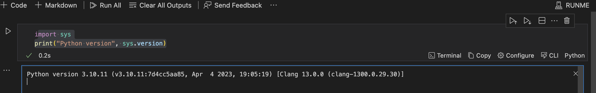

# Shebang RunMe Toolkit

Runme enables users to complete step-by-step instructions with ease, making runbooks actually runnable. This makes it an ideal solution for runbooks, playbooks, and any documentation that requires users to complete runnable steps incrementally. Operational docs become more reliable and less susceptible to bitrot with the help of Runme.

Shebang, on the other hand, is a versatile utility designed to execute scripts written in various scripting languages including Shell, Perl, Python, and more. The term 'Shebang' is derived from the '#!' symbol, which is used at the beginning of scripts to define the interpreter that should be used to run the script.

### Why are Shebangs Important?

Including a shebang line is crucial for specifying the interpreter for each code block. This allows for seamless execution of mixed-language scripts. The shebang line dictates to the platform which environment to use, ensuring that the code runs correctly and efficiently within the interface provided.

## Prerequisites

Before proceeding with the integration of Shebang in [Runme](/install#runme-cli), ensure that Runme is properly [installed](/install#runme-cli) on your system. This is a crucial step to guarantee the smooth execution of your runbooks

## Configuring Shebang in Visual Studio Code

Visual Studio Code (VS Code) provides a user-friendly interface for configuring Shebang. Follow the steps below to set up Shebang in VS Code.

You can switch to the programming language of your choice using the language interpreter feature in VS Code. This allows you to configure the environment for running code directly within the editor, making your coding experience much smoother and easier.


Follow the steps below to set up Shebang in VS Code:

1. Open your script (markdown file) in VS Code
2. Click on "Configure" menu at the buttom right of your code block
3. Click on "Advance"
4. Set the path to the interpreter


5. close the modular
6. Execute the Runme command:

```sh
# short for "runme tui" is 
runme
```



## Examples of Shebang Lines for Different Languages

Each of the following examples, written in Python, Ruby, Bash, and Node.js (JavaScript), accomplishes the same task: they define a greeting ("Hello, World!"), obtain the current date and time, and then concatenate these into a single message. The primary difference lies in the syntax and functions/methods used for date and time formatting in each language.

### Python

To run the Python code, you need to set the path to the Python interpreter, which is ***/usr/bin/python3***, in the advanced section of your configuration in your code block.

```python
import datetime

# Define a variable for the greeting
greeting = "Hello, World!"

# Get the current date and time
currentDateTime = datetime.datetime.now().strftime('%Y-%m-%d %H:%M:%S')

# Concatenate the greeting with the current date and time
fullGreeting = greeting + " It's now " + currentDateTime

# Output the full greeting
print(fullGreeting)
```

### Bash

To use Bash, you need to set the Interpreter to point to the Bash interpreter, which is ***/usr/bin/bash***, in the advanced section of your configuration in your code block.

```sh

# Define a variable for the greeting
greeting="Hello, World!"

# Get the current date and time
currentDateTime=$(date '+%Y-%m-%d %H:%M:%S')

# Concatenate the greeting with the current date and time
fullGreeting="$greeting It's now $currentDateTime"

# Output the full greeting
echo $fullGreeting
```

### Ruby

To use Ruby, you need to add the path to the Ruby interpreter, which is ***/usr/bin/ruby***, in the advanced section of your configuration in your code block.

```sh
# Define a variable for the greeting
greeting = "Hello, World!"

# Get the current date and time
currentDateTime = Time.now.strftime("%Y-%m-%d %H:%M:%S")

# Concatenate the greeting with the current date and time
fullGreeting = "#{greeting} It's now #{currentDateTime}"

# Output the full greeting
puts fullGreeting
```

### PHP

To use PHP, you need to add the path to the PHP interpreter, which is ***/usr/bin/php***, in the advanced section of your configuration in your code block..

```php { interpreter=/opt/homebrew/bin/php }
<?php
// PHP Script Example: Greeting with Date and Time

// Define a variable for the greeting
$greeting = "Hello, World!";

// Get the current date and time
$currentDateTime = date('Y-m-d H:i:s');

// Concatenate the greeting with the current date and time
$fullGreeting = $greeting . " It's now " . $currentDateTime;

// Output the full greeting
echo $fullGreeting;
?>
```

### Node

To use Node.js, you need to add the path to the node interpreter, which is ***/usr/bin/node***, in the advanced section of your configuration in your code block.

```sh
// Define a variable for the greeting
const greeting = "Hello, World!";

// Get the current date and time
const currentDateTime = new Date().toISOString().replace('T', ' ').substring(0, 19);

// Concatenate the greeting with the current date and time
const fullGreeting = `${greeting} It's now ${currentDateTime}`;

// Output the full greeting
console.log(fullGreeting);
```

## Combining Multiple Languages in Your Notebook

It's possible to combine multiple languages in a single notebook by using different shebang lines for each script block. For an example of a notebook with multiple languages, see the [Shebang Notebooks example on GitHub](https://github.com/stateful/Shebang-Notebooks/blob/main/shebang-example.md).

