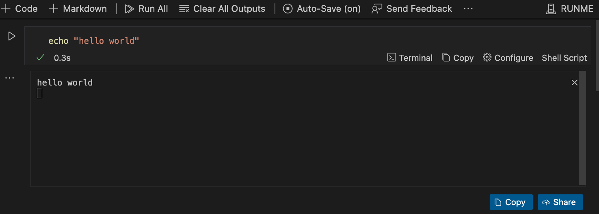
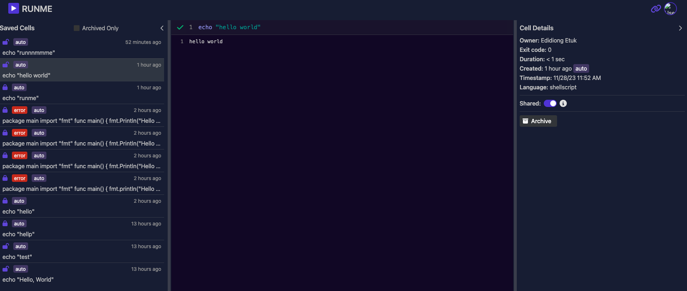
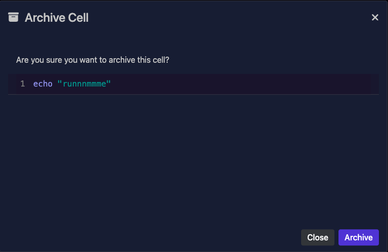
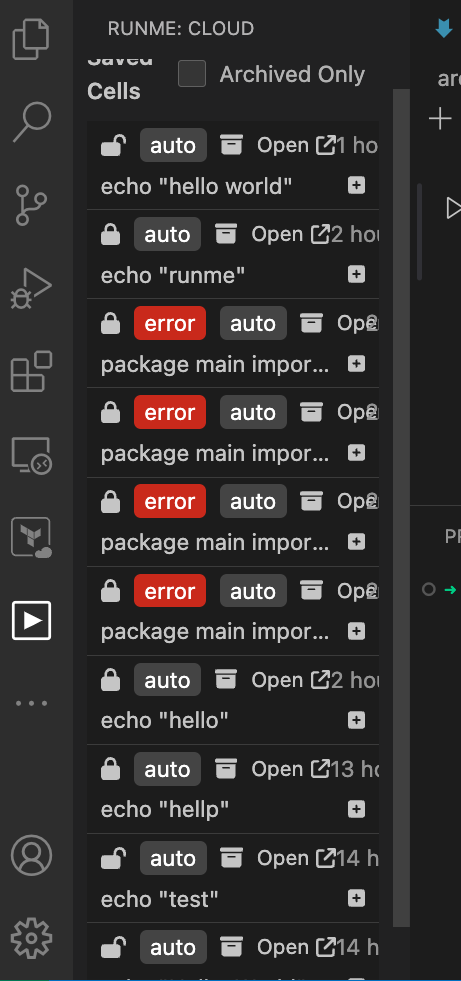
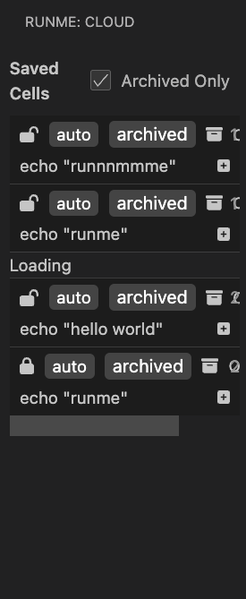

---
runme:
  id: 01HGAP763P40ATQQN75RMGW6XJ
  version: v2.0
---

# Archiving Feature in Runme

The Archiving feature in Runme is designed to provide a robust solution for storing and managing the outputs generated from markdown shells. This feature is essential for preserving outputs for future reference or as historical data points. It leverages the Runme Cloud, ensuring secure and accessible storage.

## How to Utilize the Archiving Feature

### Prerequisites
**Auto-Save or Manual Save**: Ensure that the outputs you wish to archive are either saved automatically (if the [Auto-Save](../configuration/auto-save) feature is enabled) or manually saved to the RunMe Cloud.

## Archiving in the Runme Cloud Web Experience
Accessing Saved Outputs: After the shell outputs are saved to the cloud, navigate to the Runme Cloud Web interface.

Please share link with caution. Anyone with the link has access. Click "Open" to toggle visibility.

### Initiating Archiving

1. Locate the “Archived Cells” option

2. Click on the specific cell you wish to archive. Within the cell options, select the designated archive option.

3. Confirm the action to archive the cell.

### Archiving in the Runme via VS code

Runme is Integrated into [VS code](../getting-started/vs-code), navigate to the Runme Cloud section. Click on the Runme icon.

### Initiating Archiving

1. Locate the “Archived Cells” option

   

2. Click on the specific cell you wish to archive. Within the Runme cloud section, select the designated archive option.

   

3. Confirm the action to archive the cell.

You can view all the archiving by clicking on the `Archived Only` in the Runme:cloud

   