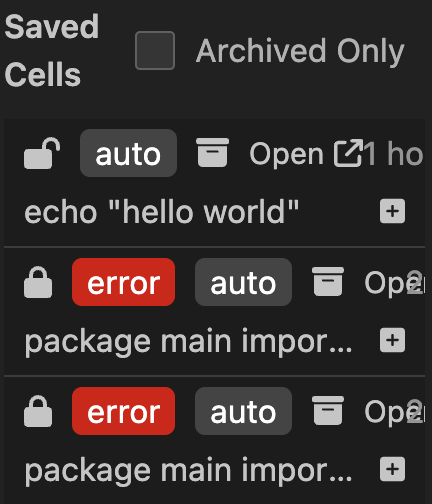

---
runme:
  id: 01HGAP763P40ATQQN75RMGW6XJ
  version: v2.0
---

# Archiving Feature

The archiving feature in Runme is designed to allow users store and manage the outputs generated from executed markdown shells. This feature is essential for preserving outputs for future reference or as historical data points. It leverages the [Runme Cloud](https://app.runme.dev/welcome), ensuring secure and accessible storage. The data stored is end to end encrypt.

## How to Utilize the Archiving Feature

**Auto-Save or Manual Save**: To archive outputs in Runme, the outputs generated need to be saved. Clicking the Save icon saves the outputs manually. You can also enable [Auto-Save](../configuration/auto-save) to remove the manual saving.

The archiving feature is available for both Runme cloud web and Runme vscode extension. 

##  Archiving Feature Runme Cloud Web 

Accessing Saved Outputs: After the shell outputs are saved to the cloud, navigate to the Runme Cloud Web interface.

> Please share link with caution. Anyone with the link has access. Click "Open" to toggle visibility.

### Initiating Archiving

1. First ensure  your shell outputs are saved.

2. Click on the specific cell you wish to archive. Within the cell options, select the designated archive option.

3. You will see a popup stating whether you want to archive the cell or not. Select 'Yes' to archive the cell.

## Archiving in the Runme via VS code

Runme is Integrated into [VS code](../getting-started/vs-code), Click on the Runme icon. a view will pop-up 

### Initiating Archiving

1. Click on the specific cell you wish to archive. Within the view, select the designated archive option.

   

2. Confirm the action to archive the cell.

> Click the checkbox besided `Archived Only` ☑️ to view all archived cells.

<video autoPlay loop muted playsInline controls>
  <source src="/videos/archiving.mp4" type="video/mp4" />
  <source src="/videos/archiving.webm" type="video/webm" />
</video>