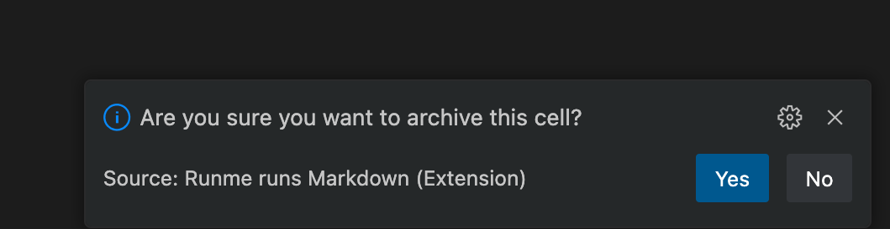

---
runme:
  id: 01HGAP763P40ATQQN75RMGW6XJ
  version: v2.0
sidebar_position: 4
title: Archiving Feature
---

The Runme archiving feature is a tidy-up tool for users. It allows you to hide outputs generated from Markdown cells to reduce clutter and preserve output for future reference. The archived files are securely stored in [Runme cloud](https://app.runme.dev/welcome) which can be accessible at any time.

On the Runme cloud, your data is encrypted both at rest and in transit, ensuring end-to-end security

## **How To Use Archiving Feature**

The archiving feature can be accessed through both the VS Code extension and the web interface. We will provide a quick walkthrough on using this feature on both platforms.

To make the most of the archiving feature on either client interface, it's important to have your output saved. You can save your output by enabling the Autosave feature for automatic saving or manually saving your work. See the [Autosave](https://docs.runme.dev/configuration/auto-save) guide for more information.

## **Archiving via Web**

As earlier mentioned, to archive an output it must first be saved. You can access your saved cells, by clicking on the "Share button" on your code block. A link will pop up to navigate you to the Runme Cloud Web interface.

> Please share link with caution as anyone with the link has access to your Runme Cloud storage. Click Open to toggle visibility.

### Initiating Archiving

1. Navigate to your saved cells and Click on the specific cell you wish to archive.
2. Within the cell options, select the archive option.
3. You will see a popup stating whether you want to archive the cell or not. Click on the **Archive** button and the cell will be archived.

## **Archiving via VS Code Extension**

To access the saved cells you want to archive via [VS Code](https://docs.runme.dev/how-runme-works/vscode), Click on the Runme icon. a view will pop-up to access the Runme Cloud.

1. Access the saved cells you want to archive via VS Code, Click on the Runme icon. A view will pop up to access the Runme Cloud.
2. Within the view, select the designated archive option.

   

3. Confirm the action to archive the cell.

## **Restore**

If you have previously archived a cell and wish to restore it to your active dashboard,  you can easily restore it using the Runme Cloud web dashboard.

1. Navigate to the Archived Cell: Go to your dashboard and check on the "Archived" box. It will take you to the section where your archived cells are listed.
2. Select the Cell to Restore: Find the cell you wish to restore. Ensure you have selected the correct cell to avoid any unintended modifications.
3. Initiate Restore: Click on the "Restore" button. This button is on the right-hand side of your dashboard.
4. Confirm Restore: The feature will be restored to your active dashboard once confirmed.
