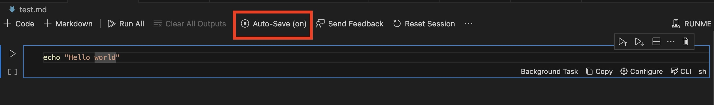
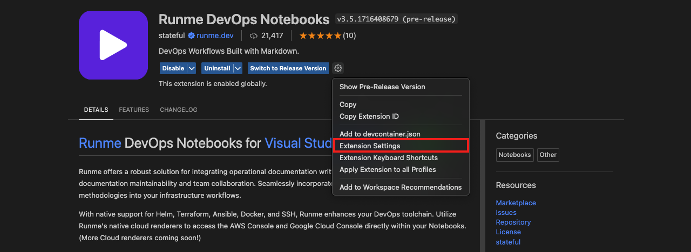
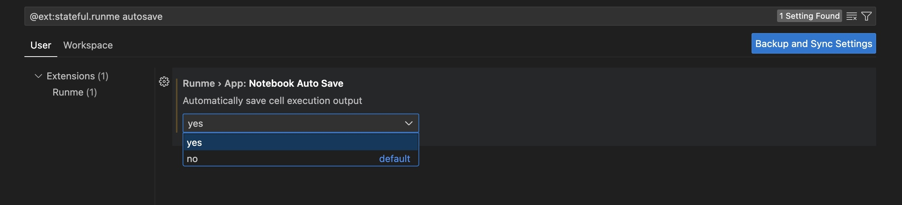
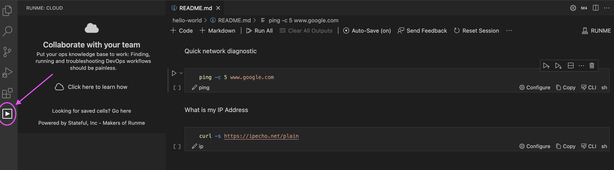
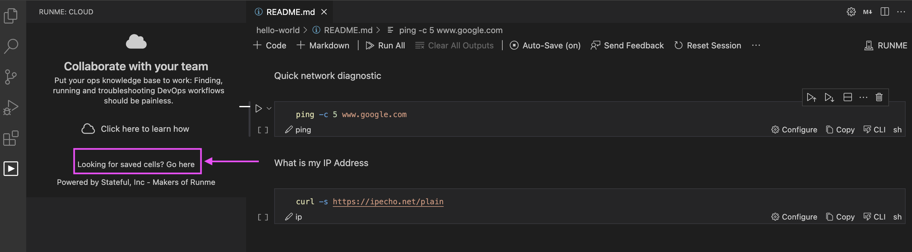
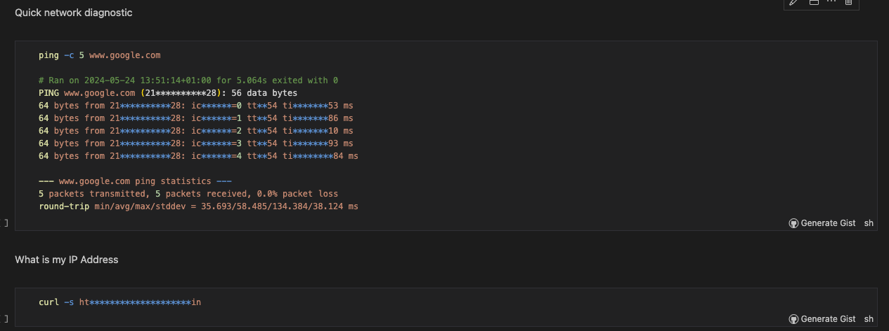

---
runme:
  id: 01HFRZ3233HSQ0NVJB9BE682G5
  version: v3
sidebar_position: 5
title: Auto-Save Feature
---

# Auto-Save Feature

The Runme auto-save feature efficiently saves and manages your commands and executed cells for future reference. This feature automatically records and saves every change and activity within your cell without manual intervention. This allows you to focus on your task and easily share your runbook with team members without worrying about losing your commands.

## **How Runme Auto-Save Feature Works**

The Runme auto-save feature goes beyond saving commands. It removes the need to manually save each cell or output you generate.

**Here’s how it works**: With the auto-save feature activated, when you run a command within your Runme cell, your generated output is automatically saved on the Runme Cloud. Here, you can access the returned output and the entire commands within your Runme cell.

All files saved in Runme are stored on the Runme Cloud. To access your saved output within the Runme Cloud, sign in using your GitHub account or any other preferred option.

Once you are signed in, you can access all your saved cells and outputs anytime, ensuring your work is always backed up and accessible whenever needed.

### **How to Enable Auto-Save**

- Toggle Auto-Save On/Off:

The auto-save feature is available by default on your Markdown file whether you use the Runme Notebook on [VS Code](https://docs.runme.dev/how-runme-works/vscode) or the [web client interface](https://docs.runme.dev/how-runme-works/web) To enable you to access this feature, at the top of your Markdown file, you can easily turn on the “Auto-save” feature.

As seen in the image below:

If, for any reason, you would like to turn the auto-save off, you can simply use the toggle button as shown above to set “Auto-Save” to (off)

Alternatively, you can set autosave to the default setting. This way, you won’t need to manually enable the feature every time to use it.

### **Set Autosave as Default**

By default, auto-save is turned off, as indicated by the autosave button at the top bar displaying off. However, if you want to use the session output feature, you can toggle the feature (on) or (off) using the autosave button.

Alternatively, you can change the settings to be permanently on by adjusting the settings. To do this:

- Navigate to the extension settings in the Runme interface. This is typically found in the toolbar or under a settings menu in both the Runme web and VS Code interface.

- Search for “autosave” to easily access the Auto-save feature settings.
- To set it as default, select “Yes” to set the selected option as a default.

This action configures the system to automatically save the output of each cell execution.

💡 If logged into the Cloud (prompt whenever Auto-Save is toggled on), cells will be stored locally in a Session Output file and securely in your dashboard for later review or sharing with others. This is optional and can be turned off if desired (follow “Open Settings” in the prompt).

### **How to Access Saved Output**

As earlier stated, Runme saved files are stored in the Runme Cloud to enable easy and secure access to your runbook. To access your saved runbook, you are required to log in to the Runme Cloud.

For ease, Runme allows you to sign in by linking your GitHub account or using any other option to sign in to the Runme cloud.

To access the Runme Cloud on your Runme web client or VS Code editor, follow the steps below”

1. On your Runme client interface, select the Runme extension icon

2. Next, click on “Go here” to access the Runme cloud.

## **Session Outputs**

Runme uses the session output feature to provide advanced auto-save functionality. When auto-save is enabled, Runme captures a complete copy of the original Markdown document and creates the entire Markdown file during the notebook’s execution.

See the image below for a sample of the session output file.

The session output file includes details on when each cell was run, the time it took to run the cell, and exit codes. Additional contextual metadata like hostname and username are also saved to the Session Outputs file.

Runme also captures non-text mime types like images (base64 encoded) outside of textual output produced by terminals.

The session outputs are written per Runme session, which is saved throughout the lifetime of the window running the runbook until it is reset via “Reset Session” in the notebook.

If there are more forms you would like to be added to the session output, kindly [let us know](https://github.com/stateful/runme/issues/new). We are open to incorporating your requests.

### **Why Separate Session Outputs?**

You might wonder why we have created a separate Session Outputs file instead of embedding outputs directly into the Markdown document. Here are some reasons:

1. Promote collaboration: We believe that cells, including their code and commands (inputs), should remain generic to facilitate collaboration and sharing of notebooks with others. This approach is particularly important for version control-tracked files.
2. Avoid version control errors: Separating files prevents accidental inclusion of outputs into version control, reducing the risk of overwriting historical artifacts from previous sessions if they were stored in the same file.
3. Enhance user experience: Session files with outputs are not directly opened in the notebook UX. After writing the output, Runme may struggle to distinguish between the input and output parts of a cell. Instead, the UX will prompt you to open the original document (which requires colocation in the same folder) as a notebook or launch the Markdown previewer to display the Session Outputs.

While we are contemplating the possibility of transparently opening Session Outputs files in the future, this may inevitably involve reformatting the original source file as part of the deserialization process.

<aside>
💡 Session Outputs

</aside>

> It is strongly recommended that you do not deploy the session output files to your version control. You can `.gitignore` the files to ensure that it doesn't get deployed.

## **Additional Information**

The auto-save feature is also used in other Runme’s features. Some of these include:

- **[Runme Gist](https://docs.runme.dev/configuration/runme-gist)**: Runme Gist uses the auto-save feature to create session outputs, which is used to generate a GitHub Gist while still concealing your sensitive details.
- **[Runme’s Archiving Feature](https://docs.runme.dev/configuration/archiving)**: The archiving feature was designed to enable you to hide outputs generated from your Runme cell to preserve them for future use. To archive a file, it must first be saved; this can be done effectively using auto-save, which stores the output automatically without manual intervention.
