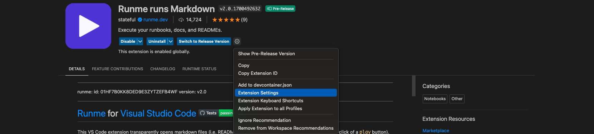
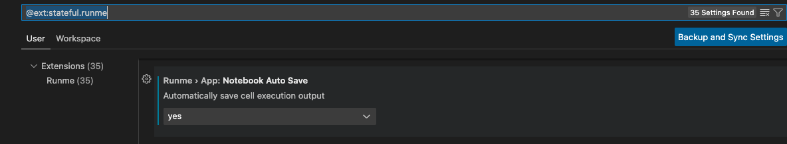

---
runme:
  id: 01HFRZ3233HSQ0NVJB9BE682G5
  version: v2.0
sidebar_position: 3
title: Auto-Save feature
---

The Auto-Save feature in Runme provides a seamless and efficient way to ensure your work is continuously saved without manual intervention. This feature is handy in scenarios where consistent data preservation is crucial.

### How to Enable Auto-Save

1. #### Access Extension Settings:

Begin by navigating to the extension settings in the Runme interface. This is typically found in the toolbar or under a settings menu.

2. #### Toggle Auto-Save On/Off:

You have the flexibility to quickly turn the Auto-Save feature on or off. This can be done directly from the top of your Markdown (.md) file. A simple toggle switch allows for easy control, ensuring that you can activate or deactivate Auto-Save as per your workflow requirements.

(Optional) **Activate Auto-Save as a default:** Within the settings, you will find an option for Auto-Save. Click on “Yes” to enable this feature as a default. This action configures the system to automatically save the output of each cell execution.

### Storage and Accessibility

- **Cloud Storage:** All auto-saved content is securely stored in a dedicated cell on the Runme Cloud. This ensures that your data is not only saved in real-time but is also accessible from any location, provided you have internet access.
- **Data Integrity and Security:** The Auto-Save feature is designed with data integrity and security in mind. Your work is saved in a consistent state, reducing the risk of data loss due to unexpected interruptions.

