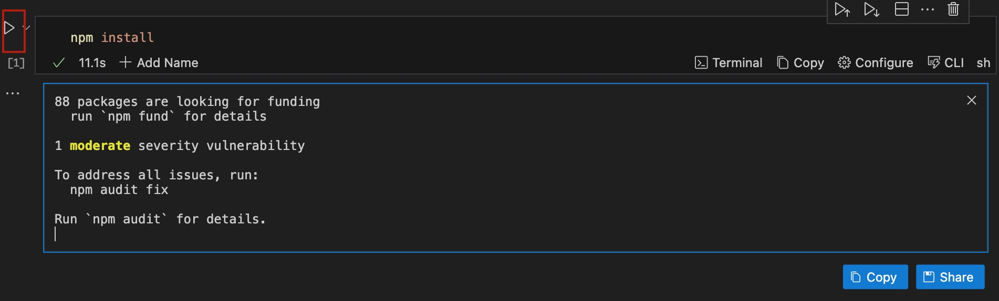
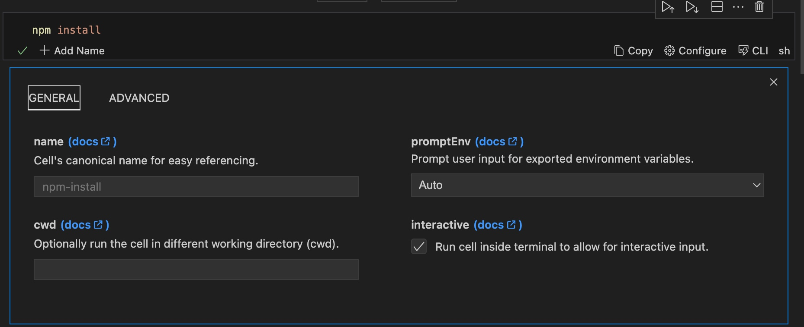
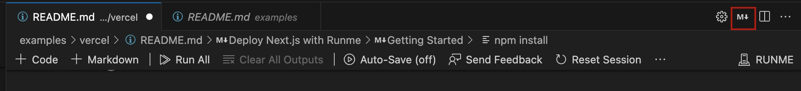
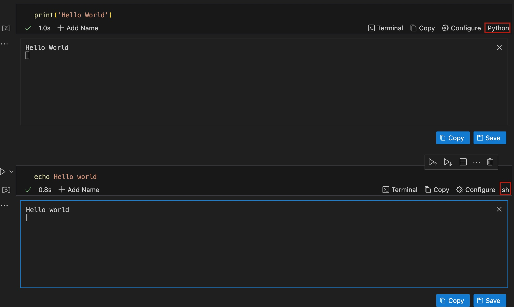
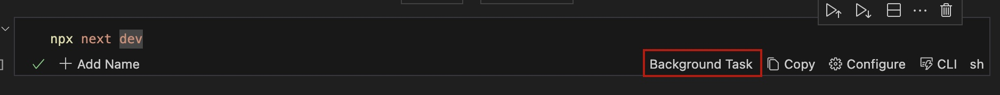
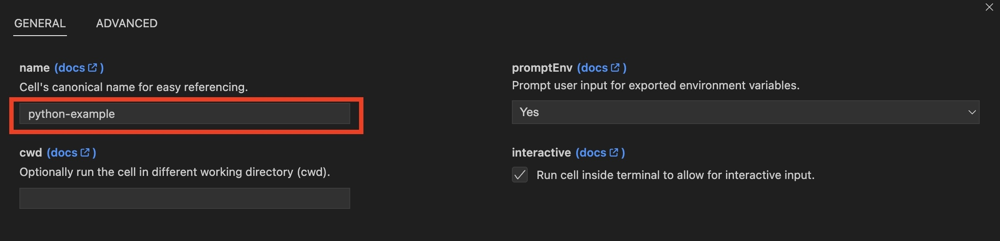

---
runme:
  id: 01HFPW3ES358GNC1Z633JB8JYR
  version: v3
sidebar_position: 1
title: Cell-level Options
---

# Cell-level Options

When running code blocks or commands with Runme, you have two execution options: document-level or cell-level options.

The cell-level options allow you to run your Markdown file by cell rather than execute the entire file at once.

In this section, we will explain the various features of the cell-level option and show you how to run your Markdown file by cell.

***Let’s dive in!***

### **Different Types of Commands**

Not all commands are equal, and expectations of how execution works can differ! For example, code blocks can be:

1. File-watchers for compilers & bundlers should run as background tasks.
2. Executors for Interactive and Non-interactive programs & scripts.
3. Human-centric output: JSON, text, images, etc.
4. Terminal visibility when no errors occur.

However, Runme makes running such commands easy. It has sophisticated features that ensure commands and code are executed inside your Markdown file. In this section, we will explore how to run commands and code in one click and some features that make running commands at the cell level easier with Runme.

## **How to Run a Cell In One Click**

To run a cell block in your Markdown file:

- Navigate to the specific cell you wish to run.
- Click the **Run** icon on the left side of the code block.



This action will run your command and return an executed output.

You can configure how your cell should run using the configuration options. In the next section, we will be explaining how to configure your cell using the different cell-level options in Runme.

## **Features of the Cell-Level Options**

The cell-level option is designed with unique sub-features which makes it efficiently and gives users the flexibility to modify each cell to their preference. Some of these features include:

### **Configuration of Cell**

Runme provides two distinct ways you can configure your cell.

- Using the **Configure** button

To modify the cell execution behavior of any cell you choose, click **Configure** on the respective cell.


A new view will open, allowing you to select “general” or “advanced” cell configuration.



- Using the Markdown Syntax

If you feel more comfortable editing the Markdown file directly, you can do it using the following configuration options [schema](../Reference/configuration#cell-options):

Let us consider this example:

```md {"id":"01HFPW3ES2Y7TXV064BKC5WS41"}
```sh {"id":"01HPM33PJFH2Q9R5S123X0HCSC","interactive":"false"}
echo "hello world"
```

The above example uses the `echo` command to display the text ***hello world*** on the terminal. The context `{"interactive":"false","name":"echo-hello-world"}` indicates that the command is intended for non-interactive execution and has been labeled accordingly.

Another example you can look at is this

```sh {"id":"01HPM6HZEJKM8PPG6T38RABV9A"}
```sh { interactive=true name=example mimeType=text/plain closeTerminalOnSuccess=false background=false }echo hello world
```

To edit the Markdown syntax of your cell in Runme, click on the button indicated in the image below



Your VS Code view will split into two. One side has Runme View, and the other has the raw Markdown view. On the Markdown view, locate the cell you want to configure and make the necessary configuration edit.

<Infobox type="sidenote">

Take a look at more [examples](https://github.com/stateful/vscode-runme/tree/main/examples) available inside the VS Code extension repo for a reference on how to apply these code block attributes in different use cases!

</Infobox>

### **Specify Language in Blocks**

Runme, just like most Markdown viewers, will work best when a script's language is contained inside fenced code blocks.

Runme provides two ways you can specify language in code blocks.

- Using our Shebang Feature

Runme has an awesome [Shebang feature](../configuration/shebang) allows users to specify each cell's programming language inside the Markdown file.



The image above shows that our first code block is in Python, and the next is in bash script.

- The use of Markdown Standard
   If possible, always specify the language according to the [Markdown standard](https://www.markdownguide.org/extended-syntax/#syntax-highlighting) as illustrated below:

```sh {"id":"01HFPW3ES2Y7TXV064BVXNCD12"}
  ```sh {"id":"01HPMBVRXTRHSD52YVAX4K648P"}
echo "language identifier in fenced code block"
```

<Infobox type="warning">

Out of the box, Runme will leverage the [Guesslang](https://github.com/yoeo/guesslang) ML/AI model with a bias towards Shell to detect the languages for unidentified code blocks.

While this works well in a lot of cases, the accuracy is not perfect.

</Infobox>

### **Handle long-running processes**

It is common to use file-watcher-enabled compilers/bundlers (e.g., `npm start dev`, `watchexec`, etc.) in the background during development.
For any cell containing an instance of these commands, tick the background cell setting. This will prevent execution from permanently blocking the notebook UX.


Once ticked notice the "Background Task" label shows up in the cell status bar!

**Default:** `false`

**Example**

```sh {"id":"01HPMBTYXA7N4M4EQHY79A806H"}
```sh {"background":"true","id":"01HPMBT8BF57MJ36JYDKAMZG1K"}
npm run watch
```



### **Cell's current working directory**

In most cases, you should set the current working directory at the document level; however, you can also set it per cell.

Click on `configure` to change the current work directory `cwd`:


```sh {"id":"01HPPF1PRAK846NR2H1CW86XVQ"}

```sh { cwd=.. "id":"01HP475WXX5PVV658023KQJFRE"}
npm run watch #relative path

```

```sh {"id":"01HPPF1PRAWK6WV432SB6KVF6G"}

```sh {"cwd":"/tmp","id":"01HPQ8F2307NFJR3WV1EJRJ0B8"}
echo "absolute path" > dummy_file
```

<Infobox type="warning">

Please note that if both `cwd` is set for doc-level and cell, they don't overwrite. They combine. For example, `cwd: /tmp/dummy` (doc) and `cwd: ..` (cell) will result in `/tmp`.

</Infobox>

### **Interactive vs non-interactive cells**

If a cell's commands do not require any input from a reader it might be a good fit to include the cell's output inside the notebook. This is useful if the resulting output could be useful as input in a downstream cell. This is what `interactive=false` is for, and it defaults to *true*.


**Default:** `true`

**Example**

```sh {"id":"01HPM7GDWT2TW3BTCRYJT3BFFW","interactive":"false"}
openssl rand -base64 32
```

<Infobox type="sidenote">

Please note that the Runme team is currently working on making output in both notebook & terminal default behavior.

</Infobox>

### **Set environment variables**

If a cell has exported variables, the user will be prompted to set these variables. This can be useful to have a parameterized cell while not needing to manually modify the cell.


**Example**

```sh {"id":"01HPM880GBF2Y1SGKA92YF4WDZ","promptEnv":"true"}
export SLEEP_SECS="0"
sleep $SLEEP_SECS
```

There are two prompt modes:

- Use a placeholder
- A prompt message.

Here's the difference:

- **Using a Placeholder**:

Using quotes or double-qoutes will prompt the use the confirm the placeholder value. This is convient when a valid default value is known ahead of time.

```sh {"id":"01HRABZTNC8946E927BGMKQ1A0"}
export PROJECT_ID="your-project-7f412a"
cli make-call --project-id $PROJECT_ID describe
```

- **Using a Prompt Message**:

When you don't know the default value, you can instead use a prompt message to ask the user for the value. The key difference here is that the message does not act as value placeholder.

```sh {"id":"01HRABZTNCZ2ZZBPDXDW3AQFGQ"}
export PROJECT_ID=Enter a valid project ID
cli make-call --project-id $PROJECT_ID describe
```

### **Terminal visibility post-execution**

A cell's execution terminal is auto-hidden unless it fails. This default behavior can be overwritten if keeping the terminal open is in the interest of the Runme notebook reader. Just untick `closeTerminalOnSuccess` (`false`).

**Default:** `true`

**Example**

```sh {"id":"01HPM835XP8SBJV14YGHQEEE3B"}
  ```sh {"closeTerminalOnSuccess":"false","id":"01HPM7MC8MAJB2QCRVPVCN1FTT"}
docker ps | grep runme/demo:latest
```

### **Human-friendly output**

Not all cells’ output is plain text. For example, you can have JSON, text, images, etc, all in your Markdown file.

Using the `mimeType` specifier, you can specify the expected output type. Runme Notebooks have a variety of renderers that will display them as human-friendly. The MIME type defaults to *text/plain*.


See in the [reference page](../Reference/mime) for the list of supported MIME types!

### **Terminal Row**

On Runme outputs are saved in lines also known as rows. The number of lines or rows in which an output should be rendered is defined by a setting known as Terminal row.
Terminal row allows you to set the number of rows with which your output should be displayed under a cell.
Where the terminal row is not set or defined, Runme displayed the output in 10 rows by default.

#### How To Set Up Terminal Row

The terminal row is a Runme VS Code feature. Therefore, you can set up using your code editor. If you haven’t installed Runme on your VS Code yet, see our installation guide to install Runme in your VS Code editor.

To set up the terminal row on your code editor, follow the steps below:

- In your `.md` file, click on the “Configure” button at the bottom left of the file.


We have provided a list of configuration settings to upgrade your experience using the Runme extension. You can configure how your Markdown is executed on your code editor using these settings.

- Navigate to “Advanced” > `terminalrow`.


- Lastly, set the number of rows you wish your output to be rendered in.

### **Unnamed vs Named cells**

On Runme cells are unnamed by default. However, you can name a cell directly in your notebook. This will enable you to easily identify the cell using the provided cell name. On the cell you wish to name, simply click on the “Add Name” button on the cell.


You will be directed to enter a preferred name for the cell.



Where a cell is not named, a generated name is provided for each cell. We recommend you DO NOT name a cell when using the CLI mode, you can use the VS Code extension to name the file in the configuration settings.

These examples showcase improved ways you can use Runme in your documentation to enhance your workflow and overall documentation process.

If you feel more comfortable editing the Markdown file directly, you can do it by using the following configuration options [schema](../Reference/configuration#Cell-Options):

```md {"id":"01HFPW3ES2Y7TXV064BKC5WS41"}
```sh {"id":"01HPM33PJFH2Q9R5S123X0HCSC","interactive":"false"}
echo "hello world"
```

The above example uses the echo command to display the text "hello world" on the terminal. The context `{"interactive":"false","name":"echo-hello-world"}` indicates that the command is intended for non-interactive execution and has been labeled accordingly.

```sh {"id":"01HPM6HZEJKM8PPG6T38RABV9A"}

Try out the previous command

```sh {"id":"01HPMBXN8PNCMJ87Y1BGQ1NKN3"}
echo hello world
```

The entire [configuration schema](../Reference/configuration#Cell-Options): as an example

```sh {"id":"01HPPF1PRA4XA9SXB45Y5VX5W0"}

```sh {"background":"false","closeTerminalOnSuccess":"false","id":"01HPM33PJFH2Q9R5SNAQX0HCSC","interactive":"true","name":"example"}
echo "hello world"
```

<Infobox type="sidenote">

Take a look at more [examples](https://github.com/stateful/vscode-runme/tree/main/examples) available inside the VS Code extension repo for a reference on how to apply these code block attributes in different use cases!

</Infobox>

### **Exclude Cell from Run All**

Every VS Code notebook allows users to run all available cells. This can be useful if you define a complete runbook in your Markdown file, allowing developers to click the **Run All** button to get set up and running.

However, sometimes certain cells should be excluded from this workflow. You can configure this behavior by clicking the `excludeFromRunAll` option.

**Default:** `false`

**Example**

```sh {"id":"01HPM81V77G7ASW1F4BTFBX13C"}
 ```sh {"excludeFromRunAll":"true","id":"01HPM7NRQYMD5T06M4KS6S2DWG"}
 # Do something optional here
```

### **Run All Cells by Category**

If you have multiple workflows in a single Markdown file you can categorize them and allow your developers to run all cells by a certain category. To enable that you can add a category as a cell option. A cell can have one or multiple categories that are comma-separated.

**Default:** `""`

**Example**

```sh {"id":"01HPM829M14ADVR9M6J7N9VF5Z"}
  ```sh {"category":"build","id":"01HPM7Q4JQ5HVJ5KS2FJ7Q31SQ"}
    # Do something here
```

<video autoPlay loop muted playsInline controls>
  <source src="/videos/categories.mp4" type="video/mp4" />
  <source src="/videos/categories.webm" type="video/webm" />
</video>
