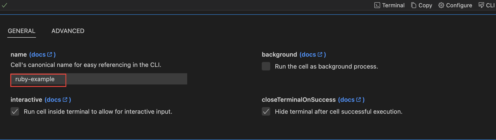
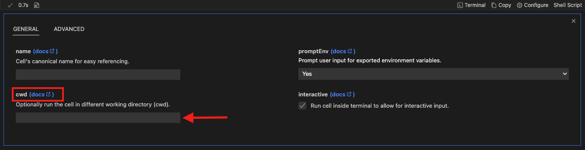
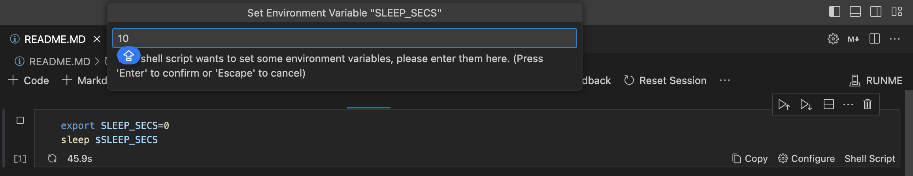
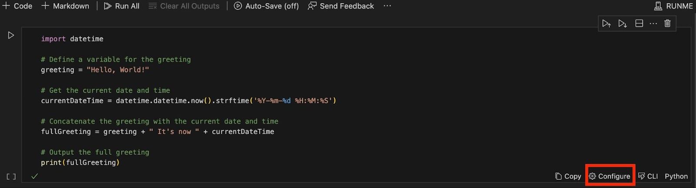
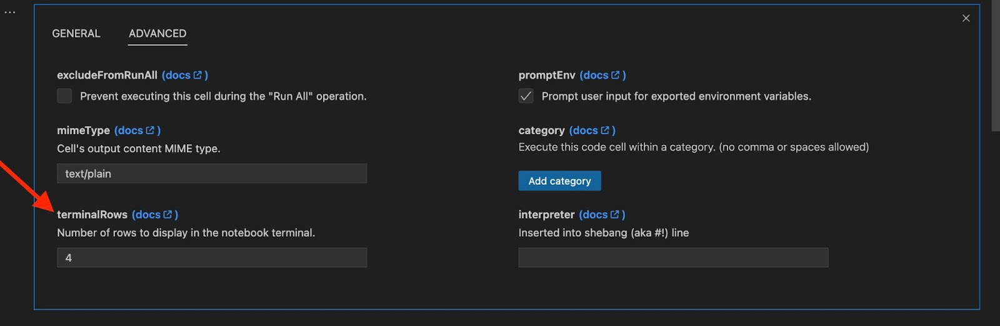

---
runme:
  id: 01HFPW3ES358GNC1Z633JB8JYR
  version: v2.0
sidebar_position: 1
title: Cell-level Options
---

In this section, we will give you a step-by-step guide on how to run your Markdown file by each cell rather than execute your entire file at once.

***Let’s dive in!***

Not all commands are equal, and expectations of how execution works can differ! For example, code blocks can be:

1. File-watchers for compilers & bundlers should run as background tasks.
2. Executors for Interactive and Non-interactive programs & scripts.
3. Human-centric output: JSON, text, images, etc.
4. Terminal visibility when no errors occur.

To modify the cell execution behavior, simply click Configure on the respective cell.

If you feel more comfortable editing the markdown file directly, you can do it by using the following configuration options [schema](https://docs.runme.dev/configuration/reference#Cell-Options):

To modify the cell execution behavior, simply click "Configure" on the respective cell.

<video autoPlay loop muted playsInline controls>
  <source src="/videos/configure-cell-execution.mp4" type="video/mp4" />
  <source src="/videos/configure-cell-execution.webm" type="video/webm" />
</video>

If you feel more comfortable editing the markdown file directly, you can do it by using the following configuration options [schema](reference#Cell-Options):

### **Unnamed vs Named cells**

On Runme cells are unnamed by default. Unless a user names a cell manually, a generated name is provided for each cell. We recommend you DO NOT name a cell when using the CLI mode, you can use the VS Code extension to name the file in the configuration settings.



These examples showcase improved ways you can use Runme in your documentation to enhance your workflow and overall documentation process.

If you feel more comfortable editing the markdown file directly, you can do it by using the following configuration options [schema](reference#Cell-Options):

```md {"id":"01HFPW3ES2Y7TXV064BKC5WS41"}
```sh {"id":"01HPM33PJFH2Q9R5S123X0HCSC","interactive":"false"}
echo "hello world"
```

The above example uses the echo command to display the text "hello world" on the terminal. The context `{"interactive":"false","name":"echo-hello-world"}` indicates that the command is intended for non-interactive execution and has been labeled accordingly.

```sh {"id":"01HPM6HZEJKM8PPG6T38RABV9A"}

Try out the previous command

```sh {"id":"01HPMBXN8PNCMJ87Y1BGQ1NKN3"}
echo hello world
```

The entire [configuration schema](reference#Cell-Options): as an example

```sh {"id":"01HPPF1PRA4XA9SXB45Y5VX5W0"}

```sh {"background":"false","closeTerminalOnSuccess":"false","id":"01HPM33PJFH2Q9R5SNAQX0HCSC","interactive":"true","name":"example"}
echo "hello world"
```

<Infobox type="sidenote">

Take a look at more [examples](https://github.com/stateful/vscode-runme/tree/main/examples) available inside the VS Code extension repo for a reference on how to apply these code block attributes in different use cases!

</Infobox>

### **Specify Language in Blocks**

Runme, just like most Markdown viewers, will work best when a script's language is contained inside of fenced code blocks.

If possible, always specify the language [according to the markdown standard](https://www.markdownguide.org/extended-syntax/#syntax-highlighting) as is illustrated below:

```sh {"id":"01HFPW3ES2Y7TXV064BVXNCD12"}
  ```sh {"id":"01HPMBVRXTRHSD52YVAX4K648P"}
echo "language identifier in fenced code block"
```

<Infobox type="warning">

Out of the box, Runme will leverage the [Guesslang](https://github.com/yoeo/guesslang) ML/AI model with a bias towards Shell to detect the languages for unidentified code blocks.

While this works well in a lot of cases, the accuracy is not perfect.

</Infobox>

### **Handle long-running processes**

It is very common to use file-watcher enabled compilers/bundlers (`npm start dev`, `watchexec...` etc) in the background during development.

For any cell containing an instance of these commands be sure to tick the "background" cell setting. This will prevent execution from permanently blocking the notebook UX.


Once ticked notice the "Background Task" label shows up in the cell status bar!

**Default:** `false`

**Example**

```sh {"id":"01HPMBTYXA7N4M4EQHY79A806H"}
```sh {"background":"true","id":"01HPMBT8BF57MJ36JYDKAMZG1K"}
npm run watch
```

### **Cell's current working directory**

In most cases, you probably want to set the current working directory at the document-level, however, it is possible to set it per cell.

Click on `configure` to change the current work directory `cwd`:



```sh {"id":"01HPPF1PRAK846NR2H1CW86XVQ"}

```sh { cwd=.. "id":"01HP475WXX5PVV658023KQJFRE"}
terraform init

```

```sh {"id":"01HPPF1PRAWK6WV432SB6KVF6G"}

```sh {"cwd":"/tmp","id":"01HPQ8F2307NFJR3WV1EJRJ0B8"}
terraform plan
```

<Infobox type="warning">

Please note that when cwd settings are added at both the document level and the cell level, none will be overwritten but rather combined. For example, if you set `cwd: /tmp/dummy` at the document level and `cwd: ..` at the cell level, the resulting working directory will be `/tmp`, effectively combining the two paths.

</Infobox>

### **Interactive vs non-interactive cells**

If a cell's commands do not require any input from a reader it might be a good fit to include the cell's output inside the notebook. This is useful if the resulting output could be useful as input in a downstream cell. This is what `interactive=false` is for, and it defaults to *true*.


**Default:** `true`

**Example**

```sh {"id":"01HPM7GDWT2TW3BTCRYJT3BFFW","interactive":"false"}
openssl rand -base64 32
```

<Infobox type="sidenote">

Please note that the Runme team is currently working on making output in both notebook & terminal default behavior.

</Infobox>

### **Set environment variables**

If a cell has exported variables, the user will be prompted to set these variables. This can be useful to have a parameterized cell while not needing to manually modify the cell.



**Default:** `true`

**Example**

```sh {"id":"01HPM880GBF2Y1SGKA92YF4WDZ","promptEnv":"true"}
export SLEEP_SECS=0
sleep $SLEEP_SECS
```

### **Terminal visibility post-execution**

A cell's execution terminal is auto-hidden unless it fails. This default behavior can be overwritten if keeping the terminal open is in the interest of the Runme notebook reader. Just untick `closeTerminalOnSuccess` (`false`).

**Default:** `true`

**Example**

```sh {"id":"01HPM835XP8SBJV14YGHQEEE3B"}
  ```sh {"closeTerminalOnSuccess":"false","id":"01HPM7MC8MAJB2QCRVPVCN1FTT"}
docker ps | grep runme/demo:latest
```

### **Human-friendly output**

JSON, text, images, etc. Not all cells’ output is plain text. Using the `mimeType` specifier it is possible to specify the expected output's type. Notebooks have a variety of renderers that will display them as human-friendly. The MIME type defaults to *text/plain*.


See in the [reference page](../configuration/reference) for the list of supported MIME types!

### **Terminal Row**

On Runme outputs are saved in lines also known as rows. The number of lines or rows in which an output should be rendered is defined by a setting known as Terminal row.
Terminal row allows you to set the number of rows with which your output should be displayed under a cell.
Where the terminal row is not set or defined, Runme displayed the output in 10 rows by default.

#### How To Set Up Terminal Row

The terminal row is a Runme VS Code feature. Therefore, you can set up using your code editor. If you haven’t installed Runme on your VS Code yet, see our installation guide to install Runme in your VS Code editor.

To set up the terminal row on your code editor, follow the steps below:

1. In your `.md` file, click on the “Configure” button at the bottom left of the file.



We have provided a list of configuration settings to upgrade your experience using the Runme extension. You can configure how your markdown is executed on your code editor using these settings.

2. Navigate to “Advanced” > `terminalrow`.



3. Lastly, set the number of rows you wish your output to be rendered in.

### **Exclude Cell from Run All**

Every VS Code notebook allows to run all available cells. This can be useful if you define a complete runbook in your markdown file and it allows developers to just click the Run All button to get set up and running. However, sometimes certain cells should be excluded from this workflow. With the `excludeFromRunAll` option, you can configure this behavior.

**Default:** `false`

**Example**

```sh {"id":"01HPM81V77G7ASW1F4BTFBX13C"}
 ```sh {"excludeFromRunAll":"true","id":"01HPM7NRQYMD5T06M4KS6S2DWG"}
 # Do something optional here
```

### **Run All Cells by Category**

If you have multiple workflows in a single markdown file you can categorize them and allow your developers to run all cells by a certain category. To enable that you can add a category as a cell option. A cell can have one or multiple categories that are comma-separated.

**Default:** `""`

**Example**

```sh {"id":"01HPM829M14ADVR9M6J7N9VF5Z"}
  ```sh {"category":"build","id":"01HPM7Q4JQ5HVJ5KS2FJ7Q31SQ"}
    # Do something here
```

<video autoPlay loop muted playsInline controls>
  <source src="/videos/categories.mp4" type="video/mp4" />
  <source src="/videos/categories.webm" type="video/webm" />
</video>
