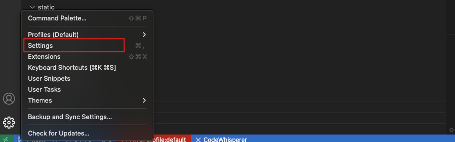
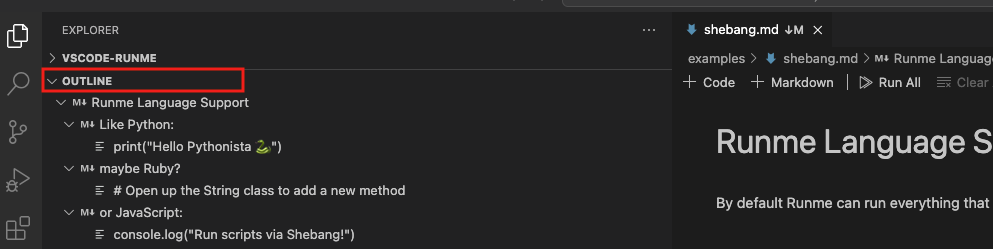

---
runme:
  id: 01HX525D9B2H33WXVN253K6WX0
  version: v3
sidebar_position: 3
title: Run Cells By Section
---

# Run Cells By Section

An alternative way to run your Runme cell individually or the entire document is to run your Markdown file by sections.

If you have a Markdown file with a large volume of codes and commands to be executed and they are all grouped into sections in the order in which they are to be executed (for example, installation section, configuration section, setting up section, etc.), rather than running each cell individually or the entire Markdown file, you can run each section of the file.

This enables you to save time and also watch the execution result of each section before proceeding to the next.

Runme cells can be grouped into headings and subheadings depending on the structure of your documentation. In your Markdown file, a section is both a heading or a subheading within the file. Runme makes it possible to run your file according to the section/headings of your Markdown file.

To do this, you first need to enable “Sticky scroll” in your notebook. Sticky scroll allows you to stick sections to the top of the editor so that they are always in view while you scroll through your Markdown file.

## Getting Started

This section will explore how to use the sticky scroll to run cells by section in Runme.

1. Enable Sticky scroll

Follow the steps below to enable sticky scroll:

- Click on the settings icon at the bottom left of your VS Code editor.
- From the provided options, select “Settings”.

- In the search bar, enter ‘**notebook sticky**.’ This will direct you to the sticky scroll configuration page in the notebook.
- Now enable Stick Scroll by clicking on the “Enabled” checkbox.

2. Run Cells

Next, follow the steps below to run cells by section in your Markdown file:

- Navigate to your README.md file and scroll through it. As you scroll, all sections will stick to the top of the file.
- Locate the section you want to run, right-click on it, and click on **Run Cells by Section**.

See the video below to represent the steps visually.

<video autoPlay loop muted playsInline controls>
  <source src="/videos/cellsection.mp4" type="video/mp4" />
  <source src="/videos/cellsection.webm" type="video/webm" />
</video>

## Run Cells by Section From Outline

Alternatively, you can run your cells by section using the Outline feature of the VS Code editor. In this example, we use this [README file](https://github.com/stateful/blog-examples/blob/main/kubernetes/k8s-secret/sealed-secret/Mac-sealedsecret.md) with several sections.

To run a section from the outline:

- Navigate to the left-hand side of your VS Code dashboard.
- Click on **OUTLINE**. The sections will be displayed in the image below.

Hover your mouse on the section you want to run, click the three dots beside it, and click run cells to run all the cells in that section.

