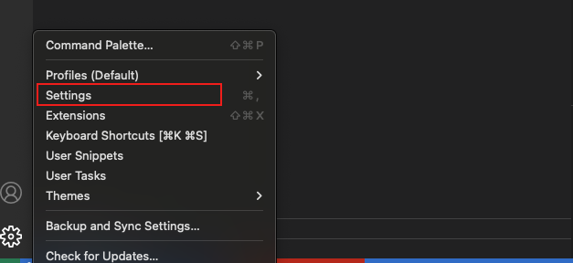
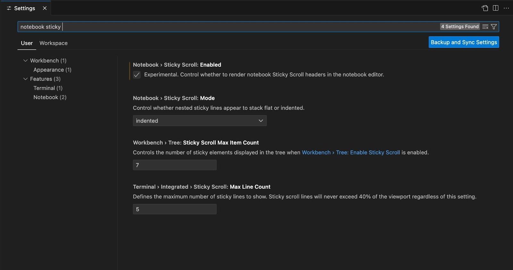
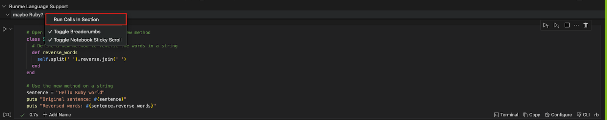
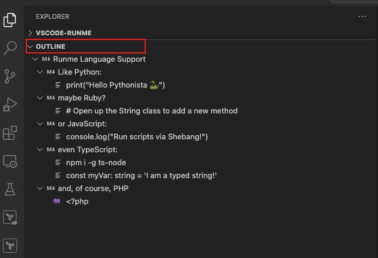
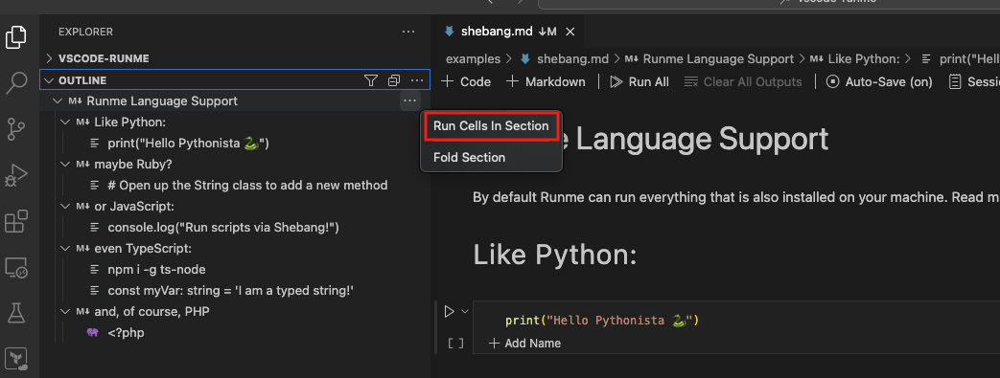

# Run Cells By Section

Runme cells can be grouped into headings and subheadings depending on the structure of your documentation. In your Markdown file, a section is both a heading or a subheading within the file.

In addition to running your cell individually or the entire document, Runme allows you to run your  Markdown file by sections.

To do this, you first need to enable “Sticky scroll” in your notebook. Follow the steps below to enable sticky scroll:

- Click on the setting icon at the bottom left of your VS Code editor.
- From the provided options, select “Settings”

- In the search bar, enter ‘notebook sticky.’ This will direct you to the sticky scroll configuration page in the notebook.
- Now enable Stick Scroll by clicking on the “Enabled” checkbox.

Next, follow the steps below to run cells by section in your Markdown file:
 - Navigate to your README.md file and scroll through it. As you scroll, all sections will stick to the top of the file.

- Locate the section you want to run, right-click on it, and click on Run Cells by Section.

See the video below to represent the steps visually.

<video autoPlay loop muted playsInline controls>
  <source src="/videos/cellsection.mp4" type="video/mp4" />
  <source src="/videos/cellsection.webm" type="video/webm" />
</video>

## Run Cells by Section From Outline

Alternatively you can run your cells by section from the Outline feature of the VS Code editor.  In this example, we use this README file with several sections.
To run a section from the outline:

- Navigate to the left-hand side of your VS Code dashboard.
Click on OUTLINE.
- The sections will be displayed in the image below.

Hover your mouse on the section you want to run, click the three dots beside it, and click run cells to run all the cells in that section.

