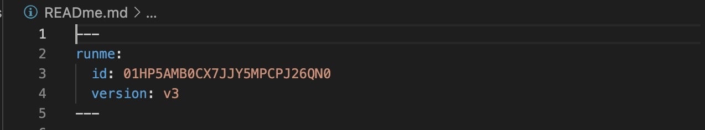

If you prefer to run the entire Markdown file in order to save time, the document-level options help you achieve that. In this section, we will walk you through the various features of the document-level options and how you can run an entire file at once.

## Run All Markdown Files In the Directory

Runme provides configuration flags that enable you to run all Markdown files in a specific directory.

For example, if you have two or more Markdown files in your current working directory and you would like to run all of them at once, Runme makes that easy for you. To do this, enter the command below in your terminal and watch your Markdown files get executed.

```yaml {"id":"01HRVWKPWWS93DG93X9R29QZCE"}
runme run --all --allow-unnamed --skip-prompts
```

## Run Specific Markdown File

You can also run a specific Markdown file. To do this, enter the command below in your terminal:

```yaml {"id":"01HRVWMYEMRYPWHE5TEDATJAD5"}
runme run --all --allow-unnamed --skip-prompts --filename=test.md
```

This will run just that specific Markdown file, in this case,  `test.md`

**Note**: Change `test.md` to the name of the Markdown file you want to execute.

## Run All Button

Alternatively, if you want to run all commands and scripts in your present Markdown file, you can do this using the “**Run All”** button. This action will run all the scripts in your file, regardless of the programming language you specified in your code block. Also, you will receive a prompt asking you if you would like to run all scripts before they are executed.


### Set Custom Shell

To specify the custom shell of each cell block in your file, you can do so using the Runme Frontmatter.



You can also specify the custom shell of each cell block in your file using the Runme Frontmatter. Once a custom shell is specified, Runme will switch to the system's default shell unless specified in the front matter. Both relative (be sure shell is included in $PATH) and absolute paths work. This is useful when notebooks are being shared amongst users with different shell setups.

```sh {"id":"01HRVWZJMS7DNA193PN87JY5N7"}
---
shell: bash
# or
shell: zsh
# or
shell: /bin/ksh
---
```

> Runme does not just retain Frontmatter, it also supports top-level settings that will affect all cells in the document.

### Current Working Directory

It is not unusual to store documents in a sub-directory, e.g., `docs/`. It is often implied that commands need to run from the base directory. To reliably execute commands in this case, it is handy to explicitly set a working directory in the frontmatter.

```yaml {"id":"01HPF4AYF82V87RYY7C23D2PCM"}
---
# relative for file inside of `docs/`
cwd: ..
# absolute works too, however, less commonplace
cwd: /tmp
---
```

