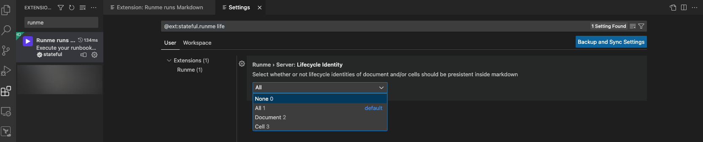

---
runme:
  id: 01HFY0VFSB5F1PF7C28BW2YSVT
  version: v2.0
---

# Lifecycle Identity in Runme

### Overview

Runme introduces a powerful new feature: Lifecycle Identity. This feature allows users to assign unique id and versioning of Runme to the cell, or the whole makrdown file. By embedding a lifecycle identity, users can track changes, versions, and the history of their documents more efficiently.

### Configuration

To activate the Lifecycle Identity feature in Runme, follow these steps:

**Access Runme Extension Settings:** Navigate to the settings section of the Runme extension.

***Enable Lifecycle Identity Tracking:*** Set the level of identity tracking you desire. There are different levels of tracking available:



Cell Level: Tracks changes at the individual cell level within a document.

Document Level:  Monitors the entire document for any modifications or version changes.

All: Applies tracking to all levels, including both cell and document levels.

### Usage

Once the Lifecycle Identity has been configured, it will add the following metadata to your markdown file :

runme:
id: [Unique Identifier]

version: [Version Number]

***Unique Identifier:*** A unique code that represents the specific instance of your document or cell.

***Version Number:*** The current version of your document or cell, which can be incremented as changes are made.

Example
Here's an example of how to embed a lifecycle identity into a markdown file:

```sh {"id":"01HFYHDGTT1BNMZD3CBCKHQGG0"}
runme:
  id: 01HFY0VFSB5F1PF7C28BW2YSVT
  version: v2.0
```

Note
The changes will apply on each reload of the document or cell.
Ensure that each document or cell has a unique identifier to avoid conflicts.
By integrating Lifecycle Identity into your Runme workflow, you can maintain better control and visibility over the evolution of your documents and cells.