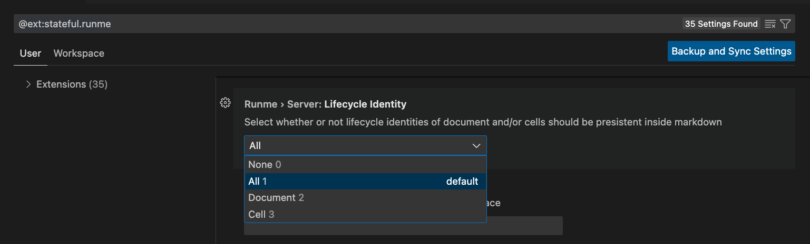
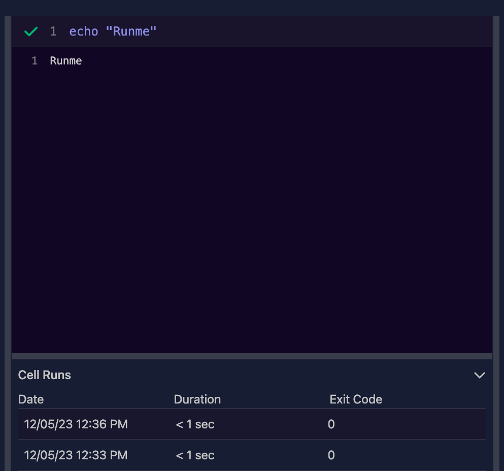

---
runme:
  id: 01HFY0VFSB5F1PF7C28BW2YSVT
  version: v2.0
sidebar_position: 3
title: Lifecycle Identity in Runme
---

Runme introduces a powerful new feature known as Lifecycle Identity. This feature assigns unique identifiers and versions to a cell, or your entire markdown file, or both. By adding a lifecycle identity, you can track changes, versions and the history of your documents.  Stay organized and in control of your files within Runme! 🚀

### Configuration

To activate the Lifecycle Identity feature in Runme, follow these steps:

* Navigate to Runme's [Extension Settings](../getting-started/vs-code#runme-settings-for-vs-code) on the your [VS code](../install#runme-for-vs-code). click on the “settings” icon and select “Extension Settings”. The Runme extension can be found in the extension toolbar at the left side on your screen.
* **Select the Tracking Level**:  Navigate to the “Lifecycle Identity” feature and select the document you wish to enable lifecycle identity tracking.



As shown in the image above, there are three levels of tracking available:

* [Cell level](../configuration/cell-level): Tracks changes within each individual cell in a document.
* [Document level](../configuration/document-level): Monitors the entire document for any modifications or version changes.
* All: Track changes made to both [Cell level](../configuration/cell-level) and [document](../configuration/document-level) levels.

### Usage

Once a Lifecycle Identity has been configured, it will add the following metadata to your markdown file :

`id`: The unique Identifier that represents the specific instance of your document or cell.

`version`: The current version number on your document or cell is the version of Runme you are using.

Here is an sample of what the lifecycle identity on your file looks like:

```sh {"id":"01HFYHDGTT1BNMZD3CBCKHQGG0"}
runme:
  id: 01HFY0VFSB5F1PF7C28BW2YSVT
  version: v2.0
```

**Note**:
Each document or cell will have a unique identifier generated by Runme. Do not edit these to avoid conflicts.

## Cell Run Grouping

Cell Run Grouping is a crucial feature that works with the lifecycle identity in Runme. It improves the organization and tracking of code runs, especially when working with markdown files or individual cells within these files. This functionality works when outputs are saved to the [Runme Cloud](https://app.runme.dev/), as it allows for a more structured and insightful analysis of the code's performance over time.

### How Cell Run Grouping Works

When a user saves the output of a cell or an entire markdown file to the Runme Cloud, Runme assigns a unique identity to that file or cell. This identity is important for the cell run grouping process. It ensures that any subsequent iterations or runs of that file or cell are recorded and grouped together under the same identity in the cloud.

This grouping is not just a simple collection of runs; it is an organized, time-stamped record of each run.
Every time the code is ran, the output is stored in the same group as the previous runs, with the exact time of each run clearly stated. This chronological arrangement of run data provides a comprehensive view of the code's evolution and performance over time.


