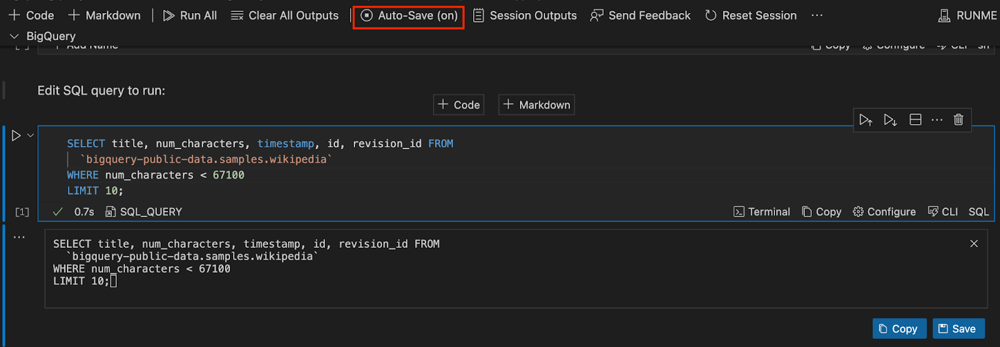
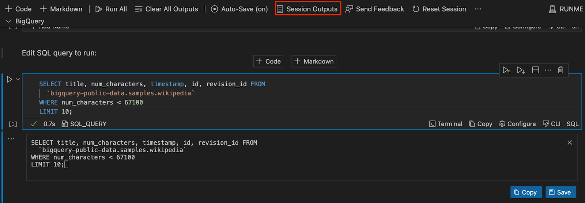
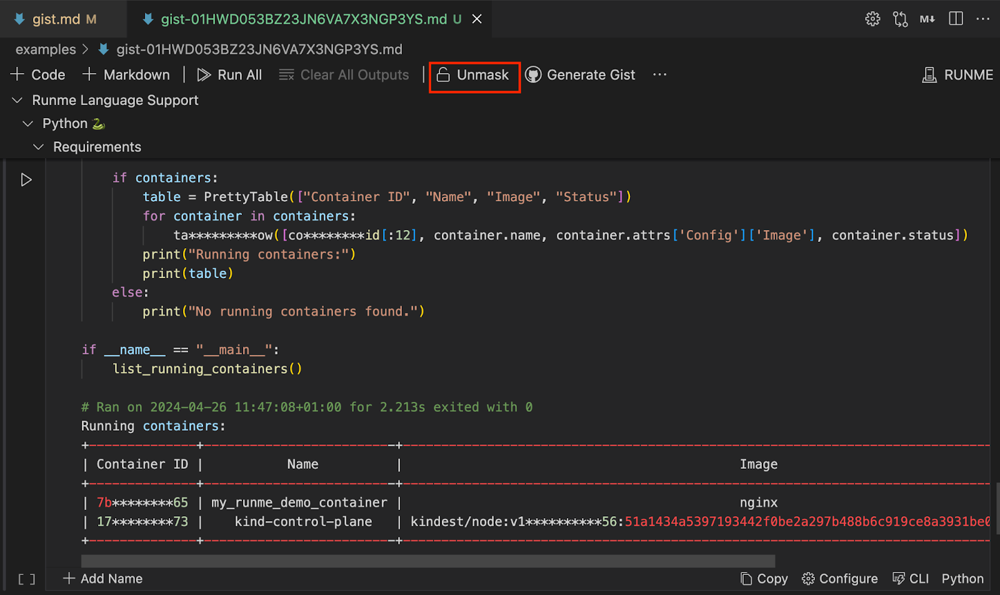
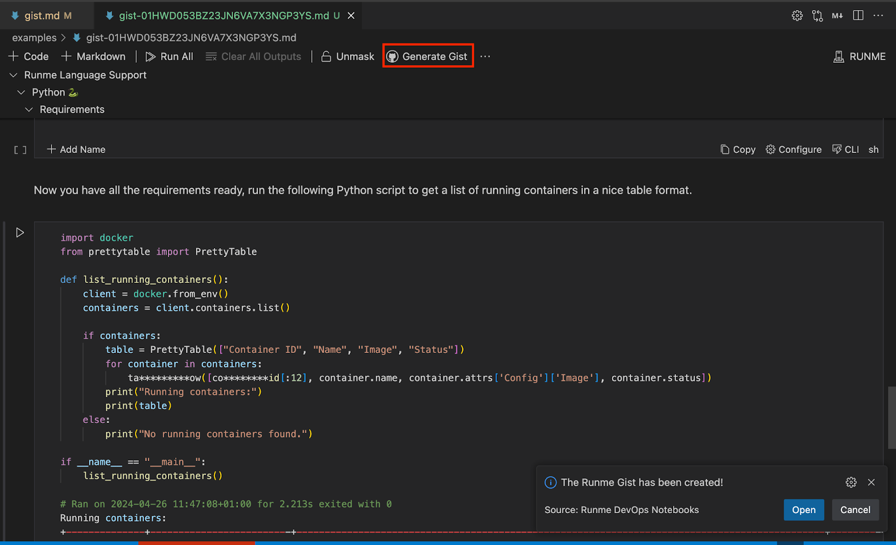

Runme Gist
Would you love to share or store your plain texts or code snippets securely with others in your team without needing a full repository or document?

Runme Gist makes that possible and prioritizes your information's sensitivity by keeping sensitive information secret. In this section, we will explain how Runme Gist works.

## What is Runme Gist?
Runme Gist combines GitHub Gist with Runme capabilities to run, share, and store plain texts or code snippets in your Markdown file. What makes Runme Gist so powerful is its ability to capture outputs and mask sensitive data without copying and pasting or integrating a third-party tool. You have everything done inside your Markdown file. Amazing right?

## Installation
- To utilize the Runme Gist feature, ensure the [Runme extension](../installation/installrunme) is installed in your VS Code. If you already have Runme installed in your VS Code, ensure you are upgraded to v3.4.0.
- Make Runme your [default Markdown viewer](../installation/installrunme) to ensure all Markdown files are automatically opened as a Runme notebook.

## How Runme Gist Works
As stated earlier, Runme Gist combines GitHub Gist with Runme capabilities to enable you to securely run, share, and store code snippets. In this section, we will explain how Runme Gist works.

1. Open your Markdown File
Create a Readme.md file and open it in your VS Code. If you already have the file you want to use, open it in VS Code.
2. Run Cells
Run your notebook cells, and ensure the auto-save feature is turned on to save your outputs without manual intervention.

3. View Sessions Output
To view your session output, click “Sessions Outputs” to inspect the locally recorded session. Alternatively, you can find it on the left-hand side of your VS Code right inside your current working directory.

The Session Outputs feature only appears when the autosave is activated and the Runme cell is run.

4. Toggle Between Mask and Unmask
You can decide if you want your session outputs to be masked or unmasked.
By default, Runme uses the open-source data guardian to mask sensitive information on a best-effort basis.

## Creating and Managing gist With Runme

GitHub Gist is a service provided by GitHub that allows users to share code snippets, notes, and other small pieces of text with others. With a single click, you can push your Runme Session Output to GitHub Gist from your Markdown file.
To do this, click on “Generate Gist”.

Runme will first prompt you to log into your GitHub account and grant write access to your Gist. After a successful login, it will display a notification containing a link to the Runme Gist hosted on your GitHub.
The link is generated as a “Secret Gist,” which will stay private as long as you keep it private. Always think twice before sharing the link, and before pushing your sessions to GitHub gist, ensure you use the Runme mask feature to keep your sensitive pieces secured.

## Visual Representation of Runme Gist
Here is a video that showcases the power of Runme Gist.

<video autoPlay loop muted playsInline controls>
  <source src="/videos/Runme-gist.mp4" type="video/mp4" />
  <source src="/videos/Runme-gist.webm" type="video/webm" />
</video>

Congratulations, you have successfully learned how to use the Runme Gist feature. Note that it is possible to keep session output files offline and locally. You can read about that here. If you love this feature, kindly give Runme a star on GitHub.
