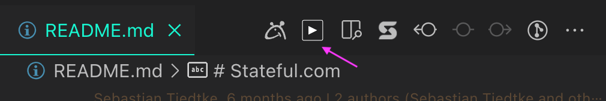
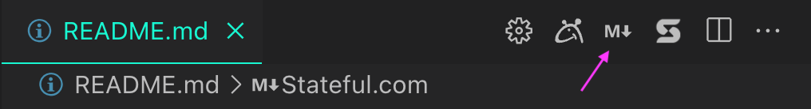
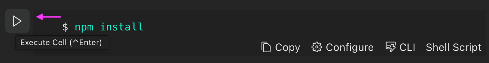
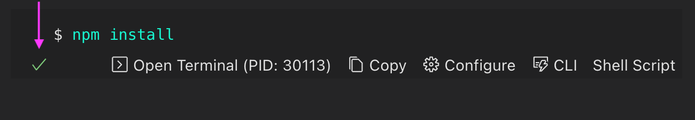
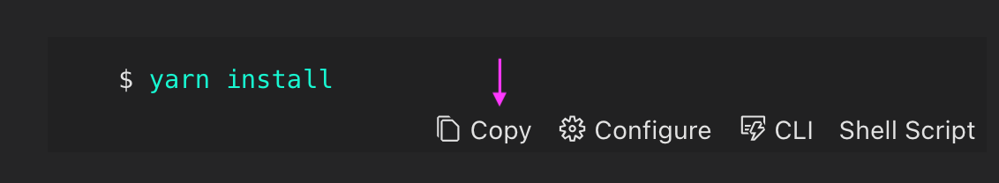
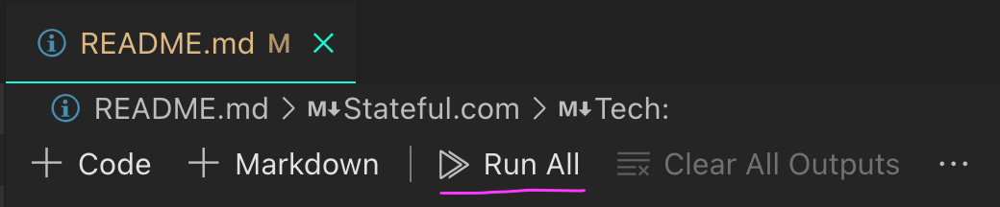
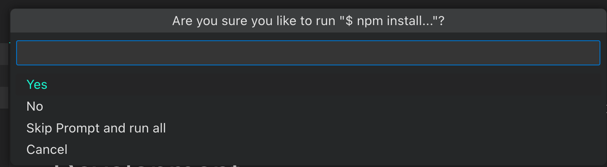

## Runme UX

Easily switch between different views.

### Open the notebook version



### Open the markdown version



## Markdown Editor

### Run a command block

It's straightforward to run one-time command blocks directly from the raw markdown. And, what's even more convenient is that any changes made to the environment stay even when switching between markdown and notebook views.


### Open block in notebook

Jump right into your Markdown's notebook view at the respective block from your editor view.


## Runme Notebook

### Run a command block

To run a command, simply click the run button (may require your mouse over the command in some themes). You will notice that this turns into a stop button for hung or long-running commands, which can be used to kill the terminal process.



A succeeding exit code will be indicated with the small green checkbox seen below:



You can also open the terminal that did the execution by clicking the “Open Terminal” button as shown above with its PID.

### Copy & paste

Outside of literally running commands, Runme offers the ability to quickly copy commands (with the click of a button) out of a markdown file to paste into your terminal.



### Run all command blocks

To run all the commands in the notebook in the order they are found, you can click the “Run All” button.



To be extra safe, you will be prompted before each step to confirm your intentions unless you select “Skip Prompt and run all”.



### Split view of markdown and notebook

It’s easy to get from notebook to markdown and vice versa.

### Run with Runme Deep Linking

You can use Runme to on-board developers with a simple click on a button. It will trigger VS Code to clone a repository and open it for the user with a specific markdown file opened, e.g. an onboarding markdown file to have the user get started with the project:

You can create such a link using the following structure:


You can put this as HTML link on any website, e.g.:

```html
<a href="vscode://stateful.runme?command=setup&repository=git@github.com:stateful/blog-examples.git&fileToOpen=node-streams/README.md">Getting onboarded to Project</a>
```

You can also just have Runme check out any arbitrary markdown file accessible from the internet. This can be useful when designing tutorials for user to go through or if your documentation is not connected to any code. For this use case rmeove the `repository` parameter and have `fileToOpen` be an url to a raw markdown file that is publicly accessible.


By adding the following badge to your `Readme.md`, developers will be able to check out your project with a simple click:

    [](https://runme.dev/api/runme?repository=git%40github.com%3Astateful%2Frunme.git)

Which will result in:

[](https://runme.dev/api/runme?repository=git%40github.com%3Astateful%2Frunme.git)

### Summary

* Execute command blocks via a simple ️⏯ play button instead of copy&paste-ing into your terminal
* Leverage placeholder and prompts to have readers interactively complete ENV VARs
* Fine-tune your doc's executable notebook cells to streamline the execution experience for others
* Run watchers for compilation/bundling in as background tasks
* Capture non-interactive output directly inside the respective notebook's cell output
* Control whether or not a cell's terminal should remain open after successful execution
* Use language identifiers in fenced code blocks to forgo language detection and higher reliability
* Set a cell's output MIME type to render images, JSON, or any other format in human-compatible ways
