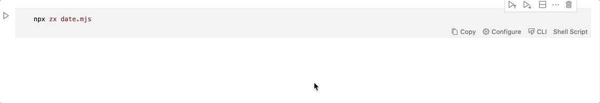
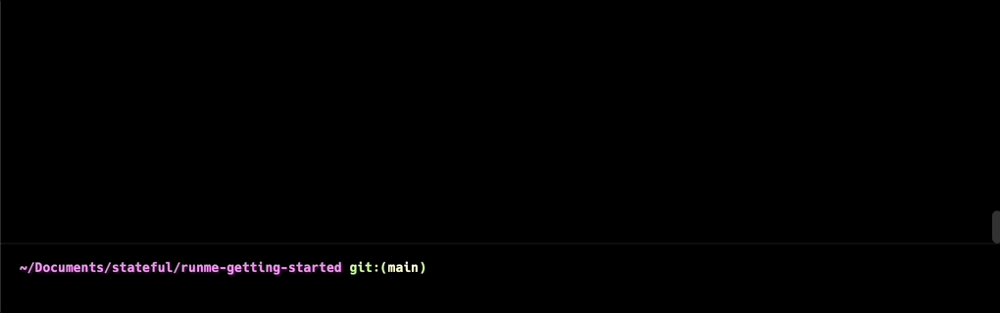

# Getting Started

Copypasta menu is over.

Have you ever wondered if there is a better way of doing READMEs and executing code blocks? It’s time for dessert, RUNME appears on the menu, and you can call it a day.


Make edits and author markdown docs inside of a notebook UX

Add markdown and code blocks easily



Run README commands from a CLI

Make your README commands executable from a CLI



## Try it yourself

Just open this guide as a notebook inside VS Code to experience Runme first-hand.

### Inside VS Code

```sh
    export MY_NAME=Enter your name
    $ echo "Hi $MY_NAME, just let Runme execute your docs for you."
```

### In Your Terminal

Alternatively, you could use Runme's CLI in your terminal. On MacOS:

```sh
    $ brew install stateful/tap/runme
    $ runme --filename getting-started.md
```

Check [Runme's releases page](https://github.com/stateful/runme/releases) to download the CLI for all other platforms.

## Your First Notebook

You can get started in one click with the following badge:

[](vscode://stateful.runme?command=setup&fileToOpen=docs/intro.md&repository=https://github.com/stateful/runme.dev.git)

Simply follow the instructions provided by VSCode to get started in seconds:


Alternatively, check out the [Install Guide](https://runme-dev-mxsdev.vercel.app/docs/install) and clone the [Example Repo](https://github.com/stateful/blog-examples) to follow along! This guide follows the `node-streams` sub-package - simply open its README file and runme will do the rest.

## Running Scripts

Runme automatically converts all bash codeblocks in your README into runnable scripts. This makes getting started with a new project a breeze - say goodbye to annoying copy-and-pasting!

To run a script, click the Run button on its left-hand side. Start by running the first script under "Prerequisites":


As you can see, we have downloaded the `business_data.csv` file, which contains business statistics about New Zealand in the years 2000-2021. It's a pretty big file!

### Warning!

In order for the set-up script to work, you'll need to have the `curl` and `unzip` utilities installed. The remainder of the scripts will also require `node.js` to be installed.

In a future version of Runme, we plan to provide a solution to help you manage these dependencies from within the notebook. Stay tuned!

## Command Output

Scroll down to the "Examples" section of the notebook. From there, try running Steps 1 and 2.

If everything goes right, you should get an output like the following:


Great! You can see the terminal output from each command beneath its respective cell. Our Node.JS script was able to parse that massive file with no problems!

### Sidenote

Wondering how you know when a command is finished executing? Look out for the checkmark in the bottom left:


If the command fails, it will be an "X" mark instead!

### Copying Output

Runme provides a handy "Copy" button to easily copy the output of a command!


### Clearing Output

Sometimes, the output of a command can clutter up the screen. To prevent this, use the "Clear Cell Outputs" menu option.

Alternatively, select the output and use the Option+Delete shortcut.


### Summary

Hopefully, you've successfully run your first Runme notebook, and understand the basics of Runme! As you'll soon see, however, you've still barely scratched the surface of Runme's capabilities.

On the next page, you'll build your own Runme notebook.

## Editing

On the last page, you ran scripts in a readme file provided by us. Where Runme really starts to shine, though, is when you use it as an editor!

### Setup

Start by initializing a new project and adding a new `README.md` file. When you open it, you should get an empty canvas, like so:


## Adding Markdown

To add a new Markdown section, click the "+ Markdown" button in the top left or center:


You can then edit the markdown block directly:


As shown in the video, once you're done editing a block, use the "Stop Editing Cell" button (the one with the checkmark):


If you ever want to edit the cell again, use the "Edit Cell" button:


Finally, you can remove a cell at any time using the "Remove Cell" button:


Note that the usual shortcuts (like Ctrl + Z) work perfectly in this environment too!

### Sidenote

You can use Escape or Ctrl + Enter to quickly finish editing a cell.

You can use Enter on its own to start editing a selected cell.

You can also use Command + Delete to quickly remove a cell!

## Adding Code

Code cell blocks work similarly to Markdown blocks, and can be edited/saved/deleted in the same way.

To create a new code block, use the "+ Code" button in the top left or center:


You can then freely add runnable code:


### Interactive Mode

By default, our script will run in "Interactive Mode." This will run the script in a separate terminal window, rather than in the notebook itself.

This is great for, as the name implies, interactive scripts. Our script, however, just prints output and has no interactivity whatsoever. It would be great to see the output in the terminal!

If we just try to run this as-is, we will experience the following:


To fix this easily, we'll need to access the Configure foldout by clicking on the Configure button:


From here, we can easily disable interactive mode:


And our code block will now display its output exactly as in the previous guide:

## Frontmatter

At the moment we won’t break your frontmatter, but we also haven’t yet implemented an interface for managing or editing it from within the notebook. Stay tuned!

## Runme Configuration for VS Code

In the VS Code settings, several configurable settings influence general Runme behavior and enable experimental functionality.


## More Examples

Previously, you learned the basic editing tools for creating and editing README files.

In this guide, you'll be exposed to a few examples of usages for Runme. Hopefully, this helps inspire you to use Runme in interesting and useful ways!

## Setup

Go ahead and clone the `stateful/vscode-runme` repo:

```sh
    git clone https://github.com/stateful/vscode-runme
```

These examples are from the `examples` sub-folder!

## Fresh Service

The first example is in the `fresh` folder and sets up a fresh service with deno.

### Local Environment

Runme makes setting up your local environment a breeze! Here, you can see a few install scripts that will set everything up:


### Sidenote

In a future version of Runme, we plan on only showing installers relevant to your current operating system/environment.

Stay tuned!

### Environment Variables

Runme can also be used to establish local environment variables for the current session.


### Warning!

Environment variable support in Runme is currently largely a work in progress.

We have a lot planned for supporting the environment/secrets in the future, so stay tuned!

### Deploying

For a deploy script, such as the one below, running as a Background task is a great idea, since it is a long-running script.


## Next.js App

This example can be found in the `vercel` sub-folder.

### Setup/Environment

Similar to the last example, we can do our setup, starting, and opening of the web browser using Runme:


### Sidenote

In a future version of Runme, we'd like to support "execution groups," so that you can execute all of the above scripts in one go!

### Authentication

Interactive terminals are perfect for providing a CLI login to the user:


### List Projects

Remember, cells can capture the output of commands in non-interactive mode!

In this case, this can be used to get a list of the user's current registered projects with the Vercel platform.


### Sidenote

So what if you want to have both interactivity _and_ stay within the notebook?

Unfortunately, making this work with VSCode is a challenge. We're working hard, however, to look for a good solution to this problem!

(TODO: maybe link to upstream VSCode issue here?)

### Background Processes

Suppose that you have a script that intends to run in the background (like a dev watcher). To simulate this now, we'll use the script `sleep 10000`.

You _could_ run this like other scripts, however, Runme supports a special "Background" mode for these kinds of tasks. This mode gives special tools to help manage them!

You can enable Background mode in the same foldout you configured Interactive mode:


### Warning!

Background mode only works in tandem with Interactive mode!

Now, when you run the script, it will be part of a long-running terminal session:


As is demonstrated by the previous video, background tasks are delineated by the "Background Task" label:


Background Tasks also get a "Stop Task" button to end their execution long after starting:


### Sidenote

Configuration fields like "background" and "interactive" are set using markdown's script metadata feature:


Be sure not to strip this data if you want to use it!

### Changing Language

(TODO: show how to change language; need issues fixed for this since language selection is broken at the moment)

## Summary

Hopefully, you now feel comfortable making your own notebooks!

In the next guide, you'll see some more practical examples, so you can get some ideas on how to use these tools in action.

## How to ensure Runme is working properly?

It’s easy. Open your project README file and see it is now opened as a Notebook file! Check that shell commands are now rendered as runnable blocks. That’s pretty nice. Finally, you’re seeing the future of running your README files now. We bet you won’t want to return to plain markdown viewers.

## How to open a README file as a markdown file?

Sometimes, you will want to see the file as a regular markdown file, and you don’t need to disable or uninstall RUNME. You can right-click on the file and pick one of the options displayed when clicking Open with. You can select the built-in text editor or markdown preview for such cases.


## Getting the best of Runme

To get the best of RUNME, and to offer a fantastic README experience, RUNME has a cell configuration option, which allows you to indicate HOW the cell will be executed. The cell represents an execution block, usually shell commands.

## Cell configuration

### Options

| Configuration         | Description                                                    | Default value |
| ------------ | ---------------------------------------------------------------| ------------- |
|  background  | Indicates if the cell should be runned as a background process | false         |
|  interactive | Indicates if run should allow interactive input                | false         |
|  closeTerminalOnSuccess | Hide Terminal after cell successful execution       | true          |
|  mimeType    |  Cell’s output content MIME type                               | text/plain    |
|  name        | Cell’s canonical name useful for referencing the cell via CLI  | auto-generated |

### Configure Cell's Execution

Not all commands are equal and expectations of how execution works differ. The most common cases are:

1. File-watchers for compilers & bundlers should run as background tasks
2. Interactive vs non-interactive execution
3. Human-centric output: JSON, text, images, etc
4. Terminal visibility when no errors occur

Just click "Configure" on the respective cell to make modifications to the cell execution behavior.


If you feel more comfortable editing the markdown file directly, you can do it by using the following configuration options schema:

```sh
```sh { interactive=false name=echo-hello-world }
echo hello world ```
```

Try out the previous command

```sh
echo hello world
```

The entire configuration schema as an example

```sh
```sh { interactive=true name=example mimeType=text/plain closeTerminalOnSuccess=false background=false }
echo hello world ```
```

Take a look at more [examples](https://github.com/stateful/vscode-runme/tree/main/examples) available inside the VS Code extension repo for a reference on how to apply these code block attributes in different use cases.

### State Management

This is an active area of development, but the currently released version of Runme doesn’t share an environment state between cells. 

To get around this problem, you can make cells completely independent by having all of the pre-requisite commands also run in the same code cell. In the following example, I solve the problem by using the file system.

**Example with the environment (DOESN’T WORK):**

```sh
$ export NAME='Adam'

$ node ./run_server -name $NAME # This wont work!
```
**Example with the file system (WORKS):**

```sh
$ echo "Adam" > name.txt

$ NAME=$(&lt;name.txt) 

$ node ./run_server -name $NAME # This works!
```

## Notebook Explorer

To help you navigate the markdown files in your project, Runme adds this super handy “RUNME NOTEBOOKS” panel. Clicking any markdown file will open it in your code editor view.


## Authoring Notebooks

Runme notebooks are special as they don't run Python code like [Jupiter Notebooks](https://code.visualstudio.com/docs/datascience/jupyter-notebooks) would do. They allow you to define shell commands that help developers to get up and running with your project.

To get started with a new notebook, just create a markdown file. Runme will automatically open a notebook view that allows adding markdown or code cells.

## Mime types

Runme supports the standard VS Code mime types alongside custom Runme mime types.

**Standard VS Code mime types**

* text/plain
* application/javascript
* text/html
* image/svg+xml
* text/markdown
* image/png
* image/jpeg

**Mime types for rendering code**

* text/x-json
* text/x-javascript
* text/x-html
* text/x-rust
* text/x-LANGUAGE_ID for any other built-in or installed languages.

**Runme Mime types**

* stateful.runme/vercel-stdout: Used for executing and rendering vercel commands
* stateful.runme/deno-stdout: Used for executing and rendering deno commands

## What You Need To Know 👩‍🏫

Runme turns arbitrary markdown files into runnable notebooks. If your markdown contains [fenced-code blocks](https://www.markdownguide.org/extended-syntax/#fenced-code-blocks) with shell-compatible commands, Runme is your friend. You most commonly find these in `README.md`, `DEV.md`, `BUILD.md`, etc but is up to your editorial preference.

### Specify Language in Blocks

Runme, just like most Markdown viewers, will work best without ambiguity about what language is contained inside of fenced code blocks. If possible, always specify the language [according to the standard](https://www.markdownguide.org/extended-syntax/#syntax-highlighting) illustrated below.

```
    ```sh
    $ echo "language identifier in fenced code block"
    ```
```

Out of the box, Runme will leverage the [Guesslang](https://github.com/yoeo/guesslang) ML/AI model with a bias towards Shell to detect the languages for unidentified code blocks. While this works well in a lot of cases, the accuracy is nowhere near 100%.

### How to handle long-running processes

You want to enable the `background` setting if notebook execution will continue indefinitely on a single command.


It is very common to use file-watcher enabled compilers/bundlers (`npm start dev`, `watchexec...` etc) in the background during development. For any cell containing an instance of these commands be sure to tick the "background" cell setting. It prevents execution from permanently blocking the notebook UX. Once ticked notice the "Background Task" label shows up in the cell status bar.


### Interactive vs non-interactive execution

If a cell's commands do not require any input from a reader it might be a good fit to include the cell's output inside the notebook. This is useful if the resulting output could be useful as input in a downstream cell.


Please note that the Runme team is currently working on making output in both notebook & terminal default behavior.

### Human-centric output: JSON, text, images, etc...

Not all cells’ output is plain text. Using the `mimeType` specifier it is possible to specify the expected output's type. Notebooks have a variety of renderers that will display them human friendly.


Amongst others here are a few popular choices: `image/svg+xml`, `text/x-json`, `text/x-javascript`, `text/x-html`, `text/x-rust`, etc.

### Terminal visibility when no errors occur

A cell's execution terminal is auto-hidden unless it fails. This default behavior can be overwritten if keeping the terminal open is in the interest of the Runme notebook reader. Just untick `closeTerminalOnSuccess` (`false`).
