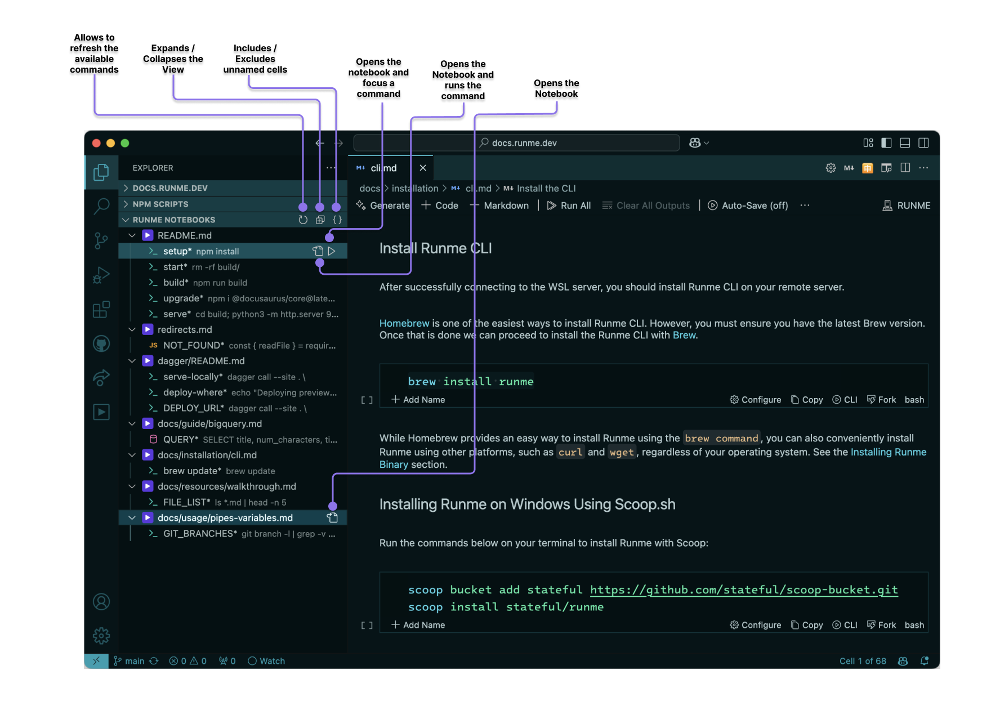

import Infobox from "../src/components/Infobox.tsx"

# Getting Started

Runme strives to provide a great experience right out of the box. Please continue to learn how to get the most out of our markdown docs. If you haven't already installed Runme, please complete the steps in [installation](/install) before proceeding.

# Your First Runme

You can get started in one click with the following badge:

Simply follow the instructions provided by VS Code to get started in seconds:

Alternatively, clone into the [Example Repo](https://github.com/stateful/blog-examples) to follow along! This guide follows the `node-streams` sub-package - simply open its README file and runme will do the rest.

If you want to use Runme outside VS Code, you can install the CLI standalone. Learn about the [Runme CLI](/install#runme-cli)

## Running Scripts

Runme automatically converts all bash codeblocks in your README into runnable scripts. This makes getting started with a new project a breeze - say goodbye to annoying copy-and-pasting!

To run a script, click the Run button on its left-hand side. Start by running the first script under "Prerequisites":

As you can see, we have downloaded the `business_data.csv` file, which contains business statistics about New Zealand in the years 2000-2021. It's a pretty big file!

<Infobox type="warning">

In order for the set-up script to work, you'll need to have the `curl` and `unzip` utilities installed. The remainder of the scripts will also require `node.js` to be installed. In a future version of Runme, we plan to provide a solution to help you manage these dependencies from within the notebook. Stay tuned!

</Infobox>

## Command Output

Scroll down to the "Examples" section of the notebook. From there, try running Steps 1 and 2.

If everything goes right, you should get an output like the following:

Great! You can see the terminal output from each command beneath its respective cell. Our Node.JS script was able to parse that massive file with no problems!

### Successful Execution

Wondering how you know when a command is finished executing? Look out for the checkmark in the bottom left:

If the command fails, it will be an "X" mark instead!

### Copying Output

Runme provides a handy "Copy" button to easily copy the output of a command!

### Clearing Output

Sometimes, the output of a command can clutter up the screen. To prevent this, use the "Clear Cell Outputs" menu option.

Alternatively, select the output and use the Option+Delete shortcut.

Hopefully, you've successfully run your first Runme notebook, and understand the basics of Runme! As you'll soon see, however, you've still barely scratched the surface of Runme's capabilities.

# Runme Editing & Authoring

Runme combines running, viewing, and editing into one experience.

## From Scratch

Start by initializing a new project and adding a new `README.md` file. Alternatively you can select `Runme Notebook` from the `File->New File` menu. When you open it, you should get an empty canvas, like so:

## Adding Markdown

To add a new Markdown section, click the "+ Markdown" button in the top left or center:

You can then edit the markdown block directly:

As shown in the video, once you're done editing a block, use the "Stop Editing Cell" button (the one with the checkmark):

If you ever want to edit the cell again, use the "Edit Cell" button:

Finally, you can remove a cell at any time using the "Remove Cell" button:

Note that the usual shortcuts (like Ctrl + Z) work perfectly in this environment too!

<Infobox type="sidenote">

You can use `ESC` or `Ctrl+Enter` to quickly finish editing a cell.

You can use Enter on its own to start editing a selected cell.

You can also use `CMD+Delete` to quickly remove a cell.

</Infobox>

## Adding Code

Code cell blocks work similarly to Markdown blocks, and can be edited/saved/deleted in the same way.

To create a new code block, use the "+ Code" button in the top left or center:

You can then freely add runnable code:

## Interactive Mode

By default, our script will run in "Interactive Mode." This will run the script in a separate terminal window, rather than in the notebook itself.

This is great for, as the name implies, interactive scripts. Our script, however, just prints output and has no interactivity whatsoever. It would be great to see the output in the terminal!

If we just try to run this as-is, we will experience the following:

To fix this easily, we'll need to access the Configure foldout by clicking on the Configure button:

From here, we can easily disable interactive mode:

And our code block will now display its output exactly as in the previous guide:

## Frontmatter

[Frontmatter](https://jekyllrb.com/docs/front-matter/) is common occurrence in markdown documents. At the moment Runme won’t break your frontmatter, but we also haven’t yet implemented an interface for managing or editing it from within the notebook. Stay tuned!

## Runme Settings for VS Code

In the VS Code settings, several configurable settings influence general Runme behavior and enable experimental functionality.

### Background Processes

Suppose that you have a script that intends to run in the background (like a dev watcher). To simulate this now, we'll use the script `sleep 10000`.

You _could_ run this like other scripts, however, Runme supports a special "Background" mode for these kinds of tasks. This mode gives special tools to help manage them!

You can enable Background mode in the same foldout you configured Interactive mode:

<Infobox type="warning">

Background mode only works in tandem with Interactive mode!

</Infobox>

Now, when you run the script, it will be part of a long-running terminal session:

As is demonstrated by the previous video, background tasks are delineated by the "Background Task" label:

Background Tasks also get a "Stop Task" button to end their execution long after starting:

### Markdown Script Metadata

Configuration fields like `background` and `interactive` are set using markdown's script metadata feature:

<Infobox type="warning">

Be sure not to strip this data if you want to use it!

</Infobox>

<!-- ### Changing Language -->

<!-- (TODO: show how to change language; need issues fixed for this since language selection is broken at the moment) -->

## Great work!

Hopefully, you now feel comfortable making your own Runme notebooks! If you run into any issues please [file a ticket](https://github.com/stateful/runme.dev/issues) or tell us about it [on Discord](https://discord.gg/runme).

Please see the [integrations section](/integrations) to see more sophisticated use-cases of Runme or learn about all the [cell configuration options](/configuration) available to streamline the reading and running experience.

## Useful Tips & Tricks

### How to ensure Runme is working properly?

It’s easy. Open your project README file and see it is now opened as a Notebook file! Check that shell commands are now rendered as runnable blocks. That’s pretty nice. Finally, you’re seeing the future of running your README files now. We bet you won’t want to return to plain markdown viewers.

### How to open a README file as a markdown file?

Sometimes, you will want to see the file as a regular markdown file, and you don’t need to disable or uninstall RUNME. You can right-click on the file and pick one of the options displayed when clicking Open with. You can select the built-in text editor or markdown preview for such cases.

### Notebook Explorer

To help you navigate the markdown files in your project, Runme adds a super handy "Runme Notebooks" panel. Clicking any markdown file will open it in your code editor view:

