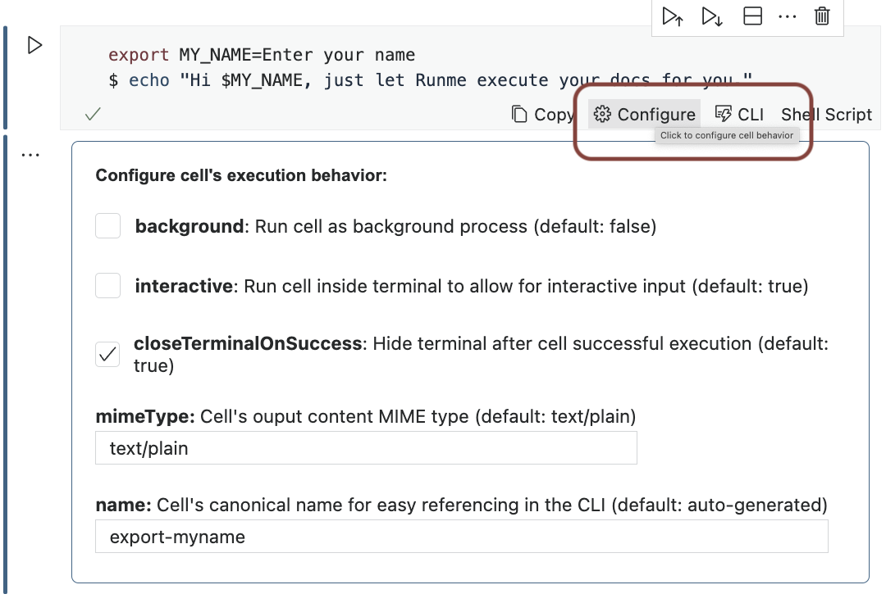
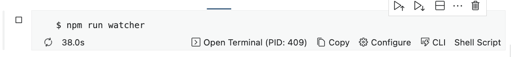
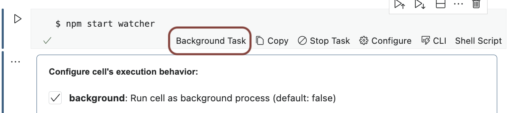
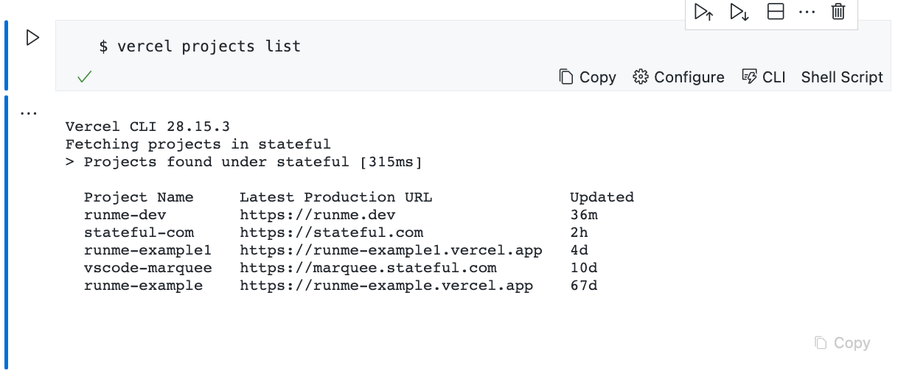

# Getting Started ⚡️

Welcome 👋! Runme strives to provide a great experience right out of the box. Please continue on to learn how to get the most out of our docs via Runme. In fact, why not use Runme to learn about Runme?

[](vscode://stateful.runme?command=setup&fileToOpen=docs/getting-started.md&repository=https://github.com/stateful/runme.dev.git)

## What is Runme? 🤔

📜 Runme lets you seamlessly turn your existing Markdown docs, such as README.md, into runnable notebooks.

⏯ Runme enables static docs to become interactive for its readers and greatly improve their learning experience.

👩‍💻 As a VS Code user, just [click here](vscode://stateful.runme?command=setup&fileToOpen=docs/getting-started.md&repository=https://github.com/stateful/runme.dev.git) to *leverage Runme to run through this getting started guide*.

### Installation

Open and search `runme` from within the Extension Panel inside VS Code or click-to-install from the Marketplace:

- VS Code's official Marketplace: [https://marketplace.visualstudio.com/items?itemName=stateful.runme](https://marketplace.visualstudio.com/items?itemName=stateful.runme)
- Open VSX Registry: [https://open-vsx.org/extension/stateful/runme](https://open-vsx.org/extension/stateful/runme)

## Why Runme? 💡

While markdown docs are ubiquitous in software and the written word foundational to documentation, bit-rot and "broken docs" are all too commonplace. The low coupling between documentation's static text and the code of the documented system exposes our docs to breakage. Runme is here to address this fundamental problem. Runme's goal is to makes existing markdown docs both **runnable** and subsequently **testable**. Much in the same way how unit tests relates to your code.

## Jump Right In 🚀

Just [open this guide](vscode://stateful.runme?command=setup&fileToOpen=docs/getting-started.md&repository=https://github.com/stateful/runme.dev.git) as notebook inside VS Code to experience Runme first-hand.

### Inside VS Code

```sh { background=false interactive=false }
export MY_NAME=Enter your name
$ echo "Hi $MY_NAME, just let Runme execute your docs for you."
```

### In Your Terminal

Alternatively, you could use Runme's CLI in your terminal. On MacOS:

```sh { interactive=true }
$ brew install stateful/tap/runme
$ runme --filename getting-started.md
```

Check [Runme's releases page](https://github.com/stateful/runme/releases) to download the CLI for all other platforms.

## What You Need To Know 👩‍🏫

Runme turns arbitrary markdown files into runnable notebooks. If your markdown contains [fenced-code blocks](https://www.markdownguide.org/extended-syntax/#fenced-code-blocks) with shell-compatible commands, Runme is your friend. You most commonly find these in `README.md`, `DEV.md`, `BUILD.md`, etc but is up to your editorial preference.

### Specify Language in Blocks

Runme, just like most Markdown viewers, will work best without ambiguity what language is contained inside of fenced code blocks. If possible, always specify the language [according to the standard](https://www.markdownguide.org/extended-syntax/#syntax-highlighting) and illustrated below.

    ```sh
    $ echo "language identifier in fenced code block"
    ```

> Out-of-the box, Runme will leverage the [Guesslang](https://github.com/yoeo/guesslang) ML/AI model with a bias towards Shell to detect the languages for unidentified code blocks. While this works well in a lot of cases, the accuracy is nowhere near 100%.

### Configure Cell's Execution

Not all commands are equal and expectations how execution works differs. Most commond cases are:

1. File-watchers for compilers & bundlers should run as background tasks
2. Interactive vs non-interactive execution
3. Terminal visibility when no errors occur
4. Human-centric output: JSON, text, images, etc

Just click "Configure" on the respective cell to make modifications to the cell execution behavior.



### How to handle long-running processes (`background`)

You want to enable the `background` setting if notebook execution will continue indefinitely on a single command.



It is very common to use file-watcher enabled compilers/bundlers (`npm start dev`, `watchexec...` etc) in the background during development. For any cell containing an instance of these commands be sure to tick the "background" cell setting. It prevents execution to permanently block the notebook UX. Once ticked notice the "Background Task" label show up in the cell status bar.



### Interactive vs non-interactive execution (`interactive`)

If a cell's commands do not require any input from a reader it might be a good
fit to include the cell's output inside of the notebook. This is useful if
resulting output could be useful as input in a downstream cell.



> Please note that the Runme team is currently working on making output in both
> notebook & terminal default behavior.

### Terminal visibility when no errors occur (`closeTerminalOnSuccess`)

### Human-centric output: JSON, text, images, etc (`mimeType`)

## Key Features 🦾

- Execute command blocks via a simple ️⏯ play button instead of copy&paste-ing into your terminal
- Leverage placeholder and prompts to have readers interactively complete ENV VARs
- Fine-tune your doc's executable notebook cells to streamline the execution experience for others
- Run watchers for compilation/bundling in as background tasks
- Capture non-interactive output directly inside the respective notebook's cell output
- Control whether or not a cell's terminal should remain open after successful execution
- Use language identifiers in fenced code blocks to forgo language detection and higher reliability
- Set a cell's output MIME type to render images, JSON, or any other format in human-compatible ways
