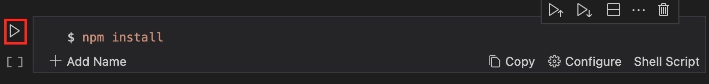
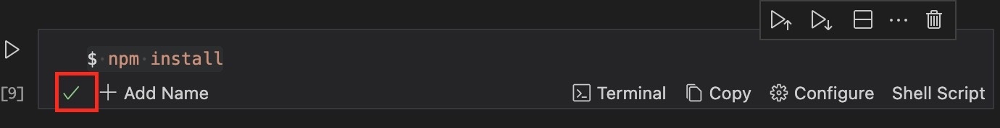
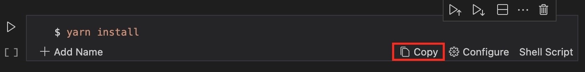
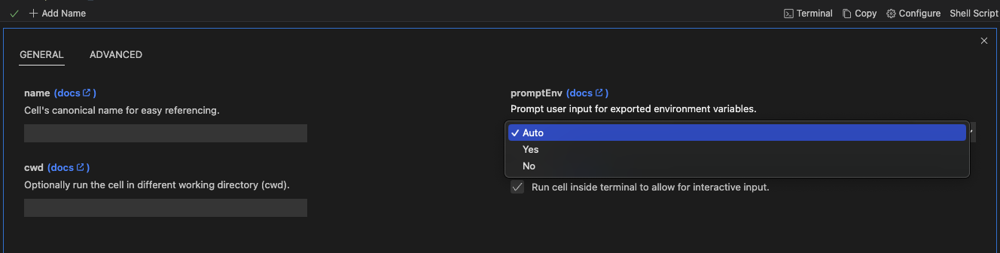
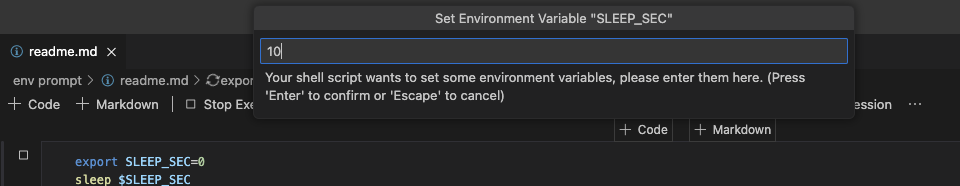
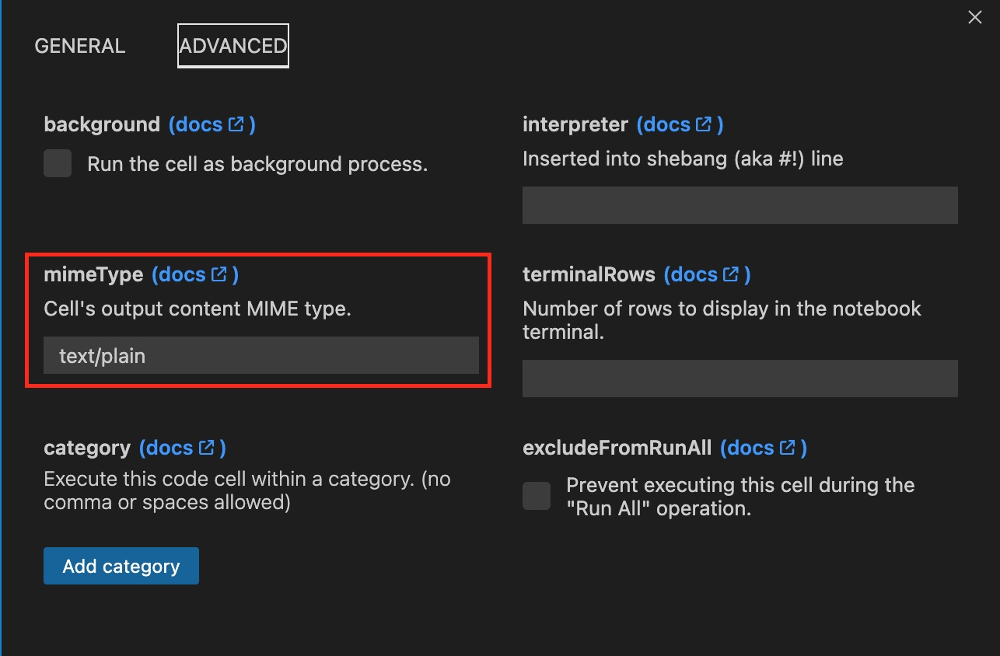
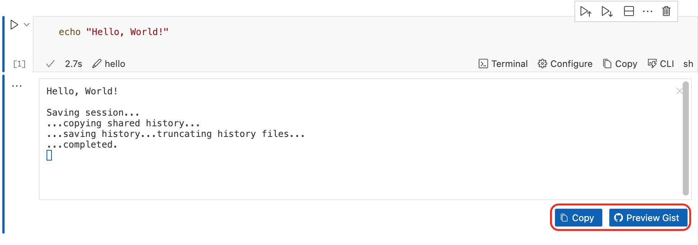

---
runme:
  id: 01HX525D9D1E2MMYPTCVJK2P32
  version: v3
sidebar_position: 8
title: Key Features
---

# Key Features

Runme makes your runbooks runnable! This implies you can execute your code written in various languages directly within your markdown file. With built-in features, Runme enhances your automation processes, providing an interactive way to run your code and streamline your tasks.

Some of the key features of Runme include:

## **Runme Notebook**

With the Runme extension installed on your VS Code, you have access to several notebook features that make it easy for users to run code and commands. Some of these features include:

**Run a command block**

In the Runme notebook, you can easily run commands with a single click. To run a command, Runme provides a “run cell” button, identified by the icon below.

Once a command is run, you will notice that this turns into a stop button, indicating the command’s execution.

On completion, a succeeding exit status will be indicated with the small green check icon. As seen below:

You can also open the terminal that did the execution by clicking the “Terminal” button as shown above.

**Copy & Paste**

More than just running commands, you can quickly copy commands out of a markdown file to paste into your terminal with one click.

**Run all command blocks**

Easily run all your code blocks at once! To run all the commands in the notebook in the order they are found, click the Run All button.

For added security, you will receive a prompt to confirm your actions before each step. You can skip the prompts and run all steps at once for a smoother process.

### Background Task

If you cannot wait for your code or command to finish execution and you want to run something else simultaneously, the background mode in Runme is the way to go.

Runme has a **background** mode that enables you to run tasks in the background. To do this, you have to activate the background mode.

### Interactive Mode

Do you love to interact with the inputs on your terminal as you execute commands and code?

If yes, you will need to activate the interactive mode. Otherwise, you can toggle it off.

## **Environment Variable Prompts**

Runme simplifies the use of environment variables in your notebooks by allowing dynamic settings within each cell block of your notebook. It provides interactive prompts in each cell, tailored to your users' needs. This ensures a smooth and user-friendly experience when incorporating real-time user interaction.

**How to Enable PromptEnv**

- Click on  `configure ⚙️` in your code cell
- Click `promptEnv` to set the condition you want the cell to run in

For instance, in the image below, we configure the `SLEEP_SECS` environment variable to 10 seconds with a single click on the run cell button. This feature is useful when your runbooks need user-specific values.

This feature allows users to input values directly within the notebook environment, making task execution more efficient. Improve your workflow with the increased flexibility provided by `promptEnv` feature.

### Render Images and CSV Tables In Your Markdown File

Runme has a `MimeType` feature that enables you to render images, CSV-based tables, and other supported content type right inside your Markdown file. Runme supports a wide range of MimeTypes such as `text/x-json`, `text/x-javascript`, `text/x-html`, `image/png`, `image/svg+xml` and `text/csv`.

You can configure to any of your choice in the cell configuration setting.

## **Shebang Support**

Runme gives you the flexibility of running your preferred programming language right inside your Markdown file. This is a result of our Shebang support.

Additionally, for those who would love to work with the interpreter of their local machine, we have made it possible for you to add your local interpreter.

## Smooth Integration With Other Platforms

Runme integrates easily with other platforms such as [GitHub Actions](https://docs.runme.dev/integrations/embed-github-action).

For example, Runme offers a convenient GitHub action that seamlessly integrates with your CI/CD pipeline. You can trigger workflows for GitHub actions in your notebook by pasting GitHub URLs.

## Piping

By default, Runme prevents variables declared in one cell from being directly accessed in another cell. However, by using Piping, which is declared using `$__`, you can pass a variable declared in a previous execution to another in the same file.

The video below provides a visual representation of how Runme integrates with GitHub actions.

### Sidenote

Please be aware that if the execution of a cell depends on the standard output (stdout) of a preceding cell, it is imperative to execute these cells sequentially. Failure to adhere to this sequence could lead to unintended and unpredictable behavior.

## Runme Gist

You can securely share or store plain texts and code snippets with others in your team without needing a full repository or document. Runme does this using the [Runme Gist feature](../configuration/runme-gist). With Runme Gist, the sensitivity of your information is prioritized and kept secret, as you can mask sensitive data in your outputs.

## Runme Cloud Renderers

[Runme Cloud Renderers](../integrations/cloud-render/index.md) is a tool that enables you to interact with your favorite cloud resources to manage and deploy your cloud-native applications right from your Notebook. It integrates with cloud platforms such as AWS and GCP and enables you to perform tasks such as listing and managing clusters, retrieving cluster information, pausing clusters, connecting to instances via SSH, etc., all within your Markdown file.

<video autoPlay loop muted playsInline controls>
  <source src="/videos/runme-revision-cloudrun.mp4" type="video/mp4" />
  <source src="/videos/runme-revision-cloudrun.webm" type="video/webm" />
  <source src="../../../static/videos/runme-revision-cloudrun.mp4" type="video/mp4" />
</video>

## **Other Key Features**

That’s not all!

There are other features available on Runme that can help you improve your process. Some other key features include:

- Installs in seconds. No external dependencies are required.
- Persistent environment variables across cell and session runs.
- Single-click experiences to accomplish subsets of steps inside larger workflows, like setting up an environment, cleaning up stale EC2 instances, or deploying to staging.
- Start a session in the editor, complete environment variables in the notebook, and finish up a workflow in the terminal — all sharing the same session.
- Open tech and open formats at the core (e.g. VS Code Platform and Markdown).
- Compatible with existing task management (Makefile, Docker, NPM/Pipfile, Rake, etc).

## Feedback and Contribution

At Runme, we are continuously enhancing and developing more features to give you a better experience. If you have feedback or new ideas on how to improve Runme, feel free to [reach out to us](https://github.com/stateful/runme?tab=readme-ov-file#feedback). We will be glad to hear from you.
