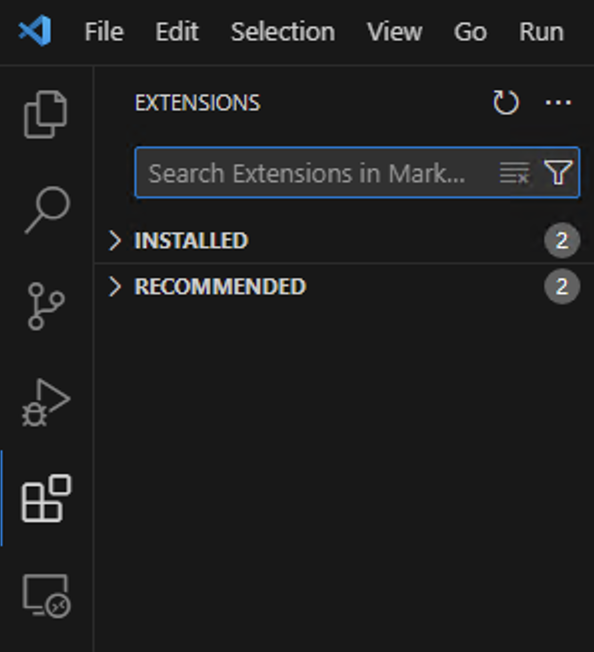
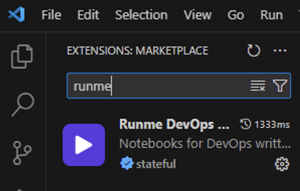
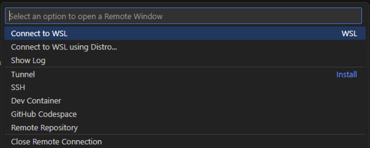
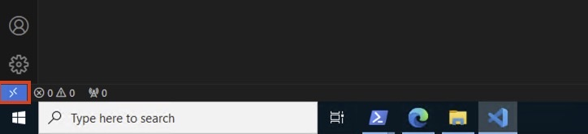
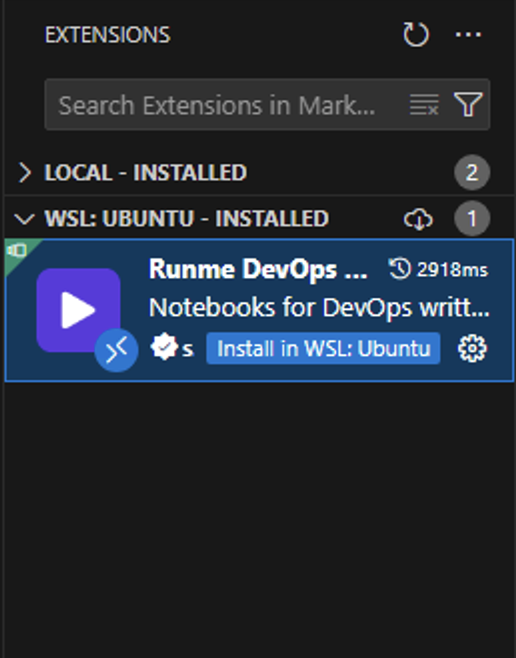
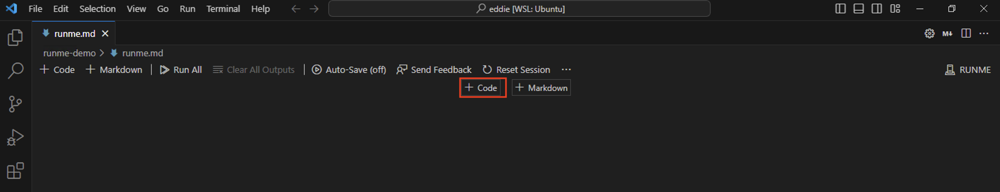
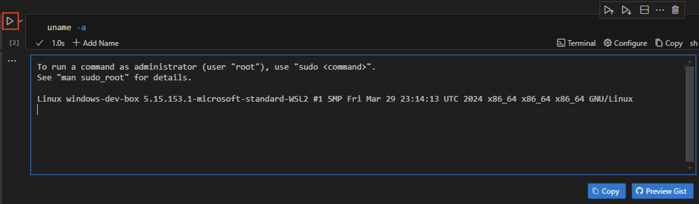
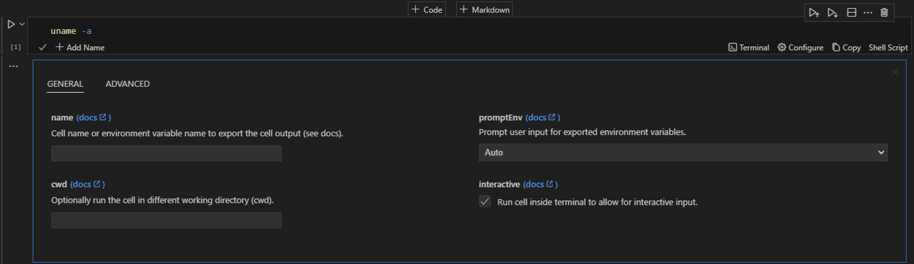
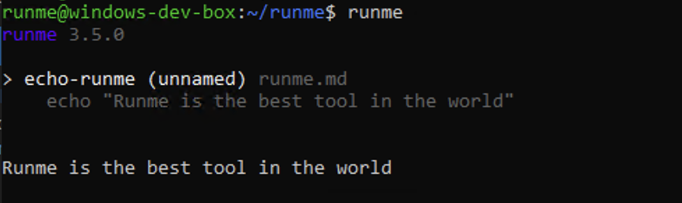

---
runme:
  id: 01J583JVRDADD3Y3TG41EEF291
  version: v3
---

# Windows

To use Runme on a Windows machine, you have to use the Windows Subsystem for Linux 2 (WSL 2). Currently, Runme is built on Cloud-native Shell Kernel with a notebook, editor, terminal, and CLI interface, With WSL 2 you can get the full Runme exprience on your Windows machine. WSL 2 allows you to run a full Linux kernel inside a lightweight utility virtual machine (VM) on Windows 10 and Windows 11.

In this section, we will explore the various steps required to get Runme working on your Windows machine.

## Requirements

To get started, you need to :

- Set up the [Windows Subsystem for Linux](https://learn.microsoft.com/windows/wsl/install) and choose your preferred Linux distribution.
- Ensure you have [Visual Studio Code](https://code.visualstudio.com/) installed on the Windows side rather than within WSL.
- Install the [WSL extension](https://marketplace.visualstudio.com/items?itemName=ms-vscode-remote.remote-wsl) in your VS Code editor.

Once all the requirements are fulfilled, the next thing you need to do is start your WSL. To learn all about starting WSL, check out [this article.](https://learn.microsoft.com/en-us/windows/wsl/install)

## How to Install Runme Extension on VS Code on Windows

In this section, we will provide a step-by-step guide to help you install the Runme VS Code extension on your Windows machine.

To get Runme installed in VS Code on your Windows machine, follow the steps below:

1. Open up VS Code on your local machine.
2. Navigate to the **`Extension`** tab, which can be located on the dashboard on your left.



3. In your search bar, type "Runme". This will display the Runme Notebook extension.



4. Now click on Install to install the Notebook extension.

## Setting up Runme on WSL

At this point, you should have WSL set up on your local Windows machine. As stated earlier, Runme is built on Cloud-native Shell Kernel. WSL helps you get the full experience of Runme on your Windows machine.

To set up Runme on WSL, follow the steps below:

- **Step One**

In your VS Code, press `F1`. This will open up a dashboard containing a list of configuration/setup options. Select **Connect to WSL**.



Alternatively, you can click on the button at the bottom left side of your VS Code dashboard, as shown in the image below, and you will be prompted with the same dashboard options.



- **Step Two**

After connecting to your server using WSL, the next step is to install the Runme extension on the remote server so you can use it as you like.



- **Step Three**

Use the File menu to open your folder. If you already have a folder open, you can also use the **WSL: Reopen Folder in WSL** command. You will be prompted which “Distro" to use.

## Running Runme works on Windows

This section will explore how [Runme works in VS Code on Windows](https://docs.runme.dev/how-runme-works/vscode).

- Create a Markdown file and click the “+Code” button to create a code cell for your scripts or command.



- Enter your command into the code cell and click Run.



- If you want to configure your code cell before running, click the configure button.



## Runme CLI with WSL

You can also access Runme from your CLI with WSL on your Windows machine. To use the Runme CLI on your WSL server, follow these steps:

1. **Connect to WSL**
   Open your terminal and run the command below:

```bash {"id":"01J583JVRDADD3Y3TG3YRJNV4Y"}
wsl
```

This will connect your machine to your WSL server.

2. **Install Runme CLI**

After successfully connecting to the WSL server, the next step is to install Runme CLI on your local machine.

To do this, run the command below:

```bash {"id":"01J583JVRDADD3Y3TG3ZGM1EYA"}
brew install runme
```

3. **Run tasks**

At this point, you have connected to the WSL server and installed Runme CLI. You can run any task of your choice within your CLI. To do this, use `runme <command>` to execute tasks defined in the Markdown `.md` files.



For more details on how to use the Runme CLI, refer to the [Runme CLI documentation](https://docs.runme.dev/how-runme-works/cli).

## Additional Resources

To learn more about how Runme works on several other client interfaces, see these resources:

- [How Runme Works in VS Code](https://docs.runme.dev/how-runme-works/vscode)
- [How Runme Works on the Web](https://docs.runme.dev/how-runme-works/web)
- [How Runme works on VS Code SSH and Remote](https://docs.runme.dev/how-runme-works/runme-via-ssh)
- [How Runme Works on CLI](https://docs.runme.dev/how-runme-works/cli)
