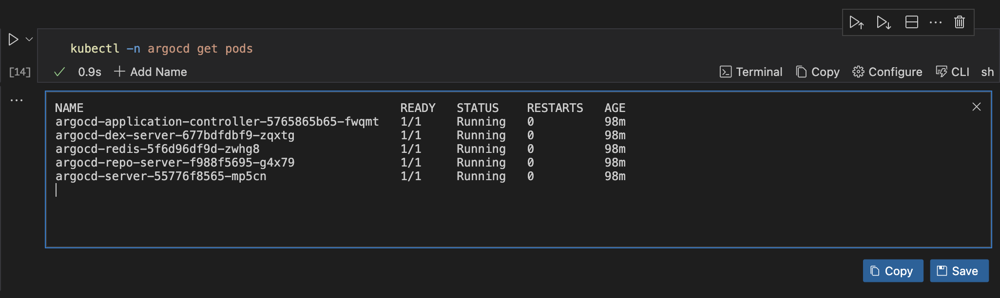
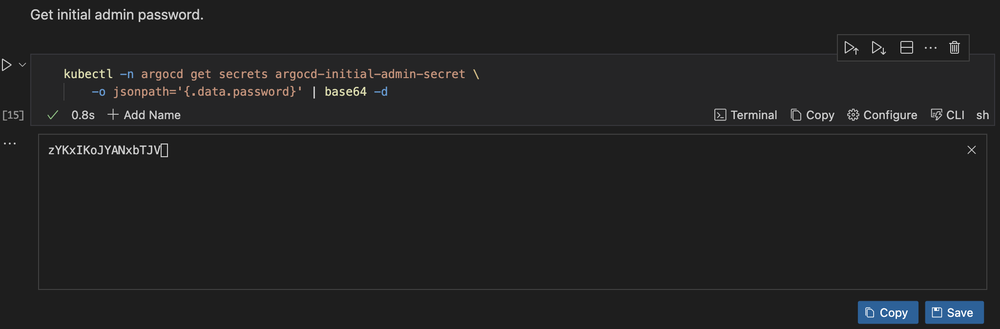
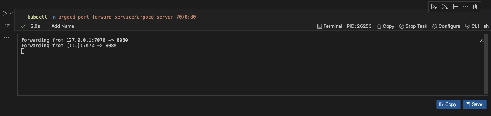

# Deploying and Managing Applications with Runme and Argo CD

In today's fast-paced tech environment, staying ahead with efficient deployment practices is crucial. Kubernetes has become a staple for managing modern infrastructure, offering flexibility and scalability. Yet, managing Kubernetes clusters and ensuring consistent, reliable deployments present ongoing challenges.

Introducing Argo CD and Runme—two cutting-edge tools reshaping deployment processes. Argo CD automates deployments from Git repositories to Kubernetes clusters, following GitOps principles. Meanwhile, Runme takes documentation to new heights, enabling the execution of actionable steps directly from the docs.

Our guide focuses on leveraging Argo CD and maximizing Runme's potential synergistically. We explore how this duo enhances efficiency and streamlines deployment workflows. From setup to advanced strategies, we equip users with the skills needed to optimize deployment practices. Whether you're a seasoned DevOps pro or a Kubernetes newbie, this guide is your go-to resource for achieving operational excellence.

## **Prerequisites**

To follow up on this tutorial, ensure you have the following:

- **Runme Extension**: Install the [Runme extension](https://marketplace.visualstudio.com/items?itemName=stateful.runme) in your VS Code editor and set it as your [default Markdown viewer](https://docs.runme.dev/installation/installrunme#how-to-set-vs-code-as-your-default-markdown-viewer).
- **Clone Repository**: We have provided an example repository to help you follow this tutorial. You can clone the [repository here](https://github.com/stateful/blog-examples/blob/main/Cloud-native/helm/helm.md).
- Insatll [brew](https://brew.sh/)
- **`kubectl`** installed for interacting with the Kubernetes cluster
- Git installed for version control
- Basic familiarity with YAML and Kubernetes resource definitions

## **Set Up Git Repository Structure**

Setting up a structured Git repository is crucial for Argo CD as it serves as the single source of truth, enabling granular control, simplified collaboration, and automated synchronization. A well-organized repository streamlines management, promotes scalability, and ensures maintainability of deployments, enhancing overall efficiency and reliability.

Repository folder tree:

```ini
argocd/
├── app-projects/          # Stores Argo CD Application Projects YAML files
├── applications/          # Stores Argo CD Application YAML files
├── installation/          # Stores Argo CD installation files
│   ├── helm-chart/        # Contains Helm chart for Argo CD
│   └── values-override.yaml        # Custom values for Argo CD installation

```

## **Create App Configuration and Project Settings**

The  **`values-override.yaml`** YAML file contains configuration settings that specifies server configuration, additional applications to deploy, additional projects within Argo CD, and their respective settings such as namespaces, sync policies, and cluster resource whitelists.

click run in this section and it will update `installation/values-override.yaml` file with your present configuration

```sh
cat << EOF > installation/values-override.yaml
server:
  configEnabled: true
  config:
    repositories: |
      - type: git
        url: https://github.com/stateful/blog-examples.git
      - name: argo-helm
        type: helm
        url: https://argoproj.github.io/argo-helm
  additionalApplications:
    - name: argocd
      namespace: argocd
      destination:
        namespace: argocd
        server: https://kubernetes.default.svc
      project: argocd
      source:
        helm:
          version: v3
          valueFiles:
          - values.yaml
          - ../values-override.yaml
        path: installation/argo-cd
        repoURL: https://github.com/stateful/blog-examples.git
        targetRevision: HEAD
      syncPolicy:
        syncOptions:
        - CreateNamespace=true
    - name: argocd-apps
      namespace: argocd
      destination:
        namespace: argocd
        server: https://kubernetes.default.svc
      project: argocd
      source:
        path: argocd-apps
        repoURL: https://github.com/stateful/blog-examples.git
        targetRevision: HEAD
        directory:
          recurse: true
          jsonnet: {}
      syncPolicy:
        automated:
          selfHeal: true
          prune: true
    - name: argocd-appprojects
      namespace: argocd
      destination:
        namespace: argocd
        server: https://kubernetes.default.svc
      project: argocd
      source:
        path: argocd-appprojects
        repoURL: https://github.com/stateful/blog-examples.git
        targetRevision: HEAD
        directory:
          recurse: true
          jsonnet: {}
      syncPolicy:
        automated:
          selfHeal: true
          prune: true
  additionalProjects:
  - name: argocd
    namespace: argocd
    additionalLabels: {}
    additionalAnnotations: {}
    description: Argocd Project
    sourceRepos:
    - '*'
    destinations:
    - namespace: argocd
      server: https://kubernetes.default.svc
    clusterResourceWhitelist:
    - group: '*'
      kind: '*'
    orphanedResources:
      warn: false
EOF
```

## **Install Argo CD Using Helm**

We are ready to install. Run the helm install command.

```sh
helm install argocd ./installation/argo-cd \
   --namespace=argocd \
   --create-namespace \
   -f values.yaml
```

Wait until all pods are running.

```sh
kubectl -n argocd get pods
```



Get the initial admin password.

```sh
kubectl -n argocd get secrets argocd-initial-admin-secret \
    -o jsonpath='{.data.password}' | base64 -d
```



Forward the port 80 of the argocd-server service to localhost:7070 using kubectl.

```sh {"background":"true"}
kubectl -n argocd port-forward service/argocd-server 7070:80
```



With runme background process feature, you can run your code cells as a [background task](../getting-started/features#background-task)


After executing the port-forward command, you'll be able to access the Argo CD web interface locally by browsing http://localhost:7070.

```sh
open https://localhost:7070
```

Log in using the initial admin password. Upon login, you'll notice the three applications defined in the `values-override.yaml` file are ready for deployment. Although the "argocd" application may initially appear out of sync due to differing templating parameters, you can resolve this by clicking the "Sync" button and waiting for it to turn green.

### To Deploy an Application Project to Argo CD

- Define the project configuration, specifying cluster resource access, destinations, and source repositories in a YAML file.
- Add, commit, and push the YAML file to your Git repository to trigger Argo CD's synchronization process.

```sh
cat << EOF >> argocd-apps/sample-app.yaml
apiVersion: argoproj.io/v1alpha1
kind: Application
metadata:
  name: sample-app
  namespace: argocd
spec:
  destination:
    namespace: sample-app
    server: https://kubernetes.default.svc
  project: sample-project
  source:
    path: sample-app/
    repoURL: https://github.com/stateful/blog-examples.git
    targetRevision: HEAD
  syncPolicy:
    syncOptions:
    - CreateNamespace=true
    automated:
      selfHeal: true
      prune: true
EOF
```

- Argo CD continuously monitors the repository for changes and automatically reconciles the project configuration.
- Once detected, Argo CD applies the updated project configuration, allowing seamless management of applications within the specified project.


Argo CD and CI/CD are vital components in modern software development. Argo CD automates application deployment and management in Kubernetes, ensuring consistency with desired states defined in Git repositories. CI/CD automates code integration, testing, and deployment, accelerating delivery while maintaining quality. Together, they enable rapid, reliable deployment cycles and foster collaboration between development and operations teams, ultimately delivering value to end-users efficiently

## Cleanup

Uninstall argo-cd helm deployment.

```sh
helm uninstall argocd
```

Wait until all resources are deleted in argocd namespace.

```sh
kubectl -n argocd get pods
```

Delete `argocd` namespaces.

```sh
kubectl delete ns argocd

```

Delete kind cluster.

```sh
kind delete cluster --name my-cluster
```
