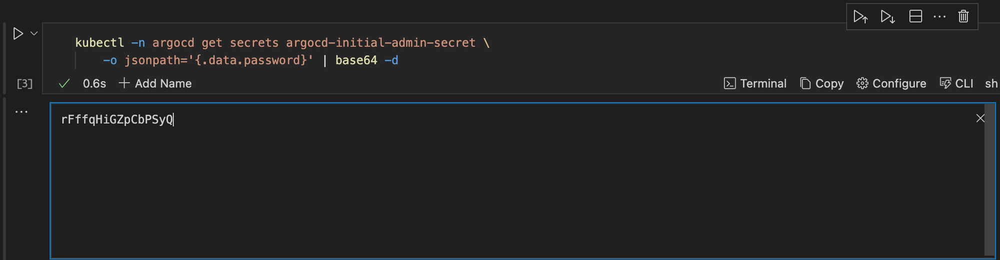

---
runme:
  id: 01HXCRQPTKTYCQX6WRQACB6F2M
  version: v3
---

# Deploying and Managing Applications with Runme and Argo CD

When it comes to managing documentation instructions and automating processes, Runme provides a platform that makes it easy and highly interactive to complete step-by-step instructions and handle automated tasks like software deployments, backup processes, etc.

With Runme, you can create detailed, step-by-step guides that document the procedures necessary to manage applications and execute them directly from your Markdown documentation.

By integrating the features of Runme with [Argo CD](https://argo-cd.readthedocs.io/), you can automate and manage your software deployments more effectively. Argo CD automates deployments from Git repositories to Kubernetes clusters, following GitOps principles. At the same time, Runme enables you to execute actionable steps directly from your Markdown file.

In this guide, we will show you how to set up Argo CD and Runme to work together. We will also walk you through creating your first Runbook and explain how to use these tools to make software deployments easier and error-free.

## **Prerequisites**

To follow up on this tutorial, ensure you have the following:

1. Basic Requirement

- Basic familiarity with YAML and Kubernetes resource definitions
- **Runme Extension**: Install the [Runme extension](https://marketplace.visualstudio.com/items?itemName=stateful.runme) in your VS Code editor and set it as your [default Markdown viewer](https://docs.runme.dev/installation/installrunme#how-to-set-vs-code-as-your-default-markdown-viewer).

2. Clone Our Repository

- **Clone Repository**: We have provided an example repository to help you follow this tutorial. You can clone the [repository here](https://github.com/stateful/blog-examples/tree/main/cloud-native).

```sh {"id":"01HXY9TQPN2Y664537HNZR54E3"}
git clone https://github.com/stateful/blog-examples/tree/main/cloud-native
```

3. Installation

```json {"id":"01HXY9Y0NJYGMY89JWYJRW1AQC"}
/bin/bash -c "$(curl -fsSL https://raw.githubusercontent.com/Homebrew/install/HEAD/install.sh)"
brew install git
brew install kind
brew install docker
kind create cluster --name my-cluster
kubectl cluster-info — context kind-my-cluster
```

The command above installs `brew` and `git,` creates a local Kubernetes Cluster using [kind](https://kind.sigs.k8s.io/), and checks whether the cluster is running and healthy.

<aside>
💡 For your kind cluster to run, you need to have docker running.

</aside>

## **Set Up Git Repository Structure**

The first step is to set up a structured Git repository for Argo CD. This will make it easier to manage everything since all the folders will be in one directory. Below is a visual representation of our repository folder tree.

Repository folder tree:

```ini {"id":"01HXY9RR9MR7B9NFY6N0B3G5Z6"}
argocd/
├── app-projects/          # Stores Argo CD Application Projects YAML files
├── applications/          # Stores Argo CD Application YAML files
├── installation/          # Stores Argo CD installation files
│   ├── helm-chart/        # Contains Helm chart for Argo CD
│   └── values-override.yaml        # Custom values for Argo CD installation

```

## **Create App Configuration and Project Settings**

Next, the `values-override.yaml` YAML file created above should contain configuration settings that specify server configuration, additional applications to deploy, additional projects within Argo CD, and their respective settings.

In your Runme cell, enter the command below and click run. This will update `installation/values-override.yaml` file with your specified configuration.

```sh {"id":"01HXY9RR9MR7B9NFY6N13J19BC"}
cat << EOF > installation/values-override.yaml
server:
  configEnabled: true
  config:
    repositories: |
      - type: git
        url: https://github.com/stateful/blog-examples.git
      - name: argo-helm
        type: helm
        url: https://argoproj.github.io/argo-helm
  additionalApplications:
    - name: argocd
      namespace: argocd
      destination:
        namespace: argocd
        server: https://kubernetes.default.svc
      project: argocd
      source:
        helm:
          version: v3
          valueFiles:
          - values.yaml
          - ../values-override.yaml
        path: installation/argo-cd
        repoURL: https://github.com/stateful/blog-examples.git
        targetRevision: HEAD
      syncPolicy:
        syncOptions:
        - CreateNamespace=true
    - name: argocd-apps
      namespace: argocd
      destination:
        namespace: argocd
        server: https://kubernetes.default.svc
      project: argocd
      source:
        path: argocd-apps
        repoURL: https://github.com/stateful/blog-examples.git
        targetRevision: HEAD
        directory:
          recurse: true
          jsonnet: {}
      syncPolicy:
        automated:
          selfHeal: true
          prune: true
    - name: argocd-appprojects
      namespace: argocd
      destination:
        namespace: argocd
        server: https://kubernetes.default.svc
      project: argocd
      source:
        path: argocd-appprojects
        repoURL: https://github.com/stateful/blog-examples.git
        targetRevision: HEAD
        directory:
          recurse: true
          jsonnet: {}
      syncPolicy:
        automated:
          selfHeal: true
          prune: true
  additionalProjects:
  - name: argocd
    namespace: argocd
    additionalLabels: {}
    additionalAnnotations: {}
    description: Argocd Project
    sourceRepos:
    - '*'
    destinations:
    - namespace: argocd
      server: https://kubernetes.default.svc
    clusterResourceWhitelist:
    - group: '*'
      kind: '*'
    orphanedResources:
      warn: false
EOF
```

This configuration should be pushed to a Git repository.

<aside>
💡 Feel free to change the url and  repoURL to any of your choice.

</aside>

## **Install Argo CD Using Helm**

In the previous section, we set up configurations for Argo CD applications and projects and defined their behavior within a Kubernetes environment.

Now, we will install Argo CD using Helm. To do this, run the `helm install` command below to install Argo CD:

```sh {"id":"01HXY9RR9MR7B9NFY6N4MYWKD6"}
helm install argocd ./installation/argo-cd \
   --namespace=argocd \
   --create-namespace \
   -f values.yaml
```

Wait until all pods are running.

```sh {"id":"01HXY9RR9MR7B9NFY6N5NW1B27"}
kubectl -n argocd get pods
```


Next, get the initial admin password. To do this, execute the command below:

```sh {"id":"01HXY9RR9MR7B9NFY6N63SPRMN"}
kubectl -n argocd get secrets argocd-initial-admin-secret \
    -o jsonpath='{.data.password}' | base64 -d
```



Forward the port 80 of the argocd-server service to `localhost:8080` using kubectl.

```sh {"background":"true","id":"01HXY9RR9NVCDREB3STEBAW78S"}
kubectl -n argocd port-forward service/argocd-server 8080:80
```

With Runme’s background process feature, you can run your code cells as a [background task](../getting-started/features#background-task). This will allow you to execute other tasks within the runbook without waiting for the initial task to complete.


After executing the port-forward command, you'll be able to access the Argo CD web interface locally by browsing http://localhost:8080.

```sh {"id":"01HXY9RR9NVCDREB3STES78KCN"}
open https://localhost:8080
```

Now, you need to log in using the initial admin password. After login, you will notice the three applications defined in the `values-override.yaml` file are ready for deployment.

Although the "argocd" application may initially appear out of sync due to differing templating parameters, you can resolve this by clicking the "**Sync**" button and waiting for it to turn green.

### To Deploy an Application Project to Argo CD

In this section, we will use a demo project to explain how to deploy an application to Argo CD using Runme. To do this, follow the steps below:

**Step One**: The first step is to define the project configuration by specifying cluster resource access, destinations, and source repositories in a YAML file.

**Step Two**: Add, commit, and push the YAML file to your Git repository to trigger Argo CD's synchronization process.

```sh {"id":"01HXY9RR9NVCDREB3STHAA23PB"}
cat << EOF >> argocd-apps/sample-app.yaml
apiVersion: argoproj.io/v1alpha1
kind: Application
metadata:
  name: sample-app
  namespace: argocd
spec:
  destination:
    namespace: sample-app
    server: https://kubernetes.default.svc
  project: sample-project
  source:
    path: sample-app/
    repoURL: https://github.com/stateful/blog-examples.git
    targetRevision: HEAD
  syncPolicy:
    syncOptions:
    - CreateNamespace=true
    automated:
      selfHeal: true
      prune: true
EOF
```

<aside>
💡 Change the `repoURL` to any GitHub repo of your choice.

</aside>

**Step Three:** After carrying out steps one and two, Argo CD continuously monitors the repository for changes and automatically reconciles the project configuration.

**Step Four**: If any change is detected, Argo CD applies the updated project configuration, allowing seamless application management within the specified project.

## Cleanup

After successfully deploying your application to Argo CD, you can clean up. In cleaning up, you are to remove application and application project definition files in the git repository sample-app.yaml and sample-project.yaml . Here are some steps to achieve this:

Step One: Uninstall argo-cd helm deployment.

```sh {"id":"01HXY9RR9NVCDREB3STKQVTHAW"}
helm uninstall argocd
```

Step Two: Wait until all resources are deleted in argocd namespace and run the command below to verify.

```sh {"id":"01HXY9RR9NVCDREB3STMN1CPYE"}
kubectl -n argocd get pods
```

Step Three: Delete `argocd` namespaces.

```sh {"id":"01HXY9RR9NVCDREB3STQJ9Y2PW","language":"sh"}
kubectl delete ns argocd

```

Step Four: Delete kind cluster.

```sh {"id":"01HXY9RR9NVCDREB3STRV2TAHD","language":"sh"}
kind delete cluster --name my-cluster
```
