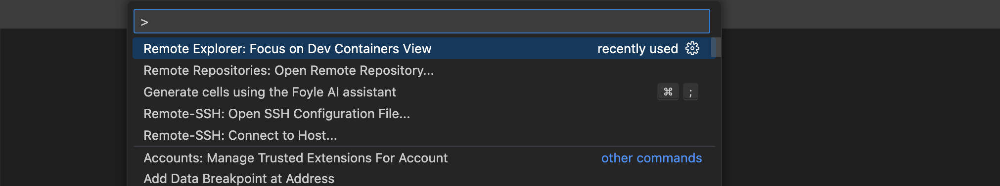
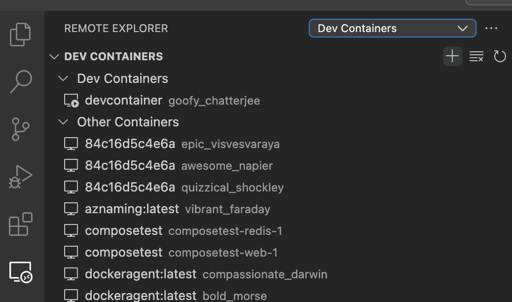
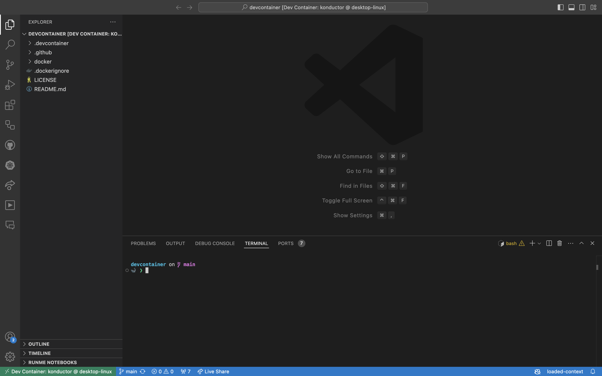
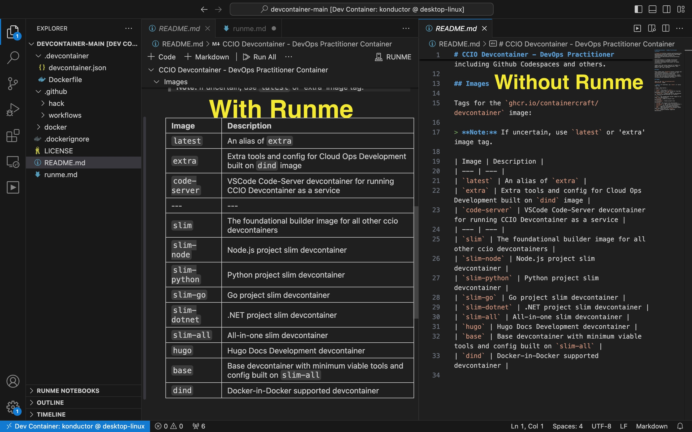

---
runme:
  id: 01J6YWZ6PHZM16VX6EE5RBTQH5
  version: v3
---

# How to Build Projects With Container Craft Dev Container and  Runme

Runme interactive notebook provides an easy way for developers and operations teams to manage workflows and document processes. With the [Runme extension,](../how-runme-works/vscode) users can access a user-friendly interface and build their projects within a pre-configured DevContainer.

In this guide, we will walk through setting up the [ContainerCraft DevContainer repository](https://github.com/ContainerCraft/devcontainer.git) as your development environment in Runme. Here, you will also learn how to create instructions for testing your projects directly inside the container. This setup ensures that your development and testing are all in a unified document.

## Prerequisites

To get started, ensure you have the following installed on your local machine:

- **Runme**: Runme provides various [client interfaces](../installation/index.md) for accessing the Runme Notebook. For this guide, we will be using [Runme on VS Code](https://marketplace.visualstudio.com/items?itemName=stateful.runme). With Runme installed on your code editor, you can proceed to set Runme as your [default Markdown viewer](../installation/installrunme#how-to-set-vs-code-as-your-default-markdown-viewer)
- **Docker**: Ensure you have [Docker installed](https://www.docker.com/products/docker-desktop/) and running on your machine.
- **VS Code Remote—Containers Extension**: Install the VS Code Remote—Containers Extension to work with containers directly in VS Code.

## Setting Up Your Dev Container

In this section, we will walk you through how to access your project repository in the ContainerCraft Dev Container in VS Code, test your project inside the dev container, and leverage Runme’s features to build your projects faster and easier.

## Clone the Repository

Start by cloning the `ContainerCraft/devcontainer` repository to your local machine:

```bash {"id":"01J6YWZ6PHZM16VX6EE3JYY98Y"}
git clone https://github.com/ContainerCraft/devcontainer.git
```

### Access the Repository in VS Code

1. Open Visual Studio Code.
2. You can access the command palette by pressing `Ctrl+Shift+P` (or `Cmd+Shift+P` on Mac) and searching for `Remote-Explorer: Focus on Dev Containers.`



3. Select the folder where you cloned the repository.



## Rebuild and Open the Container

- VS Code should prompt you to reopen the folder in a container. If it doesn’t, open the command palette again and select `Remote-Explorer: Focus on Dev Containers...`.
- VS Code will build the Docker container defined in the `.devcontainer` folder and open the workspace inside the container once the build is complete.



## Test Your Project Inside the Dev Container

Your container environment is set up with pre-configured tools and config required for DevOps, including Runme, Kubernetes, Helm, Kubectl, K9s, Tmux, Python, Go, and more. You can use these tools directly within the VS Code terminal, which runs inside the container. 

<video autoPlay loop muted playsInline controls>
  <source src="/videos/runme-devcontainer-hello.mp4" type="video/mp4" />
  <source src="../../static/videos/runme-devcontainer-hello.mp4" type="video/mp4" />
  <source src="/videos/runme-devcontainer-hello.webm" type="video/webm" />
  <source src="../../static/videos/runme-devcontainer-hello.webm" type="video/webm" />
</video>
<br/>

## **Add Your Project Files**

To add your project files to the dev container workspace, copy them into the cloned repository folder or mount an additional volume in the `devcontainer.json` file.

```jsx {"id":"01J6YWZ6PHZM16VX6EE3RR3QER"}
cp -r ~/my-project/* .
```

The command above copies your project to the workspace. Alternatively, you can clone your project into the dev container. 

```jsx {"id":"01J73XKSBWZDVA209YNPRJ59A1"}
git clone https://github.com/username/repository.git
```

After adding your project files to the folder, you can leverage Runme to easily build your projects with ContainerCraft DevContainer using any language you choose. This is made possible with the [Shebang support feature](../configuration/shebang). This allows you to easily set the code block of the specific programming language you intend to use.

<video autoPlay loop muted playsInline controls>
  <source src="/videos/Runme-python-dev-container.mp4" type="video/mp4" />
  <source src="../../static/videos/Runme-python-dev-container.mp4" type="video/mp4" />
  <source src="/videos/Runme-python-dev-container.webm" type="video/webm" />
  <source src="../../static/videos/Runme-python-dev-container.webm" type="video/webm" />
</video>
<br/>

You can also add and run the different supported languages in one Markdown file. 

When building projects, you may need to execute a command and move to the next command quickly. However, you may get stuck because the previous command still needs to be executed, and you cannot move on. [Runme’s background task](../how-runme-works/vscode#background-processes) feature solves this issue! With the background task, you can execute commands and move on to the next.

<video autoPlay loop muted playsInline controls>
  <source src="/videos/go-runme-dev-container.mp4" type="video/mp4" />
  <source src="../../static/videos/go-runme-dev-container.mp4" type="video/mp4" />
  <source src="/videos/go-runme-dev-container.webm" type="video/webm" />
  <source src="../../static/videos/go-runme-dev-container.webm" type="video/webm" />
</video>
<br/>

Runme also makes your Markdown file more organized and user-friendly.



You can easily build your entire project with the CotainerCraft DevContainer using all the existing features of Runme. Here is an example of [how to handle large data efficiently with Node.js streams](https://github.com/stateful/blog-examples/tree/main/node-streams). 

<video autoPlay loop muted playsInline controls>
  <source src="/videos/runme-node.mp4" type="video/mp4" />
  <source src="../../static/videos/runme-node.mp4" type="video/mp4" />
  <source src="/videos/runme-node.webm" type="video/webm" />
  <source src="../../static/videos/runme-node.webm" type="video/webm" />
</video>
<br/>

## Customize the Environment

If your project requires additional tools or dependencies:

- Edit the `Dockerfile` or `devcontainer.json` in the `.devcontainer` folder to include what’s needed.
- Rebuild the container to apply these customizations.

## Shutting Down the Container

After completing the task, you can shut down the container by closing the VS Code, which automatically stops the container. However, your project files and changes will persist on your local machine.

## Additional Resources[](https://docs.runme.dev/integrations/dagger#additional-resources)

To learn more about Runme, see more resources on Runme:

- [Running Runme in a DevContainer](../guide/devcontainer)
- [How to Integrate Python Virtual Environments with Runme](../guide/pythonenv)
