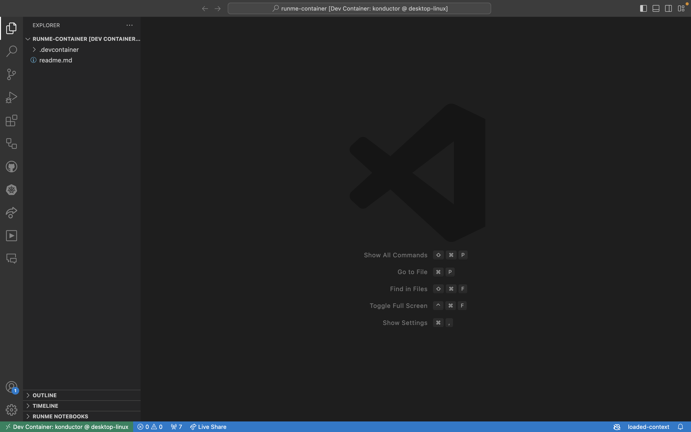

---
runme:
  id: 01J6YWZ6PHZM16VX6EE5RBTQH5
  version: v3
---

# How to Build Projects With Container Craft Dev Container and  Runme

Runme provides an interactive notebook for developers and operations teams to run projects while documenting each step of the process.

In this guide, we will walk through setting up the ContainerCraft DevContainer as your development environment with Runme. The ContainerCraft DevContainer houses the most commonly used tools and configurations required for DevOps and provides a consistent development environment for DevOps practitioners. You will also learn how to create instructions for testing your projects directly inside the container.

## Prerequisites

To get started, ensure you have the following installed on your local machine:

- **Runme**: Runme provides various [client interfaces](../installation/index.md) for accessing the Runme Notebook. For this guide, we will be using [Runme on VS Code](https://marketplace.visualstudio.com/items?itemName=stateful.runme). With Runme installed on your code editor, you can proceed to set Runme as your [default Markdown viewer](../installation/installrunme#how-to-set-vs-code-as-your-default-markdown-viewer)
- **Docker**: Ensure you have [Docker installed](https://www.docker.com/products/docker-desktop/) and running on your machine.
- **VS Code Remote—Containers Extension**: Install the [VS Code Remote—Containers Extension](https://marketplace.visualstudio.com/items?itemName=ms-vscode-remote.remote-containers) to work with containers directly in VS Code.

## Setting Up Your Dev Container

In this section, we will walk you through creating your dev container with all necessary files, accessing it in VS Code, testing your project in the container, and using Runme’s features to build your projects.

## Create the `.devcontainer` Folder.

To create your `.devcontainer` folder, ensure you have a `README.md` file in your project directory. In your `README.md` file, run the command below:

```bash {"id":"01J6YWZ6PHZM16VX6EE3JYY98Y"}
mkdir -p ./.devcontainer
```

### Create and Configure the `devcontainer.json`

The `devcontainer.json` file specifies how VSCode should handle the container. In your `README.md` file, run the script below. This will create the `devcontainer.json` file and give it the ContainerCraft DevContainer configuration.

```bash {"id":"01J7GC2HFGJXB58KQZ6M1VVJ15"}


cat <<EOF | sudo tee ./.devcontainer/devcontainer.json > /dev/null
{
    "name": "konductor",
    "remoteUser": "vscode",
    "dockerFile": "Dockerfile",
    "init": true,
    "privileged": true,
    "overrideCommand": false,
    "updateRemoteUserUID": true,
    "shutdownAction": "stopContainer",
    "securityOpt": [
        "seccomp=unconfined"
    ],
    "runArgs": [
        "--privileged",
        "--network=host",
        "--device=/dev/kvm"
    ],
    "mounts": [
        "source=dind-var-lib-docker,target=/var/lib/docker,type=volume"
    ],
    "features": {
        "ghcr.io/devcontainers/features/docker-outside-of-docker:1": {}
    },
    "postCreateCommand": "devcontainer-links",
    "forwardPorts": [
        1313,
        2222,
        6000,
        7681,
        8080
    ],
    "customizations": {
        "vscode": {
            "extensions": [
                "golang.go",
                "vscodevim.vim",
                "github.copilot",
                "stateful.runme",
                "max-ss.cyberpunk",
                "ms-python.python",
                "redhat.vscode-yaml",
                "esbenp.prettier-vscode",
                "oderwat.indent-rainbow",
                "okteto.kubernetes-context",
                "ms-vsliveshare.vsliveshare",
                "ms-azuretools.vscode-docker",
                "github.vscode-github-actions",
                "ms-kubernetes-tools.kind-vscode",
                "ms-vscode.vscode-typescript-next",
                "github.vscode-pull-request-github",
                "ms-vscode-remote.remote-containers",
                "randomfractalsinc.vscode-data-table",
                "visualstudioexptteam.vscodeintellicode",
                "ms-kubernetes-tools.vscode-kubernetes-tools"
            ]
        }
    }
}
EOF
```

### Create and Configure the `Dockerfile`

The `Dockerfile` defines the base image for the dev container, which is the foundation for setting up the development environment. In your `README.md` file, run the script below.

```bash {"id":"01J7GC7RQ5QRM437CJS3TCPW8B"}
cat <<EOF | sudo tee ./.devcontainer/Dockerfile > /dev/null
FROM ghcr.io/containercraft/devcontainer:latest
EOF
```

This will create a Dockerfile with containercraft image in it.

## Access Your Project in the Dev Container

Now that you have set up your dev container, you need to access your project in the dev container. To do this, follow the steps below:

1. Press `Ctrl+Shift+P` (or `Cmd+Shift+P` on Mac) to open the command palette. Then, search for `Remote-Explorer: Focus on Dev Containers`.


2. Now, click the `+` icon to select your project.


## Rebuild and Open the Container

After selecting the folder where your project is, VS Code should prompt you to reopen the folder in a container.

If that does not happen, open the command palette (`Ctrl + Shift + P`) and select `Remote-Explorer: Focus on Dev Containers`. This will allow VS Code to build the Docker container defined in the `.devcontainer` folder and open the workspace inside the container once the build is complete.



## Test Your Project Inside the Dev Container

Your container environment is set up with pre-configured tools required for DevOps, including Runme, Kubernetes, Helm, Kubectl, K9s, Tmux, Python, Go, and more. You can use these tools directly within the VS Code terminal, which runs inside the container.

<video autoPlay loop muted playsInline controls>
  <source src="/videos/runme-devcontainer-hello.mp4" type="video/mp4" />
  <source src="../../static/videos/runme-devcontainer-hello.mp4" type="video/mp4" />
  <source src="/videos/runme-devcontainer-hello.webm" type="video/webm" />
  <source src="../../static/videos/runme-devcontainer-hello.webm" type="video/webm" />
</video>
<br/>

## Runme Features

With Runme in your dev container, you can build projects in any programming language. This is made possible with the [Shebang support feature](../configuration/shebang) It allows you to easily set the code block of the specific programming language you intend to use. You can also add and run the different supported languages in one Markdown file.

Here is an example of a simple Python project showcasing how the Runme Shebang feature enables you to execute commands and scripts in a dev container.

<video autoPlay loop muted playsInline controls>
  <source src="/videos/Runme-python-dev-container.mp4" type="video/mp4" />
  <source src="../../static/videos/Runme-python-dev-container.mp4" type="video/mp4" />
  <source src="/videos/Runme-python-dev-container.webm" type="video/webm" />
  <source src="../../static/videos/Runme-python-dev-container.webm" type="video/webm" />
</video>
<br/>

In addition, you can set your code block to run a command(s) in the background while you focus on other aspects of your project using the [background task feature](https://docs.runme.dev/how-runme-works/vscode#background-processes).

Below is an example video that illustrates how the background task feature works with your Go projects in a dev container.

<video autoPlay loop muted playsInline controls>
  <source src="/videos/go-runme-dev-container.mp4" type="video/mp4" />
  <source src="../../static/videos/go-runme-dev-container.mp4" type="video/mp4" />
  <source src="/videos/go-runme-dev-container.webm" type="video/webm" />
  <source src="../../static/videos/go-runme-dev-container.webm" type="video/webm" />
</video>
<br/>

Here is also an example of a project on [how to handle large data efficiently with Node.js streams](https://github.com/stateful/blog-examples/tree/main/node-streams).

<video autoPlay loop muted playsInline controls>
  <source src="/videos/runme-node.mp4" type="video/mp4" />
  <source src="../../static/videos/runme-node.mp4" type="video/mp4" />
  <source src="/videos/runme-node.webm" type="video/webm" />
  <source src="../../static/videos/runme-node.webm" type="video/webm" />
</video>
<br/>

## Shutting Down the Container

After completing the task, you can shut down the container by closing the VS Code, which automatically stops the container. However, your project files and changes will persist on your local machine.

## Additional Resources

To learn more about using Dev Containers with Runme, see more resources below:

- [Running Runme in a DevContainer](../guide/devcontainer)
- [How to Integrate Python Virtual Environments with Runme](../guide/pythonenv)
- [Developing Inside Container](https://code.visualstudio.com/docs/devcontainers/containers)
