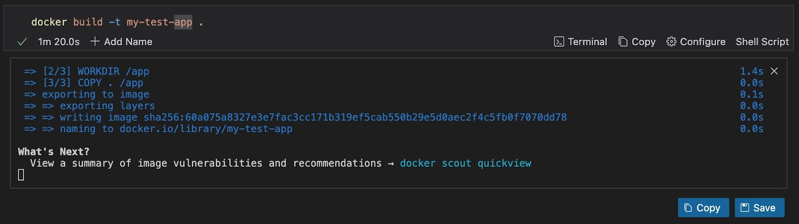
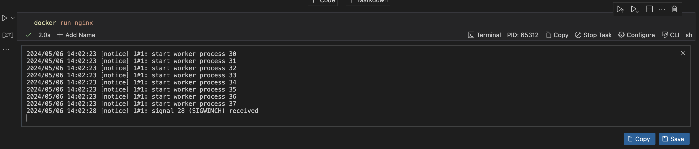
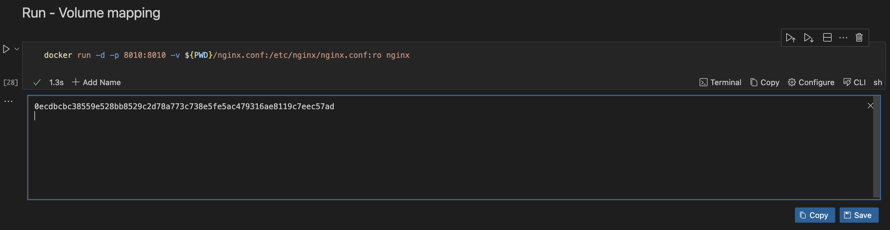
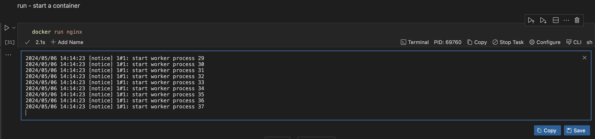
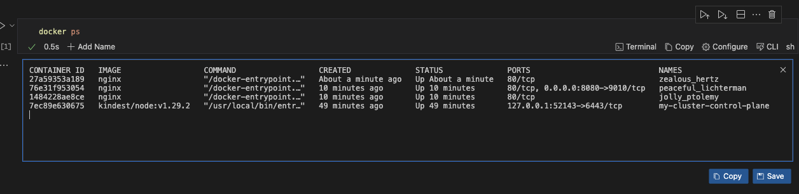
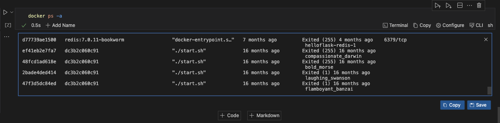
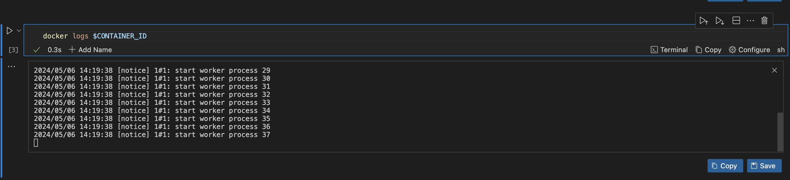
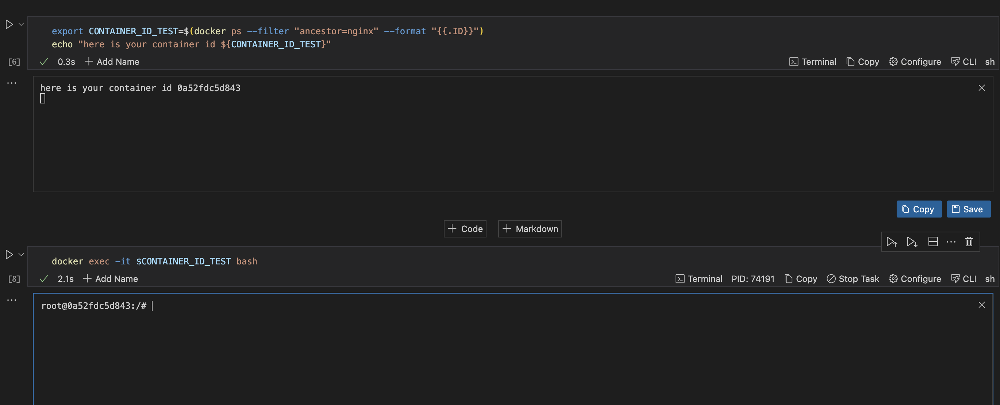
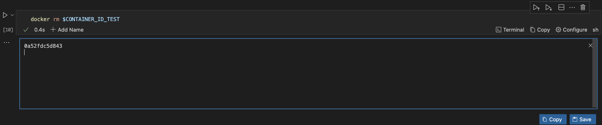
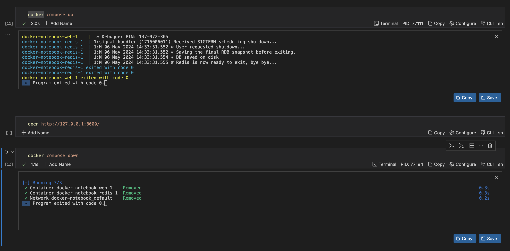

---
runme:
  document:
    relativePath: docker.md
  session:
    id: 01HX6SSSX93QT3RWVETACQJVY5
    updated: 2024-05-06 18:51:13+01:00
---

# How to Use Docker with Runme

[Docker](ht******************om/) has transformed development tooling by streamlining the creation, deployment, and management of applications across diverse environments. Running Docker in a runbook ensures that tasks and workflows can be automated easily, as it enables you to create precise instructions on how to deploy, update, and manage Docker containers across all environments.

Now, Runme is not just any runbook. Runme provides an interactive runbook that can turn your documentation into an interactive and executable environment.

Runme enhances the use of Docker by simplifying the automation of tasks and the deployment of applications within secure Docker containers. By running Docker in Runme Notebook, you can execute commands, create, and follow the instructions in your documentation (within your runbook).
Essentially, Runme takes the detailed guide you have written and turns it into actions directly in Docker's protected environment. This makes your workflow more efficient, consistent, and easy to manage.

In this guide, we will walk you through different use cases of Docker with Runme.

## **Prerequisites**

- **Clone the repository**: We created a [notebook repository](ht*************************************************************************ok) containing all the instructions and commands required for this guide.
- **Install Runme**: Install the [Runme extension on VS Code](ht**************************************************************me) and set it as your [default Markdown viewer.](ht***********************************************************************************************er)

## Example Use Case

In this section, we will walk you through how you can perform various docker commands from your Runme cell and utilize the several features of Runme for more effective workflow execution. This use case focuses on a simple Python app named `my-test-app`.

### Automating Docker Build in Runme

Building an image in Docker enables you to create a Docker image from a set of instructions defined in a Dockerfile. These instructions specify the steps needed to assemble the necessary configurations for the image.

To build your image from a Dockerfile, use the command below

```sh
docker build -t <image_name>:<tag> <path_to_dockerfile>
```

Example:



### Run a Docker Image

You can run a Docker image and customize your container's interaction with the host system and external networks. Here are some commands to do this:

**Docker Run**

​​Running a container in Docker allows you to create an instance of a Docker image as an isolated and lightweight environment. This instance, a container, condenses an application along with its dependencies and configurations. When a container is run, it executes the commands specified in its Dockerfile.

`docker run` creates and start a new container based on a Docker image.
To run a Docker image, use the command below

```sh
docker run <image_name>
```



**Volume Mount**

Volume mount maps directories or files on the host machine to directories inside the container, providing data persistence and allowing for easy file access.

```sh
docker run -v <host_directory>:<container_directory> <image_name>
```

Example:



**Port Mapping**

Port Mapping enables communication between containers and the host machine, allowing external access to services inside the container.

To do this, use the command below:

```sh
docker run -p <host_port>:<container_port> <image_name>
```

Example:


If a cell block takes a lot of time to execute, you can also run such a cell in the background using [Runme’s background mode](../getting-started/features#background-task). This will enable you to save time and move on to other tasks while your previous task is still running.


### Container Management in Docker Within the Runme Cell

With Docker within Runme, you can easily manage your container's activities inside your Runme cell and Markdown file. Container management entails organizing and supervising containers to ensure smooth operation and optimal performance.
In this section, we explore several commands for managing your containers.

**Start a container**

Starting a container is the same as running a container. To start a container, use the command below:

```sh
docker run <image_name>
```

Example:



**List Containers**

To get a list of all running containers, use the command below:

```sh
docker ps
```



If you would love to get a list of all containers (including stopped ones), use the command below:

```sh
docker ps -a
```

Example:



**Container Logs**

In Docker, container logs provide you with the recorded output generated by a Docker container during its execution. They are useful for troubleshooting, monitoring, auditing, and debugging.
To view the logs of a container, use the command below:

```sh
docker logs <container_id or container_name>
```

Example:



**Execute a Command Inside a Container**

Executing a command inside a Docker container means running a specific command within the container. This allows you to interact with the containerized environment without interactively entering the container.
To execute a command inside a container, use the command below

```sh
docker exec -it $CONTAINER_ID_TEST bash
```

Example:



**Stop a Running Container**

To stop a running container, use the command below:

```sh
docker stop <container_id or container_name>
```

Example:


**Remove a Container**

To remove a container, run the command below:

```sh
docker rm <container_id or container_name>
```

Example:



### Docker compose

Docker Compose is a tool for defining and running multi-container Docker applications. It uses YAML files to configure the application’s services and performs the creation and start-up process of all the containers.



## How to Manage Docker Containers using Runme Run Cells by Section Feature

With Runme, you can efficiently manage your Docker containers by running your commands by section. Rather than running each cell individually, you run them by section. The video below provides a visual illustration of how this feature works.

<video autoPlay loop muted playsInline controls>
  <source src="/videos/do****************p4" type="video/mp4" />
  <source src="/videos/docker-container.webm" type="video/webm" />
</video>

In this guide, we covered the various way you can use Docker within your Runme cell to perform different actions. Runme has several features that make it a choice platform for integrating and using Docker. Some key features of Runme include:

- The [background mode](../getting-started/features#background-task) makes it possible to run commands in the background.
- [Autosave feature](../configuration/auto-save), which provides you with the opportunity to auto-save your outputs without manual intervention.
- You can run your Markdown file by cells, an entire document, or sections.

To explore more features of Runme and learn how they can be utilized in your workflows, visit our [documentation page](ht******************ev/).

