---
runme:
  id: 01HXCRQPTPH3KV5Z9HVC16PVBV
  version: v3
---

# How to Use Docker with Runme

[Docker](https://www.docker.com/) has transformed development tooling by streamlining the creation, deployment, and management of applications across diverse environments. Running Docker in a runbook ensures that tasks and workflows can be automated easily, as it enables you to create precise instructions on how to deploy, update, and manage Docker containers across all environments.

Now, Runme is not just any runbook. Runme provides an interactive runbook that can turn your documentation into an interactive and executable environment.

Runme enhances the use of Docker by simplifying the automation of tasks and the deployment of applications within secure Docker containers. By running Docker in Runme Notebook, you can execute commands, create, and follow the instructions in your documentation (within your runbook).

Essentially, Runme takes the detailed guide you have written and turns it into actions directly in Docker's protected environment. This makes your workflow more efficient, consistent, and easy to manage.

In this guide, we will walk you through the use cases of integrating Runme and Docker.

## **Prerequisites**

To get started, ensure you have the following:

- **Clone the repository**: We created a [notebook repository](https://github.com/stateful/blog-examples/tree/main/docker-notebook) containing all the instructions and commands required for this guide. To clone this repo and go into the folder for this guide, run the command below

```sh {"id":"01HYG0CRBP472SW6E302EQQZAK"}

git clone --branch T-doc-notebook https://github.com/stateful/blog-examples.git
cd blog-examples/docker-notebook
```

<<<<<<< Updated upstream
- **Install Runme**: Install the [Runme extension on VS Code](https://marketplace.visualstudio.com/items?itemName=stateful.runme) and set it as your [default Markdown viewer.](https://docs.runme.dev/installation/installrunme#how-to-set-vs-code-as-your-default-markdown-viewer)
=======
- **Install Runme**: Install the [Runme extension on VS Code](https://marketplace.visualstudio.com/items?itemName=stateful.runme) and set it as your [default Markdown viewer.](/installation/vscode#how-to-set-vs-code-as-your-default-markdown-viewer)
>>>>>>> Stashed changes
- **Required Packages**: Run the command below to install the required packages for this guide.

```sh {"id":"01HYG0F007XK8RT7466DNS16RQ"}
/bin/bash -c "$(curl -fsSL https://raw.githubusercontent.com/Homebrew/install/HEAD/install.sh)"
brew install docker
```

## Example Use Case

In this section, we will walk you through how you can perform various docker commands from your Runme cell and utilize the several features of Runme for more effective workflow execution. This use case focuses on a simple Python app named `my-test-app`.

### Automating Docker Build in Runme

Building an image in Docker enables you to create one from a set of instructions defined in a Dockerfile. These instructions specify the steps needed to assemble the necessary configurations for the image.

`docker build` is the command to build a Docker image from a Dockerfile.

To build your image from a Dockerfile, use the command below

```sh {"id":"01HYG0CDGVMKKSRD28CKQZG2PG"}
docker build -t <image_name>:<tag> <path_to_dockerfile>
```

Example:

```sh {"id":"01HYG0JDJ7V3J96XQCMDBPDNDR"}
docker build -t my-test-app .
```

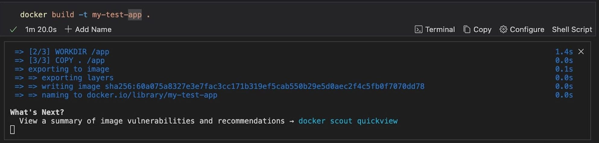

### Run a Docker Image

You can run a Docker image and customize your container's interaction with the host system and external networks. Here are some commands to do this:

**Docker Run**

Running a container in Docker allows you to create an instance of a Docker image as an isolated and lightweight environment. This instance, a container, condenses an application along with its dependencies and configurations. When a container is run, it executes the commands specified in its Dockerfile.

`docker run` is the command to create and start a new container based on a Docker image.

To run a Docker image, use the command below

```sh {"id":"01HYG0CDGVMKKSRD28CNTR0F6R"}
docker run <image_name>
```

Example:

```sh {"id":"01HYG0NRRRWM01XHV4YCEZBC4W"}
docker run nginx
```

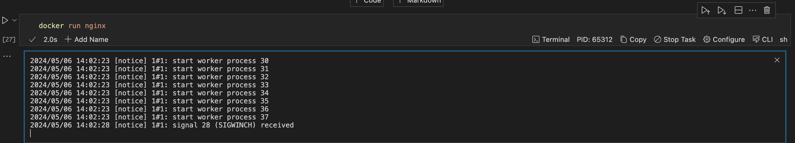

**Run Container Using Runme Environment Variable**

You can run your container using the [Runme environment variable](https://docs.runme.dev/configuration/cell-level#set-environment-variables). This will prompt you to input a variable you want executed along with your command. To see how this works, run the command below in the Runme cell.

```sh {"id":"01HYG0RJXB98D2MXEM59E325ET"}
export CONTAINER_ID=$(docker run -d -p 80:5000 nginx)
echo "Starting container ${CONTAINER_ID}"
```

Now you can open the app using the command below

```sh {"id":"01HYG0RTRAV1QEAT0CN7HX8R83"}
open http://localhost:8000
```

**Volume Mount**

Volume mount maps directories or files on the host machine to directories inside the container, providing data persistence and allowing for easy file access.

```sh {"id":"01HYG0CDGVMKKSRD28CS80BHB9"}
docker run -v <host_directory>:<container_directory> <image_name>
```

Example:

```sh {"id":"01HYG0SYB9Z9GZ5S0DA50J9D3A"}
docker run -d -p 8010:8010 -v ${PWD}/nginx.conf:/etc/nginx/nginx.conf:ro nginx
```

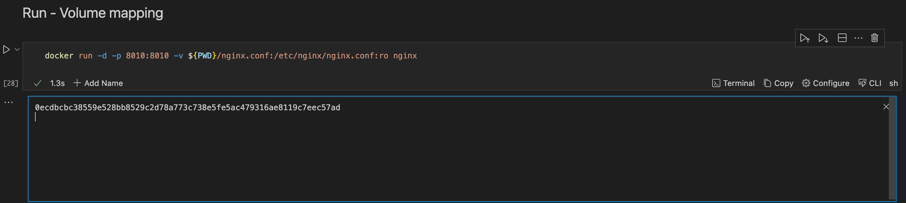

**Port Mapping**

Port Mapping maps ports on the host machine to ports exposed by the container, allowing external access to services inside the container.

To do this, use the command below:

```sh {"id":"01HYG0CDGVMKKSRD28CTVJZCEA"}
docker run -p <host_port>:<container_port> <image_name>
```

Example:

```sh {"id":"01HYG107BGHZQK6KFJQQ8KW5NS"}
docker run -p 80:5000 nginx
```

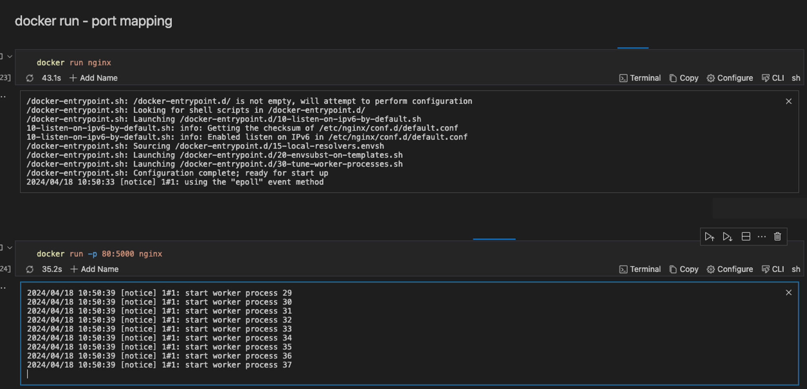

If a cell block takes a lot of time to execute, you can also run such a cell in the background using [Runme’s background mode](../getting-started/features#background-task). This will enable you to save time and move on to other tasks while your previous task is still running.

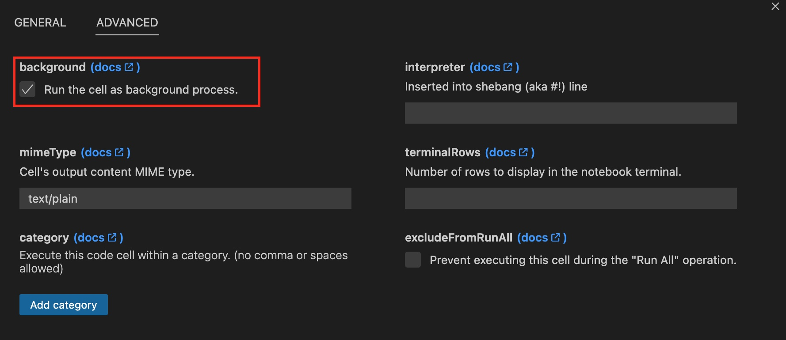

### Sleep a Container

You can instruct Docker to make a container sleep.

```sh {"id":"01HYG13VHVNNBET33025VEGMZ5"}
docker run $CONTAINER_ID sleep 5
```

When you run the command `docker run $CONTAINER_ID sleep 5`, you instruct Docker to create and start a new container from the specified image and then run the `sleep` command inside the container for 5 seconds.

### Manage Docker Images

There are several commands which can enable you to manage your Docker image. Here are some of these commands:

**List all Images**

It is possible to list all the images currently available on your Docker host. To do this, run the command below:

```sh {"id":"01HYG15YG5AXY2E7NWXGPEDYCC"}
docker images
```

**Remove an Image**

If you would love to remove an image from your local Docker host, run the command below:

```sh {"id":"01HYG16NDV59THPXJP2KNKMAEW"}
docker rmi nginx
```

This command will try to remove the Docker image with the name **`nginx`**.

Replace `nginx` with the image of your choice.

### Container Management in Docker Within the Runme Cell

With Docker within Runme, you can easily manage your container's activities inside your Runme cell and Markdown file. Container management entails organizing and supervising containers to ensure smooth operation and optimal performance.

In this section, we explore several commands for managing your containers.

**Start a container**

Starting a container is the same as running a container. To start a container, use the command below:

```sh {"id":"01HYG0CDGVMKKSRD28CW5A544X"}
docker run <image_name>
```

Example:

```sh {"id":"01HYG19HDRCZHG7J2PE6S3HYWH"}
docker run nginx
```

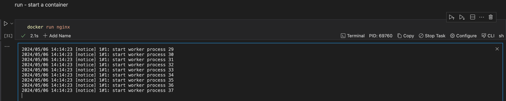

**List Containers**

To get a list of all running containers, use the command below:

```sh {"id":"01HYG0CDGVMKKSRD28CW9K9PYK"}
docker ps
```

Example:

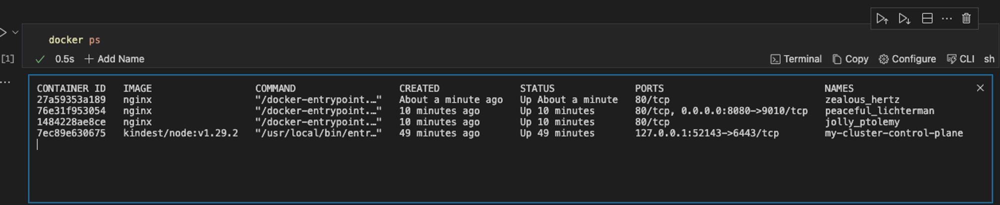

If you would love to get a list of all containers (including stopped ones), use the command below:

```sh {"id":"01HYG0CDGVMKKSRD28CY0VR3NH"}
docker ps -a
```

Example:

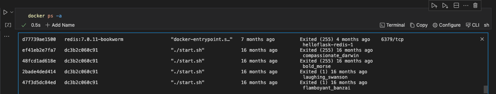

**Container Logs**

In Docker, container logs provide you with the recorded output generated by a Docker container during its execution. They are useful for troubleshooting, monitoring, auditing, and debugging.

To view the logs of a container, use the command below:

```sh {"id":"01HYG0CDGVMKKSRD28CYA9Y4YB"}
docker logs <container_id or container_name>
```

Example:

```sh {"id":"01HYG1D58ZKNYRBVAB6JMN8CP0"}
docker logs $CONTAINER_ID
```

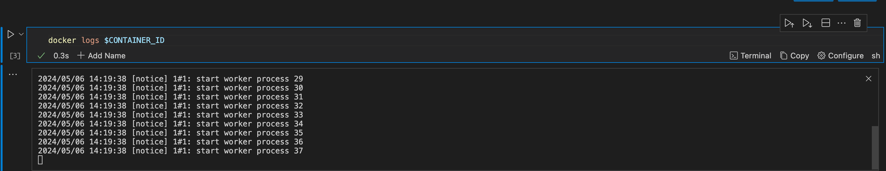

You can also use the inspect command to retrieve detailed information about your container or docker image. To do this, run the command below

```sh {"id":"01HYG1EXX2BH0PASBAVRM52HVB"}
docker inspect $CONTAINER_ID
```

**Execute a Command Inside a Container**

Executing a command inside a Docker container means running a specific command within the container. This allows you to interact with the containerized environment without interactively entering the container.

Runme makes this easy through the use of [environment variables prompts](../getting-started/features#environment-variable-prompts). Runme’s environment variable prompts allow you to input values directly within your notebook environment and store them easily.

To execute a command inside a container leveraging Runme’s environment variable prompt, run the command below:

```sh {"id":"01HYG0CDGVMKKSRD28D05RQF0Y"}
export CONTAINER_ID_TEST=$(docker ps --filter "ancestor=nginx" --format "{{.ID}}")
echo "here is your container id ${CONTAINER_ID_TEST}"
```

```sh {"id":"01HYG0CDGVMKKSRD28D2N4A9HA"}
docker exec -it $CONTAINER_ID_TEST bash
```

Example:

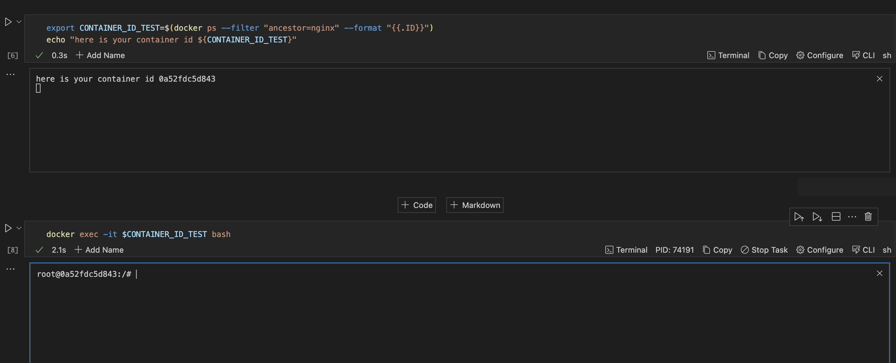

**Stop a Running Container**

To stop a running container, use the command below:

```sh {"id":"01HYG0CDGVMKKSRD28D4VSAHH4"}
docker stop <container_id or container_name>
```

Example:

```sh {"id":"01HYG1ND1DH0DAFHBSA5Q84EM6"}
docker stop $CONTAINER_ID_TEST
```

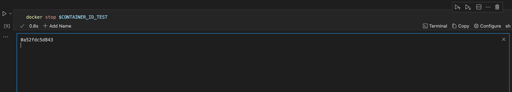

**Remove a Container**

To remove a container, run the command below:

```sh {"id":"01HYG0CDGVMKKSRD28D54ZG3B7"}
docker rm <container_id or container_name>
```

Example:

```sh {"id":"01HYG1PWCE76YHBZAKY5FMDEC4"}
docker rm $CONTAINER_ID_TEST
```

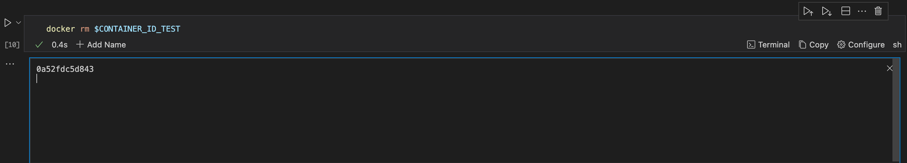

### Docker compose

Docker Compose is a tool for defining and running multi-container Docker applications. It uses YAML files to configure the application’s services and performs the creation and setup process for all the containers.

For this example, we created a [YAML file](https://github.com/stateful/blog-examples/blob/T-doc-notebook/docker-notebook/compose.yaml) to demonstrate how docker-compose works. If your YAML file is in a different directory from your current working directory, you can easily [change your Runme cell](../configuration/cell-level#cells-current-working-directory) to the directory where the file exists and then run the docker-compose command.

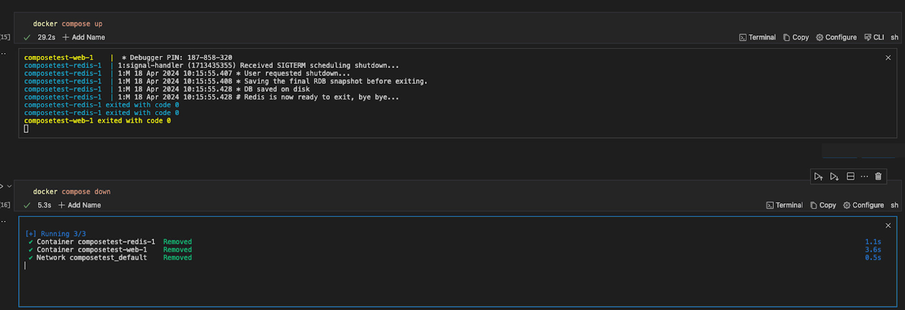

## How to Manage Docker Containers using Runme Run Cells by Section Feature

With Runme, you can efficiently manage your Docker containers by running your commands by section. Rather than running each cell individually, you run them by section. The video below provides a visual illustration of how this feature works.

<video autoPlay loop muted playsInline controls>
  <source src="/videos/docker-container.mp4" type="video/mp4" />
  <source src="/videos/docker-container.webm" type="video/webm" />
</video>

In this guide, we covered the basics of running Docker commands in Runme.

Runme has several features that make it a choice platform for integrating and using Docker. Some key features of Runme include

- The [background mode](../getting-started/features#background-task) makes it possible to run commands in the background.
- [Autosave feature](../configuration/auto-save), which provides you with the opportunity to auto-save your outputs without manual intervention.
- You can run your Markdown file by cells, an entire document, or sections.

To explore more features of Runme and learn how they can be utilized in your workflows, visit our [documentation page](https://docs.runme.dev/).

