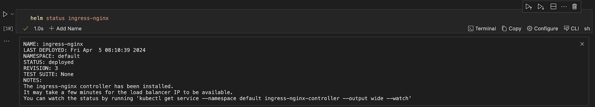
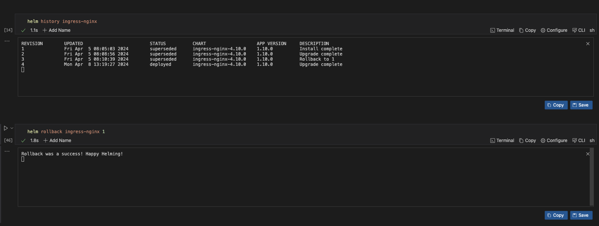
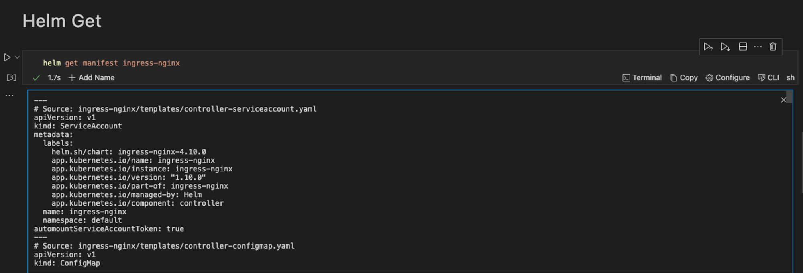
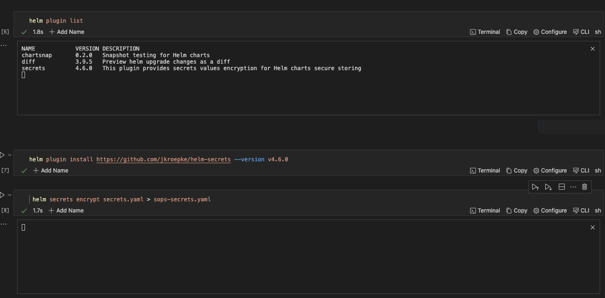

---
runme:
  id: 01HX525D9FNAVSGJXVFBPTKS96
  version: v3
---

# How To Integrate Helm With Runme

If you are performing a task repeatedly, it is best to automate it; this is a core principle of DevOps.

With Runme, you can automate your task by creating an interactive notebook where you can run your commands, perform deployment and carry out the instructions outlined in your documentation.

While [Helm](https://helm.sh/) is a package manager for Kubernetes, an open-source orchestration platform. It assists users in defining, installing, and managing applications and their dependencies on a Kubernetes cluster.

This guide demonstrates how Helm integrates with Runme to automate processes and reduce repetitive tasks.

## **Prerequisite**

To follow up on this tutorial, ensure you have the following:

<<<<<<< Updated upstream:docs/guide/helm.md
- **Runme Extension**: Install the [Runme extension](https://marketplace.visualstudio.com/items?itemName=stateful.runme) in your VS Code editor and set it as your [default Markdown viewer](https://docs.runme.dev/installation/installrunme#how-to-set-vs-code-as-your-default-markdown-viewer).
=======
- **Runme Extension**: Install the [Runme extension](https://marketplace.visualstudio.com/items?itemName=stateful.runme) in your VS Code editor and set it as your [default Markdown viewer](/installation/vscode#how-to-set-vs-code-as-your-default-markdown-viewer).
>>>>>>> Stashed changes:docs/guide/k8s/helm.md
- **Clone Repo**: We have provided an example repository to help you follow this tutorial. You can clone the [repo here](https://github.com/stateful/blog-examples/blob/main/cloud-native/helm/helm.md).

```sh {"id":"01HY2N3NNE1X67QD5FE0Y5T2XG"}
git clone https://github.com/stateful/blog-examples.git
```

- **Require Packages**: Install the required packages ([kind](https://kind.sigs.k8s.io/docs/user/quick-start/),[kubectl](https://kubernetes.io/docs/tasks/tools/install-kubectl-linux/), [Helm](https://helm.sh/docs/intro/install/) ) inside your Markdown file. *Runme allows you to achieve this! Simply run the command in the [prerequisite section](https://github.com/stateful/blog-examples/blob/main/cloud-native/helm/helm.md#prerequiste) in the repo.*

```sh {"id":"01HY2N6DK7MTY9D251K9K88CKH"}
brew install kind
brew install docker
brew install helm
```

This code cell below deletes the cluster if it already existed.

```sh {"id":"01HYG96SHB7J2MC94MVD7TV70S"}
kind delete cluster --name helm-runme
```

We're using kind to create a Kubernetes cluster locally. The name of the Kubernetes cluster is `helm-runme`

```sh {"id":"01HY2PQM3VEJ00ZY1K42794MSK"}
kind create cluster --name helm-runme
```

Check if your cluster is running

```sh {"id":"01HYG98VQD6C3ECRCRVGPC4HZ4"}
kubectl get ns
```

Using the Runme [cell section](../configuration/cellsection) feature you can run the entire subheading at a go.

Follow the instructions and commands in the above [notebook](https://github.com/stateful/blog-examples/blob/main/cloud-native/helm/helm.md) for this guide.

## Basic Helm Commands

Now that you have installed Helm on your local machine, let’s try some basic commands. Run the commands below:

```sh {"id":"01HY2N8AX7RH70450FNH32K3GX"}
helm search hub Wordpress
```

This command searches the Helm Hub repository for Helm charts related to WordPress and will return any available WordPress charts from the Helm Hub.

```sh {"id":"01HY2NAX2TS2D6N0GCA4PY0N9Q"}
helm list --all
```

This command lists all releases managed by Helm in the current Kubernetes cluster. The—`all` flag shows all releases, including superseded ones.

```sh {"id":"01HY2NBHN6PSNYSVX1ZA81TWGG"}
helm repo update
```

This command updates the local cache of Helm chart repositories.

```sh {"id":"01HY2NCAXFYX82NJ1MH328KHZV"}
helm history ingress-nginx
```

This command displays the release history for a specific Helm release named `ingress-nginx`. You can check out the release history for any Helm release. Simply change `ingress-nginx` to the release of your choice.

Let’s dive deeper into more complex Helm configurations in your Markdown file with Runme.

## **Creating A Helm Chart Within Your Runme Environment**

You can create your [helm chart](https://helm.sh/docs/intro/using_helm/#creating-your-own-charts) to suit your specific use case however, for this guide, we will be using a helm chart from the `helm repo`.

The repo adds a Kubernetes Ingress controller called `ingress-nginx` which helps manage external access to services within the Kubernetes cluster.

Runme is dynamically set. You can run the entire markdown file using the [Run all](https://docs.runme.dev/configuration/document-level#run-all-button) feature. If you want to run just a particular [section](../configuration/cellsection), you can also do that, or run just a [single cell](../configuration/cell-level).

<video autoPlay loop muted playsInline controls>
  <source src="/videos/runme-section.mp4" type="video/mp4" />
  <source src="/videos/runme-section.webm" type="video/webm" />
</video>

## **Installing Helm Packages with Runme**

The `helm install` command installs a Helm chart into your Kubernetes cluster. When you run `helm install`, specify the release name, the chart name (either local or from a repository), and any necessary configuration values or overrides. Helm fetches the specified chart from the repository (if not locally available) and installs it into your cluster, creating a new release.

The code block below installs the Kubernetes Ingress controller and checks the status of the deployment to ensure everything is properly installed.

```sh {"id":"01HY2NFXR962402ZPEF358YGMH"}
helm install ingress-nginx ingress-nginx/ingress-nginx
```

Check the status of helm chart

```sh {"id":"01HY2NG053CNSCHX67K4JKFE5A"}
helm status ingress-nginx 
```

This is a pictorial representation of the output in the Runme terminal.



Now, you have successfully installed it with your Runme terminal:tada:

## **Upgrading Helm Packages With Runme**

After installing your Helm packages, you can upgrade them. The `helm upgrade` command upgrades a release to a new version of a chart or applies changes to an existing release. Helm plugins are external tools or extensions that enhance the functionality of the Helm CLI.

With Runme, you can modify the [working directory](../configuration/cell-level#cells-current-working-directory) for your code cell to a file directory of your choice. This enables you to easily run `values.yaml` even if the file is not located in the same directory as your markdown file.

To upgrade the Ingress package installed earlier, run the command below:

```sh {"id":"01HY2N2J67P73EYA9Y1EDQFEJV"}
helm upgrade ingress-nginx ingress-nginx/ingress-nginx --values values.yaml
```

To check the status of your deployment, run the command below:

```sh {"id":"01HY2N2J67P73EYA9Y1GG6DQBR"}
helm status ingress-nginx
```

If you ever want to uninstall the package, run the command below:

```sh {"id":"01HY2NQF4GTM7ZT2EWZ3KF1DFZ"}
helm uninstall ingress-nginx
```

## **Implementing Helm Rollback**

In your Runme notebook, you can revert to a specific historical version of a Helm release within your Kubernetes cluster. Use the `helm rollback` command alongside the release name and the revision number you want to deploy.

For example, the code block below, when executed, displays the revision history for the Helm release, rolls back the Helm release named `ingress-nginx` to a specific revision, in this case, revision 1, and provides information about the current state of the release.

```sh {"id":"01HY2NRC36PRTHQVMSYFZET7YM"}
helm history ingress-nginx
```

```sh {"id":"01HY2NSA32EN437R1QR5CNE4VN"}
helm rollback ingress-nginx 1
```

```sh {"id":"01HY2NS5ZGPBZVHRGGQJ4NEAJ0"}
helm status ingress-nginx
```



## **Retrieve Information with Runme**

The `helm get` command in Helm retrieves information about a specific release or resource within a release. It provides various subcommands to fetch different information related to Helm releases.

To retrieve information about the Ingress package installed, run the command below

```sh {"id":"01HY2NVEWP5QVCNN4ZA0YTY8FB"}
helm get manifest ingress-nginx
```

When the command is executed successfully, this is the output.



To retrieve the release note associated with the package, run the command below

```sh {"id":"01HY2NWZ29MR7PY2MYF8PY67RA"}
helm get notes ingress-nginx
```

## **Add Helm Plugin**

Helm plugins are external tools or extensions that enhance the functionality of the Helm CLI. For this guide, we installed the `sops` plugin to use it encrypt our kubernetes secret.

To get the list of the Helm plugins installed on your local system, run the command below:

```sh {"id":"01HY2NXNA21A6BH3XBPP06RDRX"}
helm plugin list
```

To install the Helm plugin named “helm-secrets” from the GitHub repository at the specified version(v4.60), run the command below:

```sh {"id":"01HY2NYQ1FJB0430A95CA39GEF"}
helm plugin install https://github.com/jkroepke/helm-secrets --version v4.6.0
```

To encrypt sensitive information within the secrets.yaml file, run the command below:

```sh {"id":"01HY2NZBQ79YR2YW2CJ7XQ6C7E"}
helm secrets encrypt secrets.yaml > sops-secrets.yaml
```

This command encrypts the file secrets.yaml using the helm-secrets plugin and write the encrypted content to a new file sops-secrets.yaml . Here is the pictorial representation of the commands when executed individually in your Runme cell.



In addition to creating a runbook to improve your documentation and automate repetitive tasks, Runme offers you an interactive environment to carry out these operations. Runme is power-packed with configuration tools to improve your process. Explore the [Runme configuration](../configuration) guide for configuration options.
