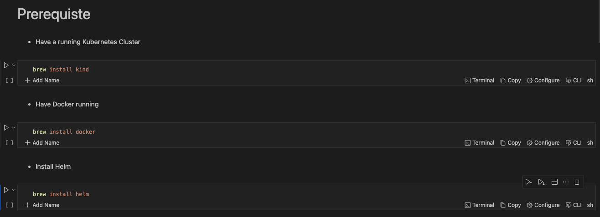

# How To Integrate Helm With Runme

If you are performing a task repeatedly, it is best to automate it; this is a core principle of DevOps.

With Runme, you can automate your task by creating an interactive notebook where you can run your commands, perform deployment and carry out the instructions outlined in your documentation.

This guide demonstrates how to integrate Helm with Runme to automate processes and reduce repetitive tasks.

## **Prerequisite**

To follow up on this tutorial, ensure you have the following:

- **Runme Extension**: Install the [Runme extension](https://marketplace.visualstudio.com/items?itemName=stateful.runme) in your VS Code editor and set it as your [default Markdown viewer](https://docs.runme.dev/installation/installrunme#how-to-set-vs-code-as-your-default-markdown-viewer).
- **Clone Repo**: We have provided an example repository to help you follow this tutorial. You can clone the [repo here](https://github.com/stateful/blog-examples/blob/main/Cloud-native/helm/helm.md).
- **Require Packages**: Install the required packages ([kind](https://kind.sigs.k8s.io/docs/user/quick-start/),[kubectl](https://kubernetes.io/docs/tasks/tools/install-kubectl-linux/), [Helm](https://helm.sh/docs/intro/install/), etc. ) inside your Markdown file. *Runme allows you to achieve this! Simply run the command in the [prerequisite section](https://github.com/stateful/blog-examples/blob/main/Cloud-native/helm/helm.md#prerequiste) in the repo.*

Create a cell in your Rume notebook and run the command below to install the necessary packages.

Follow the instructions and commands in the above [notebook](https://github.com/stateful/blog-examples/blob/main/Cloud-native/helm/helm.md) for this guide.

Create a cell in your Rume notebook and run the command below to install the required packages. See example below:



Using the Runme [cell section](../configuration/cellsection) feature you can run the entire subheading at a go

## **Creating A Helm Chart Within Your Runme Environment**

You can create your [helm chart](https://helm.sh/docs/intro/using_helm/#creating-your-own-charts) to suit your specific use case however, for this guide, we will be using a helm chart from the `helm repo`.

The repo adds a Kubernetes Ingress controller called `ingress-nginx` which helps manage external access to services within the Kubernetes cluster.

Runme is dynamically set. You can run the entire markdown file using the [Run all](https://docs.runme.dev/configuration/document-level#run-all-button) feature. If you want to run just a particular [section](../configuration/cellsection), you can also do that, or run just a [single cell](../configuration/cell-level).

<video autoPlay loop muted playsInline controls>
  <source src="/videos/runme-section.mp4" type="video/mp4" />
  <source src="/videos/runme-section.webm" type="video/webm" />
</video>

## **Installing Helm Packages with Runme**

The `helm install` command installs a Helm chart into your Kubernetes cluster. When you run `helm install`, you specify the release name, the chart name (either local or from a repository), and any necessary configuration values or overrides. Helm fetches the specified chart from the repository (if not already locally available) and installs it into your cluster, creating a new release.

The `helm install` section of this guide installs the  Kubernetes Ingress controller & checks the status of the deployment to make sure everything is installed appropriately.


Successfully installed with your Runme terminal:tada:

To uninstall Ingress Controller :

```sh
helm uninstall ingress-nginx
```

## **Upgrading Helm Packages With Runme**

The `helm upgrade` command upgrades a release to a new version of a chart or applies changes to an existing release.
Helm plugins are external tools or extensions that enhance the functionality of the Helm CLI. Plugins allow users to extend Helm’s capabilities by adding new commands or features without modifying the core Helm codebase.

With Runme, you can modify the [working directory](../configuration/cell-level#cells-current-working-directory) for your code cell to a file directory of your choice. This enables you to easily run `values.yaml` even if the file is not located in the same directory as your markdown file.

```sh
helm upgrade ingress-nginx ingress-nginx/ingress-nginx --values values.yaml
```

To check the status of your deployment

```sh
helm status ingress-nginx
```

## **Implementing Helm Rollback**

In your Runme notebook, you can revert to a specific historical version of a Helm release within your Kubernetes cluster. Using the `helm rollback` command, Along side the name of the release and the revision number you want to deploy.


```sh
helm status ingress-nginx
```

## **Retrieve Information with Runme**

The `helm get` command in Helm is used to retrieve information about a specific release or resource within a release. It provides various subcommands to fetch different types of information related to Helm releases.

```sh
helm get manifest ingress-nginx
```

## **Add Helm Plugin**

Helm plugins are external tools or extensions that enhance the functionality of the Helm CLI. For this guide, we installed the `sops` plugin to use it encrypt our kubernetes secret


```sh
helm secrets encrypt secrets.yaml > sops-secrets.yaml
```

In addition to creating a runbook to improve your documentation and automate repetitive tasks, Runme offers you an interactive environment to carry out these operations. Runme is power-packed with configuration tools to improve your process. Explore the [Runme configuration](../configuration) guide for configuration options.
