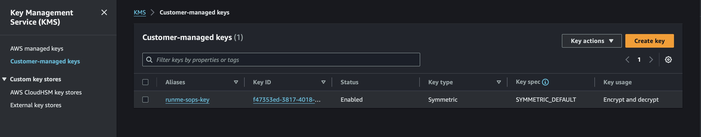

# **Securing and Automating Kubernetes Secrets with Runme and SOPS/Sealed Secrets**

As a DevOps or site reliability engineer, you have probably come across the need to store sensitive information such as API keys, passwords, and tokens within the Kubernetes cluster, and as such, you resorted to using Kubernetes secrets.

Handling sensitive information and keys in itself is a risk, most often as DevOps and SRE engineers you have probably had not only to handle but store sensitive data like API keys, passwords, or tokens within your Kubernetes cluster. If you're nodding along, then you're likely resorted to using Kubernetes secrets.

Before our sensitive information is stored as Kubernetes secrets, keeping them as plain text is a huge risk, as they could easily get compromised leading to data breaches or unauthorized access, so we need to encrypt them before deploying them to the cluster.

In this guide, we will walk you through how you can secure Kubernetes secrets and also automate this process to create a source of truth and save more time using Runme and SOPS/Sealed Secrets.

## What is Runme?

Runme is a tool that helps you to execute interactive runbooks using Markdown files. It offers an interactive and user-friendly platform to walk you through the process of making secret encryption effortless.

## **Why Choose Runme?**

### **1. User-Friendly Interactive Documentation:**

Runme Notebook transforms the learning process into an interactive adventure. You no longer need to worry about tedious text-based guides; as you can easily follow along and execute step-by-step.

### **2. Live Code Execution:**

Execute commands directly within the Runme Notebook environment. Witness the magic unfold in real time as you encrypt and decrypt secrets without switching between your terminal and documentation.

### **3. Visually Appealing:**

Embrace a visually appealing and clutter-free guide. Runme Notebook's clean interface enhances your learning experience, making it enjoyable and easy to digest.

### **4. Centralized Knowledge Hub:**

Runme Notebooks can function as your source of truth and execution ground. Runme serves as a centralized hub for all your documentation. Find everything related to securing Kubernetes secrets here.

# **Securing Secrets with SOPS**

To encrypt your Kubernetes secrets using SOPS, you need another level of security and access to your cloud provider; this is where you need to use a key management service (KMS). For this guide, we will be using an [AWS KMS key](https://docs.aws.amazon.com/kms/latest/developerguide/concepts.html#kms_keys). This helps provide secure key management, key rotation, access control, auditing, and compatibility with cloud platforms.

### Prerequisite

- An AWS account with privileges to create an I[AM User](https://docs.aws.amazon.com/IAM/latest/UserGuide/id_users.html) and a [KMS Key](https://docs.aws.amazon.com/kms/latest/developerguide/concepts.html#kms_keys).
- [AWS CLI](https://docs.aws.amazon.com/cli/v1/userguide/cli-chap-install.html) installed and configured

```sh {"id":"01HRSZWCJZ8PG0T0EWGAP2ZS1Q"}
aws configure
```

- **Kubernetes Cluster**: Ensure you have a running Kubernetes cluster. for this guide we will be using [kind](https://kind.sigs.k8s.io/docs/user/quick-start/) for my Kubernetes cluster

```sh {"id":"01HRT007KXE45ESZTWN1JD6X5D"}
brew install kind
```

- **[Kubectl](https://kubernetes.io/docs/tasks/tools/):** Install the Kubernetes command-line tool on your machine.

```sh {"id":"01HRT011Y2QB3VFSW1XM2AGMFG"}
brew install kubectl
```

## **Installation of SOPS**

### Step 1: Download SOPS Binary

Replace {version} with the latest version of SOPS and {platform} with your platform (e.g., darwin for macOS, linux for Linux).

For this guide, we are using a Linux engine.

### Step 2: Move the Binary to Your PATH

### Step 3: Make the Binary Executable

```sh {"id":"01HRT07G9K6WR6PX9ZR3EAC1TH"}
# Make the binary executable
chmod +x /usr/local/bin/sops
```

## **Create a KMS Key**

Next, you’ll need to create a [KMS key](https://docs.aws.amazon.com/kms/latest/developerguide/concepts.html#kms_keys) in AWS, this key will be used to encrypt and decrypt your secrets. Follow the steps below to create a KMS key:

1. Sign in to the AWS Management Console and open the KMS console.
2. Click on **Create key.**
3. For "Alias," enter a name for your key. For example, "runme-sops-key".
4. For "Key material origin," choose "AWS KMS generates the key material."
5. Add the AWS users or roles to manage the key under "Key administrators."
6. Click on **Next**.
7. Choose the options that best suit your "Key usage permissions" needs.
8. Click on **Next**.
9. Review your key settings and click on **Finish**.



## **Configure SOPS**

Configure SOPS effortlessly with your AWS KMS key

```sh {"id":"01HRT0C3AXKJ7PJ6616BHT5R5D"}
echo "creation_rules
  - kms: arn:aws:kms:{region}:{account-id}:alias/{alias}" > ~/.sops.yaml
```

Verify the configuration by checking the contents of `~/.sops.yaml`

```sh {"id":"01HRT0CW617Y7TTBJFGAYJ6YD0"}
cat ~/.sops.yaml
```
