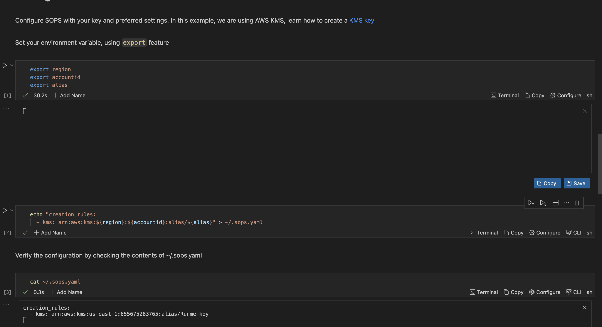
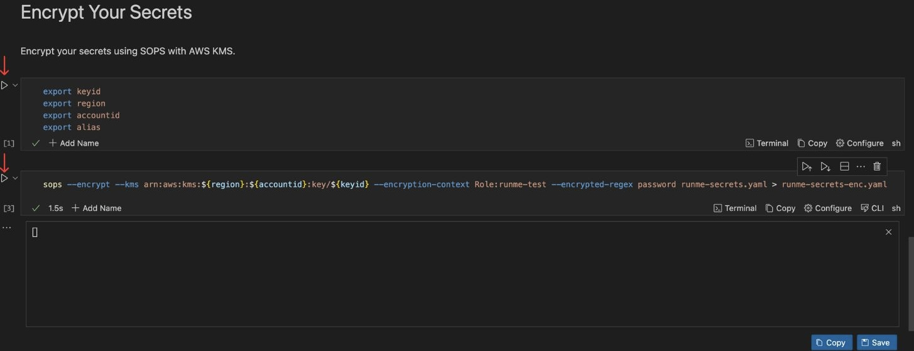
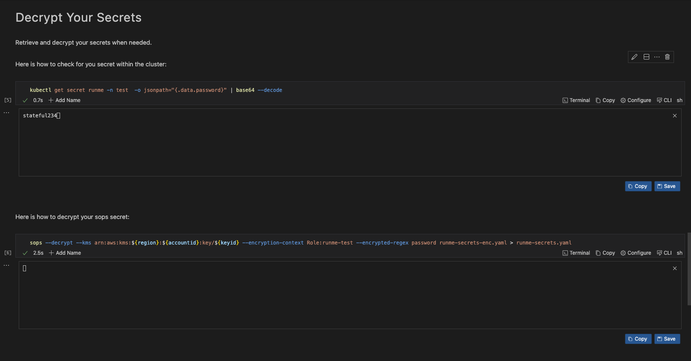
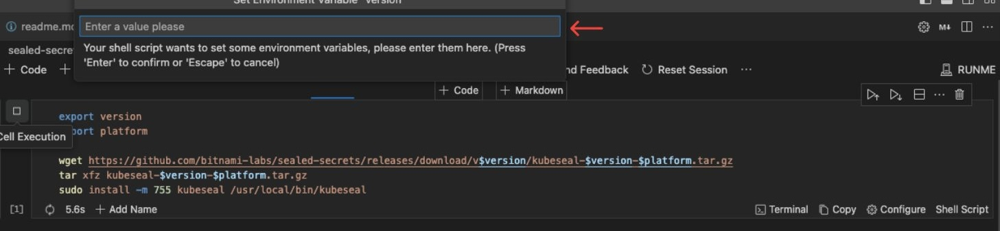
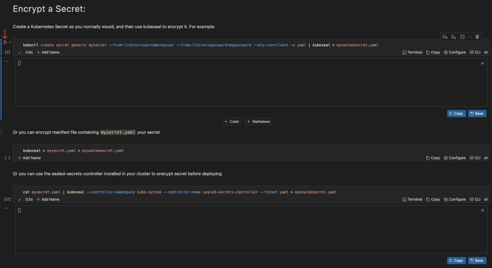

# How to Automate Kubernetes Secrets Encryption with Runme

The default [Kubernetes Secrets](https://kubernetes.io/docs/concepts/configuration/secret/) are stored either as plaintext or base64 encoded. These secrets should not be sent to version control systems like git due to the security risk of exposing sensitive data such as API keys, passwords, or tokens.

In cases where a developer or an infrastructure-focused engineer needs to add secrets to the cluster or to version control, they should use encryption-first tools. These tools securely share and push these secrets to version control. Tools like [sops](https://fluxcd.io/flux/guides/mozilla-sops/) and [sealed-secrets](https://archive.eksworkshop.com/beginner/200_secrets/installing-sealed-secrets/) are commonly used by DevOps and SREs.

With Runme, Platform Engineers can document how secrets are added to a Kubernetes cluster, ensuring the commands and guides are repeatable, consistent, and executable. Runme also enables engineers to create runbooks as documentation. This allows other team members, including new ones, to add and encrypt secrets correctly without leaking data and causing a significant security breach.

The guide below explains how to use [Runme](https://github.com/stateful/blog-examples/tree/main/k8s-secret) as your central knowledge hub. It will make your documentation the go-to source for all infrastructure operations.

## **Prerequisites**

- An AWS account with privileges to create an [IAM User](https://docs.aws.amazon.com/IAM/latest/UserGuide/id_users.html) and a [KMS Key](https://docs.aws.amazon.com/kms/latest/developerguide/concepts.html#kms_keys).
- [AWS CLI](https://docs.aws.amazon.com/cli/v1/userguide/cli-chap-install.html) installed and configured.
- Kubernetes Cluster: A running Kubernetes cluster is required. For this guide, we will use [kind](https://kind.sigs.k8s.io/docs/user/quick-start/) for our Kubernetes cluster.
- [Kubectl](https://kubernetes.io/docs/tasks/tools/): The Kubernetes command-line tool should be installed on your machine.

Here is a [notebook](https://github.com/stateful/blog-examples/blob/main/k8s-secret/sops/prerequiste.md) to help you install these prerequisites. For this guide we are using either Linux or Mac OS

## **Securing Secrets with SOPS**

Encrypt your Kubernetes secrets using SOPS; you need enhanced security and access to your cloud provider. This requires a [Key Management Service](https://docs.aws.amazon.com/kms/latest/developerguide/concepts.html#kms_keys) (KMS). For this guide, we'll use an AWS KMS key. This service offers secure key management, key rotation, access control, auditing, and compatibility with cloud platforms.

Here is an example [notebook](https://github.com/stateful/blog-examples/blob/main/k8s-secret/sops/sops.md) to follow this toturial.

### **Installation of SOPS**

**Step 1: Download SOPS Binary**

Click the execute cell button to download `sops` to your environment.

<video autoPlay loop muted playsInline controls>
  <source src="/videos/runme-envprompt-k8s.mp4" type="video/mp4" />
  <source src="/videos/runme-envprompt-k8s.webm" type="video/webm" />
</video>

You can use the Runme [env prompt](https://docs.runme.dev/getting-started/features#environment-variable-prompts) feature, all you need to do is input the latest version of SOPS for `{version}` and your platform for `{platform}` (e.g., *Darwin* for macOS, *linux* for Linux). The env prompt uses the `export` commands available in Unix-like operating systems (such as Linux and macOS) to set the environment variable.

<br />
<Infobox type="sidenote" title="Note">

You don’t need to input the environment variable again ones the values has been inputted, other code cell within the notebook can use, unless you reset the session.

</Infobox>

### **Create a KMS Key**

Firstly, you need to create a [KMS key](https://docs.aws.amazon.com/kms/latest/developerguide/concepts.html#kms_keys) in AWS to encrypt and decrypt your secrets. You can create a KMS key with a specific name by using the `--description` option followed by the name of the key, for example, `runme-key`.

To extract the value associated with the `KeyId` field, use `jq -r` to parse the JSON input from the `aws kms create-key` command.

You can transfer the stdout result of the last execution to your subsequent execution using the [Chain Cell Output](https://docs.runme.dev/getting-started/features#chain-cell-output) feature. To create an alias, refer to the image below:


Lastly, you can save it to the runme cloud for future use or reference using the runme [auto-save](https://docs.runme.dev/configuration/auto-save) feature.

### **Configure SOPS**

To configure `SOPS`, you need to create a configuration file that specifies how SOPS should encrypt your secrets and what encryption keys to use. Here's how you can do it:

1. Use the first code block to set the variable and input the value.
2. Use the second block to create the `sops.yaml` file.
3. Finally, use the third block to confirm and check if the file was created correctly.

Refer to the image below for a better understanding of the process:



### **Encrypt Your Secrets**

Encrypt your sensitive information with ease using SOPS and AWS KMS. follow each step effortlessly.

1. Set your environment variable
2. Click the run button



Your secrets within `runme-secrets.yaml` will be encrypted and transferred to `runme-secrets-enc.yaml`.

### **Decrypt Your Secrets**

Retrieve and decrypt your secrets with confidence. Runme Notebook provides clear and concise instructions, ensuring the decryption process is as smooth as encrypting.



Decrypt the secret from a sops encrypted secret `runme-secrets-enc.yaml` into the original version before it was encrypted `runme-secrets.yaml`

### **Apply Encrypted Secret**

```sh {"id":"01HRSMKKZDED03HJNEATG1D3W9"}
sops -d runme-secrets-enc.yaml | kubectl apply -f -
```

## **Securing Secrets with Sealed Secrets**

[Sealed Secrets](https://archive.eksworkshop.com/beginner/200_secrets/installing-sealed-secrets/) is an open-source project developed by Bitnami that helps encrypt Kubernetes secrets, which can then be securely stored in your version control. This allows for the implementation of DevOps practices without compromising sensitive data. It is important to note that only the Sealed Secrets controller can decrypt these encrypted secrets. To use Sealed Secrets, you need to install the Sealed Secrets Controller, also known as ___Kubeseal___.

To input the value of `version` or `platform`, you can use the [env prompt](https://docs.runme.dev/getting-started/features#environment-variable-prompts).



### **Encrypt a Secret**

Create a Kubernetes Secret and use **`kubeseal`** to encrypt it




This creates a SealedSecret resource (**`mysealedsecret.yaml`**) containing the encrypted data.

### Decrypt a Secret

To retrieve the original version of `runme-secrets.yaml`, you can decrypt the encrypted secret `mysealedsecret.yaml`.


### **Deploy the Sealed Secret:**

```sh {"id":"01HRSMKKZDFG16ASX22PJ26RP7"}
kubectl apply -f mysealedsecret.yaml
```

The Sealed Secrets controller will decrypt the SealedSecret and create a regular Kubernetes Secret with the decrypted data.

Make sure to replace placeholders like **`mysecret.yaml`** and **`mysealedsecret.yaml`** with your secret and sealed secret filenames. Adjust controller-specific details such as the namespace and name according to your environment.

## **Challenges with Manual Execution**

While the above processes help you secure your Kubernetes key, manually carrying out these operations can be take time and effort. This is where Runme comes in.

Runme is a documentation tool that automates manual processes and gives you the time to jump right into a task, execute it, and save time.

You can quickly eliminate the hassle of learning and implementing secret encryption in Kubernetes by automating these processes with Runme.

## **Improve Documentation Experience with Runme Notebook**

Previously, we explored securing your Kubernetes secrets using sealed secrets and SOPS. Now, we will walk you through how to automate these processes with a single click right inside your Markdown file.

1. Open VS Code on your local machine. Navigate to the extensions tab and search for “Runme” Now, click Install.
2. Create a README file.
3. To execute each of your commands, paste them into the code block in Runme and click the run cell button beside the code block.

The image below illustrates how easy it is to download the SOPS binary using Runme.


To have a full view of these processes, you can clone this [repo](https://github.com/stateful/blog-examples/tree/main/k8s-secret), open it with VS Code on your local machine and click the run cell button to complete your tasks. However, ensure you have installed [Runme](../installation/index.md) first.

Embrace the Runme Notebook experience to secure your secrets and effortlessly enhance your Kubernetes knowledge. Visit [Runme Documentation](https://docs.runme.dev/) to embark on a guided journey to a more secure Kubernetes environment.
