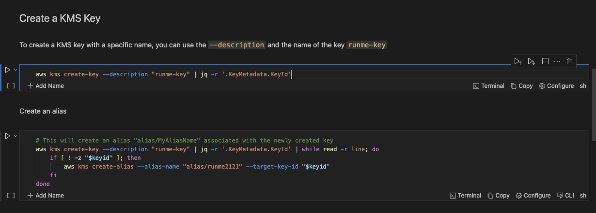
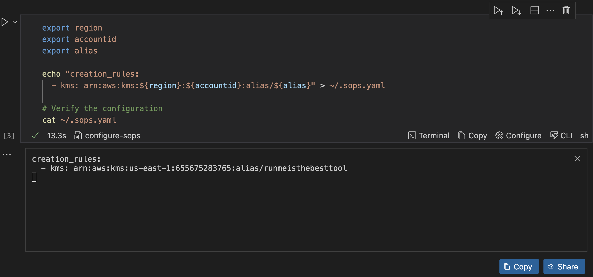
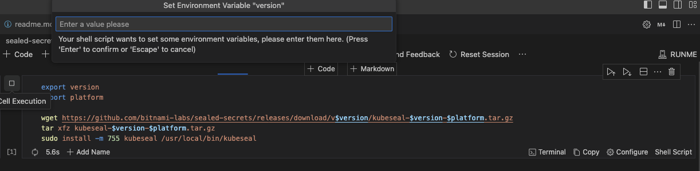

# How to Secure and Automate Kubernetes Secrets with Runme and SOPS/Sealed Secrets

The default [Kubernetes Secrets](https://kubernetes.io/docs/concepts/configuration/secret/) are stored either as plaintext or base64 encoded. These secrets should not be sent to version control systems like git due to the security risk of exposing sensitive data such as API keys, passwords, or tokens.

In cases where a developer or an infrastructure-focused engineer needs to add secrets to the cluster or to version control, they should use encryption-first tools. These tools securely share and push these secrets to version control. Tools like [sops](https://fluxcd.io/flux/guides/mozilla-sops/) and [sealed-secrets](https://archive.eksworkshop.com/beginner/200_secrets/installing-sealed-secrets/) are commonly used by DevOps and SREs.

With Runme, Platform Engineers can document how secrets are added to a Kubernetes cluster, ensuring the commands and guides are repeatable, consistent, and executable. Runme also enables engineers to create runbooks as documentation. This allows other team members, including new ones, to add and encrypt secrets correctly without leaking data and causing a significant security breach.

The guide below explains how to use [Runme](https://github.com/stateful/blog-examples/tree/main/k8s-secret) as your central knowledge hub. It will make your documentation the go-to source for all infrastructure operations.

## **Prerequisites**

- An AWS account with privileges to create an [IAM User](https://docs.aws.amazon.com/IAM/latest/UserGuide/id_users.html) and a [KMS Key](https://docs.aws.amazon.com/kms/latest/developerguide/concepts.html#kms_keys).
- [AWS CLI](https://docs.aws.amazon.com/cli/v1/userguide/cli-chap-install.html) installed and configured.
- **Kubernetes Cluster:** A running Kubernetes cluster is required. For this guide, we will use [kind](https://kind.sigs.k8s.io/docs/user/quick-start/) for our Kubernetes cluster.
- **[Kubectl](https://kubernetes.io/docs/tasks/tools/):** The Kubernetes command-line tool should be installed on your machine.

Here is a [notebook](https://github.com/stateful/blog-examples/blob/main/k8s-secret/sops/prerequiste.md) to help you install these prerequisites. For this guide we are using either Linux or Mac OS

## **Securing Secrets with SOPS**

Encrypt your Kubernetes secrets using SOPS; you need enhanced security and access to your cloud provider. This requires a [Key Management Service](https://docs.aws.amazon.com/kms/latest/developerguide/concepts.html#kms_keys) (KMS). For this guide, we'll use an AWS KMS key. This service offers secure key management, key rotation, access control, auditing, and compatibility with cloud platforms.

Here is an example [notebook](https://github.com/stateful/blog-examples/blob/main/k8s-secret/sops/sops.md) to follow this toturial.

### **Installation of SOPS**

**Step 1: Download SOPS Binary**

Click on execute cell button to install `sops` 

<video autoPlay loop muted playsInline controls>
  <source src="/videos/runme-envprompt-k8s.mp4" type="video/mp4" />
  <source src="/videos/runme-envprompt-k8s.webm" type="video/webm" />
</video>

Set your environment variable:

```sh {"id":"01HSDSRR7BPPAATCHMZPZDXBGE"}
export version
export platform
```

```sh {"id":"01HRT2VDC4VKCGXFGTRD6QESJX"}

curl -LO https://github.com/getsops/sops/releases/download/$version/sops-$version.$platform
```

By using the runme [env prompt](https://docs.runme.dev/getting-started/features#environment-variable-prompts) feature, all you need to do is input the latest version of SOPS for `{version}` and your platform for `{platform}` (e.g., *darwin* for macOS, *linux* for Linux).

<br />
<Infobox type="sidenote" title="Note">

You don’t need to input the environment variable again ones the values has been inputted, other code cell within the notebook can use, unless you reset the session.

</Infobox>

For this guide, we are using a Linux operating system.

### **Create a KMS Key**

Next, create a [KMS key](https://docs.aws.amazon.com/kms/latest/developerguide/concepts.html#kms_keys) in AWS. This key will be used to encrypt and decrypt your secrets.

To create a KMS key with a specific name, use the `--description` option followed by the name of the key, in this case, `runme-key`.

use the `jq -r` to parse the JSON input recieved from `aws kms create-key` command and extract the value associated with the `KeyId` field

Use the [Chain Cell Output](https://docs.runme.dev/getting-started/features#chain-cell-output) feature to transfer the stdout result of the last execution into your next execution To create an `alias`



You can save it straight to the runme cloud for future use or reference, using the runme [auto-save](../configuration/auto-save) feature

### **Configure SOPS**

Create a `SOPS` configuration file, this file specifies how `SOPS` should encrypt your secrets and what encryption keys to use.



Verify the configuration by checking the contents of `~/.sops.yaml`

```sh {"id":"01HRT1S289XFGGR43ZFJSJN8G8"}
cat ~/.sops.yaml
```

### **Encrypt Your Secrets**

Encrypt your secrets seamlessly using SOPS and AWS KMS, no more cryptic commands; each step is laid out for you to follow along effortlessly.

```sh {"id":"01HRT1REM347HVT1YNEHNQ75M9"}
sops --encrypt --kms arn:aws:kms:$region:$account-id:key/$key --encryption-context Role:sops-runme-kms-role --encrypted-regex password runme-secrets.yaml > runme-secrets-enc.yaml
```

the secrets in your `runme-secrets.yaml`  gets encrypt an piped into another file `runme-secrets-enc.yaml`

### **Decrypt Your Secrets**

Retrieve and decrypt your secrets with confidence. Runme Notebook provides clear and concise instructions, ensuring the decryption process is as smooth as encrypting.

here is how to check for you secret within the cluster:

```sh {"id":"01HRSMKKZDA1MJMTEPK8CHS7YF"}
kubectl get secret sops-runme -n test -o jsonpath="{.data.password}” | base64 --decode
```

here is how to decrypt your sops secret:

```sh {"id":"01HRT1HVC0JY2JH7WKD1PRXW3H"}
sops --decrypt --kms arn:aws:kms:{region}:{account-id}:key/{key} --encryption-context Role:sops-runme-kms-role --encrypted-regex password runme-secrets-enc.yaml > runme-secrets.yaml
```

Decrypt the secret from a sops encrypted secret `runme-secrets-enc.yaml` into the original version before it was encrypted `runme-secrets.yaml`

### **Apply Encrypted Secret**

```sh {"id":"01HRSMKKZDED03HJNEATG1D3W9"}
sops -d runme-secrets-enc.yaml | kubectl apply -f -
```

## **Securing Secrets with Sealed Secrets**

[Sealed Secrets](https://archive.eksworkshop.com/beginner/200_secrets/installing-sealed-secrets/) is an open-source project initiated by Bitnami. It’s used for encrypting Kubernetes secrets. After encryption, these secrets can be safely stored in your version control. This enables DevOps practices without exposing sensitive data.

Only the Sealed Secrets controller has the ability to decrypt these encrypted secrets.

- **Kubeseal:** Install the Sealed Secrets Controller.

```sh {"id":"01HS1APA6Q2DF946SNP7NN0Y7E"}
export version
export platform

wget https://github.com/bitnami-labs/sealed-secrets/releases/download/v$version/kubeseal-$version-$platform.tar.gz
tar xfz kubeseal-$version-$platform.tar.gz
sudo install -m 755 kubeseal /usr/local/bin/kubeseal
```

using the `export` command prompts you to input the value of `version` or `platform`



Installing the Custom Controller and CRD for SealedSecrets

```sh {"id":"01HS1AR998QYFRGSA30DNZ6KQC"}
wget https://github.com/bitnami-labs/sealed-secrets/releases/download/v$version/controller.yaml
kubectl apply -f controller.yaml
```

Check the status of the controller pod.

```sh {"id":"01HS1ARV0VY9NRX6C5QGCE8837"}
kubectl get pods -n kube-system | grep sealed-secrets-controller
```

### **Encrypt a Secret**

- Create a Kubernetes Secret and use **`kubeseal`** to encrypt it:

```sh {"id":"01HRSMKKZDHRFG7RMFFHDXWZAB"}
kubectl create secret generic mysecret --from-literal=username=myuser --from-literal=password=mypassword --dry-run=client -o yaml | kubeseal > mysealedsecret.yaml
```

- Alternatively, you can encrypt a manifest file:

```sh {"id":"01HRSMKKZD3YZ69HWSZNW9FRWP"}
kubeseal < mysecret.yaml > mysealedsecret.yaml
```

- Use the sealed-secrets-controller installed in your cluster to encrypt a secret before deploying:

```sh {"id":"01HRSMKKZDFC6E3DE7T5Z79GDT"}

cat mysecret.yaml | kubeseal --controller-namespace kube-system --controller-name sealed-secrets-controller --format yaml > mysealedsecret.yaml
```

This creates a SealedSecret resource (**`mysealedsecret.yaml`**) containing the encrypted data.

### Decrypt a Secret

You can decrypt the encrypted secret `mysealedsecret.yaml` into the original version`runme-secrets.yaml`

```sh {"id":"01HS1JF6867W5ASTVZ86GC37N2"}
kubectl get sealedsecret <mysealedsecret> -o yaml | kubeseal --raw > runme-secret.yaml
```

### **Add a New Value to a Sealed Secret**

```sh {"id":"01HRSMKKZDQ3BAD5TMBMC994MY"}
echo -n "my secret api key" | kubectl create secret generic xxx --dry-run=client --from-file=api_key=/dev/stdin -o json | kubeseal --controller-namespace=kube-system --controller-name=sealed-secrets --format yaml --merge-into sealed-secret.yaml
```

### **Delete Sealed Secret:**

- To delete the secret, use the **`kubectl`** command:

```sh {"id":"01HRSMKKZDEM5TGC0H49MCX158"}
kubectl delete -f mysealedsecret.yaml
```

### **Deploy the Sealed Secret:**

```sh {"id":"01HRSMKKZDFG16ASX22PJ26RP7"}
kubectl apply -f mysealedsecret.yaml
```

The Sealed Secrets controller will decrypt the SealedSecret and create a regular Kubernetes Secret with the decrypted data.

Make sure to replace placeholders like **`mysecret.yaml`** and **`mysealedsecret.yaml`** with your secret and sealed secret filenames. Adjust controller-specific details such as the namespace and name according to your environment.

## **Challenges with Manual Execution**

While the above processes help you secure your Kubernetes key, manually carrying out these operations can be take time and effort. This is where Runme comes in.

Runme is a README documentation software that automates manual processes and gives you the time to jump right into a task, execute it, and save time.

You can quickly eliminate the hassle of learning and implementing secret encryption in Kubernetes by automating these processes with Runme.

## **Improve Documentation Experience with Runme Notebook**

Previously, we explored securing your Kubernetes secrets using sealed secrets and SOPS. Now, we will walk you through how to automate these processes with a single click right inside your Markdown file.

1. Open VS Code on your local machine. Navigate to the extensions tab and search for “Runme” Now, click Install.
2. Create a README file.
3. To execute each of your commands, paste them into the code block in Runme and click the run cell button beside the code block.

The image below illustrates how easy it is to download the SOPS binary using Runme.


To have a full view of these processes, you can clone this [repo](https://github.com/stateful/blog-examples/tree/main/k8s-secret), open it with VS Code on your local machine and click the run cell button to complete your tasks. However, ensure you have installed [Runme](../installation/index.md) first.

Embrace the Runme Notebook experience to secure your secrets and effortlessly enhance your Kubernetes knowledge. Visit [Runme Documentation](https://docs.runme.dev/) to embark on a guided journey to a more secure Kubernetes environment.
