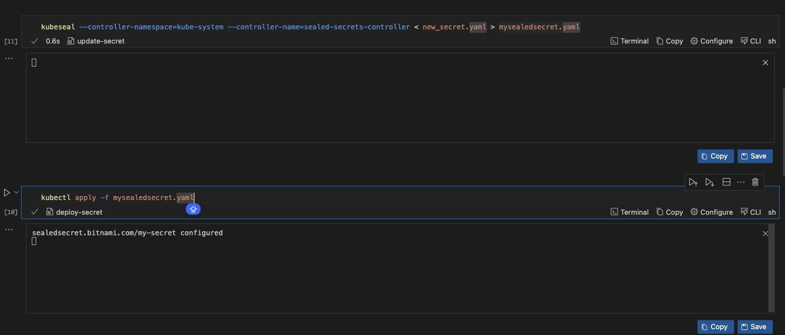
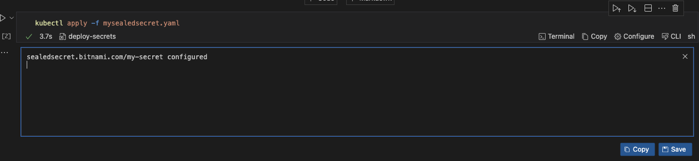

# Securing Kubernetes Secrets with Sealed Secrets and Runme

Runme provides a platform for documenting processes and instructions. It integrates swiftly with cloud infrastructures, including Kubernetes and its resources.

This guide will explore one such resource, Kubernetes secrets, with a specific focus on Sealed Secrets.

[Sealed Secrets](https://archive.eksworkshop.com/beginner/200_secrets/installing-sealed-secrets/) is an open-source project that helps encrypt Kubernetes secrets, which can then be securely stored in your version control. Runme makes securing these secrets easier.

In this guide, we will demonstrate the steps required to encrypt Kubernetes secrets with Sealed Secrets in Runme successfully.

## **Prerequisites**[](https://docs-runme-55rq3q1vz-stateful.vercel.app/guide/k8s-secret#prerequisites)

To get started, ensure you have the following:

- **Clone the repository**: We created a [notebook repository](https://github.com/stateful/blog-examples/tree/main/kubernetes/k8s-secret/sealed-secret) containing all the instructions and commands required for this guide.
- **Install Runme**: Install the [Runme extension on VS Code](https://marketplace.visualstudio.com/items?itemName=stateful.runme) and set it as your [default Markdown viewer.](https://docs.runme.dev/installation/installrunme#how-to-set-vs-code-as-your-default-markdown-viewer)

This guide will focus on using the Mac specifications. If you use a Linux OS, follow the instructions in the [Linux Markdown files.](https://github.com/stateful/blog-examples/blob/main/kubernetes/k8s-secret/sealed-secret/linux-sealedsecrets.md)

### Install all Dependencies

To follow up on securing your secrets using Sealed Secrets, ensure you install the necessary dependencies in the notebook's prerequisite section. In your Runme cell, run the commands below to install all dependencies required for this guide.

<video autoPlay loop muted playsInline controls>
  <source src="/videos/sealed-secrets-runme.mp4" type="video/mp4" />
  <source src="/videos/sealed-secrets-runme.webm" type="video/webm" />
</video>

### **Encrypt a Secret in Runme**[](https://docs-runme-55rq3q1vz-stateful.vercel.app/guide/k8s-secret#encrypt-a-secret)

To encrypt a secret, you must create a Kubernetes secret using `kubeseal`. Navigate to your cloned repo's ‘Encrypt a Secret’ section and [choose your preferred encryption method from the options provided.](https://github.com/stateful/blog-examples/blob/main/kubernetes/k8s-secret/sealed-secret/Mac-sealedsecret.md#encrypt-a-secret)  Once that is done, run the command below in your Runme cell.

Runme will automatically create a Sealed Secret resource containing the encrypted data, the **`mysealedsecret.yaml`**

### Adding New Value to A Secret

You can add a new value to your secret by navigating to [this section](https://github.com/stateful/blog-examples/blob/main/kubernetes/k8s-secret/sealed-secret/Mac-sealedsecret.md#adding-a-new-value-to-a-sealed-secret) and executing the commands. You only need to update your manifest file with the new values, re-encrypt the secrets, and then reapply them to the cluster. All of these can be executed in your Runme cell. The image below shows a visual representation of this process.

From the output gotten, you can see that your new value has successfully been added.



### Decrypt a Secret[](https://docs-runme-55rq3q1vz-stateful.vercel.app/guide/k8s-secret#decrypt-a-secret)

To retrieve the original version of `runme-secrets.yaml`, you can decrypt the encrypted secret, `mysealedsecret.yaml`. Run the command in the ‘Decrypt a Secret’ section of the repo and run it in your Runme cell.

```sh
kubeseal --controller-name=sealed-secrets-controller --controller-namespace=kube-system  < mysealedsecret.yaml > mysecrets.yaml
```

### Delete a Secret

To delete the secret, use the `kubectl` command to delete the resource and run it in your Runme cell.

```sh
kubectl delete -f mysealedsecret.yaml
```

### **Deploy the Sealed Secret**[](https://docs-runme-55rq3q1vz-stateful.vercel.app/guide/k8s-secret#deploy-the-sealed-secret)

To deploy your secret, execute the code below:

```sh
kubectl apply -f mysealedsecret.yaml
```



The Sealed Secrets controller will decrypt the Sealed Secret and create a Kubernetes Secret with the decrypted data.

Make sure to replace placeholders like **`mysecret.yaml`** and **`mysealedsecret.yaml`** with your secret and Sealed Secret filenames. Adjust controller-specific details such as the namespace and name according to your environment.

## How Runme Improves Your Documentation Experience

In this guide, we explored how to encrypt, decrypt, delete, deploy a Kubernetes secrtes using sealed secrets and Runme. Runme made the process of carrying all these operations out swiftly by utilizing its features.

Some [key features](https://docs.runme.dev/getting-started/features) of Runme that make it stand out include:

- Its ability to simplify the copying and pasting of commands and codes,
- Run tasks in the background, interact with your terminal,
- Render images and tables inside your markdown files,
- Run code in your preferred language.

These are just a few of the things you can achieve in Runme. To explore Runme more, visit the [Runme Documentation](https://docs.runme.dev/), where you can embark on a guided journey to a more secure Kubernetes environment.
