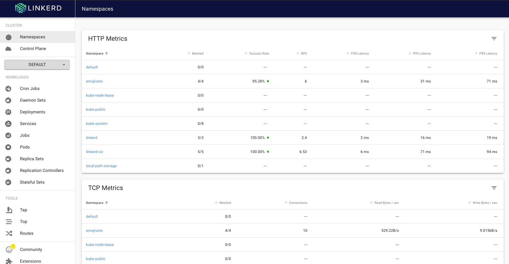
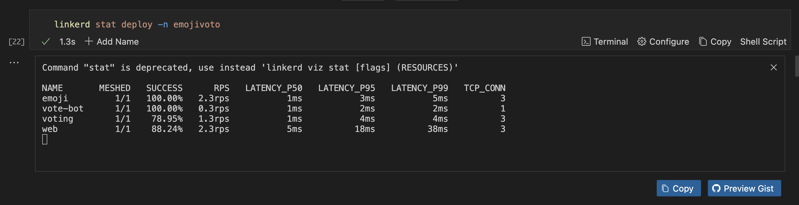
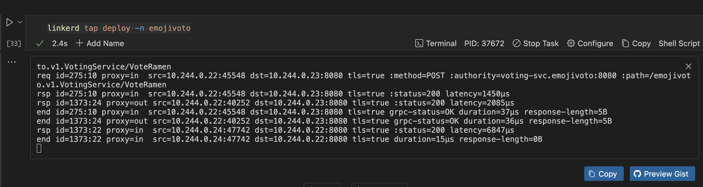
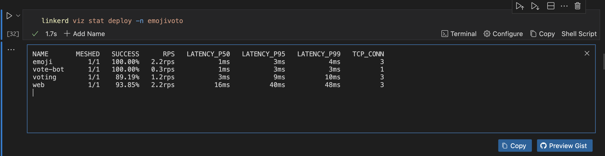

---
runme:
  id: 01J8M72V254RGQ6SDZKQZZE33Q
  version: v3
---

# Linkerd

This guide will walk you through installing Linkerd, deploying a basic application, and using its observability and security features with Runme.

### **Prerequisites**

Before proceeding with this guide, ensure you have the following.

- Runme Extension: Install the [Runme extension](https://marketplace.visualstudio.com/items?itemName=stateful.runme) in your VS Code editor and set it as your [default Markdown viewer](/installation/vscode#configure-your-default-markdown-editor).
- Kubernetes cluster: A functioning Kubernetes cluster (such as Minikube, k3d, or a cloud provider's managed Kubernetes).
- kubectl: Kubernetes CLI installed and configured to interact with your cluster.
- Helm (optional): For easier management of Linkerd and its extensions.
- Linkerd CLI: Required to interact with Linkerd.

## Setting Up

This section will walk you through how to set up for this project.

If you already have a cluster running, run this code cell below to delete the cluster if it already exists.

```sh {"id":"01J8M53EJFTCTQE56AW0MYANBM"}
kind delete cluster --name runme-linkered
```

In this guide, we are using kind to create a Kubernetes cluster locally. The name of the Kubernetes cluster is `runme-linkered`

```sh {"id":"01J8M54FXAN57RZQK0CT3N7EJ2"}
kind create cluster --name runme-linkered
```

To check if your cluster is running, run the command below.

```sh {"id":"01J8M554318GGDD7WDJFM2CEVM"}
kubectl get ns
```

## **Install the Linkerd CLI**

After setting up the project, the next step is to install the [Linkerd CLI](https://linkerd.io/2.16/getting-started/#step-1-install-the-cli). The CLI helps with tasks like installing Linkerd into your cluster, validating your setup, and checking the status of your mesh. To install, run the command below ( if you have [brew](https://brew.sh/) already installed).

```sh {"id":"01J8M55WEWHYWXJE9ZRC1Q6TPE"}
brew install linkerd
```

Verify the installation by checking the version:

```sh {"id":"01J8M56DWJGQN23TWN36CHRCQF"}
linkerd version
```

### **Validate Your Cluster**

To validate and ensure your cluster is ready to use Linkerd, run this command.

```sh {"id":"01J8M574YJXESCN5HQ7ZYB9Y3Y"}
linkerd check --pre
```

This command will validate that your Kubernetes cluster meets Linkerd’s requirements (e.g., proper Kubernetes version, sufficient resources, etc.).

### **Install Linkerd Control Plane**

To install Linkerd’s control plane, run the following commands. The control plane comprises components like the Linkerd controller, proxy injector, and web UI.

before installing the control plane, you have to install the custom resource definitions, run the command below

```sh {"id":"01J8M57WZF0HMF8VAEYZKA1SME"}
linkerd install --crds | kubectl apply -f -
```

Install the control plane:

```sh {"id":"01J8M5BV7ZWVYAE3M6E6DTMR3V"}
linkerd install | kubectl apply -f -
```

If you would love to monitor the installation progress, run the command below.

```sh {"id":"01J8M5CEBNPCW9T21FJMCRMP7Q"}
linkerd check
```

Once installed, you’ll see a confirmation that Linkerd is running correctly.

## **Deploy Your First Application with Linkerd**

You can deploy a sample application to demonstrate Linkerd in action. Let's use Linkerd's sample app, `emojivoto`. In this section, we will explore the steps to achieving that.

**Install the `emojivoto` app using `kubectl`:**

To do this, run the command below.

```sh {"id":"01J8M5D3S58DY65QNWYPMH3CA7"}
kubectl apply -f https://run.linkerd.io/emojivoto.yml
```

You can view the running pods in the emojivoto namespace:

```sh {"id":"01J8M5EJE03FK26RQ3GT5YBHW6"}
kubectl get pods -n emojivoto
```

Now, inject the Linkerd proxy into the app:

```sh {"id":"01J8M5F6W11ZEDA3J6X12F8XPD"}
kubectl get -n emojivoto deploy -o yaml \
| linkerd inject - \
| kubectl apply -f -
```

This command injects the Linkerd sidecar proxy into the application. The proxy helps secure and monitor service-to-service communication.

**Extend Linkerd**

Linkerd has several extensions that can be installed to add extra functionality, such as:

- Viz: For observability enhancements (e.g., Grafana dashboards).
- Jaeger: For distributed tracing.
- Multicluster: For managing multiple Kubernetes clusters with Linkerd.

You can install these extensions using the linkerd install command followed by the extension name. For example, to install the Viz extension, run the command below.

```sh {"id":"01J8M5GDS3B6M4D9CFKG21A68X"}
linkerd viz install | kubectl apply -f -
```

**Validate the Installation**

After the Viz extension has been installed, check the installation status:

```sh {"id":"01J8M5H2CJ70K3XP7TRQGCWPT5"}
linkerd viz check
```

You can now access advanced visualizations, including the Grafana dashboards.

**Access the Linkerd Dashboard**

Linkerd has a powerful web dashboard that allows you to view your services.

To open the Linkerd dashboard, run this command. You can also use the [Runme background task feature](/getting-started/vscode#background-processes) to make this run in the background while executing other commands.

```sh {"id":"01J8M5K3HVDMCAVXF7BDH1WV8Z"}
linkerd viz dashboard
```

This will open the dashboard in your default browser, where you can view:

- The communication patterns between microservices.
- Real-time metrics like success rates and request latencies.
- Traffic split. If you implement traffic splitting (e.g., for canary deployments), you can see how traffic is routed between services.



**Monitor Traffic Between Services**

You can use the CLI to get real-time metrics from your application. For example, to view the live request traffic between services in the `emojivoto` namespace:

```sh {"id":"01J8M5KXW4R4Y9MKEYEY2TZ2SV"}
linkerd stat deploy -n emojivoto
```



This will show success rates, request latencies, and request volumes for your services.

To get more detailed traffic information, you can use `tap`. You can set this command to run in the background using the [background task feature](/getting-started/vscode#background-processes) of Runme.

```sh {"id":"01J8M5NV3J8JG8Y6SCJ1G62VDT"}
linkerd tap deploy -n emojivoto
```



This will provide a live stream of requests between your services, including HTTP status codes and response times.

**Enable mTLS for Secure Communication**

One of Linkerd’s key features is mutual TLS (mTLS), which automatically encrypts communication between services and verifies their identities.

To check if mTLS is enabled, run this command.

```sh {"id":"01J8M5PSM00NN8G8R61RSJY2PV"}
linkerd viz stat deploy -n emojivoto
```



You should see the percentage of requests secured by mTLS in the output.

Linkerd automatically manages mTLS certificates and handles certificate rotation, so minimal configuration is required. You can enforce policy checks to ensure all communication is encrypted.

## **Conclusion**

In this guide, you’ve learned how to install and use Linkerd for service mesh capabilities on a Kubernetes cluster. You’ve explored core features like proxy injection, observability and secure mTLS communication.

To learn more about Runme and how it works with Kubernetes to make work easier, read our guides:

- [Istio Service Mesh](/guide/k8s/istio)
- [Kubectl](/guide/k8s/kubectl)
- [Argo CD](/guide/k8s/argocd-cli)
