# How to Set Up a Monitoring Stack For Your Application by Leveraging Runme

A monitoring stack is a set of tools and technologies that collect, process, and visualize data from various sources to improve the performance and security of systems and applications.

Often, having several instructions scattered everywhere to set up and configure your monitoring stack can be overwhelming. This is where Runme comes in! Runme provides a platform that helps you document all the standardized processes needed to set up and configure your monitoring stack, centralizing your procedures and processes in an interactive runbook accessible to you and your team.

With Runme, you create a set of predefined procedures and instructions for installing and configuring all dependencies needed for your monitoring stack, such as [Prometheus](https://prometheus.io/), [Grafana](https://grafana.com/), etc.

In this guide, we will walk you through configuring a monitoring stack and creating a Runbook for your application setup and configuration using Runme.

## Prerequisites

To follow up on the steps in this guide, ensure you have the following:

- Runme Extension: Install the [Runme extension](https://marketplace.visualstudio.com/items?itemName=stateful.runme) in your VS Code editor. You can make Runme your [default Markdown viewer](https://docs.runme.dev/installation/installrunme#how-to-set-vs-code-as-your-default-markdown-viewer), ensuring all your Markdown files are automatically opened as a Runme Notebook. Additionally, it provides other client interfaces where you can run your Markdown file. See the [Runme installation](https://docs-runme-jg6ocbnyb-stateful.vercel.app/installation/) guide.
- Clone Repository: We have provided an example repo to help you follow this tutorial. Clone the [repository here](https://github.com/stateful/blog-examples/tree/main/kubernetes/monitoring-stack). If you are a Linux user, navigate to the [Linux file](https://github.com/stateful/blog-examples/blob/main/kubernetes/monitoring-stack/linux.md). For Mac users, see the [Mac file](https://github.com/stateful/blog-examples/blob/main/kubernetes/monitoring-stack/mac.md).
   This guide focuses on the Linux README.md file; other operating systems also work.

## Install a Node Exporter

A [Node Exporter](https://github.com/prometheus/node_exporter) allows for detailed monitoring of system-level metrics like CPU usage, memory usage, disk, and network activity, providing valuable insights into the health and performance of the underlying infrastructure.

To install a Node Exporter in Runme, navigate to the “[Install Node Exporter](https://github.com/stateful/blog-examples/blob/main/kubernetes/monitoring-stack/linux.md#install-node-exporter)” section in the cloned repository, enter the command in your Runme cell, and click on run.

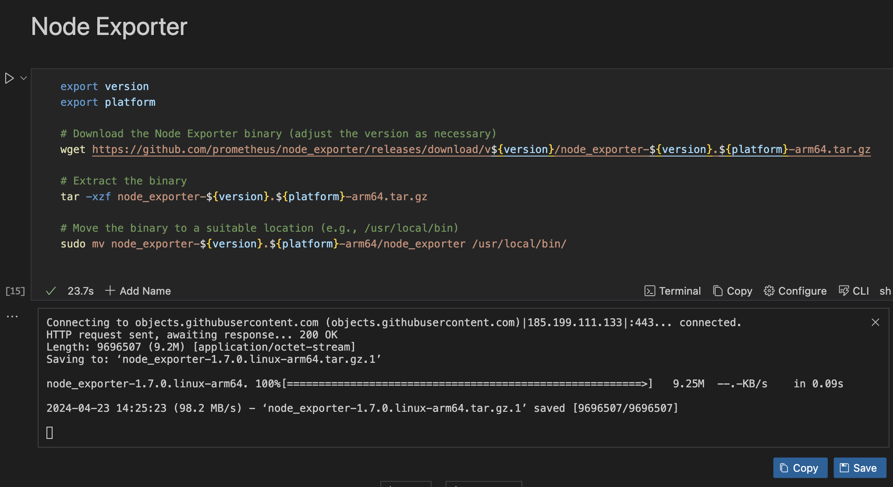

Runme uses its [environment variable prompt feature](https://docs.runme.dev/getting-started/features#environment-variable-prompts) to prompt users to enter a value for the version and the platform. Runme will store these values, so you no longer need to enter them when working on this project.

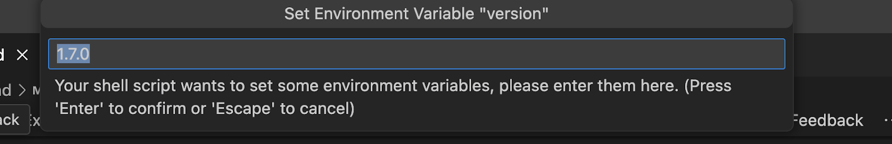

## Configure Your Node Exporter In Your Runbook

To configure your node exporter, you must follow three steps.

Step One: Set Up Node Exporter as a Service

Create a `systemd` service file that ensures the Node Exporter is properly configured as a background service. This will allow it to continuously collect and export system metrics to Prometheus for monitoring and analysis. To do this, navigate to the “[Setup Node Exporter as a Service](https://github.com/stateful/blog-examples/blob/main/kubernetes/monitoring-stack/linux.md#setup-node-exporter-as-a-service)” section in your cloned repository and run the command in your Runme cell.

```sh
cat <<EOF > sudo tee /etc/systemd/system/node_exporter.service > /dev/null
[Unit]
Description=Prometheus Node Exporter
After=network.target

[Service]
ExecStart=/usr/local/bin/node_exporter

[Install]
WantedBy=default.target

EOF

```

Output:

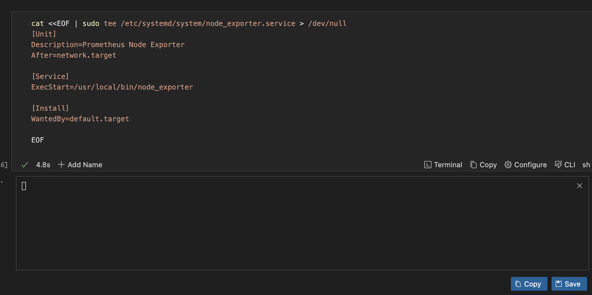

Step Two: Run Node Exporter as a Service

In this step, you are required to run your Node Exporter service, check its status, and restart it if necessary. To do this, navigate to the “[Run Node Exporter as a Service](https://github.com/stateful/blog-examples/blob/main/kubernetes/monitoring-stack/linux.md#run-node-exporter-as-a-service)” section and run the command in your Runme cell.

```sh
sudo cp -rf ${PWD}/node_exporter/node_exporter.service /etc/systemd/system/

sudo systemctl daemon-reload

sudo systemctl enable node_exporter
echo "node exporter enable"

sudo systemctl start node_exporter
echo "node_exporter has started."


sudo systemctl status node_exporter

sudo systemctl restart node_exporter
```

Output:

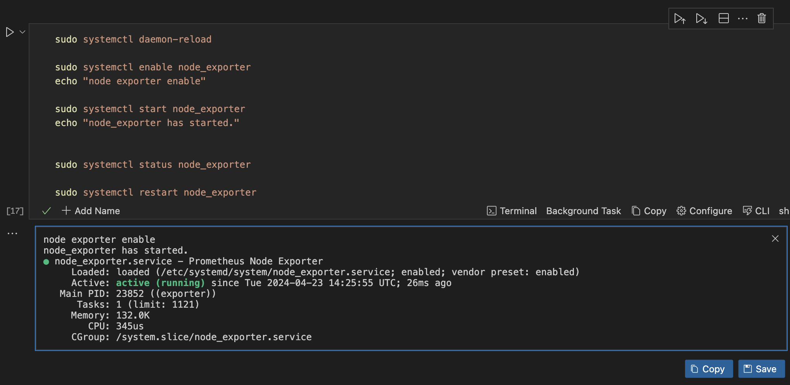

### Install Prometheus

In a monitoring stack, Prometheus gathers metrics, monitors system and application health, generates alerts based on a predefined rule, and provides insights into system and application performance and availability.

To install Prometheus in Runme, navigate to the “[Install Prometheus](https://github.com/stateful/blog-examples/blob/main/kubernetes/monitoring-stack/linux.md#install-prometheus)” section in your cloned repository, enter and run the command in your Runme cell.

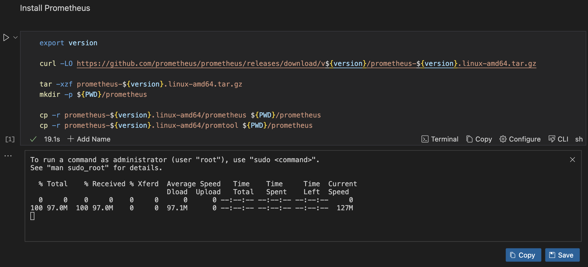

Runme will leverage its environment prompt feature to prompt you to input the version of Prometheus you want to install. Once you input the version, you will have an output similar to the one above.

### Configure your Prometheus

To configure your Prometheus, you will be required to follow three steps:

Step One: Setup your Prometheus configuration
Create a Prometheus configuration file that specifies how Prometheus should collect metrics from the Node Exporter. To do this, navigate to the section on “[Setting up Prometheus Configuration](https://github.com/stateful/blog-examples/blob/main/kubernetes/monitoring-stack/linux.md#setup-your-prometheus-configuration)”, enter the command, and run it in your Runme cell.

```sh
cat <<EOF > ${PWD}/prometheus/prometheus.yml
global:
  scrape_interval: 15s
  evaluation_interval: 15s
scrape_configs:
  - job_name: 'node_'
    metrics_path: /metrics
    static_configs:
      - targets:
        - 10.90.2.1:9116
EOF
```

Output:

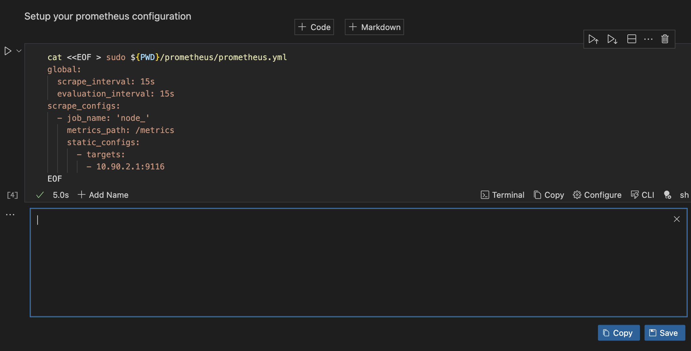

Step Two: Set up Prometheus as a service
Create a `systemd` service file for the Prometheus Agent Mode, which will facilitate federation and data collection from multiple Prometheus instances or remote targets. To do this, navigate to the “[Setting up prometheus as a Service](https://github.com/stateful/blog-examples/blob/main/kubernetes/monitoring-stack/linux.md#setup-prometheus-as-a-service)” section, enter the command, and run it in your Runme cell.

```sh
cat <<EOF > ${PWD}/prometheus/prometheus.service
[Unit]
Description=Prometheus Agent Mode
After=network-online.target
[Service]
User=${USER}
WorkingDirectory=${PWD}
ExecStart=${PWD}/prometheus/prometheus --config.file=${PWD}/prometheus/prometheus.yml --enable-feature=agent
[Install]
WantedBy=multi-user.target
EOF
```

Output:

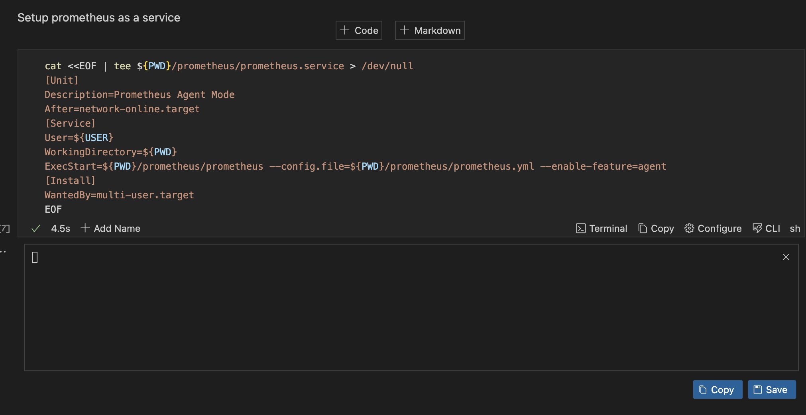

Step Three: Run Prometheus as a Service
Now, run Prometheus as a service. To do this, navigate to the “[Run Prometheus as a Service](https://github.com/stateful/blog-examples/blob/main/kubernetes/monitoring-stack/linux.md#run-prometheus-as-a-service)” section, enter the command, and run it in your Runme cell.

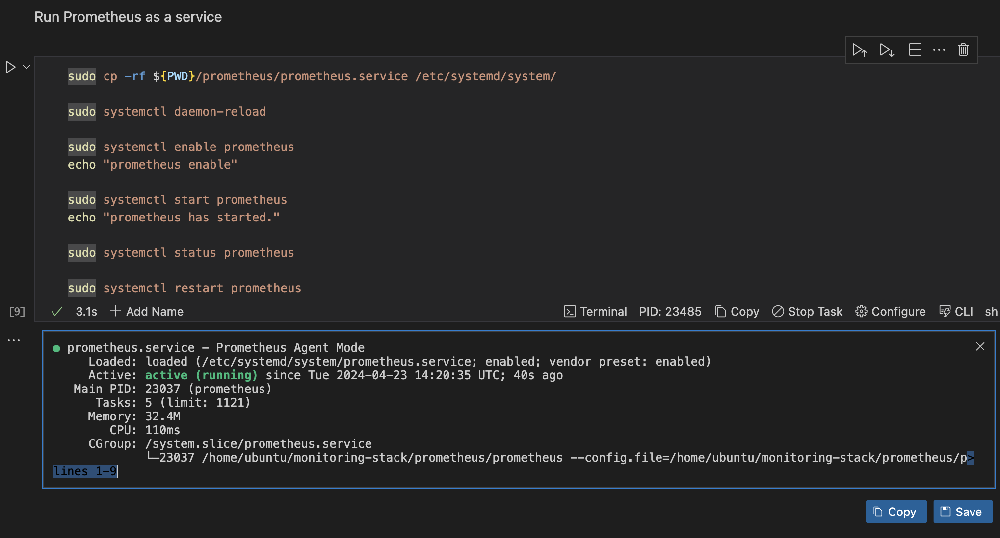

Step four: Open the app
Run the code below in your Runme cell to open the Prometheus app on your local machine.

```sh
open http://localhost:9090
```

Output:

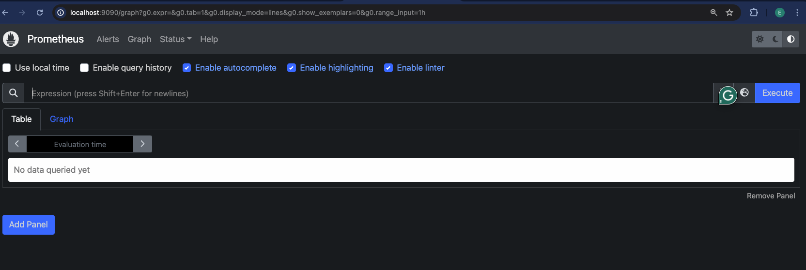

## Install Grafana

Grafana provides a user-friendly interface for visualizing and analyzing metrics, logs, and other monitoring data in your monitoring stack. To install Grafana for your monitoring stack, navigate to the “[Install Grafana](https://github.com/stateful/blog-examples/blob/main/kubernetes/monitoring-stack/linux.md#install-grafana)” section and run the command in your Runme cell.

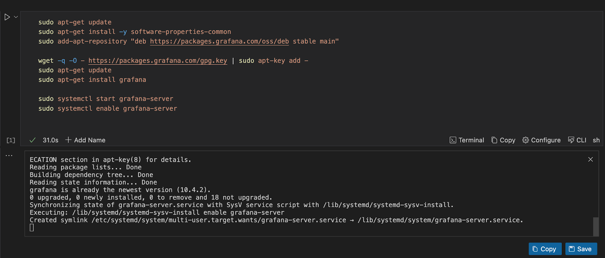

## Open the App

You installed Grafana on your local machine using Runme in the previous step. Now, you need to open the Grafana app on your local machine. To do this, enter the command below in your Runme cell and run the command.

```sh
open http://localhost:3000
```

Ouput:

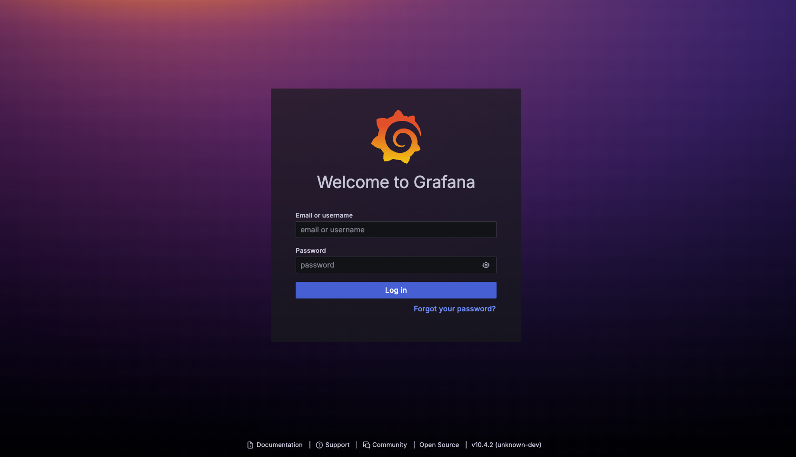

## Install Alert Manager

An alert manager is a component of a monitoring stack that handles alerts sent by monitoring tools like Prometheus. It is responsible for grouping, deduplication, and routing alerts to the appropriate recipients. To install an alert manager and make it a part of your monitoring stack, navigate to the “[Install Alert Manager](https://github.com/stateful/blog-examples/blob/main/kubernetes/monitoring-stack/linux.md#install-alert-manager)” section in the cloned repository, enter the command in your Runme cell, and run it.

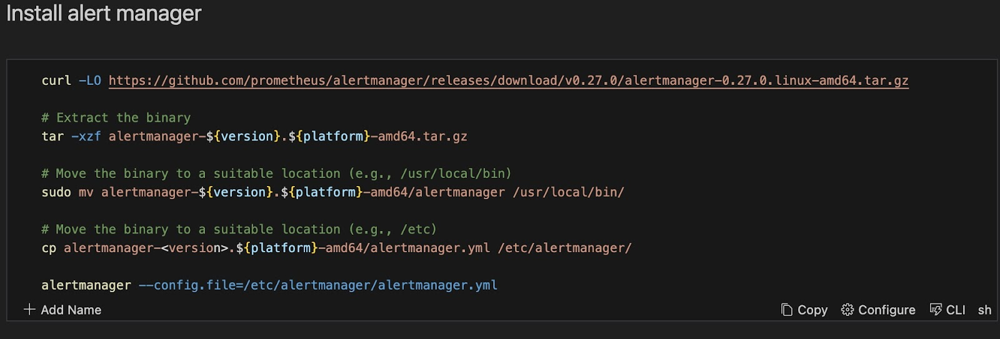

You can edit your `alertmanager.yml` file to define the alerting configurations, notification integrations, and routing rules. To do that, run this command in your Runme cell `nano /etc/alertmanager/alertmanager.yml`

### Configure and Run Your Alert Manager

You will follow three steps to configure and run your alert manager.

Step One: Set Up Alert Manager as a Service
Create a `systemd` service file for Alertmanager, specify its description, user-startup command, and target for activation. To do this, navigate to the “[Setup Alert Manager as a Service](https://github.com/stateful/blog-examples/blob/main/kubernetes/monitoring-stack/linux.md#setup-alert-manager-as-a-service)” section, enter the command, and run it in your Runme cell.

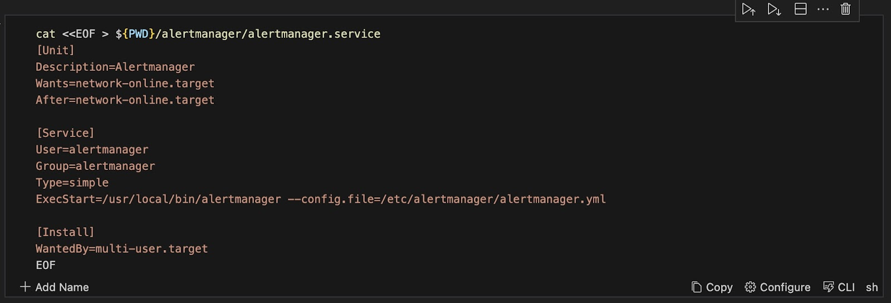

Step Two: Run Alert Manager as a Service
Now, you can run your alert manager as a service. To do this, navigate to the “[Run Alert as a Service](https://github.com/stateful/blog-examples/blob/main/kubernetes/monitoring-stack/linux.md#run-alert-manager-as-a-service)” section, enter the command in your Runme cell, and run it.

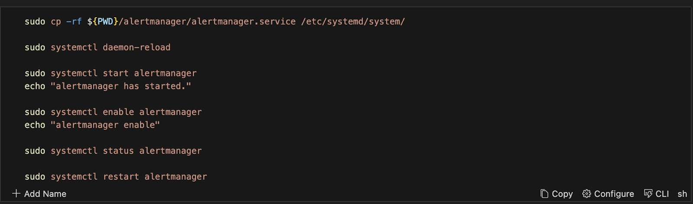

Step Three: Open the app
To open the alert manager app on your local machine, run the command below in your Runme cell.

```sh
open http://localhost:9093
```


## Why use Runme

Rather than having your codes, commands, or processes in separate files or performing a task repeatedly, Runme enables you to have everything inside your Markdown file, which can be automated whenever you need to run this process.
Some key features of Runme that make it a choice platform for your monitoring stack include:

- Environment Variable Prompts
   As you can see from the procedure above, the [environment variable prompt](https://docs.runme.dev/getting-started/features#environment-variable-prompts) is one feature that makes it a choice platform for this task. This feature comes in handy when your runbooks need user-specific values. It allows you to input values directly within your notebook environment, thus making your task execution more efficient.
- Run Sections
   Runme makes [running the script by section](https://docs.runme.dev/configuration/cellsection) possible. For example, in your monitoring-stack notebook, you can choose to run each section (“Node Exporter,” “Prometheus,” “Grafana”) rather than individual cells. This feature makes running this task easier and faster.
- Auto-Save
   Runme makes saving your outputs easier without manual intervention by triggering the [auto-save feature](https://docs.runme.dev/configuration/auto-save). This way, you can focus on your task and run your commands without worrying about losing your outputs.
- Share Runbook With Members of Your Team
   Runme makes sharing of outputs from an executed cell with team members easy. You only need to leverage Runme’s autosave feature to save your output, and you have unlocked the access to share that output with your team members.

These are just a few features of Runme. We continually work to improve your experience with Runme by providing you with more features and updates to enhance your documentation and automation processes. To explore other features of Runme, see the [Runme guide](https://docs.runme.dev/) for comprehensive details.
