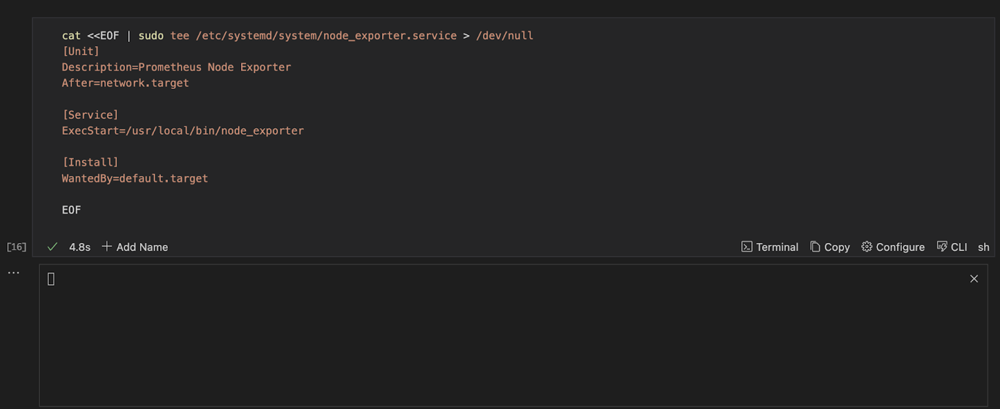
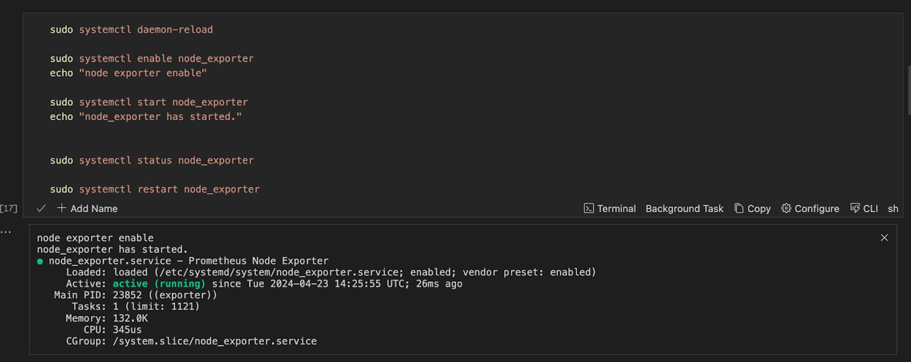
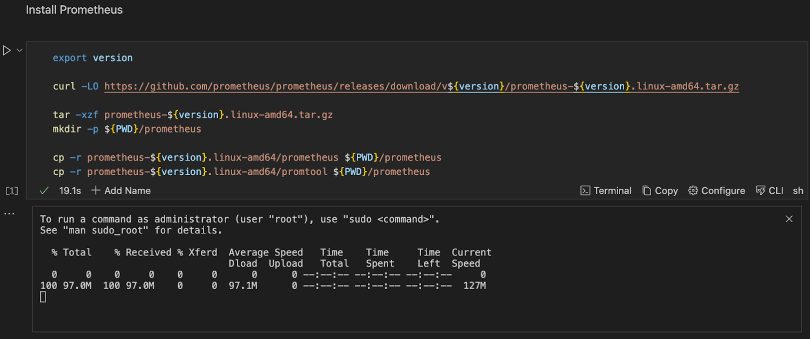
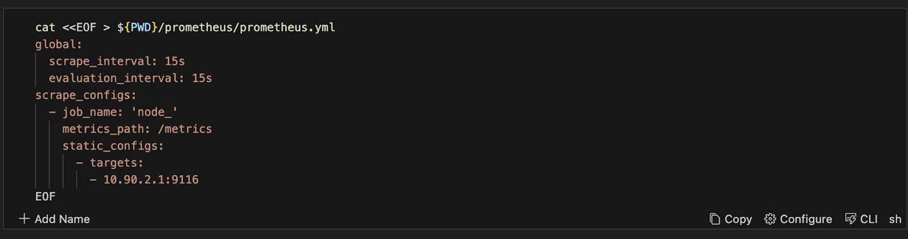
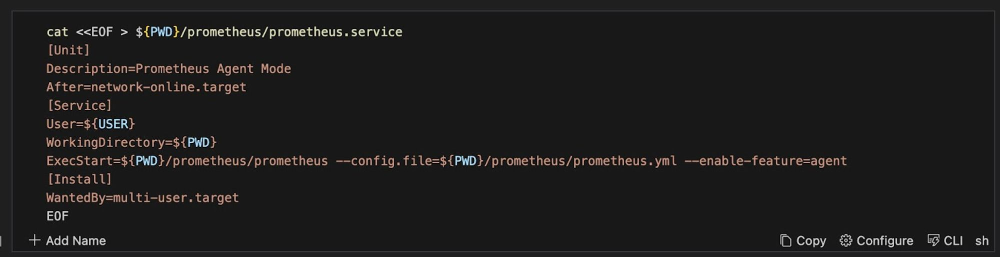
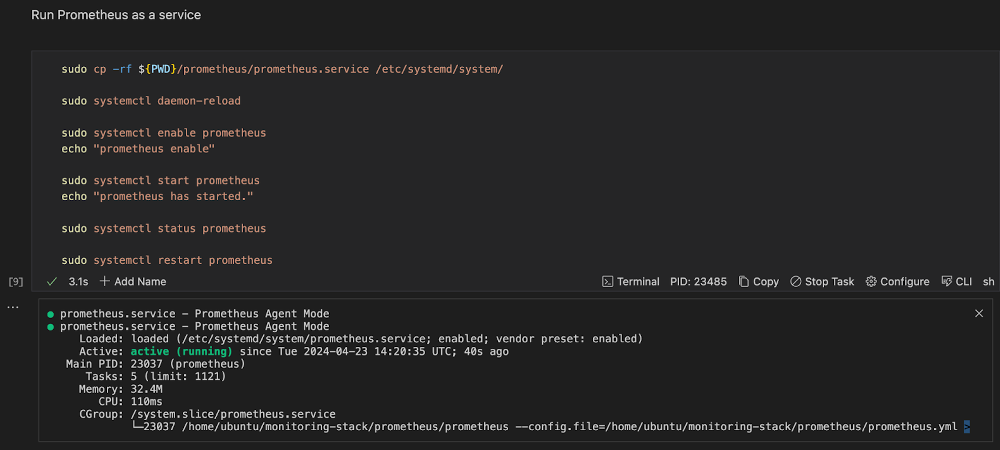
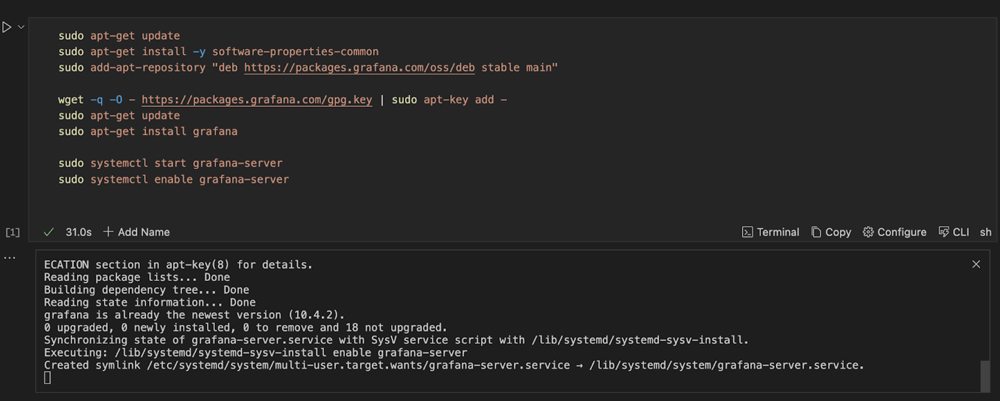

---
runme:
  id: 01HX525D9GDAKP0662NVFVSDR8
  version: v3
---

# How to Set Up a Monitoring Stack For Your Application by Leveraging Runme

Most often, instructions for setting up and configuring monitoring stack procedures are set in multiple documents, which can be overwhelming.

This is where Runme comes in! Runme provides a platform that helps you document all the standardized processes needed to set up and configure your monitoring stack, enabling you to centralize your procedures in an interactive runbook accessible to you and your team.

With Runme, you create a set of predefined procedures and instructions for installing and configuring all dependencies needed for your monitoring stack, such as [Prometheus](https://prometheus.io/), [Grafana](https://grafana.com/), Node exporter and Alertmanager.

In this guide, we will walk you through configuring a monitoring stack and creating a Runbook for your application setup and configuration using Runme.

## Prerequisites

To follow up on the steps in this guide, ensure you have the following:

<<<<<<< Updated upstream
- Runme Extension: Install the [Runme extension](https://marketplace.visualstudio.com/items?itemName=stateful.runme) in your VS Code editor. You can make Runme your [default Markdown viewer](https://docs.runme.dev/installation/installrunme#how-to-set-vs-code-as-your-default-markdown-viewer), ensuring all your Markdown files are automatically opened as a Runme Notebook. Additionally, it provides other client interfaces where you can run your Markdown file. See the [Runme installation](https://docs-runme-jg6ocbnyb-stateful.vercel.app/installation/) guide.
=======
- Runme Extension: Install the [Runme extension](https://marketplace.visualstudio.com/items?itemName=stateful.runme) in your VS Code editor. You can make Runme your [default Markdown viewer](/installation/vscode#how-to-set-vs-code-as-your-default-markdown-viewer), ensuring all your Markdown files are automatically opened as a Runme Notebook. Additionally, it provides other client interfaces where you can run your Markdown file. See the [Runme installation](/installation/) guide.
>>>>>>> Stashed changes
- Clone Repository: We have provided an example repo to help you follow this tutorial. Clone the [repository here](https://github.com/stateful/blog-examples/tree/main/kubernetes/monitoring-stack). If you are a Linux user, navigate to the [Linux file](https://github.com/stateful/blog-examples/blob/main/kubernetes/monitoring-stack/linux.md). For Mac users, see the [Mac file](https://github.com/stateful/blog-examples/blob/main/kubernetes/monitoring-stack/mac.md).

This guide focuses on the Linux README.md file; other operating systems also work.

## Install a Node Exporter

[Node Exporter](https://github.com/prometheus/node_exporter) allows for detailed monitoring of system-level metrics like CPU usage, memory usage, disk, and network activity, providing valuable insights into the health and performance of the underlying infrastructure.

To install a Node Exporter run the command below in your Runme cell.

```sh {"id":"01HXY82ZK9JD52ER5HBMN93PAN"}
export version
export platform

# Download the Node Exporter binary (adjust the version as necessary)
wget https://github.com/prometheus/node_exporter/releases/download/v${version}/node_exporter-${version}.${platform}-arm64.tar.gz

# Extract the binary
tar -xzf node_exporter-${version}.${platform}-arm64.tar.gz

# Move the binary to a suitable location (e.g., /usr/local/bin)
sudo mv node_exporter-${version}.${platform}-arm64/node_exporter /usr/local/bin/

# Optionally, create a system service file (e.g., for systemd)
sudo nano /etc/systemd/system/node_exporter.service
```

When the command is executed successfully, this is what you will see in your Runme terminal.


Runme uses its [environment variable prompt feature](/configuration/cell-level#environment-variable-prompts) to prompt users to enter a value for the version and the platform. Runme will store these values, so you no longer need to enter them when working on this project.


## Configure Your Node Exporter In Your Runbook

After installing your node exporter, the next step is to configure your node exporter. To do this, you must follow three steps.

- **Step One**: Set Up Node Exporter as a Service

Create a `systemd` service file that ensures the Node Exporter is properly configured as a background service. This will allow it to continuously collect and export system metrics to Prometheus for monitoring and analysis. To do this, run the command below in your Runme cell.

```sh {"id":"01HXY82FRQB5GC3S9EZRBBBQ0B"}
cat <<EOF > sudo tee /etc/systemd/system/node_exporter.service > /dev/null
[Unit]
Description=Prometheus Node Exporter
After=network.target

[Service]
ExecStart=/usr/local/bin/node_exporter

[Install]
WantedBy=default.target

EOF
```

Here is a visual representation of the command in a Runme cell and how it outputs when executed.



- Step Two: Run Node Exporter as a Service

In this step, you are required to run your Node Exporter as a service, check its status, and restart it if necessary. To do this, run the command below in your Runme cell.

```sh {"id":"01HXY82FRQB5GC3S9EZVBK1XP3"}
sudo cp -rf ${PWD}/node_exporter/node_exporter.service /etc/systemd/system/

sudo systemctl daemon-reload

sudo systemctl enable node_exporter
echo "node exporter enable"

sudo systemctl start node_exporter
echo "node_exporter has started."


sudo systemctl status node_exporter

sudo systemctl restart node_exporter
```

Here is a visual representation of the command in your Runme cell and its output when executed successfully.



## Install Prometheus

In a monitoring stack, Prometheus gathers metrics, monitors system and application health, generates alerts based on a predefined rule, and provides insights into system and application performance and availability.

To install Prometheus with Runme, run the command below.

```sh {"id":"01HXY8DVDW4P8MA98M1YJTP4R2"}
export version

curl -LO https://github.com/prometheus/prometheus/releases/download/v${version}/prometheus-${version}.linux-amd64.tar.gz

tar -xzf prometheus-${version}.linux-amd64.tar.gz
mkdir -p ${PWD}/prometheus

cp -r prometheus-${version}.linux-amd64/prometheus ${PWD}/prometheus
cp -r prometheus-${version}.linux-amd64/promtool ${PWD}/prometheus
```

Here is a visual representation of the command in a Runme cell and the output when executed successfully.



Runme will leverage its environment prompt feature to prompt you to input the version of Prometheus you want to install. Once you input the version, you will have an output similar to the one above.

## Configure your Prometheus

In the previous section, you installed Prometheus on your local machine. Now, you need to configure Prometheus. To configure your Prometheus, you will be required to follow three steps:

Step One: Setup your Prometheus configuration

Create a Prometheus configuration file that specifies how Prometheus should collect metrics from the Node Exporter. To create this Prometheus configuration file, run the commands below.

```sh {"id":"01HXY82FRQB5GC3S9EZWX0VT68"}
cat <<EOF > ${PWD}/prometheus/prometheus.yml
global:
  scrape_interval: 15s
  evaluation_interval: 15s
scrape_configs:
  - job_name: 'node_'
    metrics_path: /metrics
    static_configs:
      - targets:
        - 10.90.2.1:9116
EOF
```

This is a visual representation of the command in a Runme cell.



Step Two: Set up Prometheus as a service

Now that you have successfully set up your Prometheus configuration, you need to set it up as a service. To do this, create a `systemd` service file for the Prometheus Agent Mode, which facilitates federation and data collection from multiple Prometheus instances or remote targets. Run the command below in your Runme cell.

```sh {"id":"01HXY82FRQB5GC3S9EZXV5MNAD"}
cat <<EOF > ${PWD}/prometheus/prometheus.service
[Unit]
Description=Prometheus Agent Mode
After=network-online.target
[Service]
User=${USER}
WorkingDirectory=${PWD}
ExecStart=${PWD}/prometheus/prometheus --config.file=${PWD}/prometheus/prometheus.yml --enable-feature=agent
[Install]
WantedBy=multi-user.target
EOF
```

**Output**:



Step Three: Run Prometheus as a Service

After successfully carrying out steps one and two, run Prometheus as a service. To do this, run the command below.

```sh {"id":"01HXY8NP75SR6YEE5CCVMYDDFA"}
sudo cp -rf ${PWD}/prometheus/prometheus.service /etc/systemd/system/

sudo systemctl daemon-reload

sudo systemctl enable prometheus
echo "prometheus enable"

sudo systemctl start prometheus
echo "prometheus has started."

sudo systemctl status prometheus

sudo systemctl restart prometheus
```

This is what this command and its output, when executed successfully, looks like in a Runme cell.



Step four: Open the app

Run the code below in your Runme cell, it will open the prometheus User Interface page.

```sh {"id":"01HXY82FRQB5GC3S9F00CFJH09"}
open http://localhost:9090
```

## Install Grafana

Grafana provides a user-friendly interface for visualizing and analyzing metrics, logs, and other monitoring data in your monitoring stack. To install Grafana for your monitoring stack, run the command below in your Runme cell.

```sh {"id":"01HXY8QJDCGYPWFS2ZC44S0JHW"}
sudo apt-get install -y adduser libfontconfig1
wget https://dl.grafana.com/enterprise/release/grafana-enterprise_9.4.7_amd64.deb
sudo dpkg -i grafana-enterprise_9.4.7_amd64.deb
sudo apt-get install grafana
systemctl enable --now grafana-server
systemctl restart grafana-server
```

Here is a pictorial representation of the code in the Runme cell and the output in the Runme terminal when executed successfully.



Open the App:

In the previous section, you installed Grafana on your local machine using Runme. Now, you need to open the Grafana app on your local machine. To do this, enter the command below in your Runme cell and run the command.

```sh {"id":"01HXY82FRQB5GC3S9F00R3P5T7"}
open http://localhost:3000
```

## Install Alertmanager

An alert manager is a component of a monitoring stack that handles alerts sent by monitoring tools like Prometheus. It is responsible for grouping, deduplication, and routing alerts to the appropriate recipients. To install an alert manager and make it a part of your monitoring stack, run the command below in your Runme cell.

```sh {"id":"01HXY8S6C54F9DH89R6JEFJCA6"}
curl -LO https://github.com/prometheus/alertmanager/releases/download/v0.27.0/alertmanager-0.27.0.linux-amd64.tar.gz

# Extract the binary
tar -xzf alertmanager-${version}.${platform}-amd64.tar.gz

# Move the binary to a suitable location (e.g., /usr/local/bin)
sudo mv alertmanager-${version}.${platform}-amd64/alertmanager /usr/local/bin/

# Move the binary to a suitable location (e.g., /etc)
cp alertmanager-<version>.${platform}-amd64/alertmanager.yml /etc/alertmanager/

alertmanager --config.file=/etc/alertmanager/alertmanager.yml
```

You can edit your `alertmanager.yml` file to define the alerting configurations, notification integrations, and routing rules. To do that, run this command in your Runme cell

```sh {"id":"01HXY8T3SJSTCYCG8P8VMA0R99"}
nano /etc/alertmanager/alertmanager.yml
```

## Configure and Run Your Alertmanager

After installing your alert manager, you will follow the three steps below to configure and run your alert manager.

- **Step One:** Set Up Alert Manager as a Service

Run the command below to create a `systemd` service file for Alertmanager and specify its description, user-startup command, and target for activation.

```sh {"id":"01HXY8WEC4G0RC9Z01KYCG0EZE"}
cat <<EOF > ${PWD}/alertmanager/alertmanager.service
[Unit]
Description=Alertmanager
Wants=network-online.target
After=network-online.target

[Service]
User=alertmanager
Group=alertmanager
Type=simple
ExecStart=/usr/local/bin/alertmanager --config.file=/etc/alertmanager/alertmanager.yml

[Install]
WantedBy=multi-user.target
EOF
```

- Step Two: Run Alert Manager as a Service

Now, you can run your alert manager as a service. To do this, run the command below

```sh {"id":"01HXY9011CT194JY2S3ZCK68H3"}
cat <<EOF > ${PWD}/alertmanager/alertmanager.service
[Unit]
Description=Alertmanager
Wants=network-online.target
After=network-online.target

[Service]
User=alertmanager
Group=alertmanager
Type=simple
ExecStart=/usr/local/bin/alertmanager --config.file=/etc/alertmanager/alertmanager.yml

[Install]
WantedBy=multi-user.target
EOF
```

Step Three: Open the app

To open the Alertmanager page on your local machine, run the command below in your Runme cell.

```sh {"id":"01HXY82FRQB5GC3S9F04BZAKFN"}
open http://localhost:9093
```

## Why use Runme

Rather than having your codes, commands, or processes in separate files or performing a task repeatedly, Runme enables you to have everything inside your Markdown file, which can be automated whenever you need to run this process.

Some key features of Runme that make it a choice platform for your monitoring stack include:

- Environment Variable Prompts

<<<<<<< Updated upstream
   As you can see from the procedure above, the [environment variable prompt](https://docs.runme.dev/getting-started/features#environment-variable-prompts) is one feature that makes it a choice platform for this task. This feature comes in handy when your runbooks need user-specific values. It allows you to input values directly within your notebook environment, thus making your task execution more efficient.

- Run Sections

   Runme makes [running the script by section](https://docs.runme.dev/configuration/cellsection) possible. For example, in your monitoring-stack notebook, you can choose to run each section (“Node Exporter,” “Prometheus,” “Grafana”) rather than individual cells. This feature makes running this task easier and faster.

- Auto-Save

   Runme makes saving your outputs easier without manual intervention by triggering the [auto-save feature](https://docs.runme.dev/configuration/auto-save). This way, you can focus on your task and run your commands without worrying about losing your outputs.
=======
  As you can see from the procedure above, the [environment variable prompt](/configuration/cell-level#environment-variable-prompts) is one feature that makes it a choice platform for this task. This feature comes in handy when your runbooks need user-specific values. It allows you to input values directly within your notebook environment, thus making your task execution more efficient.

- Run Sections

  Runme makes [running the script by section](/usage/run-section) possible. For example, in your monitoring-stack notebook, you can choose to run each section (“Node Exporter,” “Prometheus,” “Grafana”) rather than individual cells. This feature makes running this task easier and faster.

- Auto-Save

  Runme makes saving your outputs easier without manual intervention by triggering the [auto-save feature](/usage/auto-save). This way, you can focus on your task and run your commands without worrying about losing your outputs.
>>>>>>> Stashed changes

- Share Runbook With Members of Your Team

   Runme makes sharing of outputs from an executed cell with team members easy. You only need to leverage Runme’s autosave feature to save your output, and you have unlocked the access to share that output with your team members.

These are just a few features of Runme. We continually work to improve your experience with Runme by providing you with more features and updates to enhance your documentation and automation processes. To explore other features of Runme, see the [Runme guide](/guide) for comprehensive details.
