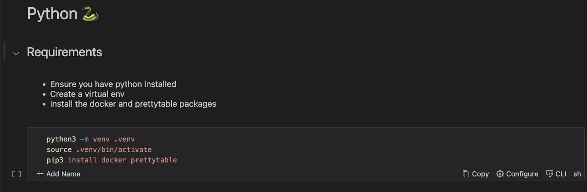

# How Intergrate Python Virtual Environment with Runme

Runme allows you to create Python environments natively in your Runme cell to enable you to save time while executing Python commands from your Markdown file.

A Python virtual environment is an isolated environment that allows you to install and manage dependencies for different projects separately.

This section will walk you through creating Python virtual environments in your Markdown file using Runme.

## How to Create a Python Virtual Environment

In this [example](https://github.com/stateful/vscode-runme/blob/main/examples/shebang.md#python-), we will create a virtual environment, activate it, and install packages of our choice into the virtual environment. To create a Python virtual environment in Runme, follow the steps below:

**Step 1**: Ensure the Runme extension is installed in your VS Code and make Runme your [default Markdown viewer](../how-runme-works/vscode#how-to-open-a-readme-file-as-a-markdown-file).

**Step 2**: Next, open your Markdown file.

**Step 3**: Enter the command below in your Runme cell.

```sh
python3 -m venv .venv
source.venv/bin/activate
pip3 install docker prettyatble 
```



The command above creates a new Python virtual environment named .venv in the current directory, activates the virtual environment, and installs Python packages docker and prettytable using the pip package manager. (Feel free to install any package of your choice).

**Step Four**: Run your command to execute it in your Runme cell. The output will be returned to the Runme terminal.

Now you have all the requirements ready, you can run your Python scripts to perform the actions you want within your Markdown file.
Python virtual environments ensure that projects remain self-contained, reproducible, and free from interference with other projects or the system-wide Python installation.
