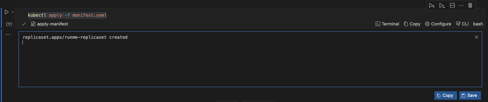
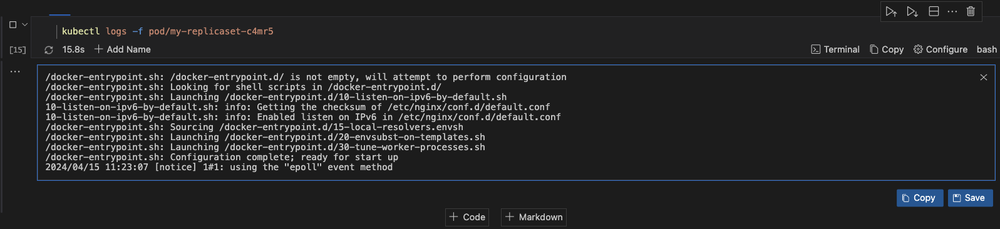
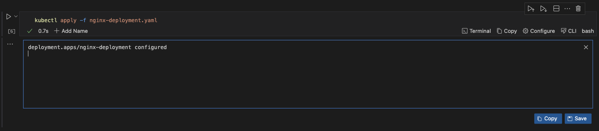
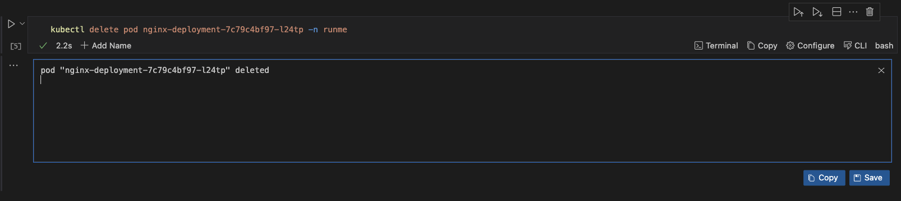
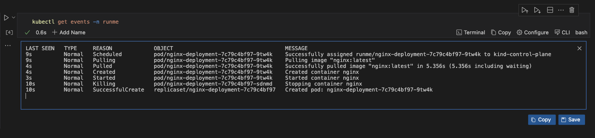
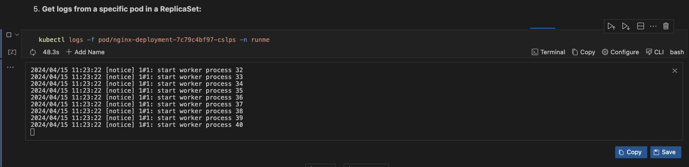

---
runme:
  id: 01HX525D9GDAKP0662NXT98NWK
  version: v3
---

# How to Optimize Kubernetes Replicaset Using Runme

Runme provides a platform that allows you to create standardized procedures for configuring, deploying, and managing your everyday operational tools and resources.

Working with essential components like [ReplicaSets](https://kubernetes.io/docs/concepts/workloads/controllers/replicaset/) ensures that operations are consistent across different environments. With Runme, you can optimize these operations right within your Markdown file!

This guide will show you a step-by-step guide to configure and deploy your Kubernetes ReplicaSets within your Runme Notebook.

## Prerequisites

To follow up on this tutorial, ensure you have the following:

- **Runme Extension**: Install the [Runme extension](https://marketplace.visualstudio.com/items?itemName=stateful.runme) in your VS Code editor and make it your [default Markdown viewer](https://docs.runme.dev/installation/installrunme#how-to-set-vs-code-as-your-default-markdown-viewer). Runme also provides other client interfaces where you can run your Markdown file. See the [Runme installation](../installation/index.md) guide.
- **Clone Repository**: We have provided an example repository to help you follow this tutorial. Clone the [Repository here](https://github.com/stateful/blog-examples/tree/main/kubernetes/replicaset).

```sh {"id":"01HYB7KWWEWVTF00NN5CDCZA3V"}
git clone https://github.com/stateful/blog-examples.git
cd kubernetes/replicaset
```

- **Require Packages**: Install the required packages (brew, kind, and kubectl) inside your Markdown file. ***Runme allows you to achieve this! Simply run the command below***

```sh {"id":"01HYB7SNYNJWQAX143R6PZAVW9"}
/bin/bash -c "$(curl -fsSL https://raw.githubusercontent.com/Homebrew/install/HEAD/install.sh)"
brew install kind
brew install kubectl
```

To get started, we have already [created a ReplicaSet](https://github.com/stateful/blog-examples/blob/main/kubernetes/replicaset/manifest.yaml) using a YAML configuration file. Here, we will demonstrate how you can manage the deployment of the Replicaset with Kubernetes. Before we deploy the ReplicaSet to Kubernetes, let us apply the functionalities to this file within your Runme cell.

## Configure your ReplicaSet for deployment in Runme

**Apply ReplicaSet Configurations in Runme**

You can easily apply ReplicaSet configurations in your Markdown file with Runme. To do this, run the command below. This command instructs Kubernetes to create and update the resources specified in the YAML file.

```sh {"id":"01HYB7TTXYQ3XW5X9XQ842PG4B"}
kubectl apply -f manifest.yaml
```

When this command is successfully executed in Runme, this is the output.



With this command, you can create the resources for ReplicaSets based on the definitions provided in the file.

With this command, you can create the resources for ReplicaSets based on the definitions provided in the file. However, if your manifest.yaml file does not exist in the same directory as your Markdown file, you can use [Runme’s cell working directory feature](../configuration/cell-level#cells-current-working-directory) to set its directory.

**Get Information About ReplicaSets**

In your Runme notebook, you can retrieve information about your ReplicaSets. This is crucial for monitoring, troubleshooting, and managing your applications running on the cluster.

If you want to get information about your ReplicaSet, run the command below:

```sh {"id":"01HYB7XM9JZ0G86T8ZGJJGFZCN"}
kubectl get replicaset
```

However, if you want to get information about a specific ReplicaSet, run the command below:

```sh {"id":"01HYB7Y71EHW34WVFPWQHQQSB8"}
kubectl describe replicaset my-replicaset
```

When these commands are executed successfully, these are the output.


**Scale the Number of Replicas in a ReplicaSet**

The command below will help you modify the desired number of replicas for the specified ReplicaSet, instructing Kubernetes to create or terminate pods until the desired number is achieved.

To scale up the number of replicas in a ReplicaSet, run the command below

```sh {"id":"01HYB7ZRN70A857X8YRACN4063"}
kubectl scale replicaset my-replicaset --replicas=4
```

To scale down the number of replicas in a ReplicaSet, run the command below:

```sh {"id":"01HYB80ATVSWXFT5DNNH2X6GE3"}
kubectl scale replicaset my-replicaset --replicas=2
```

Remember to change the numbering to the one of your choice. When the command is executed, Runme displays a confirmation message indicating that the ReplicaSet has been scaled just like the image below.


**Get Logs From a Specific Pod in a ReplicaSet**

To follow the logs of a specific pod in real time, run the command below

```sh {"id":"01HYB854RRH31D1TFMXG2YKK86"}
kubuectl get pod
```

```sh {"id":"01HYB82SF00CMC3ZCBRNWTMFEP"}
kubectl logs -f pod/my-replicaset-c4mr5
```

Replace `my-replicaset-c4mr5` with the name of your pod.

When this command is executed, Runme returns logs about the specific Pod. This information can be used to debug or troubleshoot a pod.



When this command is executed, Runme returns logs about the specific pod. This information can be used to debug or troubleshoot a pod. As provided in the image above

**Delete a ReplicaSet**

You can choose to delete a ReplicaSet along with the pods it manages or delete all ReplicaSets within a specified namespace along with their managed pods.

To delete a ReplicaSet with the pods, run the command below

```bash {"id":"01HYB87SSD1X7PPT5QHQRNJYD3"}
kubectl delete replicaset your-replicaset-name
```

To delete all ReplicaSet within a specified namespace, run the command below

```bash {"id":"01HYB87SSD1X7PPT5QHV960020"}
kubectl delete replicaset --all -n <your-namespace>

```

 **View ReplicaSet events**

You can view events within your ReplicaSet. This is useful for diagnosing and debugging issues with your ReplicaSet and its associated pods.

To view events related to a specific ReplicaSet, run the command below:

```bash {"id":"01HYB87SSD1X7PPT5QHWTP8X38"}
kubectl get events --field-selector involvedObject.name=my-replicaset -n runme
```

To view events from a specific pod, run the command below

```bash {"id":"01HYB87SSD1X7PPT5QHXXC7B85"}
 kubectl logs -f pod/my-replicaset-c4mr5
```

Be sure to change `my-replicaset-c4mr5` to your pod’s name.

## How to Manage ReplicaSets Using a Deployment in Runme

By using a deployment, you delegate the management of ReplicaSets to Kubernetes. The deployment provides a declarative update to Pods and many other useful features. Among the features deployed, Replicaset ensures that a specified number of pod replicas run at any given time. With Runme, you can write and execute all these processes in your Markdown file.

This section will walk you through the step-by-step process of managing ReplicaSets using a Deployment in Runme.

**Step One: Deploy your application with Runme**

You need to create a manifest file to deploy your application to your Kubernetes cluster. For the tutorial, we will be deploying an [NGINX web server application](https://github.com/stateful/blog-examples/blob/main/kubernetes/replicaset/nginx-deployment.yaml). This Kubernetes manifest deploys our NGINX application into the "runme" namespace and specifies that it should manage a set of 5 identical Pods running the NGINX web server.

**Step Two: Update the Manifest File**

If you have scaled the number of pods in your cluster up or down and want this reflected in your manifest file, you need to update it. To do this, you need to update your deployment file to the specific number of pods you want running and reapply your Deployment file.

In your Runme Cell, run the command below.

```bash {"id":"01HYB8DKPD9NPRQPD6PTKKRZYS"}
kubectl apply -f nginx-deployment.yaml
```



This will update your deployment with the defined ReplicaSet.

**Step Three: Delete a Pod**

ReplicaSet ensures that the specified number of identical pods are running at all times. If a pod is deleted, ReplicaSet automatically creates a replacement pod to maintain the desired replica count. To delete a pod, run the command below in your Runme cell, and you will see an output identical to the one generated in the image.

```bash {"id":"01HYB8EWMMG8G6W9HAGK0AFVEW"}
kubectl delete pod nginx-deployment-7c79c4bf97-l24tp -n runme
```



**Step Four: View Kubernetes Events in your Runme terminal**

In Kubernetes, events are records of various occurrences and state changes within your cluster. By leveraging Runme, you can easily view events of your ReplicaSets right in your Markdown file. To view events in your ReplicaSet, run the command below.

```bash {"id":"01HYB8FTE24C93YVCJP4X7ZV6G"}
kubectl get events -n runme
```



**Step Five: Get Logs From a Specific Pod in the ReplicaSet**

You can get logs from a specific pod in your ReplicaSet. To get logs from a specific pod in the ReplicaSet, run the command below

```bash {"id":"01HYB8GQSV6JTQ8RPGP8H5M75F"}
kubectl logs -f pod/nginx-deployment-7c79c4bf97-cslps -n runme
```



This command can be useful for troubleshooting issues or monitoring the activity of a specific pod within your Kubernetes cluster.

We have successfully explored how to manage your ReplicaSets right in your Markdown file with Runme. There are other examples of how you can use Runme to handle your automation tasks and ensure standardized procedures for routine tasks. Explore the [guide page](https://docs.runme.dev/guide/) for other integration examples.
