---
runme:
  id: 01J4PEEDGDB2XNDVEMT2A5NAY9
  version: v3
---

# Setup Cloud Native Mesh with Runme

Runme interactive notebook is designed to help you execute and document your daily automation tasks.

With Runme, you can run your code and commands directly within the notebook, which makes it easy to manage and improve your workflow.

In this guide, we will focus on integrating Istio, a powerful service mesh, into your Markdown files using Runme. Istio helps you manage and secure your microservices.

By the end of this guide, you'll be able to use Runme to efficiently set up and manage Istio in your projects.

## Prerequisite

To follow up on this tutorial, ensure you have the following:

**Runme Extension:** Install the [Runme extension](https://marketplace.visualstudio.com/items?itemName=stateful.runme) in your VS Code editor and set it as your [default Markdown viewer](../installation/installrunme#how-to-set-vs-code-as-your-default-markdown-viewer).

**Required Packages:** Install the required packages (kind, kubectl, helm) in your Markdown file. Runme allows you to achieve this! Simply run the command below.

```sh {"id":"01J4PEEDESRWQG8MDQNJATK6CD"}
/bin/bash -c "$(curl -fsSL https://raw.githubusercontent.com/Homebrew/install/HEAD/install.sh)"
brew install git
brew install kind
brew install docker
brew install yq
```

The command above installs `brew` and `git,` and creates a local Kubernetes Cluster using [kind](https://kind.sigs.k8s.io/)

💡 For your kind cluster to run, you need to have docker running.

### Install Istio CLI[](https://docs-runme-q3n6krjle-stateful.vercel.app/guide/servicemesh#install-istio-cli)

Download the Istio release and install the Istio CLI.

```sh {"id":"01J4PEEDESRWQG8MDQNJSC7MKC"}
curl -L https://istio.io/downloadIstio | sh -
```

Replace `<version>` with the version of Istio you downloaded

```bash {"id":"01J4PEEDESRWQG8MDQNP2ZR7GT"}
cd istio-<version>
export PATH=$PWD/bin:$PATH
```

[](https://docs-runme-q3n6krjle-stateful.vercel.app/guide/servicemesh#install-istio-on-kubernetes)

## **Setting Up Your Cluster**[](https://docs-runme-q3n6krjle-stateful.vercel.app/guide/argocd-cli#setting-up-your-cluster)

To proceed with this tutorial, you are required to set up your Kubernetes cluster. This is an important step as it ensures that service mesh can manage your microservices application.

The first step in setting up your cluster is to check if any already exist and delete it. To do that, run the command below.

```sh {"id":"01J4PEEDESRWQG8MDQNS02C6P7"}
kind delete cluster --name helm-runme
```

Next, use `kind` to create a Kubernetes cluster locally. For this tutorial, the name of the Kubernetes cluster will be `runme-mesh`. To create this, run the command below.

```sh {"id":"01J4PEEDESRWQG8MDQNW1X253G"}
kind create cluster --name runme-mesh
```

After creating a cluster, the next step is to inspect the cluster to ensure it is running and healthy. To do this, run the command below.

```bash {"id":"01J4PEEDESRWQG8MDQNWSHS5GR"}
kubectl cluster-info — context kind-runme-mesh
```

If you would like to inspect namespaces, execute the command below

```sh {"id":"01J4PEEDESRWQG8MDQNX1WZK7H"}
kubectl get ns
```

To create a new namespace, execute the command below

```sh {"id":"01J4PEEDESRWQG8MDQP0BDS8KF"}
kubectl create namespace mesh
```

## Install Istio on Kubernetes[](https://docs-runme-q3n6krjle-stateful.vercel.app/guide/servicemesh#install-istio-on-kubernetes)

After successfully setting up your cluster, the next step is to install Istio on Kubernetes.

You can use the `istioctl` command to install Istio. There are different profiles available, but for this tutorial we are using `demo` .

```sh {"id":"01J4PEEDF0XKGE0V7CVGZRR1D9"}
istioctl install --set profile=demo
```

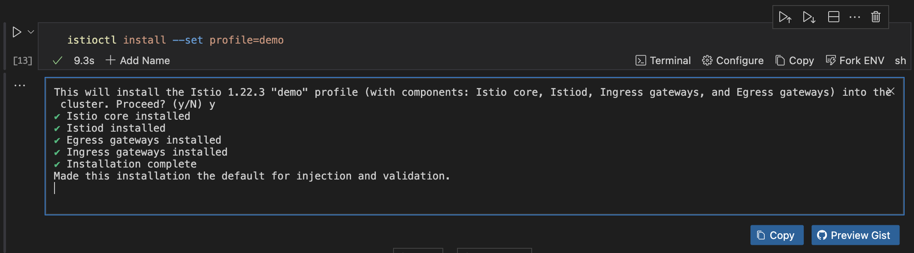

To verify the installation of Istio, run the command below:

```sh {"id":"01J4PEEDF0XKGE0V7CVH44SZW3"}
istioctl verify-install
```

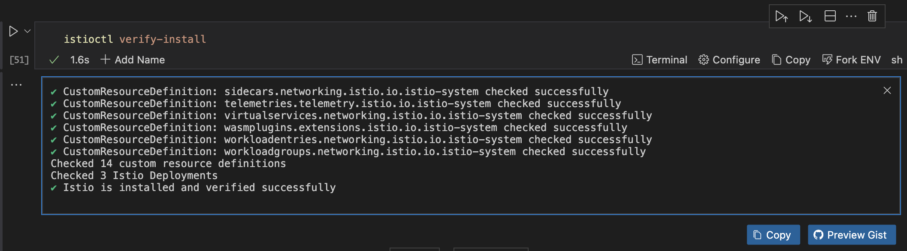

## Verify Istio Components[](https://docs-runme-q3n6krjle-stateful.vercel.app/guide/servicemesh#verify-installation)

Ensure all Istio components are running correctly.

```sh {"id":"01J4PEEDF0XKGE0V7CVKFXT5T9"}
kubectl get pods -n istio-system
```

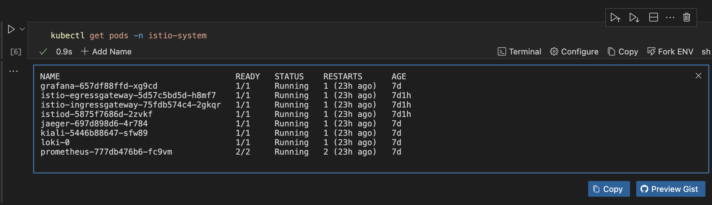

You should see pods for `istiod`, `istio-ingressgateway`, and other components.

## Label the Namespace for Istio Injection[](https://docs-runme-q3n6krjle-stateful.vercel.app/guide/servicemesh#label-the-namespace-for-istio-injection)

After complete verification of all Istio components, you need to label the namespaces where your application is deployed for automatic sidecar injection. Run the command below to achieve this.

```sh {"id":"01J4PEEDF1FY462R33GEC2BFTF"}
kubectl label namespace <your-namespace> istio-injection=enabled
```

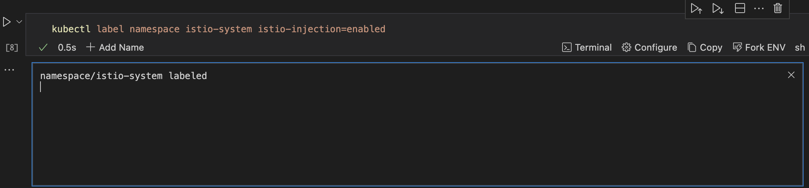

Be sure to replace `your-namespace` with the name of the namespace where Istio is running.

## Deploy Sample Application[](https://docs-runme-q3n6krjle-stateful.vercel.app/guide/servicemesh#deploy-sample-application)

In this section, we will deploy a sample application to verify that the service mesh is working as it should.

To achieve this, run the command below.

```sh {"cwd":"/Users/macbookpro/Desktop/docs.runme.dev/docs/guide/istio-1.22.3","id":"01J4PEEDF1FY462R33GEY55MBF"}
kubectl apply -f samples/bookinfo/platform/kube/bookinfo.yaml
```

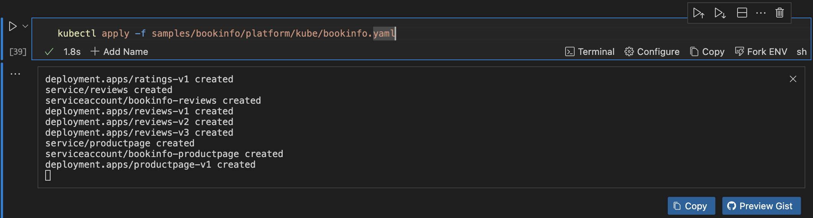

Using the [Runme cwd feature](https://docs.runme.dev/configuration/cell-level#cells-current-working-directory), you can confidently set your code cell block to the path where `samples/bookinfo/platform/kube/bookinfo.yaml` is located on your local machine (the sample folder is inside of `istio-<version>` that you downloaded earlier).

## Expose the Application[](https://docs-runme-q3n6krjle-stateful.vercel.app/guide/servicemesh#expose-the-application)

After deploying your sample application, the next step is to expose the application using the Istio ingress gateway. Run the command below to do this.

```sh {"cwd":"/Users/macbookpro/Desktop/docs.runme.dev/docs/guide/istio-1.22.3","id":"01J4PEEDF8SEA5G3AMWACZD0YS"}
kubectl apply -f samples/bookinfo/networking/bookinfo-gateway.yaml
```

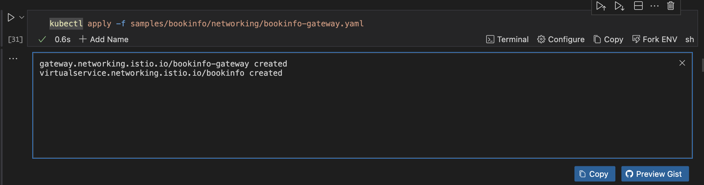

[Runme cwd feature](https://docs.runme.dev/configuration/cell-level#cells-current-working-directory) here to set your code cell block to the path where `samples/bookinfo/platform/kube/bookinfo.yaml` is located (the sample folder is inside of `istio-<version>` that you downloaded earlier).

## Verify the Application[](https://docs-runme-q3n6krjle-stateful.vercel.app/guide/servicemesh#verify-the-application)

To verify the application and check the ingress IP and port, run the command below.

```sh {"id":"01J4PEEDF8SEA5G3AMWCJ2XXV4"}
kubectl get svc istio-ingressgateway -n istio-system
```

If you would want to analyze the entire cluster, run the command below.

```sh {"id":"01J4PEEDF8SEA5G3AMWEXW4RE4"}
  istioctl analyze
```

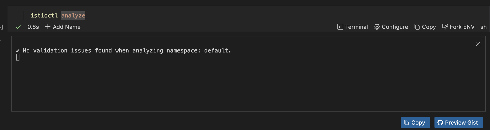

[](https://docs-runme-q3n6krjle-stateful.vercel.app/guide/servicemesh#additional-configuration)

## Traffic Management[](https://docs-runme-q3n6krjle-stateful.vercel.app/guide/servicemesh#traffic-management)

Now the next step is to properly handle traffic management. To do this, you need to create a `VirtualService` that will define the routing rules. The example in this tutorial routes all traffic to the `reviews` service to version `v1`

To begin traffic management, first create a file named `runme-virtual-service-reviews-v1.yaml` by running the script below.

```sh {"id":"01J4PEEDF8SEA5G3AMWHRB0GRD"}
cat << EOF > runme-virtual-service-reviews-v1.yaml
apiVersion: networking.istio.io/v1alpha3
kind: VirtualService
metadata:
  name: reviews
spec:
  hosts:
  - reviews
  http:
  - route:
    - destination:
        host: reviews
        subset: v1
EOF
```

Next, run this command.

```bash {"id":"01J4PEEDF9Q8N8AGEJN7GJP4Q3"}
kubectl apply -f runme-virtual-service-reviews-v1.yaml
```

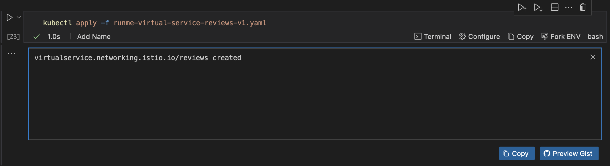

**Set Up Destination Rules**

After creating the file, you need to define the subsets for the `reviews` service. To do this, create a file named `destination-rule-reviews.yaml` that will contain the following configuration:

```bash {"id":"01J4PEEDF9Q8N8AGEJN9WCVVK5"}
cat << EOF > destination-rule-reviews.yaml
apiVersion: networking.istio.io/v1alpha3
kind: DestinationRule
metadata:
  name: reviews
spec:
  host: reviews
  subsets:
  - name: v1
    labels:
      version: v1
  - name: v2
    labels:
      version: v2
  - name: v3
    labels:
      version: v3

EOF
```

Now, apply the configuration by executing the command below:

```bash {"id":"01J4PEEDF9Q8N8AGEJN9Y2YM8W"}
kubectl apply -f destination-rule-reviews.yaml
```

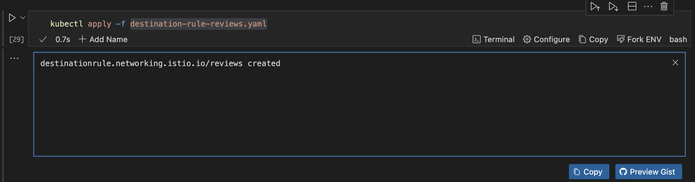

**Implementing Traffic Shifting**

You can gradually shift traffic between different versions of a service. For example, shifting 50% of the traffic to version `v2` and the other 50% to version `v3`.

To do this, create a file named `runme-virtual-service-reviews-shifting.yaml` and give it the following configurations:

```bash {"id":"01J4PEEDF9Q8N8AGEJNDQ56VW1"}
cat << EOF > runme-virtual-service-reviews-shifting.yaml
apiVersion: networking.istio.io/v1alpha3
kind: VirtualService
metadata:
  name: reviews
spec:
  hosts:
  - reviews
  http:
  - route:
    - destination:
        host: reviews
        subset: v2
      weight: 50
    - destination:
        host: reviews
        subset: v3
      weight: 50

EOF
```

Now, apply the configuration by executing the command below:

```bash {"id":"01J4PP654BB1MB30AVG1WTMAVX"}
kubectl apply -f runme-virtual-service-reviews-shifting.yaml
```

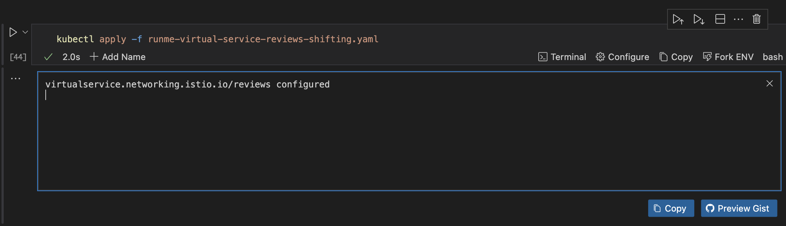

**Testing the Configuration**

Test the routing rules by accessing the application. To do this, you can utilize Runme’s environment variable prompt feature to use the external IP of the Istio Ingress Gateway:

```bash {"id":"01J4PEEDF9Q8N8AGEJNGSDZ2JM"}
export GATEWAY_URL=$(kubectl -n istio-system get service istio-ingressgateway -o jsonpath='{.status.loadBalancer.ingress[0].ip}')
curl http://$GATEWAY_URL/productpage
```

## Security[](https://docs-runme-q3n6krjle-stateful.vercel.app/guide/servicemesh#security)

To boost the application's security, we will enable strict mutual TLS mode in Istio. This mode secures service-to-service communication and provides authentication to protect sensitive data.

To do this, create a file named `peer-authentication.yaml` and give it the following configurations:

```sh {"cwd":"/Users/macbookpro/Desktop/docs.runme.dev/docs/guide/","id":"01J4PEEDFAA2PV3CBPY9YSS6NG"}
cat << EOF > peer-authentication.yaml
apiVersion: security.istio.io/v1beta1
kind: PeerAuthentication
metadata:
  name: default
  namespace: istio-system
spec:
  mtls:
    mode: STRICT
EOF
```

Apply the configuration:

```sh {"id":"01J4PFSYG20GTKE6PWCHFBE1DX"}
kubectl apply -f peer-authentication.yaml
```

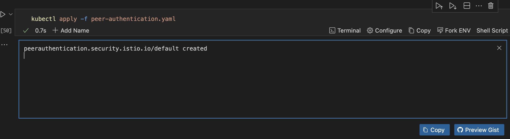

## Observability[](https://docs-runme-q3n6krjle-stateful.vercel.app/guide/servicemesh#observability)

To get a visual view of your application's progress, consider integrating with [Prometheus](../guide/monitoring-stack#configure-your-prometheus), [Grafana](../guide/monitoring-stack#install-grafana), and Jaeger for metrics, dashboards, and tracing.

Run this command to do that.

```bash {"cwd":"/Users/macbookpro/Desktop/docs.runme.dev/docs/guide/istio-1.22.3","id":"01J4PEEDFDRZG60BYR4ENM3SQ2"}
kubectl apply -f samples/addons
```

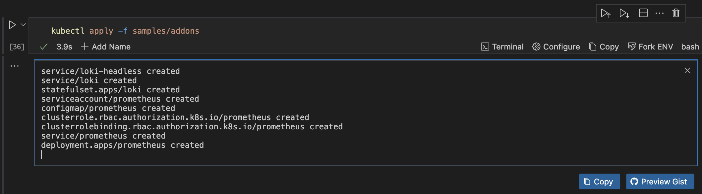

Using the [Runme cwd feature](../configuration/cell-level#cells-current-working-directory), you can confidently set your code cell block to the path where the samples folder is located on your local machine (the sample folder is inside of `istio-<version>` that you downloaded earlier).

## Cleanup[](https://docs-runme-q3n6krjle-stateful.vercel.app/guide/agrocd#cleanup)

After successfully deploying your application, you can clean up when you’re done. Here are some steps to achieve this:

**Step One:** If you used istioctl to install Istio, you can use it to uninstall

```sh {"id":"01J4PEEDFEHDVPZT0FEH5YP5K0"}
istioctl uninstall --purge -y
```

**Step Two:** If you installed Istio manually or prefer to do it manually

```sh {"id":"01J4PEEDFEHDVPZT0FEM3G8RST"}
kubectl -n mesh get pods
```

**Step Three:** Delete `istio-system` namespaces.

```sh {"id":"01J4PEEDFFV7N83E9CQ79CYJ7X"}
kubectl delete namespace istio-system
```

**Step Four:** Delete kind cluster.

```sh {"id":"01J4PEEDFFV7N83E9CQ7SQBX8T"}
kind delete cluster --name my-cluster
```

## Additional Resources

Some other guides you may want to explore:

[Deploying and Managing Applications with Runme and Argo CD](https://docs.runme.dev/guide/agrocd)

[Advanced Guide to Argo CD and Runme](https://docs.runme.dev/guide/argocd-cli)

[How to Setup a Monitoring Stack for Your Applications by Leveraging Runme](https://docs.runme.dev/guide/monitoring-stack)
