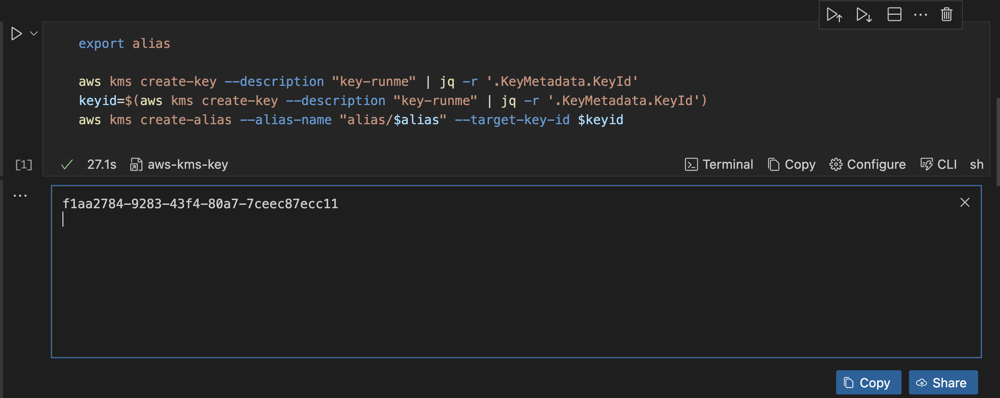
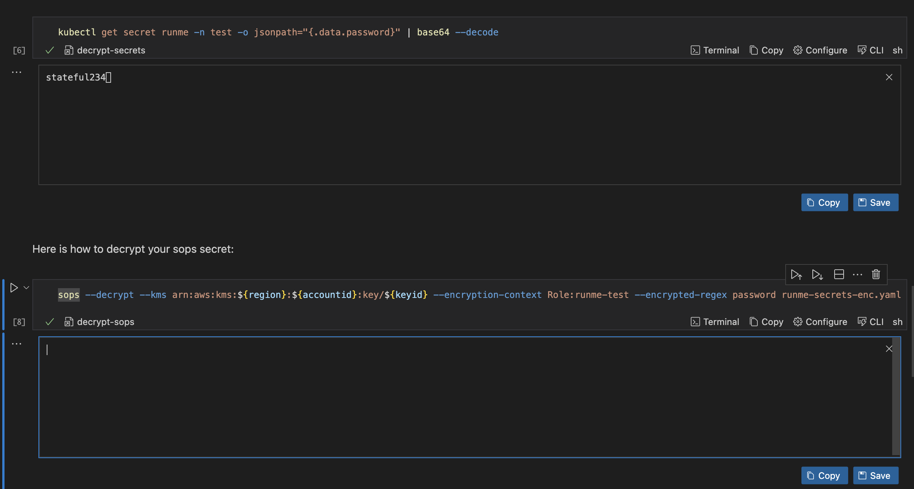
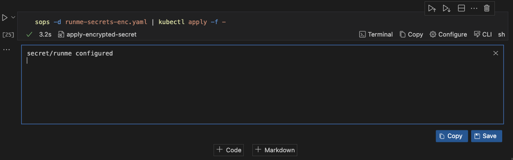

---
runme:
  id: 01HX525D9HYD6QHP138A69XKJ1
  version: v3
---

# How to Automate Kubernetes Secrets Encryption with SOPS and  Runme

Runme turns your documentation into interactive notebooks for operating cloud infrastructure. This cloud infrastructure includes Kubernetes, which is the combination of resources such as servers, cloud platforms, secrets, etc., that are supported in a Kubernetes environment.

For the purpose of this guide, we will focus on Kubernetes secrets using Secret Operations.

Secret Operations (SOPS) is a tool for managing and encrypting Kubernetes secrets and other sensitive data. It helps secure secrets stored in version control systems like Git by encrypting them using a key stored in a separate file. This way, secrets are never stored in plain text, even in version control.

In this guide, we will walk you through automating your [Kubernetes Secrets](https://kubernetes.io/docs/concepts/configuration/secret/) encryption with Runme to ensure your encryption and decryption processes are automated and properly documented to improve your secret management.

## **Prerequisites**[](https://docs-runme-55rq3q1vz-stateful.vercel.app/guide/k8s-secret#prerequisites)

To get started, ensure you have the following:

- **Clone the Repository**: We have created a notebook repository containing all the instructions and commands required for this guide. Ensure to [clone the repository](https://github.com/stateful/blog-examples/tree/main/kubernetes/k8s-secret).
- **Install Runme:** Install the [Runme extension on VS Code](https://marketplace.visualstudio.com/items?itemName=stateful.runme) and set Runme as your [default Markdown viewer.](https://docs.runme.dev/installation/installrunme#how-to-set-vs-code-as-your-default-markdown-viewer)
- **Require Packages**: Install the required packages (brew, kind, and kubectl) inside your Markdown file. *Runme allows you to achieve this! Simply run the command in the [prerequisite section](https://github.com/stateful/blog-examples/blob/main/kubernetes/replicaset/replicaset-mac.md#prerequisites) of the repository.*

This guide will focus on using the Mac specifications. If you use a Linux OS, follow the instructions in the [Linux Markdown files](https://github.com/stateful/blog-examples/blob/main/kubernetes/k8s-secret/sops/sops-linux.md).

## **Securing Secrets with SOPS**[](https://docs-runme-55rq3q1vz-stateful.vercel.app/guide/k8s-secret#securing-secrets-with-sops)

To encrypt your Kubernetes secrets using SOPS, you need an advanced security measure, access to a cloud provider, and a Key Management Service (KMS). For this guide, we will use an [AWS KMS key](https://docs.aws.amazon.com/kms/latest/developerguide/concepts.html#kms_keys).

Navigate to the [SOPS file](https://github.com/stateful/blog-examples/tree/main/kubernetes/k8s-secret/sops) in the repository you cloned earlier and open the Markdown file based on the specifications of your operating system to follow up on this section of the guide.

### **Installation of SOPS**[](https://docs-runme-55rq3q1vz-stateful.vercel.app/guide/k8s-secret#installation-of-sops)

Run the command within your Runme cell to install `kind`, `kubectl`, `sops`, and `awscli`

<video autoPlay loop muted playsInline controls>
  <source src="/videos/runme-sops.mp4" type="video/mp4" />
  <source src="/videos/runme-sops.webm" type="video/webm" />
</video>

Finally, configure the installed AWS CLI in your Runme Terminal.

### **Create a KMS Key within your Runme Cell**[](https://docs-runme-55rq3q1vz-stateful.vercel.app/guide/k8s-secret#create-a-kms-key)

To encrypt and decrypt your secrets, you need a KMS key. As earlier mentioned, we will use the AWS KMS key to carry out this action. Create a cell for this section and run the command in your Markdown file in your cell.



This command will prompt you to input a value for `alias` and create a KMS key. It will filter the output only to show the key ID and turn it into an environment variable called `keyid`. Once you run this command, you will get an output similar to the one in the image above.

You can also save this output to the Runme cloud for future use with the [Runme auto-save](https://docs.runme.dev/configuration/auto-save) feature.

### **Configure SOPS in Runme** [](https://docs-runme-55rq3q1vz-stateful.vercel.app/guide/k8s-secret#configure-sops)

To configure your SOPS, specify how to encrypt your secrets, and then define the encryption keys. To do this, navigate to the section on SOPS configuration and run the command in your Markdown file using Runme.


Once this is executed, it returns the configuration of your sops.yaml file to ensure that it is correct.

### **Encrypt Your Secrets**[](https://docs-runme-55rq3q1vz-stateful.vercel.app/guide/k8s-secret#encrypt-your-secrets)

To encrypt your secret, ensure you have the following information set:

- Your environment variables
- Your manifest `runme-secrets.yaml` file containing your secrets. If you have not done this, create one using the following YAML manifest in [our repository ](https://github.com/stateful/blog-examples/blob/main/kubernetes/k8s-secret/sops/runme-secrets.yaml).
- Click the **execute cell** button.


Now, we have successfully encrypted your secrets within `runme-secrets.yaml`. Runme automatically transfers your information to `run me-secrets-enc.yaml`.

### **Decrypt Your Secrets within the Runme cell.**[](https://docs-runme-55rq3q1vz-stateful.vercel.app/guide/k8s-secret#decrypt-your-secrets)

Similar to the encryption process, Runme lets you decrypt your encrypted security in your Markdown file. This will ensure that every process is properly automated.

To decrypt your secrets, navigate to the “Decrypt Secrets” section in the repository and run the command in your Markdown file with Runme.

```sh
sops --decrypt --kms arn:aws:kms:${region}:${accountid}:key/${keyid} --encryption-context Role:runme-test --encrypted-regex password runme-secrets-enc.yaml > runme-secrets.yaml
```



When you decrypt the secret, it moves the decrypted secrets from a SOPS-encrypted secret `runtime-secrets-enc.yaml` into the original version before it was encrypted `runme-secrets.yaml`

### **Apply Encrypted Secret**[](https://docs-runme-55rq3q1vz-stateful.vercel.app/guide/k8s-secret#apply-encrypted-secret)

To apply the encrypted secrets in your `runme-secrets-enc.yaml` file, run the command below.

```sh
sops -d runme-secrets-enc.yaml | kubectl apply -f -
```



This runs the `runme-secrets-enc.yaml` file decrypts it and then applies the file.

## **Improved Documentation Experience with Runme Notebook**[](https://docs-runme-55rq3q1vz-stateful.vercel.app/guide/k8s-secret#improve-documentation-experience-with-runme-notebook)

We successfully encrypted our Kubernetes secrets inside our Markdown file. Runme makes your automation process easy with its features.

One of the useful features within the notebook environment is the [environment variable prompt](https://docs-runme-ckcd767be-stateful.vercel.app/getting-started/features#environment-variable-prompts). It allows users to input values directly and reuse them whenever needed.

Runme's [Autosave](https://docs.runme.dev/configuration/auto-save) feature automatically tracks all changes and activities without manual intervention.

To learn more about Runme and explore its features, visit the [Runme Documentation](https://docs.runme.dev/) to begin your journey to automating your operations processes.
