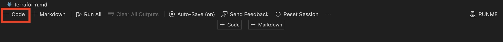
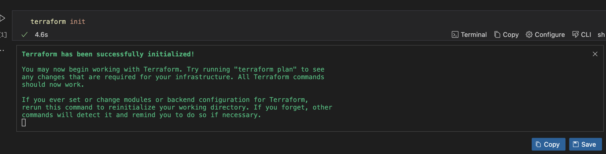
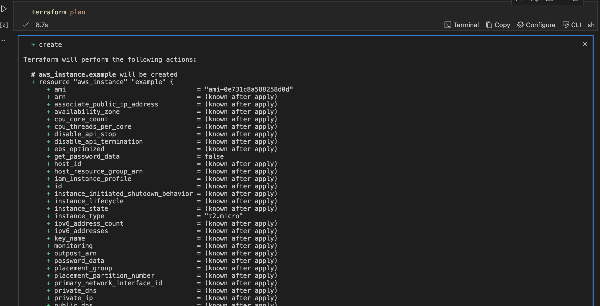
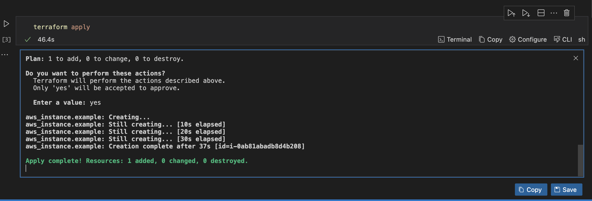
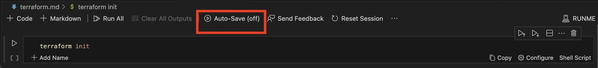
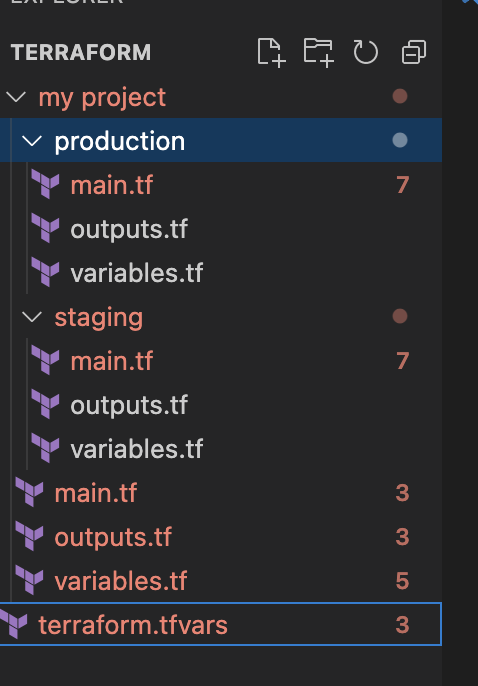

# Infrastructure Automation With Terraform Using Runme

As a cloud infrastructure engineer imagine you are responsible for managing the infrastructure of a web application that runs in multiple environments this includes, development, staging, and production. This infrastructure is defined using Terraform. However, you are faced with a specific configuration challenge where each environment has specific configuration requirements in addition your team needs visibility during the application deployment process.

***This is where Runme comes in!***

Runme provides you with an interactive runbook where you can easily complete step-by-step instructions, execute runnable stables for operational docs, and through saved provide visibility to other team members.

In this guide, we will help you understand how to set Terraform to create an EC2 instance on AWS and run this instance using Runme

Before we proceed, there are a few requirements needed to get started

## **Prerequisites**

1. **Cloud Provider**

   For this guide, we will be using Amazon Web Services (AWS) as our cloud provider. Ensure you have an AWS account, with an account you will be able to access the AWS key credentials which will be used subsequently.

2. **Terraform Installation**

   Install Terraform on your local machine. You can download the latest version from the [official Terraform website.](https://developer.hashicorp.com/terraform/tutorials/aws-get-started/install-cli)

3. **Runme Installation**

   To get Runme available on your local machine or server, you are required to install the Runme. Runme has various client interfaces with which you can use Runme, this includes; [VS Code editor](../installation/installrunme.md), [CLI](../installation/runmecli.md), and [web app](../how-runme-works/web.md). In this guide, we will use Runme for VS Code editor using the [Runme Notebook extension](../how-runme-works/vscode.md).

## **Setting Up Terraform for EC2 Instance**

1. **Create a Project Directory:**

   Begin by creating a new directory for your Terraform project and navigate to the directory in your terminal.

```sh {"id":"01HPPVN521NV378FM42N6FA9B8"}
mkdir terraform-ec2-instance
cd terraform-ec2-instance
```

Next, create a new file named main.tf in your project directory. This file will contain the Terraform configuration for your EC2 instance.

```sh {"id":"01HPPVN521WAPSS4TR5EX0JZM0"}
provider "aws" {
  region = "us-east-1"  # Replace with your desired AWS region
}

resource "aws_instance" "example" {
  ami           = "ami-0e731c8a588258d0d"  # Amazon Linux 2 AMI ID
  instance_type = "t2.micro"
}
```

In the code snippet above, we set the AWS region,

- We set the AWS region (you can replace the region with your desired region).
- Next, define the the Aws EC2 instance, example using the ”aws_instance”.
- Specify the ami (Amazone Machine Image) ID for the instance.
- Lastly, the instance_type to t2.micro” to indicate the instance a micro-sized instance.

## **Run your file with Runme**

In this section of the guide, we will creating a runbook with Runme which will be used to run the project.

Runme has amazing functionalities that not only allows  you run your commands within your markdown file but also saves the output in a separate file through a feature knwn as session output.
Through this you are not only running your command but your output is saved for future reference.

**Initialize Terraform**

To begin, first create a `.md` file within your project directory. With Runme installed, every markdown (`.md`) file created in your code editor will ipen with Markdown. Alteratieky you can set Runme as your [editor markdown viewer](../installation/installrunme#how-to-set-vs-code-as-your-default-markdown-viewer).

In your markdown file, creating a code block to execute your command.



Add your code to initialize Terraform

```sh {"id":"01HPPVN521G7D9D2TP25XQWKPQ"}
terraform init
```

Run the above  command to initialize your Terraform configuration



This command initializes your working directory and downloads the necessary providers.

**Review and Apply**

Before applying the changes, you can review the execution plan to ensure everything looks correct:

```sh {"id":"01HPPVN5219N10HWNKZXN1Y84A"}
terraform plan
```

You should get a similar output:



Once this is thoroughly checked for errors or misconfiguration, you can apply the changes to create the EC2 instance.

```sh {"id":"01HPPVN521WJGE2J9H910RNXNP"}
terraform apply
```

Output:



Terraform will prompt you to confirm the changes. Type `yes` and press Enter. Once the apply process is complete, you can go to the AWS Management Console to verify that your EC2 instance has been created.

## **Save Output**

Runme allows you to save your output throughout your deployment process.  Whether it's running code or markdown, you can keep track of every activity that has taken place throughout your deployment process by saving the output
This saved output is automatically stored in a new file which is created by default, so you can easily reference it at any time.
To use this feature, just toggle the "Autosave" option at the top of your code editor in your markdown file to turn “on” or “off”. It's that simple!



Alternatively you set the Auto-save as default. This will ensure that autosave is always on and your outputs are automatically saved. See the [Auto-save](../configuration/auto-save.md) feature for more information.

**Cleaning Up**

If you want to destroy the resources created by Terraform, you can run:

```sh {"id":"01HPPVN521T99NSTVPRQAJHE36"}
terraform destroy
```

This command will prompt you to confirm the destruction of resources. Type `yes` to proceed.

## **Terraform Workspaces**

Within your code cell you can set the directory structure of where you want your executable command to be initiated from



- Create workspace for production and staging:

```sh {"id":"01HPPVN521ZCD3HX1SGCR7544X"}
#production
terraform workspace new production
```

Set your block to run from your `production` directory

```sh {"id":"01HPPVN5212VTQBJWMYWXX3NWE"}
#staging
terraform workspace new staging
```

Set your block to run from your `staging` directory

- Select between workspaces:

```sh {"id":"01HPPVN5219P79KAJ0ANQMRECT"}
#production
terraform workspace select production
```

or

```sh {"id":"01HPPVN52141RSC7WD2M6JZ323"}
#Staging

terraform workspace select staging
```

Lastly based on your preferred workspace, execute the command by applying the terraform configuration t0 modify the infrastructure in the environment of your choice.

For example, in production, run the command below:

```sh {"id":"01HPPVN521RJ1ZVZVVYGTYNNGJ"}
# For production
terraform workspace select production
terraform apply -var-file=terraform.tfvars
```

```sh {"id":"01HPPVN521FKVYQWW8Y3GME5JV"}
# For staging
terraform workspace select production
terraform apply -var-file=terraform.tfvars
```

This will allow for the separation of configurations for different environments, making it easier to manage and apply changes to infrastructure in distinct contexts, such as development, testing, and production.

## **Conclusion**

Using Runme with Terraform helps you to create an operational workflow that integrates Terraform commands within Runme’s automated runbook. ​​In this guide, we walked through running a Terraform within a Runme Notebook in our VS Code editor. We covered how you can run your EC2 instance with Runme, review and apply your changes, set directory commands for each workspace, and save your output for future reference.
We hope this tutorial was of help to you.
Wish you a smooth operation!

