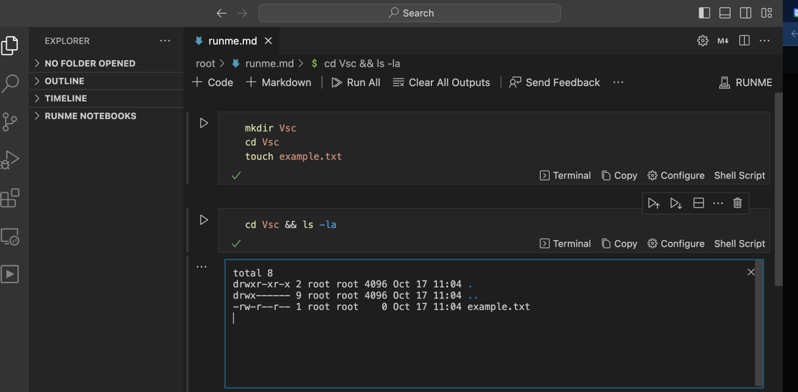
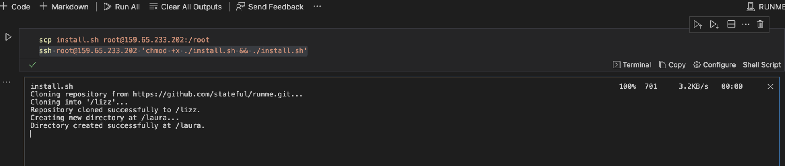

---
runme:
  id: 01HX525D9JDANSP0J2F8K8PXG9
  version: v3
sidebar_position: 3
---

# Runme for VS Code SSH & Remote

Runme enables you to execute codes and commands inside your Markdown file without switching tabs. It integrates easily with [VS Code SSH](https://code.visualstudio.com/docs/remote/ssh) and allows users to connect to remote instances effortlessly. This integration allows for easy execution of specific instructions directly in Markdown files, streamlining workflows and boosting productivity.

<<<<<<< Updated upstream:docs/how-runme-works/runme-via-ssh.md
In this section, we will explore the various ways you can utilize Runme with VS Code SSH.
=======
To follow the instructions on this page, ensure you have installed Runme on your [VS Code](/installation/vscode) or [CLI](/installation/cli). Also, ensure you have access to the remote server you need.
>>>>>>> Stashed changes:docs/getting-started/vscode-ssh.md

To follow up on the instructions on this page, ensure you have installed Runme on your [VS Code](https://docs.runme.dev/installation/installrunme) or [CLI](https://docs.runme.dev/installation/runmecli). Also, ensure you have access to the remote server you need.

## **VS Code Remote Development**

Runme leverages the [Remote Development extension](https://marketplace.visualstudio.com/items?itemName=ms-vscode-remote.vscode-remote-extensionpack) provided by VS Code to enable you to attach remote SSH hosts to your local VS Code environment. This makes task execution easier and enhances productivity by simplifying development processes, minimizing the need for manual commands, and automating repetitive tasks, saving time and reducing the likelihood of errors.

This approach also optimizes performance by ensuring consistent and reliable script and process execution, thus improving the development workflow.

> 💡 Note: Runme harnesses VS Code's [Remote Development](https://marketplace.visualstudio.com/items?itemName=ms-vscode-remote.vscode-remote-extensionpack) extensions to attach VS Code to remote SSH hosts.

### How to Set up SSH Connection in VS Code

To set up your SSH key configuration, follow the steps below:

1. [Generate an SSH key](https://docs.github.com/en/authentication/connecting-to-github-with-ssh/adding-a-new-ssh-key-to-your-github-account) if you haven't already.
2. Identify the remote host you want to connect to and make sure you have the necessary login credentials.
3. Ensure that you have [Visual Studio Code](https://code.visualstudio.com/download) installed on your local machine.
4. Install the [Runme extension](https://marketplace.visualstudio.com/items?itemName=stateful.runme) in Visual Studio Code.
5. Use the [Visual Studio Code Remote - SSH](https://code.visualstudio.com/docs/remote/ssh) extension to connect to the remote host via SSH.

<video autoPlay loop muted playsInline controls>
  <source src="/videos/ssh-into-server.mp4" type="video/mp4" />
  <source src="/videos/runme-illustration.webm" type="video/webm" />
</video>

6. Install the [Runme extension](https://marketplace.visualstudio.com/items?itemName=stateful.runme) on the remote server and leverage the notebook UX to execute what you want.

<video autoPlay loop muted playsInline controls>
  <source src="/videos/install-runme-on-server.mp4" type="video/mp4" />
  <source src="/videos/install-runme-on-server.webm" type="video/webm" />
</video>

7. Create a block of code called `command` to execute the desired actions on the remote host.

### Example: how to use Runme attached to SSH host

```sh {"id":"01HPQBHPSYHSX2F6SFBE7RCNT4"}
mkdir Vsc
cd Vsc
touch example.txt
```



## **Key-Based Authentication**

To enhance security when using Runme, it is recommended that [SSH keys](https://docs.github.com/en/authentication/connecting-to-github-with-ssh/adding-a-new-ssh-key-to-your-github-account) be used for authentication. This eliminates the need for password transmission and reduces the risk of brute-force attacks.

To execute commands on a remote server using Runme, follow these steps:

1. **Set up your SSH key configuration**

Set up your SSH key configuration by following the instructions [here](https://docs.github.com/en/authentication/connecting-to-github-with-ssh/adding-a-new-ssh-key-to-your-github-account).

2. **Set Up the Remote Server**

Ensure you can access the remote server and the necessary permissions to execute commands.

3. **Create a Markdown File**

Create a `.md` file to connect to the remote server and execute the desired commands.

4. **Create a Block of Code**

In the .md file, create a block of code that uses the SSH command to connect to the remote server and execute the desired command.

```sh {"id":"01HPQBHPSY79T1NSR3P7E27BER"}
ssh user@remote.server.com 'bash -s' < script.sh
```

This command will run a bash script called `script.sh` on the remote server. Make sure to replace `user` and `remote.server.com` with your own username and the server's hostname or IP address.

By following these steps and using SSH keys for authentication, you can enhance the security of your Runme commands and reduce the risk of unauthorized access or attacks.

5. **Execute the Runme command**

To execute your command, run the command below

```sh {"id":"01HPQBHPSYNE6C9RPE3KXC51P7"}
# short for "runme tui" is
runme
```

6. **Running Multiple Markdown files**

Select the Markdown file `.md` you want to execute (if you have multiple `.md` files or different codeblocks and instruction in a `.md`)


### How to SSH into Remote Hosts From a Notebook

If you need to securely copy files from your local machine to a remote server, you can install Secure Copy Files [SCP](https://www.geeksforgeeks.org/scp-command-in-linux-with-examples/) on your machine. SCP encrypts data during transmission, protecting it from unauthorized access.

To do this, you need to set up an [SSH Connection](https://docs-runme-56vudiq08-stateful.vercel.app/getting-started/runme-via-ssh#key-based-authentication) and run the code below in your Markdown file

```sh {"id":"01HPQBHPSYM2Z33GX8FR4RBGJ7"}
scp /path/to/bash/script user@host:/path/on/remote/server
ssh user@host 'bash /path/on/remote/server/script.sh'
```

***This is an example of running bash script in a server.***


