---
runme:
  id: 01HFW523YXM0NQ9Z0ZZF87TBDV
  version: v3
sidebar_position: 1
title: Runme on VS Code
---

# Runme on VS Code

Get a great experience right out of the box with Runme on VS Code.  In this section, we will guide you through making the most of your Markdown documents with Runme.

<Infobox type="sidenote" title="Install Runme VS Code extension">

To get started with Runme on VS Code, ensure you have the Runme Notebook extension installed on your code editor. See the step-by-step [installation](../installation/installrunme)  guide to install the Runme Notebook extension proceed.

</Infobox>

## Your First Runme

If you would like to quickly understand how Runme works in VS Code, simply clone the [example Repo](https://github.com/stateful/blog-examples) to follow along! This guide follows the `node-streams` sub-package; open its README file, and Runme will do the rest.

### From Scratch

Start by initializing a new project and adding a new `README.md` file. Alternatively, you can select `Runme Notebook` from the `File->New File` menu. When you open it, you should get an empty canvas, like this:

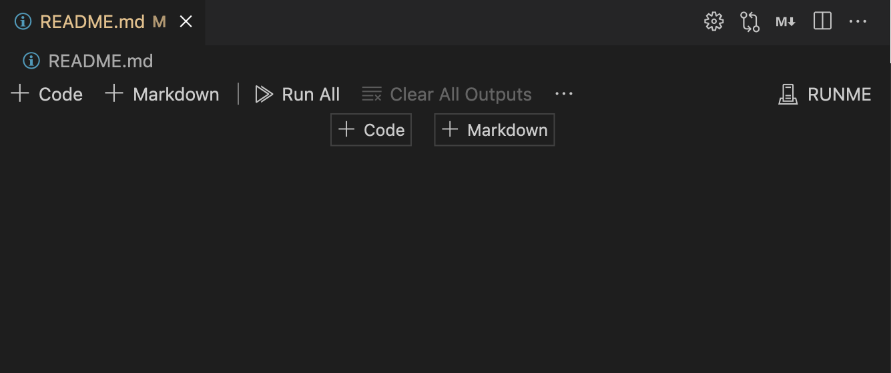

### Adding Markdown

To add a new Markdown section, click the "**+ Markdown"** button in the top left or center:

You can then edit the Markdown block directly:

<video autoPlay loop muted playsInline controls>
  <source src="/videos/edit-markdown-block.mp4" type="video/mp4" />
  <source src="/videos/edit-markdown-block.webm" type="video/webm" />
</video>

As shown in the image below, once you're done editing a block, use the **Check** icon (the one with the checkmark):

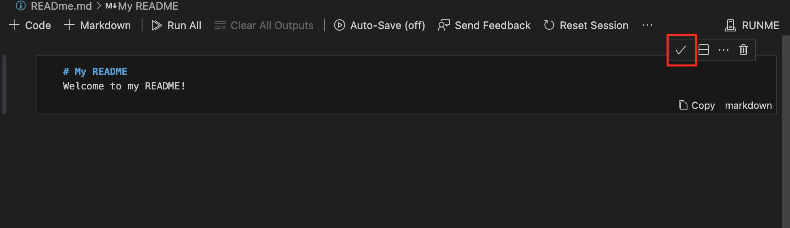

To edit the cell again, use the **Edit Cell** icon:

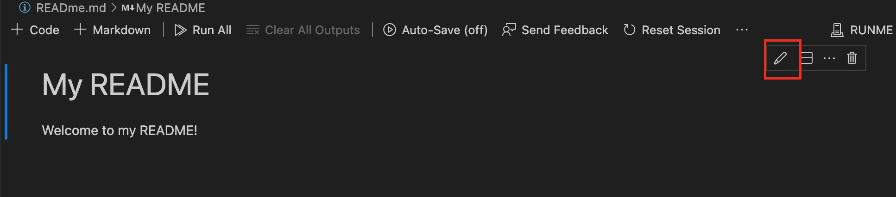

Finally, you can remove a cell at any time using the **Delete Cell** icon:

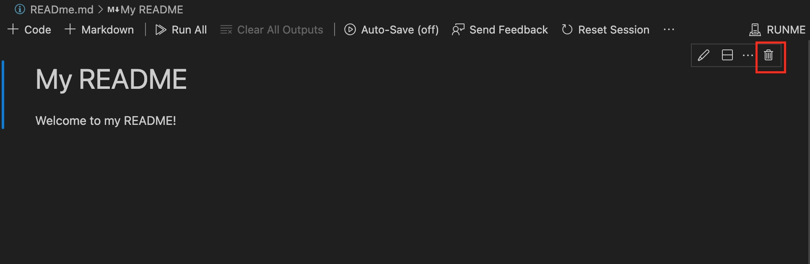

Note that the usual shortcuts (like `Ctrl + Z`) work perfectly in this environment too!

<Infobox type="sidenote">

Other shortcuts you can use are:

1. `ESC` or `Ctrl+Enter` to quickly finish editing a cell.
2. `Enter` on its own to start editing a selected cell.
3. `CMD+Delete` to quickly remove a cell.

</Infobox>

### Adding Code

Code cell blocks work similarly to Markdown blocks and can be edited, saved, or deleted in the same way.

To create a new code block, use the `+ Code` button in the top left or center:

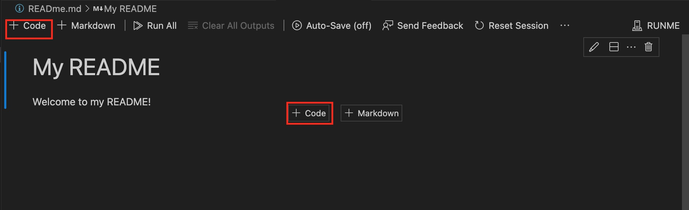

You can then freely add runnable code:

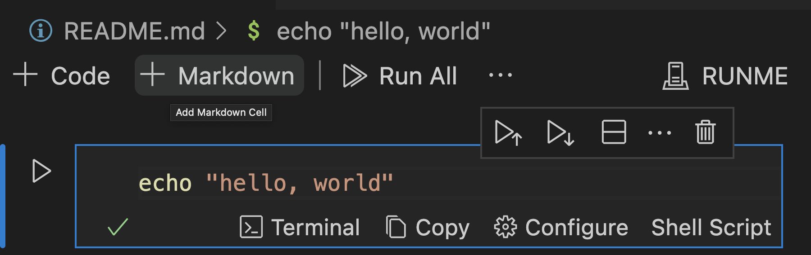

In this section, we will demonstrate how Runme displays command output when running code or commands. For this illustration, we will use a Node.js script in our repository under the **[Examples](https://github.com/stateful/blog-examples/blob/main/node-streams/README.md)** section.

 
<Infobox type="sidenote" title="Note">

Note that the Node.js example is entirely optional. You can use any script of your preference to print the output you want. However, if you decide to follow along with it, make sure you have [Node.js](https://nodejs.org/en/), [curl](https://curl.se/), and [unzip](https://infozip.sourceforge.net/UnZip.html) installed on your local machine.

</Infobox>

## **Running Scripts**

Runme automatically converts all bash codeblocks in your README into runnable scripts. This makes getting started with a new project a breeze - say goodbye to annoying copy-and-pasting!

To run a script, click the Run button on its left-hand side. Start by running the first script under "Prerequisites":

<video autoPlay loop muted playsInline controls>
  <source src="/videos/run-scripting-vscode.mp4" type="video/mp4" />
  <source src="/videos/run-scripting-vscode.webm" type="video/webm" />
</video>

As you can see, we have downloaded the `business_data.csv` file, which contains business statistics about New Zealand in the years 2000-2021. It's a pretty big file!

## **Command Output**

Now, try running Steps 1 and 2 in the [Example Repo](https://github.com/stateful/blog-examples/blob/main/node-streams/README.md).

You should get an output like this:

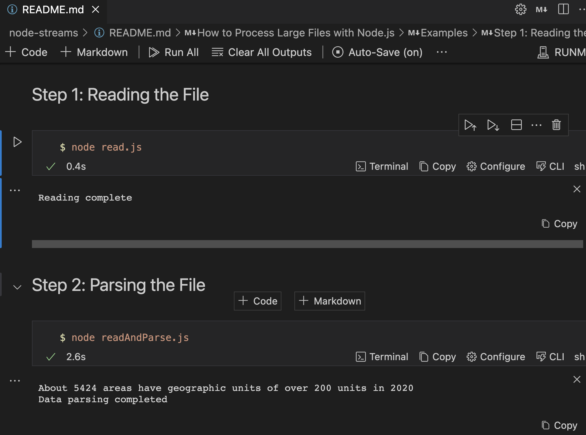

Great! You can see the terminal output from each command beneath its respective cell. Our Node.JS script was able to parse that massive file with no problems!

### Successful Execution

Wondering how you know when a command is finished executing? Look out for the checkmark in the bottom left:

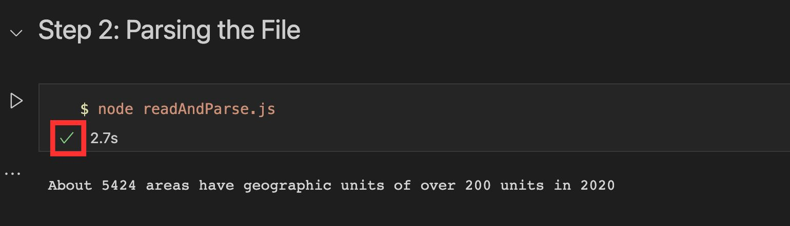

If the command fails, it will be an "X" mark instead!

### Copying Output

Runme provides a handy "**Copy**" button to easily copy the output of a command!

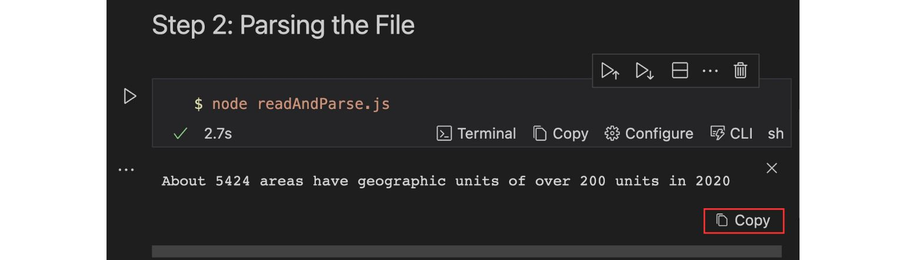

### Clearing Output

Sometimes, the output of a command can clutter up the screen. To prevent this, use the "Clear Cell Outputs" menu option.

Alternatively, select the output and use the **Option+Delete shortcut**.

Congratulations on running your first Runme notebook! 🎉. While you've understood the basics, there's more to discover about Runme's powerful features. Let's get ready to dive deeper.

## **Interactive Mode**

What is an interactive runbook without interaction?

By default, our script will run in “Interactive Mode”. This mode enables you to interact with interactive scripts in the output terminal. It will run the script in a separate terminal window rather than in the notebook itself.

If we just try to run this as it is, we will experience the following:

<video autoPlay loop muted playsInline controls>
  <source src="/videos/hello-world-vscode-error.mp4" type="video/mp4" />
  <source src="/videos/hello-world-vscode-error.webm" type="video/webm" />
</video>

However, when you disable interactive mode from the configuration setting, you cannot interact with your scripts.

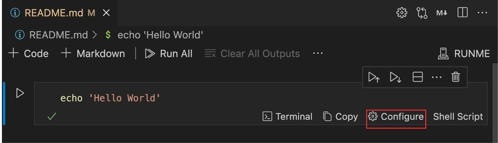

From here, we can easily disable interactive mode:

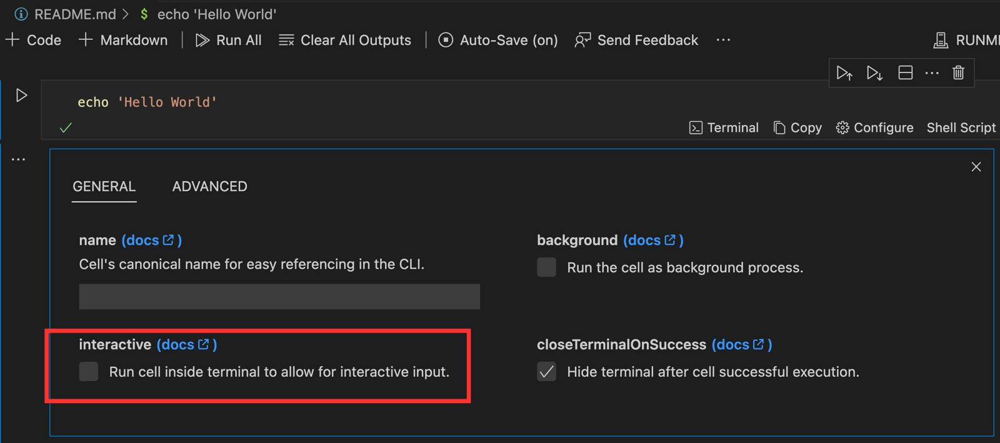

Our code block will now display its output exactly as below:

<video autoPlay loop muted playsInline controls>
  <source src="/videos/non-interactive-mode.mp4" type="video/mp4" />
  <source src="/videos/non-interactive-mode.webm" type="video/webm" />
</video>

## **Frontmatter**

[Frontmatter](https://jekyllrb.com/docs/front-matter/) is a common occurrence in Markdown documents. At the moment Runme won’t break your frontmatter, but we also haven’t yet implemented an interface for managing or editing it from within the notebook. Stay tuned!

## Awesome Runme Configurations for VS Code

In the VS Code settings, several configurable settings influence general Runme behavior and enable experimental functionality. They include:

### Background Processes

This handles scripts that you will love to run in the background.

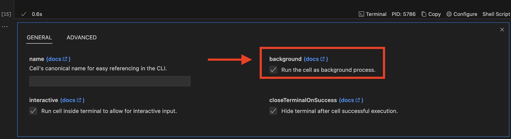

<Infobox type="warning">

Background mode only works in tandem with Interactive mode!

</Infobox>

Now, when you run the script, it will be part of a long-running terminal session:

<video autoPlay loop muted playsInline controls>
  <source src="/videos/background-modes.mp4" type="video/mp4" />
  <source src="/videos/background-modes.webm" type="video/webm" />
</video>

As is demonstrated by the previous video, background tasks are delineated by the "Background Task" label:

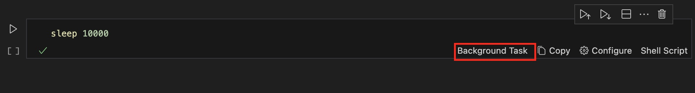

Background Task also has a **Stop Task** button to end their execution long after starting:

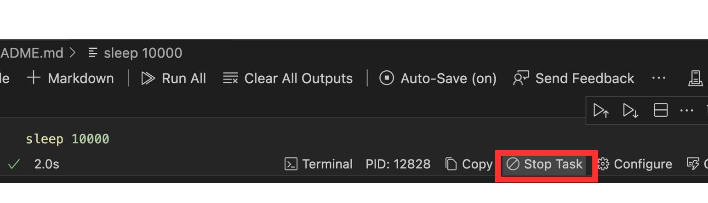

### Markdown Script Metadata

Configuration fields like `background` and `interactive` are set using Markdown's script metadata feature:

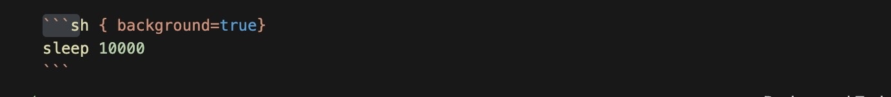

<Infobox type="warning">

Be sure not to strip this data if you want to use it!

</Infobox>

## Feedback

At this point, we believe you now feel comfortable creating and using Runme on VS Code! We would appreciate your feedback. You can send us feedback directly from VS Code, simply click “Send Feedback” button on your Markdown file in your code editor.

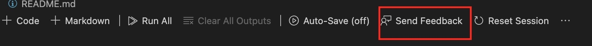

## **Useful Tips & Tricks**

Here are some useful tips and tricks to enable you to use Runme in your VS Code editor without hassle.

### How to ensure Runme is working properly?

It’s easy. Open your project README file and see it is now opened as a Notebook file! Check that shell commands are now rendered as runnable blocks. That’s pretty nice. Finally, you’re seeing the future of running your README files now. We bet you won’t want to return to plain markdown viewers.

### How to open a README file as a markdown file?

Sometimes, you will want to see the file as a regular Markdown file, and you don’t need to disable or uninstall Runme. You can right-click on the file and pick one of the options displayed when clicking Open with. You can select the built-in text editor or Markdown preview for such cases.

### Notebook Explorer

To help you navigate the Markdown files in your project, Runme adds a super handy `Runme Notebooks` panel. Clicking any Markdown file will open it in your code editor view:

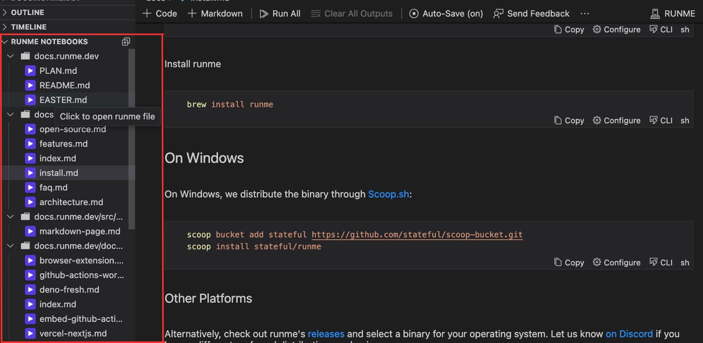

## Next Steps

Congratulations!

We believe, at this point, you have gotten an advanced understanding of how Runme works on VS Code. Now, it’s time to begin using Runme in VS Code for all your automation and documentation processes.

We have provided an [FAQ page](/resources/faq), which we constantly update to address common questions you may have about Runme.

If you run into any issues kindly [file a ticket](https://github.com/stateful/runme/issues) or tell us about it [on Discord](https://discord.gg/runme). We are open to hearing your suggestions on how we can improve Runme.
