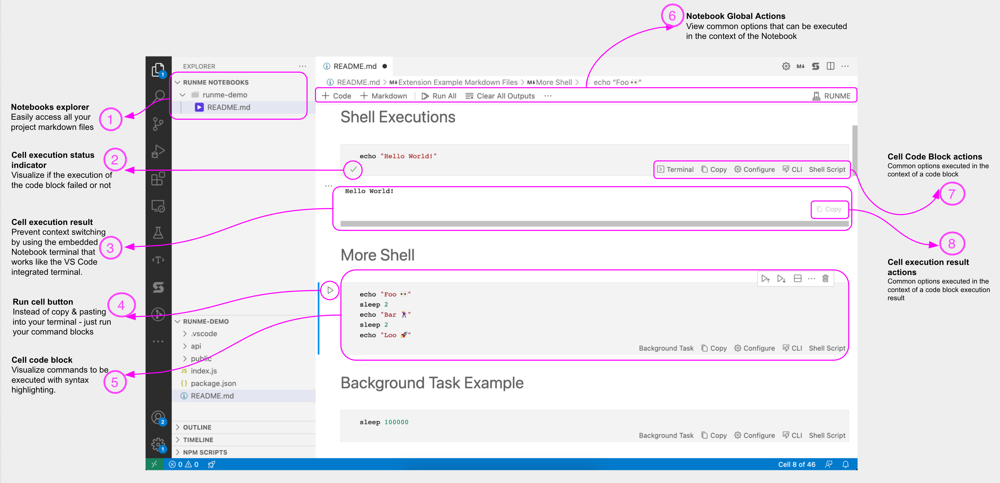

---
runme:
  id: 01HX525D9MCT9JC5FMWKE5RMKB
  version: v3
sidebar_position: 4
title: Runme for Web
---
# Runme for Web

Runme can run as a self-contained web app. Since Runme's notebook UX is built on the VS Code platform, we can leverage the [code-server](https://github.com/coder/code-server) project to run it as a local, self-contained web app.

To start with Runme on the Web, you first need to follow the guide on [installing Runme on Web.](https://docs.runme.dev/installation/web)

## Features of Runme on Web

Installing Runme on the Web allows you to use VS Code right at your local host address on your default web browser and set up a Runme `code-server`.

On the web app, the features and actions that can be perform are quite similar to running [Runme in VS Code](https://docs.runme.dev/how-runme-works/vscode). The features include, :

1. **Notebooks Explorer:** Which makes accessing Markdown files easier.
2. **Cell Execution Status Indicator:** You can easily view if your code execution was successful or not.
3. **Cell Execution Result:** View the executed cell result using the integrated VS Code terminal.
4. **Run Cell Button:** Run code and command in Markdown.
5. **Cell Code Block:** Get a visual representation of commands to be executed with syntax highlighting.
6. **Notebook Global Actions:** View common options that define your code input and execution in the context of the Notebook.
7. **Cell Code Block Actions:** It gives you a list of actions that define code block execution. This includes cell language, [configurations](https://docs.runme.dev/configuration/) etc.
8. **Cell Execution Result:**  Copy your generated output.
