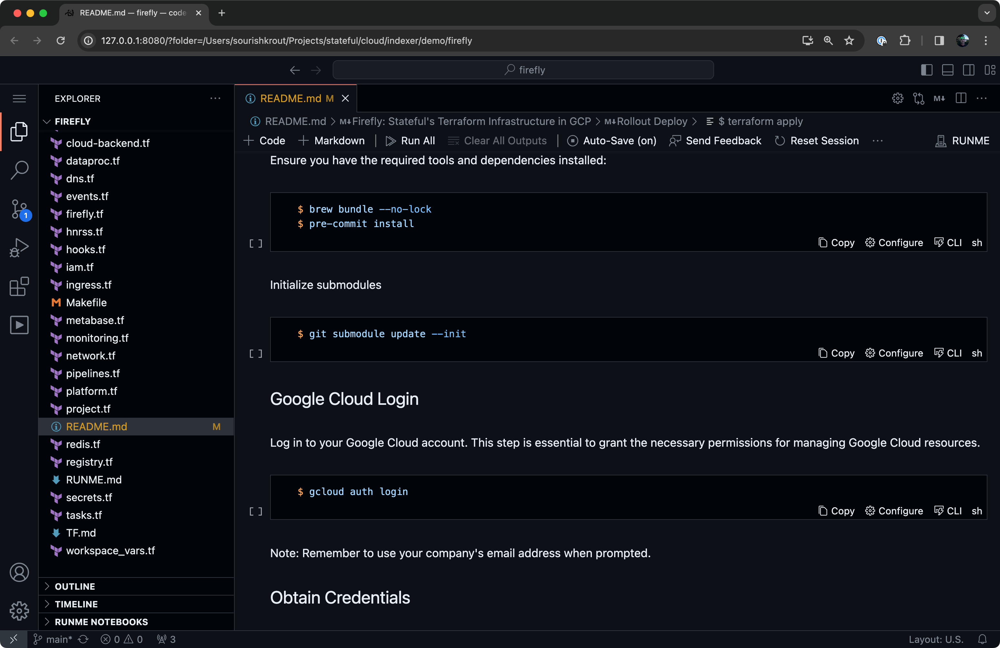

---
runme:
  id: 01HGAW03Y6QJQASC1QM0XC76P3
  version: v2.0
sidebar_position: 1
title: Home
---

import Infobox from "../src/components/Infobox.tsx"

# **Quick Start**

If you are of the kind who likes to jump in head first. Below's a quick start guide to launch into Runme's self-hosted web UX.

## **MacOS**

```sh
$ brew install runme && runme open
```

## **Linux & Windows**

```sh
$ npx runme open
```

Make sure to confirm the prompts and you should be dropped into the Runme web interface at `http://127.0.0.1:8080`. Go ahead and open any abitrary markdown document as notebook or open the terminal to test-drive the `runme` CLI. While the UI might remind you of VS Code, it's a self-hosted web app. More information please see [Runme for Web](/getting-started/web).



<br />
<Infobox type="sidenote" title="Keep going!">

If you want to learn more about Runme and ideas behind, please continue reading below.

</Infobox>

## **Why Runme?**

Runme makes runbooks actually runnable, making it easy to complete step-by-step instructions. This makes it an excellent solution for runbooks, playbooks, and documentation that requires users to complete runnable steps incrementally—making operational docs reliable and less likely to become outdated.

## **Reliable Knowledge Sharing** 🤝

Using notebook-based technology, users can execute instructions, check intermediate results, and ensure the desired outputs match expectations to complete the steps confidently. Authors, on the other hand, can define reliable paths for operational tasks, steps it takes to diagnose problems, or remedies to resolve problems and effectively share them with teammates.

In a nutshell, Runme combines the guardrails of a pipeline with the flexibility of scripting, where users can check intermediary results before moving on. Much like a terminal session, environment variables are retained across execution, and it is possible to pipe previous cells' output into successive cells.

<video autoPlay loop muted playsInline controls>
  <source src="/videos/Key-feature-v2.mp4" type="video/mp4" />
  <source src="/videos/Key-feature-v2.webm" type="video/webm" />
</video>

<br />
<Infobox type="sidenote" title="Try it now">

Learn how to install Runme and [get started](https://docs.runme.dev/getting-started/s).

</Infobox>

## **What is Runme?**

Runme enables you to execute interactive runbooks using markdown. More specifically, Runme runs your code and commands inside your fenced code blocks (shell, bash, zsh, but also, Ruby, Python, etc).

We have designed a comprehensive set of tools and configurations that are 100% compatible with CommonMark, the standard for markdown. Through this, your integration with Runme does not interfere with your existing markdown documentation or tooling.

Alongside, we provide interfaces for terminal, editor, and notebooks all attached to a kernel, making them interoperable. While these interfaces share core features, each interface excels in different use cases.

> 💡 Runme is like Jupyter but with a Shell/Bash Kernel and lightweight dependencies.

## **Usability**

Runme runs everywhere, irrespective of the environment: a local laptop, a VM, a Devcontainer, Cloud Development Environment, or attached to a remote host via SSH:

- Split loose scripts into runbooks with separate cells, intermediate outputs, and controls to check before moving on.
- Get ahead of bit-rot and reverse-engineering runbooks executing them directly from markdown inside your project's repo.
- Increase the shareability of runbooks by decoupling them from personal _dotfiles_ or _bash_history's_ without getting in the way.
- Codify golden paths without overly restricting the flexibility of "scripting".

Learn more about Runme's [Kernel Architecture](https://docs.runme.dev/architecture) to understand what powers Runme's portability.

## **Known Limitations**

- Runme currently only has rudimentary support for PowerShell. While PowerShell is not limited to Windows, it is its primary platform. We recommend using [WSL](https://learn.microsoft.com/en-us/windows/wsl/).
- Please [report any issues](https://github.com/stateful/runme/issues/new) you encounter, big or small, to help us make Runme better.

### **Communication & Support**

Need assistance in getting started? Get in touch with our support team to provide answers to your questions and provide you with all the necessary details to get you started with Runme.

<Infobox type="sidenote" title="Join Runme community!">

Make sure to [get in touch](https://discord.gg/runme) with us if you are missing a feature or have other ideas.

</Infobox>
