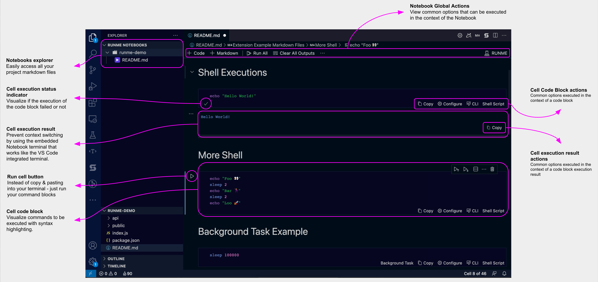
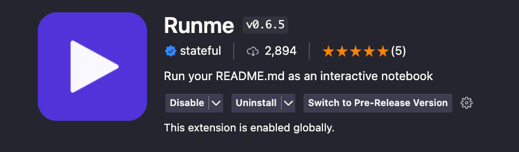
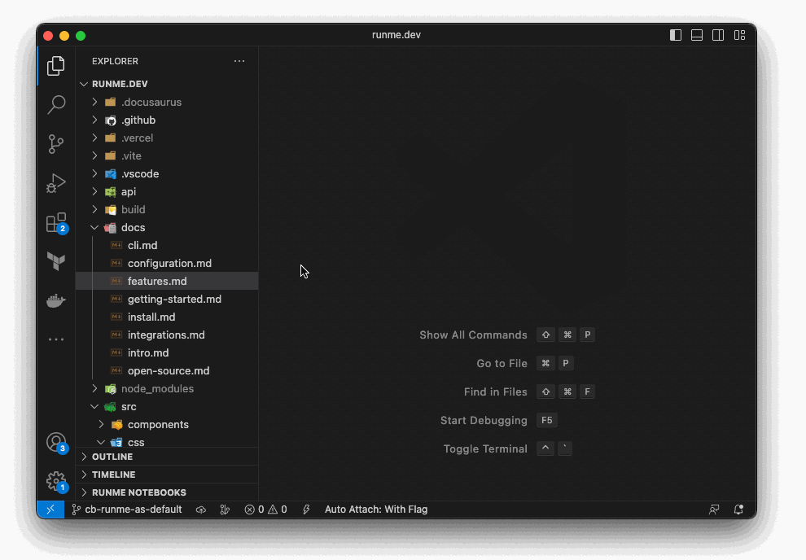
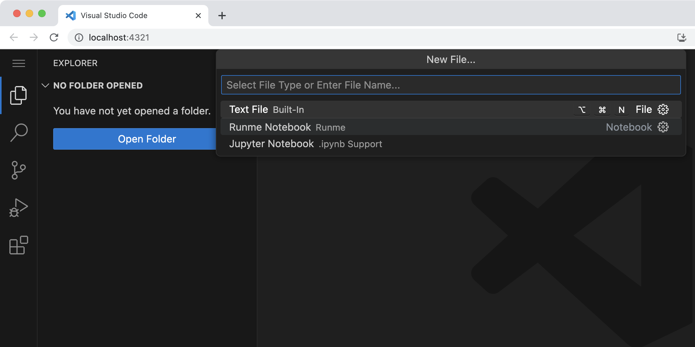

import Infobox from "../src/components/Infobox.tsx"

Runme comes with multiple client interfaces; CLI for the terminal, notebook and editor integration in VS Code, and a self-hosted web app version with the same features for the browser. Here's how to intall them:

## Runme CLI

The Runme CLI is ideal for power users who want to run markdown documentation from the terminal.


### On MacOS

The easiest way on MacOS is to use Homebrew:

```sh
$ brew update
```

Install runme

```sh
$ brew install stateful/tap/runme
```

### On Windows

On Windows, we distribute the binary through [Scoop.sh](https://scoop.sh/):

```sh
$ scoop bucket add stateful https://github.com/stateful/scoop-bucket.git
$ scoop install stateful/runme
```

#### Other Platforms

Alternatively, check out runme's [releases](https://github.com/stateful/runme/releases) and select a binary for your operating system. Let us know [on Discord](https://discord.gg/runme) if you have a different preferred distribution mechanism.

If you have Go developer tools installed, you can install it with go install:

```sh
$ go install github.com/stateful/runme@latest
```

If you don't have go developer tools installed and still want to use this method, [download and install go](https://go.dev/doc/install).

#### Download Binaries directly

You can find a binary for your OS/arch on our [releases page](https://github.com/stateful/runme/releases). Let us know on [Discord](https://discord.com/invite/BQm8zRCBUY) if you have a preferred distribution mechanism.

See [the doc page on the cli](https://runme-dev-mxsdev.vercel.app/docs/cli) for installation instructions.

### Basic Usage

Runme has a nice TUI that you can use simply like so:

```sh
# short for "runme tui"
$ runme
```


This allows you to quickly execute any script present in the README.

<Infobox type="warning" title="Warning!">

Runme won't work if your current working directory doesn't contain a README file at the top level!

You can use the `--chdir` flag to alter the working directory or `--filename` to specify any other markdown file, without changing the environment's working directory.

</Infobox>

Runme parses every shell or bash code block of a markdown file and allows you to execute it within your terminal environment. It comes with several commands that help you to run code blocks in your markdown successfully:

```sh
Parses commands directly from a markdown (e.g. README) to make them executable.

Usage:
  runme [flags]
  runme [command]

Available Commands:
  branch      Suggest a branch name (aka branchGPT)
  completion  Generate the autocompletion script for the specified shell
  fmt         Format a Markdown file into canonical format
  help        Help about any command
  list        List available commands
  login       Log in to Runme
  logout      Log out from Runme
  print       Print a selected snippet
  run         Run a selected command
  suggest     Use our suggestion engine to give contextual advice
  tui         Run the interactive TUI

Flags:
      --allow-unknown     Display snippets without known executor (default true)
      --background        Enable running background blocks as background processes
[...]
```

By default, Runme will try to open a `Readme.md` file in your current work directory but you can modify this by using the `filename` and `chdir` flags, e.g.:

```sh
runme ls --filename SUPPORT.md --chdir ./.github
```

### Running Commands Directly

The TUI is nice, but what if you just want to run a specific command quickly?

To run a specific script by name, use the `runme run <command>` subcommand.

## Runme for VS Code

Open the `Extensions Tab` in the VS Code sidebar and search for **"Runme"**. The CLI is contained inside the extension.


Alternatively, you can go to the [VS Code Marketplace](https://marketplace.visualstudio.com/items?itemName=stateful.runme) and click the green `Install` button.

That's it. Now, any time you open a Markdown file (`*.md` or `*.mdx`) it will open as a Runme notebook.



### Bleeding Edge Features

A pre-release version of Runme is offered for curious developers who want to try our latest enhancements to the extension. Head to the extension configuration and click Switch to Pre-release Version to use it. If you don’t see such an option, ensure your VS Code is at least 1.63.0.



### Default Markdown Viewer

Install the VS Code Runme extension just like every other VS Code extension, open any `.md` / `.mdx` file in VS Code with commands, then click to run them (and much more). Then go create your own custom runnable markdown files! If you like to use Runme as your default markdown file viewer in VS Code, follow these steps:

1. Right-click on any `*.md` or `*.mdx` file in the explorer window (in the directory file list, not under "Open Editors").
2. Pick "Open With"
3. Pick "configure default editor" at the bottom of the list
4. Pick "Run your README.md - Runme"

or set the following in your `.vscode/settings.json` file of your project:

```json
  // ...
  "workbench.editorAssociations": {
    "*.md": "runme"
    // ...
  },
  // ...
```

You can also switch by just doing a right-click on the file and go to `"Open With ..."`, e.g.:



## Runme for Web

Runme can run as a self-contained web app. Since Runme's notebook UX is built on top of the VS Code platform, we can leverage the [code-server](https://code.visualstudio.com/blogs/2022/07/07/vscode-server) binary to run it as a local self-contained web app.



Just run following command to install `code-server`:

```sh
$ wget -O- https://aka.ms/install-vscode-server/setup.sh | sh
$ code-server serve-local --install-extension stateful.runme --start-server
```

Followed by launching Runme inside of it:

```sh
$ code-server serve-local --install-extension stateful.runme --start-server
```

Just follow the link in the logs to launch into the web app.

```text
[2023-05-21 12:43:29] info Found existing installation at /Users/sourishkrout/.vscode-cli/server-stable-web/bin/b3e4e68a0bc097f0ae7907b217c1119af9e03435
[2023-05-21 12:43:29] info Starting server...
*
* Visual Studio Code Server
*
Server bound to 127.0.0.1:8000 (IPv4)
Extension host agent listening on 8000
[12:43:29] Installing extensions...
Web UI available at http://localhost:8000/?tkn=6e6560a2-75ff-4cda-aad1-1bf68e188c6f
[12:43:29] Extension host agent started.
```

<Infobox type="sidenote" title="Coming soon">

We are working on providing a single command option to install and run Runme for Web from the CLI.

</Infobox>

### How It Works

Runme's functionality when run as a web app mirrors VS Code's UX. Go ahead and check out [Getting Started](/docs/getting-started) for next steps.
