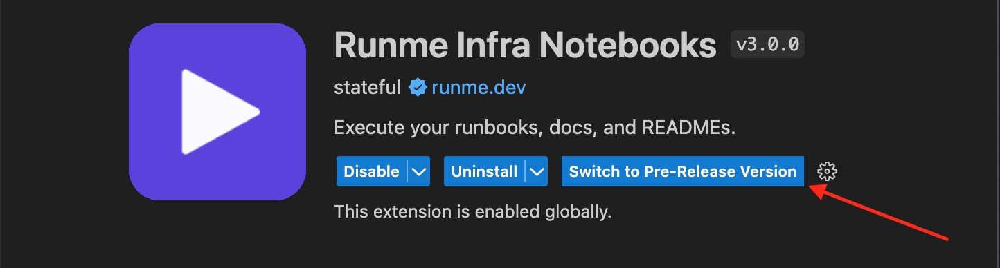

---
runme:
  id: 01HMXW3W0C2V6YSP2PPB33T61E
  version: v2.2
---

# Install Runme on VS Code

In this section, we will guide you through installing Runme on VS Code.

Let's get started.

## **Installing Runme on VS Code**

To get started, open the `Extensions Tab` in your VS Code sidebar and search for **"Runme"**. The CLI is contained inside the extension.


Alternatively, you can go to the [VS Code Marketplace](https://marketplace.visualstudio.com/items?itemName=stateful.runme) and click the green `Install` button.

That's it!

Now, whenever you open a Markdown file (**`*.md`** or **`*.mdx`**), it will open as a Runme notebook.


### **Bleeding Edge Features**

A pre-release version of Runme is offered for curious developers who want to try our latest enhancements to the extension. Head to the extension configuration and click “**Switch to Pre-release Version**” to access it.




[](https://docs.runme.dev/installation/installrunme#default-markdown-viewer)

If you don't see this option, make sure your VS Code is updated to at least version `1.63.0`.

### **Default Markdown Viewer**

To use Runme as your default markdown file viewer in VS Code, follow these steps:

1. Right-click on any `.md` or `.mdx` file in the explorer window (in the directory file list, not under "Open Editors").
2. Choose "Open With."
3. Select "Configure Default Editor" at the bottom of the list.
4. Choose "Run your [README.md](http://readme.md/) - Runme."

Alternatively, you can set the following in your `.vscode/settings.json` file in your project:

```javascript {"id":"01HMXWAXX8WA6KTQPG7QNR43MV"}
// ...
"workbench.editorAssociations": {
    "*.md": "runme"
    // ...
  },
  // ...
```

Now, when you open any `.md` or `.mdx` file, it will default to the Runme viewer.

You can also switch by just doing a right-click on the file and go to `"Open With ..."`, e.g.:


### **How it Works**

When Runme is ran as a web app, it replicates the user experience of VS Code. For the next steps, explore the [Getting Started](https://docs.runme.dev/getting-started) guide.
