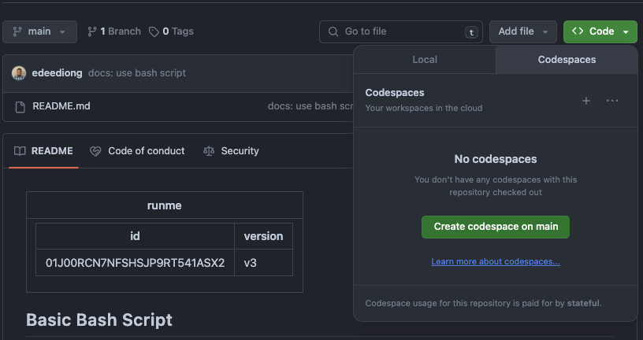
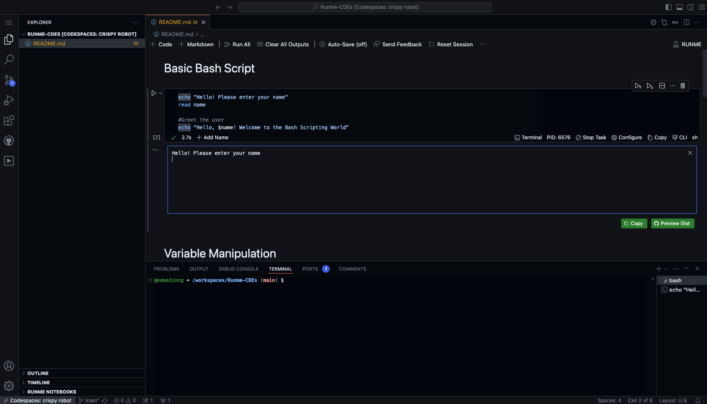

---
runme:
  id: 01J01B5S4Y31Q8FAP5SREPGWRY
  version: v3
title: Install Runme on CDEs
---

# Install Runme on Cloud Development Environments

Runme is a powerful tool that manages and runs development scripts directly from your documentation and codebase. It helps with automation, consistency, and collaboration. Integrated with Cloud Development Environments (CDEs) like GitHub Codespaces, Gitpod, and Project IDX, Runme enhances the development process by providing a centralized and user-friendly interface for script management. CDEs offer pre-configured, accessible, and consistent setups, eliminating the need for extensive local configurations and boosting productivity. Runme and CDEs simplify workflows, improve efficiency, and ensure a seamless development experience.

This guide provides step-by-step instructions on how to install the Runme extension in GitHub Codespaces, Gitpod, and Project IDX. Runme helps in managing and running your development scripts directly from your codebase and documentation.

## GitHub Codespaces

### Creating a Codespace

1. Navigate to a new repository.
2. Click Code.
3. Click + in the Codespaces tab to open a new Codespace on your repository.



> A Visual Studio Code instance will open in your browser with a unique URL and container.

### Installing Runme in Codespaces

1. Once your Codespace is open, click on the Extensions view icon on the sidebar or press `Ctrl+Shift+X` to open the Extensions view.
2. In the search bar, type "Runme" and press Enter.
3. Locate the Runme extension in the search results and click on Install.


4. Once installed, you can use the Runme extension to manage and run your scripts directly from your codebase.



## Gitpod

### Sign Up and Login

1. Sign Up:

* Go to the [Gitpod website](https://gitpod.io/).
* Click on "Get Started for Free" and sign up using your GitHub, GitLab, or Bitbucket account.

2. Login:

* Once signed up, log in to Gitpod with the account you used to sign up.

### Creating a New Workspace

1. From a Repository:

- Navigate to the repository on GitHub, GitLab, or Bitbucket that you want to work on.
- Add `gitpod.io/#` before the URL of the repository. For example, `https://github.com/user/repo` becomes `https://gitpod.io/#https://github.com/user/repo`.
- Press Enter, and Gitpod will start setting up your workspace.

```sh {"id":"01J01CHB3T1KG1ZV9WT59RKDN2"}
open https://gitpod.io/#https://github.com/stateful/Runme-CDEs
```

### Installing Runme in Gitpod

1. Once your workspace is open, click on the Extensions view icon on the sidebar or press `Ctrl+Shift+X` to open the Extensions view.
2. In the search bar, type `Runme` and press Enter.
3. Locate the Runme extension in the search results and click on `Install`.


4. Once installed, you can use the Runme extension to manage and run your scripts directly from your codebase.


## Project IDX

### Login

1. Go to [Project IDX](https://idx.dev/).
2. Login with your credentials.

### Creating a New Project

1. After logging in, you will see the dashboard.
2. Click on the New Project button to create a new project.


### Installing Runme in Project IDX

1. Once your project environment is set up, click on the Extensions view icon on the sidebar or press `Ctrl+Shift+X` to open the Extensions view.
2. In the search bar, type `Runme` and press Enter.
3. Locate the Runme extension in the search results and click on Install.


4. Once installed, you can use the Runme extension to manage and run your scripts directly from your codebase.


With these instructions, you can easily install the Runme extension in GitHub Codespaces, Gitpod, and Project IDX.

## **Next Steps**

You can achieve so much more with the Runme and your Markdown will also benefit from its features. [Our documentation](https://docs.runme.dev/how-runme-works/web) provides more details on how this works.
