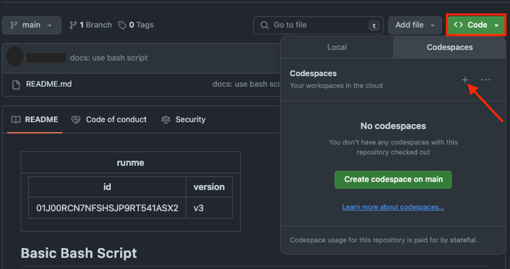
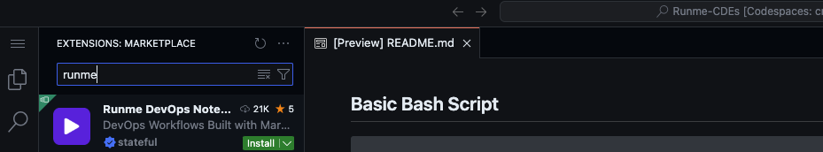
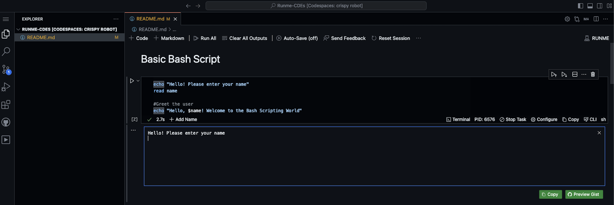
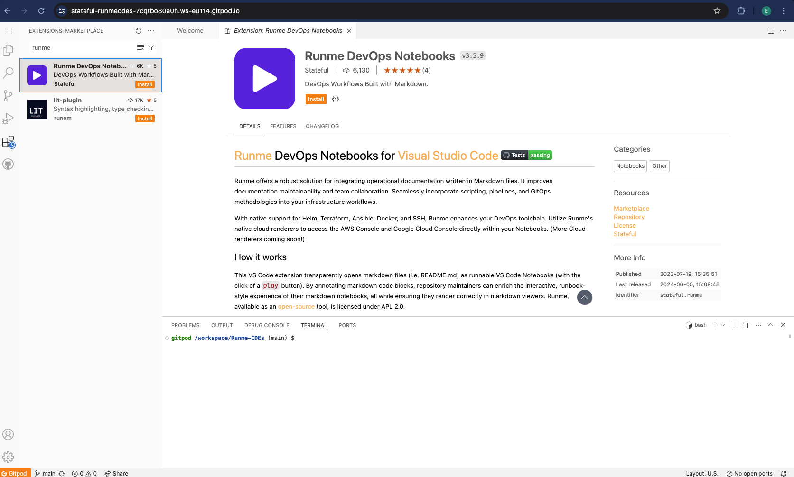
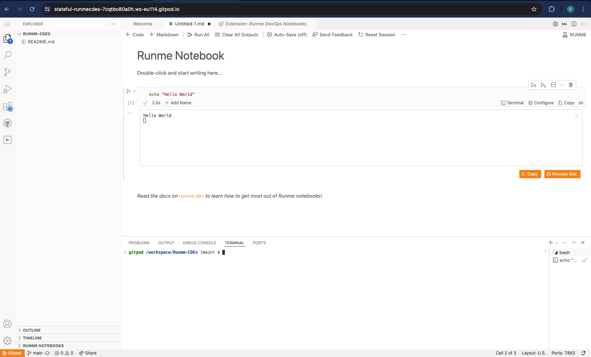
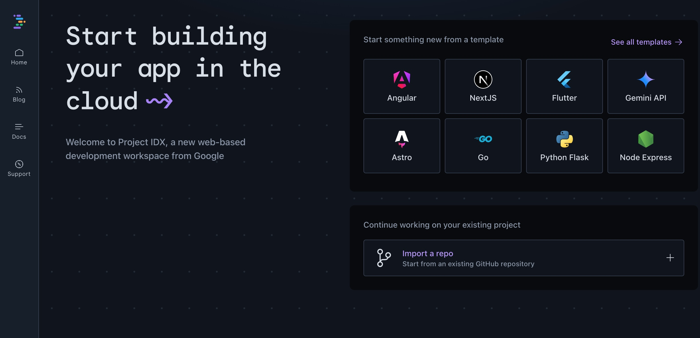
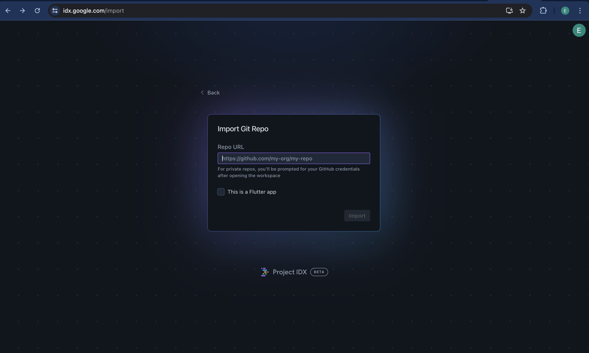
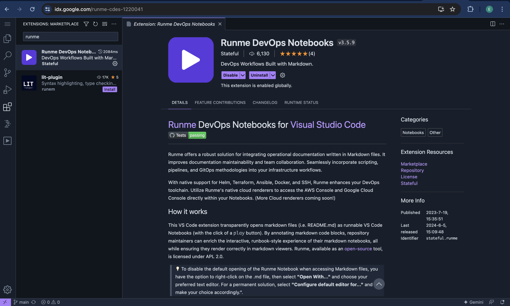
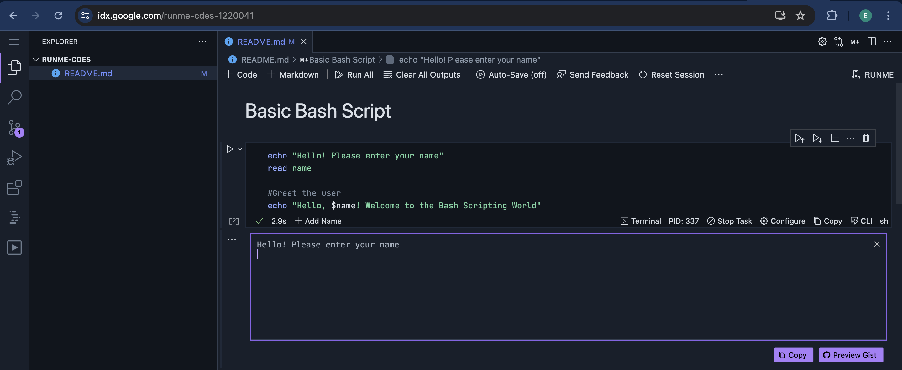

---
runme:
  id: 01J01B5S4Y31Q8FAP5SREPGWRY
  version: v3
title: Install Runme on CDEs
---

# Install Runme on Cloud Development Environments

Runme can easily be integrated with Cloud Development Environments (CDEs) like [GitHub Codespaces](https://docs.github.com/en/codespaces/overview), [Gitpod](https://www.gitpod.io/), and [Project IDX](https://idx.dev/) to enhance development process by creating a ready-to-code environments with an interactive notebook. Experience the ease of dependable documentation and instantly-ready coding setups

In the sections below, we will provide step-by-step instructions for installing Runme in your favorite Cloud Development Environments.

## **GitHub Codespaces**

GitHub codespaces is a cloud-based development environment that speeds up project setup by providing pre-configured environments for users and promotes collaborative development, testing, and debugging directly within GitHub. With the VS Code extension on GitHub Codespace, you can install Runme. This integration helps developers automate routine tasks and execute notebooks directly from your GitHub repository.

In this section, we will walk you through how to install Runme on GitHub Codespaces.

### **Creating a Codespace**

To create a codespace, do the following:

1. Navigate to a new repository.
2. Click `Code`.
3. Click + in the Codespaces tab to open a new Codespace on your repository.



> A Visual Studio Code instance will open in your browser with a unique URL and container.

### **Installing Runme in Codespaces**

1. Once your Codespace is open, click on the Extensions view icon on the sidebar or press `Ctrl+Shift+X` to open the Extensions view.
2. In the search bar, type `Runme` and press Enter.
3. Locate the Runme extension in the search results and click on `Install`.



4. Once installed, you can use the Runme extension to manage and run your scripts directly from your codebase.



Now, you have successfully installed Runme in your GitHub Codespaces.

## **Gitpod**

Gitpod is a cloud-based development environment that allows developers to launch ready-to-code environments from any Git repository instantly. Thus eliminating the need for manual setup and configuration, saving time and effort.

In this section, we will walk you through how to Install Runme on Gitpod.

### **Sign Up and Login**

The first step is to create an account and sign-in. To do this, go to the [Gitpod website](https://gitpod.io/), click on **‘Try for Free’** and sign up using your GitHub, GitLab, or Bitbucket account.

Once signed up, log in to Gitpod with the account you used earlier.

### **Creating a New Workspace**

After completing the signup and log-in process, the next step is to create a new workspace. To do this, follow the steps below:

- Navigate to the repository on GitHub, GitLab, or Bitbucket that you want to work on.
- Add `gitpod.io/#` before the URL of the repository. For example, `https://github.com/user/repo` becomes `https://gitpod.io/#https://github.com/user/repo`.
- Press Enter, and Gitpod will start setting up your workspace.

```sh {"id":"01J01CHB3T1KG1ZV9WT59RKDN2"}
open https://gitpod.io/#https://github.com/stateful/Runme-CDEs
```

### **Installing Runme in Gitpod**

After creating a new workspace for your project, it’s time to install Runme in Gitpod. To do this, do the following:

1. Once your workspace is open, click on the Extensions view icon on the sidebar or press `Ctrl+Shift+X` to open the Extensions view.
2. In the search bar, type `Runme` and press Enter.
3. Locate the Runme extension in the search results and click on `Install`.



4. Once installed, you can use the Runme extension to manage and run your scripts directly from your codebase.



## **Project IDX**

Project IDX is designed to make building, management, and deployment of full-stack web and multiplatform applications easier. In this section, we will walk you through the process of installing Runme on Project IDX.

### **Login**

The first step is to log in. To do this, go to the [Project IDX](https://idx.dev/) website and click on ‘**Get Started**’.

After affirming to the instructions that pop up, you will be logged in.

> Project IDX works with your Google account details.

### **Creating a New Project**

The next step is to create a new project. To do this, follow the steps below.

1. After logging in, you will see the dashboard.



2. You can either start something new from a template based on your programming language or you import an existing project. For this guide, we will import a repo. Once you click on that option, a new dashboard opens up that prompts you to import the repo URL.



### **Installing Runme in Project IDX**

1. Once your project environment is set up, click on the Extensions view icon on the sidebar or press `Ctrl+Shift+X` to open the Extensions view.
2. In the search bar, type `Runme` and press Enter.
3. Locate the Runme extension in the search results and click on `Install`.



4. Once installed, you can use the Runme extension to manage and run your scripts directly from your codebase.



With these instructions, you can easily install the Runme extension in GitHub Codespaces, Gitpod, and Project IDX.

## **Next Steps**

Runme offers more benefits. You can achieve so much more with the Runme, and your Markdown will also benefit from its features. Explore [Our documentation](../configuration/index.md) to get more details on how this works.
