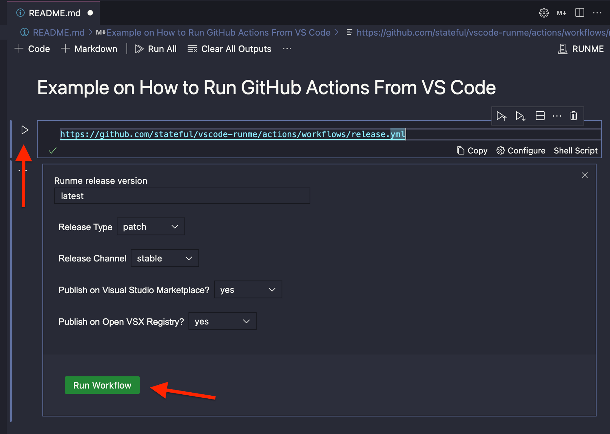
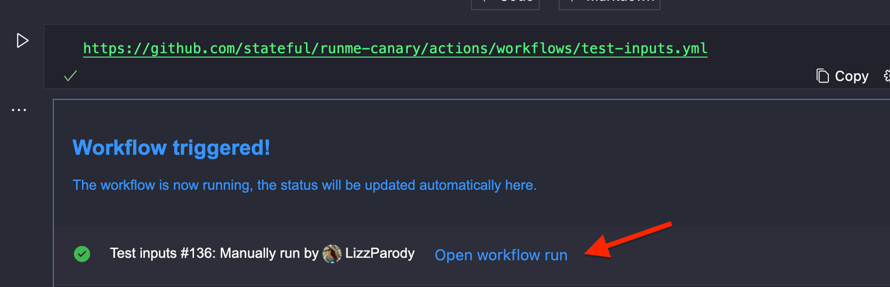
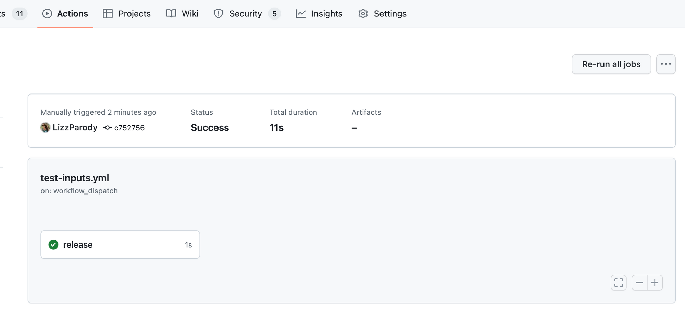

import Infobox from "../src/components/Infobox.tsx"

Previously, you learned the basic editing tools for creating and editing README files.

In this guide, you'll be exposed to a few ways you can integrate Runme with different environment or 3rd party services.

## GitHub Action

Runme provides a GitHub action that allows you to seamlessly use the tool in CI/CD. It enables to re-use the workflows that your contributor use in CI/CD and therefore verifies that your contributing guidelines are still up to date.

### Setup

In `.github/workflows/test.yaml` create a new file with the following contents:

```yaml
name: Test Changes

on: [push, pull_request]

jobs:
  test:
    runs-on: ubuntu-latest
    steps:
      - name: Clone Repository
        uses: actions/checkout@v2
      - name: Setup Node version
        uses: actions/setup-node@v2
        with:
          node-version: 18.x
      - name: Install dependencies
        run: npm ci
      # execute workflows through Runme
      - name: Build / Test Project
        uses: stateful/runme-action@v2
        with:
          workflows: |
            build
            test
```

Now, you can define what should be done for building and testing your project in e.g. a `CONTRIBUTING.md` and have your contributors be able to run the same flows through the CLI, e.g. via: `runme run build tes`.

## Fresh App on Deno Cloud

The first example is in the `fresh` folder and sets up a fresh service with deno. You can manually check out this example by [opening it with Runme](https://runme.dev/api/runme?repository=https%3A%2F%2Fgithub.com%2Fstateful%2Fvscode-runme.git&fileToOpen=examples%2Ffresh%2FREADME.md).

### Local Environment

Runme makes setting up your local environment a breeze! Here, you can see a few install scripts that will set everything up:


<Infobox type="sidenote">

In a future version of Runme, we plan on only showing installers relevant to your current operating system/environment. Stay tuned!

</Infobox>

### Environment Variables

Runme can also be used to establish local environment variables for the current session.


<Infobox type="warning">

Environment variable support in Runme is currently a work in progress. We have a lot planned for supporting the environment/secrets in the future, so stay tuned!

</Infobox>

### Deploying

For a deploy script, such as the one below, running as a Background task is a great idea, since it is a long-running script.


## Next.js App on Vercel

This example can be found in the `vercel` sub-folder. You can manually check out this example by [opening it with Runme](https://runme.dev/api/runme?repository=https%3A%2F%2Fgithub.com%2Fstateful%2Fvscode-runme.git&fileToOpen=examples%2Fvercel%2FREADME.md).

### Setup/Environment

Similar to the last example, we can do our setup, starting, and opening of the web browser using Runme:


<Infobox type="sidenote">

In a future version of Runme, we'd like to support "execution groups," so that you can execute all of the above scripts in one go!

</Infobox>

### Authentication

Interactive terminals are perfect for providing a CLI login to the user:


### List Projects

Remember, cells can capture the output of commands in non-interactive mode!

In this case, this can be used to get a list of the user's current registered projects with the Vercel platform.


## Embedding GitHub Actions

> 💡 Be sure to install [Runme for VS Code](/install#runme-for-vs-code) first

<br/>

GitHub Actions provides a robust and flexible continuous integration and continuous delivery (CI/CD) platform for automating various tasks within your development lifecycle (build, test and deployment), ultimately empowering you to focus more on writing code and less on repetitive manual processes.
One building block of GitHub actions is [Workflows](https://docs.github.com/en/actions/using-workflows/about-workflows), a YAML file describing an automated process that will run one or more jobs.

<video className="rounded" autoPlay loop muted playsInline controls>
  <source src="videos/embed.mp4" type="video/mp4" />
  <source src="videos/embed.webm" type="video/webm" />
</video>

### Workflow types

- Events that occur in your workflow's repository
- Events that occur outside of GitHub and trigger a repository_dispatch event on GitHub
- Scheduled times
- Manual

Currently, Runme only supports manual workflows; they are helpful to trigger jobs on demand, some common use cases are:

- **Targeted releases**: Deploy specific versions of artifacts to specific environments (production, testing, staging) on demand or after thorough testing or approval.
- **Overwrite a scheduled task workflow**: Sometimes, you may want to override the schedule and trigger the workflow manually.
- **Trigger a testing pipeline**: Initiate specific code or infrastructure verification testing workflows. This allows developers or quality assurance teams to trigger comprehensive tests when needed, ensuring adequate coverage.
- **Incident response**: Reduce risk during an incident by triggering an incident response workflow. It helps mitigate the problem by including diagnostic scripts, notifying the immediate response team, or initiating remedial action.
- **User Interaction Workflows**: GitHub Actions can be triggered manually to facilitate user interactions, such as starting a build or initiating a specific process based on user input. Useful for workflows involving user requests, feedback, or custom actions.
- **Experimental or One-off Tasks**: Sometimes, you may need to run a workflow for an experimental or one-off task that doesn't require automation or a predefined trigger. Manually triggering the workflow provides flexibility in executing such tasks.

In general, being able to run a GitHub Action manually gives you control over workflows by adding an extra layer of flexibility to your CI/CD and automation processes.

### How to use it

Use the __workflow_dispatch__ event to specify your manually triggered workflow, you can optionally specify inputs that are passed to the workflow. The triggered workflow receives the inputs in the [inputs context](https://docs.github.com/en/actions/learn-github-actions/contexts#inputs-context)

See an example of a manually triggered workflow:

```yaml
name: My manual worfklow
on:
  workflow_dispatch:
    inputs:
      releaseVersion:
        description: "Runme release version"
        required: true
        type: string
        default: latest
      releaseType:
        description: "Release Type"
        required: true
        type: choice
        default: "patch"
        options:
          - patch
          - minor
          - major
      releaseChannel:
        description: "Release Channel"
        required: true
        type: choice
        default: stable
        options:
          - stable
          - edge
      publishMarketplace:
        description: "Publish on Visual Studio Marketplace?"
        required: true
        type: choice
        default: "yes"
        options:
          - "yes"
          - "no"
      publishOpenVSX:
        description: "Publish on Open VSX Registry?"
        required: true
        type: choice
        default: "yes"
        options:
          - "yes"
          - "no"

jobs:
  release:
    runs-on: ubuntu-latest
    env:
      REPOSITORY: runme
    steps:
      - name: Print inputs
        run: |
          echo "${{ toJSON(github.event.inputs) }}"

```

The above YAML file, specifies a simple manual triggered workflow file with inputs: releaseVersion, releaseType, releaseChannel, publishMarketplace, publishOpenVSX, and a job that prints the values for each input in JSON format.

### Use Runme to trigger a manual workflow

Currently, there are two ways to indicate Runme to run a GitHub Action:

- GitHub repository source URL
   `https://github.com/organization/repository/blob/main/.github/workflows/workflow.yml`
- GitHub workflow URL
   `https://github.com/organization/repository/actions/workflows/workflow.yml`

If you paste an URL following any of those formats in any markdown file, Runme will understand you want to run a manually triggered GitHub Action. If the file specifies inputs, a convenient form is displayed to specify the values, they will be displayed according to the type of input:

- Choice: Drop-down list
- String: Input text

To execute the action, you need access to the repository and sign in using your GitHub account by authorizing Runme from within VS Code

Once you are authenticated, you should be able to see the workflow file like the following:



In the above example, we have a workflow action with inputs, once you specify them, you can click Run Workflow to trigger the action.
Once you trigger the action, you will see in real-time the status of the execution of the workflow, just like the original GitHub action interface.



If you click Open workflow run, a browser window will be opened with the detailed logs of the triggered workflow



<Infobox type="sidenote">

In a future version of Runme, we plan to display workflow run details in real-time. We think Runme is a great companion of the official [GitHub Actions extension](https://marketplace.visualstudio.com/items?itemName=GitHub.vscode-github-actions).

</Infobox>
