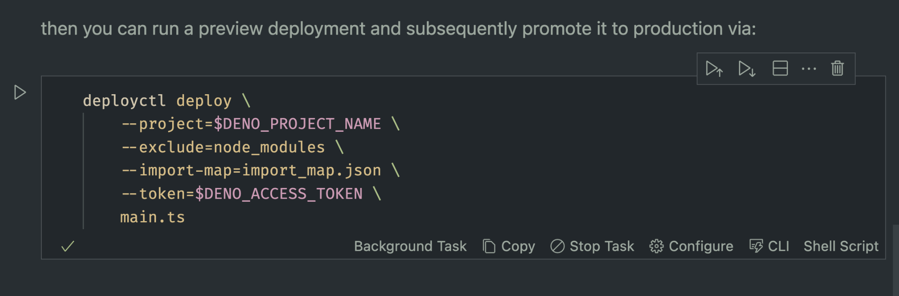

## Fresh App on Deno Cloud

The first example is in the `fresh` folder and sets up a fresh service with deno. You can manually check out this example by [opening it with Runme](https://runme.dev/api/runme?repository=https%3A%2F%2Fgithub.com%2Fstateful%2Fvscode-runme.git&fileToOpen=examples%2Ffresh%2FREADME.md).

### Local Environment

Runme makes setting up your local environment a breeze! Here, you can see a few install scripts that will set everything up:

In a future version of Runme, we plan on only showing installers relevant to your current operating system/environment. Stay tuned!

### Environment Variables

Runme can also be used to establish local environment variables for the current session.

Environment variable support in Runme is currently a work in progress. We have a lot planned for supporting the environment/secrets in the future, so stay tuned!

### Deploying

For a deploy script, such as the one below, running as a Background task is a great idea, since it is a long-running script.

